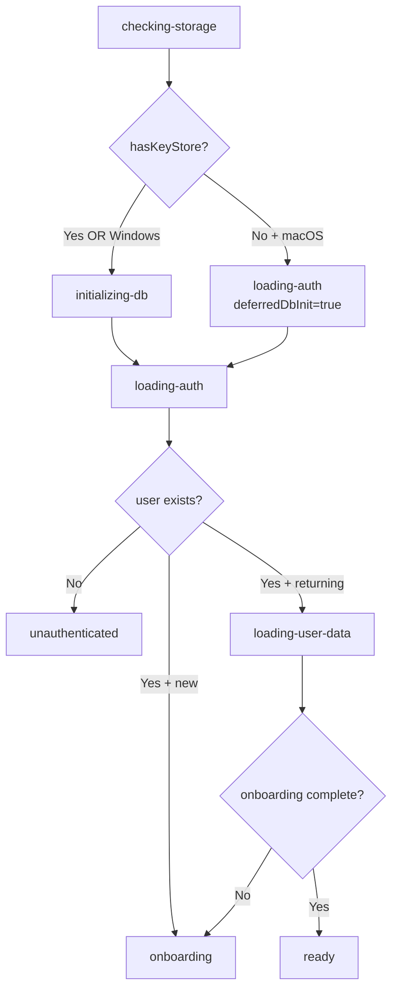
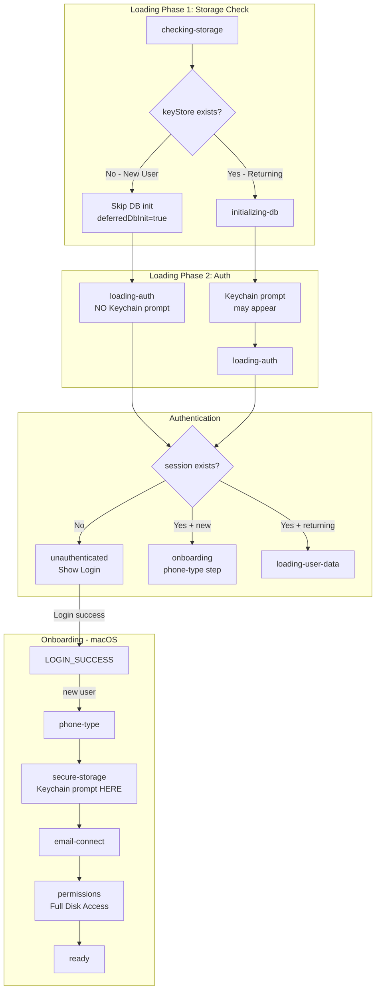
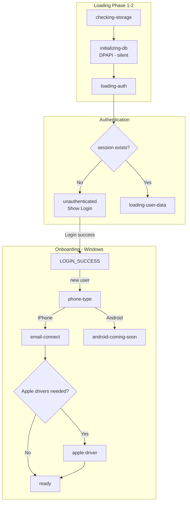
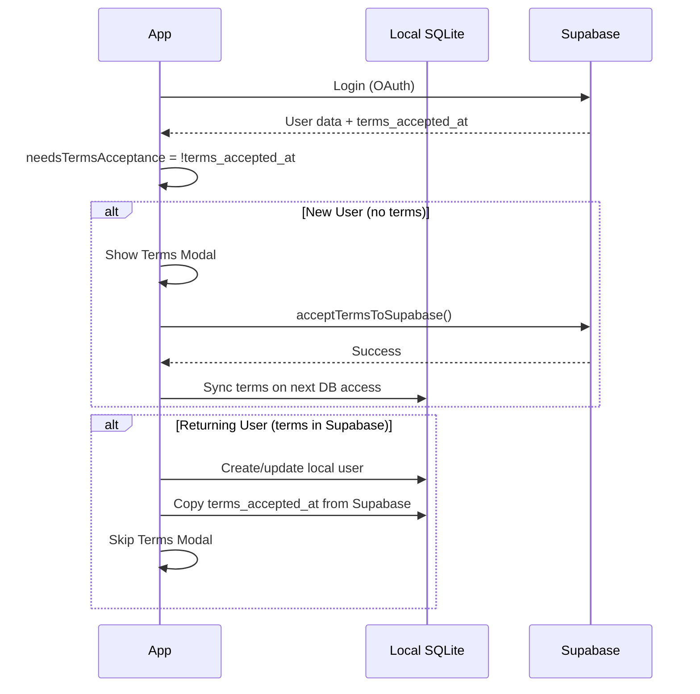
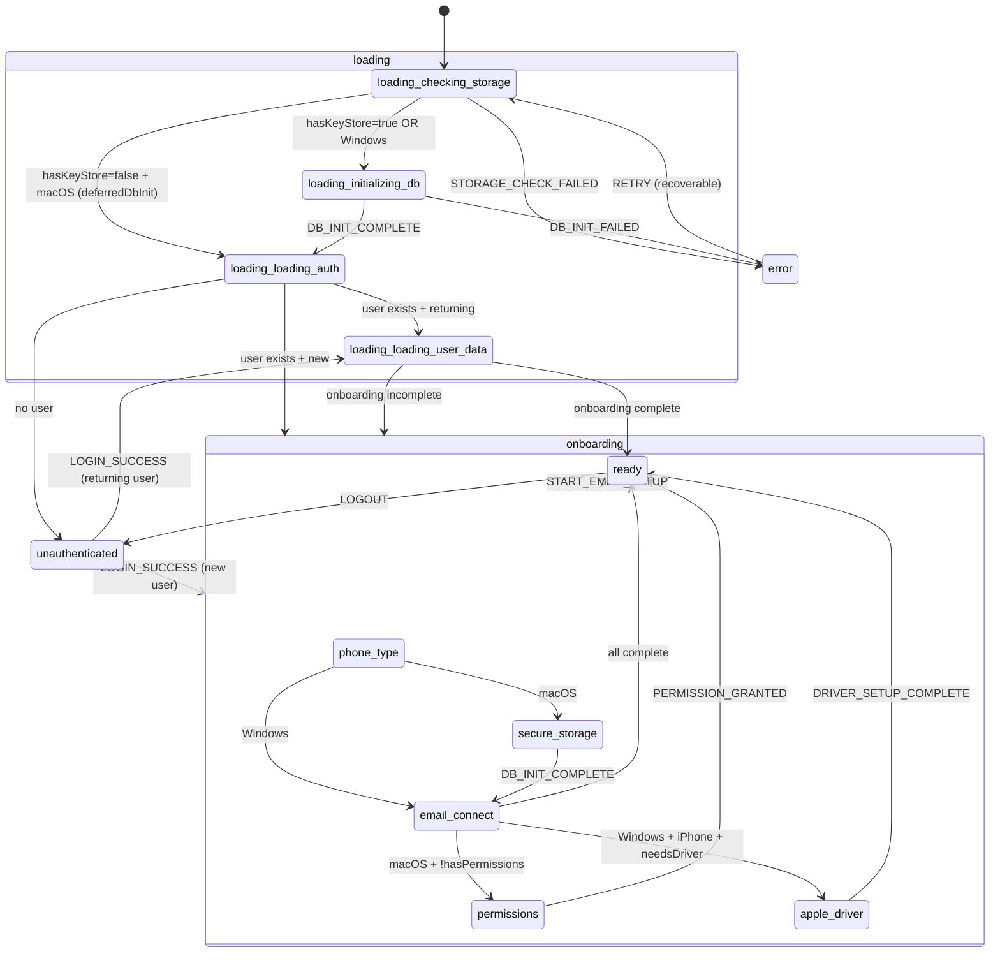
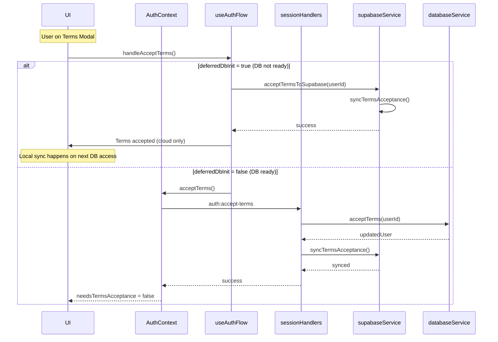

# Magic Audit Onboarding Flow Analysis

## Executive Summary

This document provides a comprehensive analysis of Magic Audit's onboarding flow across all platforms and user types. The onboarding experience involves complex interactions between the state machine, multiple services, and platform-specific requirements.

---

## 1. Architecture Overview

### State Machine

The app uses a unified state machine (`reducer.ts`) with the following states:

```
loading -> unauthenticated -> onboarding -> ready
                  |              |
                  v              v
               error          error
```

### Loading Phases (in order)



### Key Files

| File | Responsibility |
|------|----------------|
| `reducer.ts` | State transitions, step progression logic |
| `LoadingOrchestrator.tsx` | Orchestrates loading phases, dispatches actions |
| `OnboardingFlow.tsx` | Renders onboarding steps, handles user actions |
| `sessionHandlers.ts` | Backend session/auth management |
| `databaseEncryptionService.ts` | Keychain/encryption key management |
| `supabaseService.ts` | Cloud sync, terms acceptance |
| `useAuthFlow.ts` | Login handlers, LOGIN_SUCCESS dispatch |

---

## 2. Platform-Specific Flows

### macOS Flow (Apple Silicon & Intel)



**Key Points:**
- First-time macOS users: DB init is DEFERRED to avoid Keychain prompt before login
- Keychain prompt appears during `secure-storage` step (after login, with explanation)
- Full Disk Access required for iMessage database access
- FDA requires "Quit & Reopen" flow

### Windows Flow



**Key Points:**
- Windows uses DPAPI for encryption - completely silent, no prompts
- No permissions step needed
- iPhone users may need Apple Mobile Device driver setup

---

## 3. User Type Scenarios

### A. Brand New User (never used app)

**macOS:**
```
1. App starts -> checking-storage
2. No keyStore found -> loading-auth (deferredDbInit=true)
3. No session -> unauthenticated (show Login)
4. User logs in via browser OAuth
5. Deep link callback -> LOGIN_SUCCESS
6. Onboarding: phone-type -> secure-storage (Keychain prompt) -> email-connect -> permissions (FDA)
7. FDA "Quit & Reopen" -> App restart
8. checking-storage -> keyStore found -> initializing-db -> loading-auth
9. Session exists, user data complete -> ready (Dashboard)
```

**Windows:**
```
1. App starts -> checking-storage -> initializing-db (silent DPAPI)
2. loading-auth -> No session -> unauthenticated
3. User logs in via browser OAuth
4. Deep link callback -> LOGIN_SUCCESS
5. Onboarding: phone-type -> email-connect -> [apple-driver if iPhone]
6. ready (Dashboard)
```

### B. Returning User on Same Device

**macOS:**
```
1. App starts -> checking-storage
2. keyStore found -> initializing-db (Keychain prompt if not "Always Allow")
3. loading-auth -> session found
4. loading-user-data -> checks: phoneType, emailOnboarding, permissions
5. All complete -> ready (Dashboard)
   OR missing steps -> onboarding (resumes at incomplete step)
```

**Windows:**
```
1. App starts -> checking-storage -> initializing-db (silent)
2. loading-auth -> session found
3. loading-user-data -> checks completion
4. ready (Dashboard) or resume onboarding
```

### C. Returning User on New Device (has Supabase data, no local data)

**Critical Scenario - BACKLOG-546/611**

```
1. App starts -> checking-storage
2. No keyStore (new device) -> deferredDbInit=true on macOS
3. loading-auth -> session restored from Supabase
4. isNewUser = needsToAcceptTerms() - checks terms_accepted_at from Supabase
5. If terms accepted in Supabase -> isNewUser=false
6. loading-user-data (or onboarding if new)
7. BACKLOG-611: Even if keyStore exists (from another user), check currentUserInLocalDb
8. If user not in local DB -> show secure-storage step
```

**Key Data Sync:**
- Terms acceptance synced from Supabase to local on session restore (BACKLOG-546)
- Phone type, email onboarding status loaded from Supabase if local data missing
- User record created in local SQLite from session data (TASK-1507E)

### D. User Who Partially Completed Onboarding Then Quit

**Scenario: Quit after phone-type, before email-connect**
```
1. App restart -> checking-storage -> initializing-db -> loading-auth
2. Session exists, isNewUser from terms check
3. loading-user-data -> phoneType exists, emailOnboarding not complete
4. Transition to onboarding, step = email-connect (skips phone-type)
```

**Scenario: Quit during FDA flow (macOS)**
```
1. FDA dialog appeared, user clicked "Quit & Reopen"
2. App restart -> checking-storage -> keyStore exists -> initializing-db
3. loading-auth -> session exists
4. loading-user-data -> hasPermissions checked via checkPermissions()
5. If permissions granted -> ready (Dashboard)
   If not granted -> onboarding at permissions step
```

---

## 4. Critical State Transitions

### 4.1 Startup Check Flow

| Check | Data Location | Handler |
|-------|--------------|---------|
| Encryption key store exists | `~/Library/Application Support/Magic Audit/db-key-store.json` | `databaseEncryptionService.hasKeyStore()` |
| Session exists | `session.json` + local SQLite sessions table | `sessionService.loadSession()` |
| Terms accepted | Supabase `users.terms_accepted_at` + local SQLite | `needsToAcceptTerms()` |
| Phone type selected | Supabase + local SQLite `users_local.mobile_phone_type` | `getPhoneType()` |
| Email onboarding complete | Local SQLite `users_local.email_onboarding_completed_at` | `hasCompletedEmailOnboarding()` |
| Permissions (macOS) | Live filesystem check | `checkPermissions()` |

### 4.2 LOGIN_SUCCESS Transition

When user completes OAuth login:

```typescript
// From unauthenticated to either onboarding or loading-user-data
dispatch({
  type: "LOGIN_SUCCESS",
  user: { id, email, displayName },
  platform: { isMacOS, isWindows, hasIPhone: false },
  isNewUser: needsTermsAcceptance // Based on terms_accepted_at
});
```

**Transition Rules:**
- `isNewUser=true` -> `onboarding` state, step = `phone-type`
- `isNewUser=false` -> `loading` state, phase = `loading-user-data`
- `deferredDbInit` flag preserved through transition

### 4.3 ONBOARDING_STEP_COMPLETE Transition

```typescript
dispatch({
  type: "ONBOARDING_STEP_COMPLETE",
  step: "phone-type",
  phoneType: "iphone" // Only for phone-type step
});
```

**Step Progression Logic (`getNextOnboardingStep`):**
1. phone-type (always first)
2. secure-storage (macOS only, if DB not initialized OR user not in local DB)
3. email-connect
4. permissions (macOS only, if !hasPermissions)
5. apple-driver (Windows + iPhone only, if needsDriverSetup)

### 4.4 DB_INIT_COMPLETE During Onboarding (Deferred Init)

For first-time macOS users:
```
onboarding(step=secure-storage, deferredDbInit=true)
  -> user clicks Continue
  -> initializeSecureStorage() called
  -> Keychain prompt appears
  -> DB_INIT_COMPLETE(success=true) dispatched
  -> deferredDbInit=false
  -> goToNext() advances to email-connect
```

---

## 5. Data Storage & Sync Points

### Storage Locations

| Data | Storage | When Synced |
|------|---------|-------------|
| **Encryption Key** | macOS Keychain / Windows DPAPI | On first DB init |
| **Session** | `session.json` (local file) | On login, cleared on logout |
| **User Profile** | Local SQLite + Supabase | Bidirectional on login |
| **Terms Acceptance** | Supabase (source of truth) | Cloud -> Local on session restore |
| **Phone Type** | Local SQLite + Supabase | Local -> Cloud on selection |
| **Email Onboarding** | Local SQLite + Supabase | Local -> Cloud on completion |
| **Permissions** | OS (live check) | Not persisted, checked on demand |

### Sync Flow: Terms Acceptance (BACKLOG-546)



---

## 6. Known Problem Areas

### 6.1 Keychain Prompt Timing (macOS)

**Issue:** First-time macOS users should NOT see keychain prompt before login screen.

**Root Cause:** DB initialization triggers `safeStorage.encryptString()` which shows Keychain prompt.

**Current Solution (TASK-1805):**
- `deferredDbInit` flag skips DB init for first-time macOS users
- DB initialized during `secure-storage` onboarding step after login
- User sees explanation before Keychain prompt appears

**Verification:**
- Check `hasKeyStore()` returns false for new installs
- `deferredDbInit` flag set in `STORAGE_CHECKED` action
- `LoadingOrchestrator` Phase 2 respects `deferredDbInit`

### 6.2 Terms Screen Reappearing

**Issue:** User accepted terms, quit for FDA, terms shown again on restart.

**Root Cause Analysis:**
1. Terms accepted to Supabase (works)
2. Local DB may not exist yet (deferredDbInit)
3. On restart, `needsToAcceptTerms()` checks local user first
4. If local user doesn't have terms_accepted_at, returns true

**Solution Path:**
- BACKLOG-546: Sync terms from Supabase to local on session restore
- `handleGetCurrentUser()` in `sessionHandlers.ts` fetches cloud user and syncs terms

**Current State:**
```typescript
// sessionHandlers.ts:637-666
const cloudUser = await supabaseService.getUserById(session.user.id);
if (cloudUser?.terms_accepted_at) {
  await databaseService.updateUser(freshUser.id, {
    terms_accepted_at: cloudUser.terms_accepted_at,
    terms_version_accepted: cloudUser.terms_version_accepted,
    // ...
  });
}
```

### 6.3 "Unknown Error" on acceptTerms

**Issue:** Local DB acceptTerms failing after restart.

**Root Cause:**
- `acceptTerms()` in `sessionHandlers.ts` requires initialized DB
- For deferredDbInit users, DB may not be initialized when terms are accepted

**Current Mitigation:**
- `acceptTermsToSupabase()` handler accepts terms directly to cloud
- Works without local DB being initialized
- Local DB syncs on next access

### 6.4 FDA Quit/Reopen Flow (macOS)

**Issue:** App should resume at correct state after macOS FDA permission grant.

**Flow Analysis:**
```
1. User on permissions step, clicks "Grant Permission"
2. System shows FDA dialog
3. User adds app, clicks "Quit & Reopen"
4. App restarts from beginning (checking-storage)
5. Session restored, user data loaded
6. hasPermissions checked via live filesystem check
7. If FDA granted -> ready (Dashboard)
   If not granted -> resume at permissions step
```

**Current Implementation:**
```typescript
// PermissionsStep.tsx
useEffect(() => {
  checkPermissions();
}, [checkPermissions]);

// Periodic check after completing flow
useEffect(() => {
  if (completedSteps.has(5)) {
    const interval = setInterval(checkPermissions, 2000);
    // ...
  }
}, [completedSteps, checkPermissions]);
```

**Potential Issue:**
- User data may not be fully loaded when permissions check runs
- If `loading-user-data` phase hasn't loaded `hasPermissions`, may incorrectly show permissions step

---

## 7. State Flow Diagrams

### 7.1 Complete State Diagram



### 7.2 Terms Acceptance Flow



---

## 8. Recommendations

### 8.1 Making Onboarding Deterministic

1. **Single Source of Truth for User State**
   - Always check Supabase for terms acceptance, phone type, email onboarding
   - Use local DB as cache, not source of truth for these flags
   - On startup, sync cloud -> local before determining onboarding state

2. **Explicit State Recovery**
   - Save current onboarding step to Supabase
   - On restart, restore exact step (not re-derive from completion flags)
   - Handle "quit mid-step" gracefully

3. **Loading Phase Guards**
   - Each phase should have explicit completion criteria
   - Don't allow transitions until criteria are met
   - Add timeout/retry logic for network operations

### 8.2 Handling Partial State Gracefully

1. **Graceful Degradation**
   - If Supabase check fails, fall back to local data
   - If local data missing, assume new user (show full onboarding)
   - Log all fallback decisions for debugging

2. **Atomic State Updates**
   - Complete each onboarding step atomically (local + cloud)
   - Don't advance until both succeed
   - Implement retry logic for failed syncs

3. **Session Recovery**
   - On "Quit & Reopen", preserve auth session
   - Use session data to restore state without full re-auth
   - Handle edge case where session expired during quit

### 8.3 Keychain Prompt Timing

**Current Implementation is Good:**
- `deferredDbInit` flag correctly defers DB init
- `secure-storage` step shows explanation before prompt
- LoadingOrchestrator Phase 2 respects the flag

**Improvements:**
1. Add explicit check in `LoadingOrchestrator` to not call `initializeSecureStorage()` when `deferredDbInit=true`
2. Consider adding loading indicator while waiting for Keychain prompt
3. Handle Keychain prompt cancellation gracefully

### 8.4 FDA Quit/Reopen Flow

**Improvements:**
1. **Persist FDA Progress Locally**
   ```typescript
   // Before showing FDA dialog
   localStorage.setItem('fda_flow_in_progress', 'true');

   // On app restart
   if (localStorage.getItem('fda_flow_in_progress')) {
     // Resume at permissions step, even if initial checks suggest otherwise
   }
   ```

2. **Smarter Permission Check on Restart**
   - Add delay before permission check to allow FS to settle
   - Check multiple times with exponential backoff
   - Trust the check result, don't second-guess based on other state

3. **Clear FDA Flag on Success**
   ```typescript
   // After PERMISSION_GRANTED
   localStorage.removeItem('fda_flow_in_progress');
   ```

### 8.5 Terms Sync Reliability

1. **Bidirectional Sync on Startup**
   - If local has terms but cloud doesn't -> sync to cloud
   - If cloud has terms but local doesn't -> sync to local
   - Currently implemented but verify in all flows

2. **Retry Failed Syncs**
   - If `syncTermsAcceptance()` fails, queue for retry
   - Don't block onboarding, but ensure eventual consistency

3. **Version Checking**
   - Always check `terms_version_accepted` and `privacy_policy_version_accepted`
   - Re-prompt if versions don't match current (already implemented)

---

## 9. Test Scenarios

### Critical Test Cases

| Scenario | Expected Behavior | Status |
|----------|-------------------|--------|
| Fresh install macOS, no login | No Keychain prompt until secure-storage step | VERIFY |
| Fresh install macOS, login, quit after phone-type | Resume at secure-storage step | VERIFY |
| Returning user macOS, quit during FDA | Resume at permissions OR dashboard if FDA granted | VERIFY |
| Returning user on new Mac | Terms not re-prompted if accepted in Supabase | VERIFY |
| Windows fresh install | Silent DPAPI init, no prompts | VERIFY |
| Terms accepted, app restart | Terms modal NOT shown | VERIFY |
| Terms rejected, app restart | Logged out, show login | VERIFY |

### Integration Test Recommendations

```typescript
describe('Onboarding Flow', () => {
  describe('macOS First-Time User', () => {
    it('should defer DB init until secure-storage step');
    it('should not show Keychain prompt before login');
    it('should show Keychain explanation before prompt');
    it('should persist progress if quit mid-onboarding');
  });

  describe('Returning User New Device', () => {
    it('should sync terms from Supabase');
    it('should not re-prompt terms if already accepted');
    it('should show secure-storage if user not in local DB');
  });

  describe('FDA Flow', () => {
    it('should resume correctly after Quit & Reopen');
    it('should go to dashboard if FDA granted');
    it('should resume at permissions if FDA not granted');
  });
});
```

---

## 10. Appendix: Action Reference

### State Machine Actions

| Action | Source | Transition |
|--------|--------|------------|
| `STORAGE_CHECKED` | Phase 1 | checking-storage -> initializing-db OR loading-auth |
| `DB_INIT_STARTED` | Phase 2 | Progress indicator |
| `DB_INIT_COMPLETE` | Phase 2 | initializing-db -> loading-auth |
| `AUTH_LOADED` | Phase 3 | loading-auth -> unauthenticated OR onboarding OR loading-user-data |
| `LOGIN_SUCCESS` | OAuth callback | unauthenticated -> onboarding OR loading-user-data |
| `USER_DATA_LOADED` | Phase 4 | loading-user-data -> ready OR onboarding |
| `ONBOARDING_STEP_COMPLETE` | Step completion | Advance to next step or ready |
| `ONBOARDING_SKIP` | Skip button | Same as complete |
| `EMAIL_CONNECTED` | OAuth complete | Updates hasEmailConnected, advances |
| `PERMISSION_GRANTED` | FDA granted | permissions -> ready |
| `LOGOUT` | Any state | -> unauthenticated |
| `ERROR` | Any error | -> error state |
| `RETRY` | Error state | -> previousState or initial |

---

*Document generated: 2026-02-03*
*Based on codebase analysis of Magic Audit v2.0.7*
