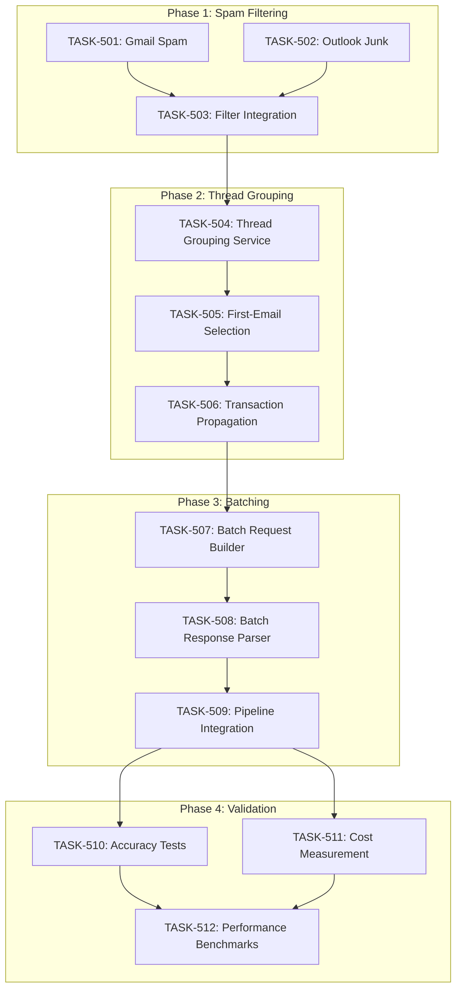

# Sprint Plan: SPRINT-007 - LLM Cost Optimization

## Sprint Goal

Reduce LLM API costs by ~97% through spam filtering, thread-based analysis, and batching. Enable testing of 600 emails for ~$0.15 instead of ~$6.00.

**Target:** 600 emails → 5 LLM calls (instead of 600)

## Prerequisites / Environment Setup

Before starting sprint work, engineers must:
- [ ] `git checkout develop && git pull origin develop`
- [ ] `npm install`
- [ ] `npm rebuild better-sqlite3-multiple-ciphers`
- [ ] `npx electron-rebuild`
- [ ] Verify app starts: `npm run dev`
- [ ] Verify tests pass: `npm test`

**Additional for this sprint:**
- [ ] Ensure SPRINT-006 changes are merged to develop (AI MVP complete)
- [ ] Verify LLM integration works (can scan emails with Anthropic/OpenAI)
- [ ] Have test email account with 50+ emails including spam

## In Scope

| ID | Title | Rationale |
|----|-------|-----------|
| BACKLOG-084 | Thread-Based Transaction Detection with Batching | 97% cost reduction |
| BACKLOG-085 | Test Thread-Based Detection Accuracy | Validate before production |

## Out of Scope / Deferred

| ID | Title | Reason |
|----|-------|--------|
| BACKLOG-086 | Local ML Model with Hybrid Training | Long-term effort, requires training infrastructure |
| - | UI changes for batching | Backend-only optimization |
| - | Real-time processing | Post-optimization enhancement |

## Reprioritized Backlog

| ID | Title | Category | Priority | Est. Turns | Dependencies | Phase |
|----|-------|----------|----------|------------|--------------|-------|
| TASK-501 | Gmail Spam Detection Utility | service | 1 | 15 | None | 1 |
| TASK-502 | Outlook Junk Detection Enhancement | service | 1 | 20 | None | 1 |
| TASK-503 | Spam Filter Integration | service | 2 | 10 | TASK-501, TASK-502 | 1 |
| TASK-504 | Thread Grouping Service | service | 3 | 25 | TASK-503 | 2 |
| TASK-505 | First-Email Selection Logic | service | 4 | 15 | TASK-504 | 2 |
| TASK-506 | Transaction Propagation to Thread | service | 5 | 20 | TASK-505 | 2 |
| TASK-507 | Batch LLM Request Builder | service | 6 | 25 | TASK-506 | 3 |
| TASK-508 | Batch Response Parser | service | 7 | 20 | TASK-507 | 3 |
| TASK-509 | Extraction Pipeline Integration | service | 8 | 20 | TASK-508 | 3 |
| TASK-510 | Accuracy Testing Suite | test | 9 | 15 | TASK-509 | 4 |
| TASK-511 | Cost Measurement Tests | test | 9 | 10 | TASK-509 | 4 |
| TASK-512 | Performance Benchmarks | test | 10 | 10 | TASK-510, TASK-511 | 4 |

**Total Estimated:** ~205 turns (~8-10 hours)

---

## Phase Plan

### Phase 1: Spam Filtering (TASK-501, 502, 503)

**Goal:** Filter out spam/junk emails before LLM processing

**Parallel tasks:**
- TASK-501: Gmail Spam Detection Utility (15 turns)
- TASK-502: Outlook Junk Detection Enhancement (20 turns)

**Sequential task:**
- TASK-503: Spam Filter Integration (10 turns) - after TASK-501, TASK-502

**Integration checkpoint:** All Phase 1 tasks merge to `int/cost-optimization`, CI must pass.

**Expected cost reduction:** ~15% (spam emails skipped)

### Phase 2: Thread Grouping (TASK-504, 505, 506)

**Goal:** Analyze only first email per thread, propagate results

**Sequential tasks (all modify hybridExtractorService.ts):**
- TASK-504: Thread Grouping Service (25 turns)
- TASK-505: First-Email Selection Logic (15 turns) - after TASK-504
- TASK-506: Transaction Propagation to Thread (20 turns) - after TASK-505

**Integration checkpoint:** Merge to `int/cost-optimization`, CI must pass.

**Expected cost reduction:** ~75% of remaining (thread grouping)

### Phase 3: Batching (TASK-507, 508, 509)

**Goal:** Batch multiple first-emails into single LLM calls

**Sequential tasks:**
- TASK-507: Batch LLM Request Builder (25 turns)
- TASK-508: Batch Response Parser (20 turns) - after TASK-507
- TASK-509: Extraction Pipeline Integration (20 turns) - after TASK-508

**Integration checkpoint:** Merge to `int/cost-optimization`, CI must pass.

**Expected cost reduction:** ~67% of remaining (batching)

### Phase 4: Validation (TASK-510, 511, 512) [BACKLOG-085]

**Goal:** Validate accuracy and cost reduction before production

**Parallel tasks:**
- TASK-510: Accuracy Testing Suite (15 turns)
- TASK-511: Cost Measurement Tests (10 turns)

**Sequential task:**
- TASK-512: Performance Benchmarks (10 turns) - after TASK-510, TASK-511

**Integration checkpoint:** ALL tests pass, ready for develop merge.

---

## Merge Plan

- **Main branch**: `develop`
- **Feature branch format**: `feature/TASK-XXX-<slug>`
- **Integration branch**: `int/cost-optimization`

### Merge Sequence

1. Create `int/cost-optimization` from `develop`

**Phase 1:**
2. TASK-501 → int/cost-optimization (parallel)
3. TASK-502 → int/cost-optimization (parallel with 501)
4. TASK-503 → int/cost-optimization (after 501, 502)

**Phase 2:**
5. TASK-504 → int/cost-optimization
6. TASK-505 → int/cost-optimization (after 504)
7. TASK-506 → int/cost-optimization (after 505)

**Phase 3:**
8. TASK-507 → int/cost-optimization
9. TASK-508 → int/cost-optimization (after 507)
10. TASK-509 → int/cost-optimization (after 508)

**Phase 4:**
11. TASK-510 → int/cost-optimization (parallel)
12. TASK-511 → int/cost-optimization (parallel with 510)
13. TASK-512 → int/cost-optimization (after 510, 511)

**Final:**
14. int/cost-optimization → develop (SR Engineer review required)

---

## Dependency Graph (Mermaid)

---

## Testing & Quality Plan

### Unit Testing

**New tests required for:**
- `electron/services/llm/spamFilterService.ts` - Spam detection logic
- `electron/services/llm/threadGroupingService.ts` - Thread grouping
- `electron/services/llm/batchLLMService.ts` - Batch request/response
- `electron/services/gmailFetchService.ts` - Spam label check
- `electron/services/outlookFetchService.ts` - Junk detection

### Coverage Expectations

- No regression from current coverage
- New services must have >70% coverage
- Integration tests cover full pipeline

### Integration / Feature Testing

Required scenarios:
- [ ] Gmail SPAM emails filtered (not sent to LLM)
- [ ] Outlook Junk emails filtered (not sent to LLM)
- [ ] Emails grouped by thread_id correctly
- [ ] First email per thread selected (earliest by date)
- [ ] Transaction detection propagates to all thread emails
- [ ] Batch requests combine multiple emails
- [ ] Batch responses parsed correctly
- [ ] Cost reduction verified (>90% reduction)
- [ ] Accuracy maintained (>95% match with current approach)

### CI / CD Quality Gates

- [ ] Unit tests (npm test)
- [ ] Type checking (npm run type-check)
- [ ] Linting (npm run lint)
- [ ] Build step (npm run build)
- [ ] Security audit (npm audit)

---

## Risk Register

| Risk | Likelihood | Impact | Mitigation |
|------|------------|--------|------------|
| Thread ID missing for some emails | Medium | Medium | Fallback to individual analysis |
| Batch response parsing errors | Medium | High | Graceful degradation, extensive tests |
| Accuracy regression | Low | High | Validation phase, conservative thresholds |
| First-email heuristic fails | Medium | Medium | Add keyword lookahead in thread |
| Outlook API rate limits | Low | Medium | Batch fetch requests |

---

## Decision Log

### Decision: Integration Branch Strategy

- **Date**: 2025-12-19
- **Context**: Cost optimization affects core extraction pipeline
- **Decision**: Use `int/cost-optimization` integration branch
- **Rationale**: Isolate changes, enable rollback if issues found
- **Impact**: All feature branches merge to int/cost-optimization first

### Decision: Sequential Phase 2 Tasks

- **Date**: 2025-12-19
- **Context**: TASK-504, 505, 506 all modify hybridExtractorService.ts
- **Decision**: Strictly sequential execution
- **Rationale**: Avoid merge conflicts in critical file
- **Impact**: Phase 2 takes longer but safer

### Decision: Defer BACKLOG-086

- **Date**: 2025-12-19
- **Context**: Local ML model is large undertaking
- **Decision**: Defer to future sprint after 084/085 validated
- **Rationale**: Prove cost optimization first, then build ML layer
- **Impact**: BACKLOG-086 remains in backlog for SPRINT-008+

---

## End-of-Sprint Validation Checklist

### Phase 1 Complete
- [ ] Gmail SPAM/TRASH emails filtered
- [ ] Outlook Junk emails filtered (inferenceClassification added)
- [ ] CI passes on int/cost-optimization

### Phase 2 Complete
- [ ] Emails grouped by thread_id
- [ ] First email per thread selected correctly
- [ ] Transaction propagates to all thread emails
- [ ] CI passes on int/cost-optimization

### Phase 3 Complete
- [ ] Batch requests combine 30-50 emails
- [ ] Batch responses parsed correctly
- [ ] Full pipeline works end-to-end
- [ ] CI passes on int/cost-optimization

### Phase 4 Complete
- [ ] Accuracy tests pass (>95% match)
- [ ] Cost tests pass (<$0.20 for 600 emails)
- [ ] Performance benchmarks meet targets
- [ ] ALL tests pass, ready for develop merge

### Sprint Complete
- [ ] All 12 tasks merged to int/cost-optimization
- [ ] int/cost-optimization merged to develop
- [ ] Cost reduction of 97% verified
- [ ] All engineer metrics collected
- [ ] Ready for production testing

---

## PM Metrics

**Sprint Planning:**
| Activity | Turns | Tokens (est.) | Time |
|----------|-------|---------------|------|
| Plan Agent | 1 | ~40K | 2 min |
| Sprint Plan Creation | 1 | ~25K | 10 min |
| Task File Creation | TBD | TBD | TBD |
| **PM Total** | TBD | TBD | TBD |

---

*Sprint created: 2025-12-19*
*PM: Agentic PM Agent*
*Source Backlog Items: BACKLOG-084, BACKLOG-085*
