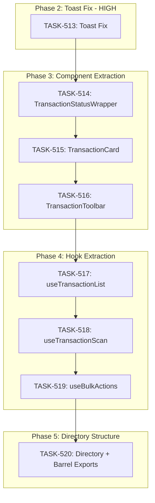

# SPRINT-008: TransactionList Refactoring

**Sprint Goal:** Reduce TransactionList.tsx from 1,357 lines to ~400 lines through systematic component and hook extraction while fixing the toast notification bug.

**Branch Strategy:**
- Base: `feature/transaction-list-ui-refinements`
- Work branches: `refactor/TASK-5XX-<slug>` (branch from base, merge back to base)
- Final merge: `feature/transaction-list-ui-refinements` → `develop`

**Status:** Planning

---

## Sprint Scope

### In Scope
1. Fix toast notification persistence (toasts disappear when modal closes)
2. Extract `TransactionStatusWrapper` to separate file
3. Extract `TransactionCard` component
4. Extract `TransactionToolbar` component
5. Extract `useTransactionList` hook
6. Extract `useTransactionScan` hook
7. Extract `useBulkActions` hook
8. Create `src/components/transaction/` directory structure

### Out of Scope
- TransactionDetails.tsx refactoring (only toast-related changes)
- New features or functionality changes
- Test file directory restructuring (tests stay in current locations)

### Testing Requirements (In Scope)
- Update test imports if they reference extracted components/hooks
- Ensure existing TransactionList tests pass after each extraction
- Add tests for extracted components if coverage drops below threshold
- Manual verification of all transaction actions after each phase

### Deferred
- Moving TransactionDetails.tsx into transaction/ directory (evaluate after core refactoring)

---

## Phase Plan

| Phase | Priority | Tasks | Review |
|-------|----------|-------|--------|
| 2 | HIGH | TASK-513 (Toast Fix) | Per-task SR review |
| 3 | MEDIUM | TASK-514, 515, 516 (Components) | Phase-end SR review |
| 4 | MEDIUM | TASK-517, 518, 519 (Hooks) | Phase-end SR review |
| 5 | LOW | TASK-520 (Directory Structure) | Per-task SR review |

---

## Dependency Graph



**Execution:** Sequential (each task modifies TransactionList.tsx, causing conflicts if parallel)

---

## Task Summary

| Task | Title | Est. Lines | Target File |
|------|-------|------------|-------------|
| TASK-513 | Fix toast persistence | +20 | TransactionList.tsx |
| TASK-514 | Extract TransactionStatusWrapper | ~250 | transaction/TransactionStatusWrapper.tsx |
| TASK-515 | Extract TransactionCard | ~150 | transaction/TransactionCard.tsx |
| TASK-516 | Extract TransactionToolbar | ~380 | transaction/TransactionToolbar.tsx |
| TASK-517 | Extract useTransactionList | ~80 | transaction/hooks/useTransactionList.ts |
| TASK-518 | Extract useTransactionScan | ~60 | transaction/hooks/useTransactionScan.ts |
| TASK-519 | Extract useBulkActions | ~100 | transaction/hooks/useBulkActions.ts |
| TASK-520 | Directory structure + index.ts | ~15 | transaction/index.ts |

---

## Estimates Summary

| Task | Turns | Tokens | Time | Confidence |
|------|-------|--------|------|------------|
| TASK-513 | 4-6 | ~20K | 30-45m | High |
| TASK-514 | 6-8 | ~28K | 45-60m | High |
| TASK-515 | 4-6 | ~20K | 30-45m | High |
| TASK-516 | 8-10 | ~36K | 60-90m | Medium |
| TASK-517 | 4-6 | ~20K | 30-45m | High |
| TASK-518 | 4-6 | ~20K | 30-45m | High |
| TASK-519 | 6-8 | ~28K | 45-60m | Medium |
| TASK-520 | 3-4 | ~14K | 20-30m | High |
| **Total** | **39-54** | **~186K** | **5-7 hrs** | - |

**Estimation Basis:**
- Similar past work: `useSelection.ts` (64 lines), `useTransactionStatusUpdate.ts` (196 lines)
- Component extraction follows existing patterns in codebase
- Hook patterns well-established (useToast, useSelection as templates)

---

## Target File Structure

```
src/components/
├── TransactionList.tsx              # ~400 lines (orchestration only)
├── TransactionDetails.tsx           # Existing (toast props added)
│
└── transaction/
    ├── index.ts                     # Barrel exports
    ├── TransactionStatusWrapper.tsx # ~250 lines
    ├── TransactionCard.tsx          # ~150 lines
    ├── TransactionToolbar.tsx       # ~380 lines
    │
    └── hooks/
        ├── useTransactionList.ts    # ~80 lines
        ├── useTransactionScan.ts    # ~60 lines
        └── useBulkActions.ts        # ~100 lines
```

---

## Quality Gates

### Per-Task (Engineer)
- [ ] Acceptance criteria met
- [ ] `npm run type-check` passes
- [ ] `npm run lint` passes
- [ ] `npm test` passes (no regressions)
- [ ] Metrics recorded (turns, tokens, time)

### Per-Phase (SR Engineer)
- [ ] All phase tasks merged
- [ ] No functionality regression
- [ ] Line count targets met
- [ ] Architecture patterns followed

### Sprint Completion
- [ ] TransactionList.tsx < 450 lines
- [ ] All extracted files pass type-check
- [ ] Full test suite passes
- [ ] Manual verification: toasts visible after approve/reject/restore
- [ ] Manual verification: all transaction actions work

---

## Risk Register

| Risk | Likelihood | Impact | Mitigation |
|------|------------|--------|------------|
| Merge conflicts between tasks | Medium | High | Sequential execution, merge before next task |
| Functionality regression | Medium | High | Test after each extraction |
| Import path breakage | Low | Medium | Barrel exports, gradual migration |
| Missing props in extraction | Medium | Medium | Explicit prop interfaces in task files |

---

## Metrics Tracking

| Task | Turns | Tokens | Time | Status |
|------|-------|--------|------|--------|
| TASK-513 | - | - | - | Pending |
| TASK-514 | - | - | - | Pending |
| TASK-515 | - | - | - | Pending |
| TASK-516 | - | - | - | Pending |
| TASK-517 | - | - | - | Pending |
| TASK-518 | - | - | - | Pending |
| TASK-519 | - | - | - | Pending |
| TASK-520 | - | - | - | Pending |
| **Total** | - | - | - | - |

---

## Sprint Timeline

1. **PM Setup** - Create sprint plan and task files
2. **Phase 2** - Toast fix (HIGH priority, blocking)
3. **Phase 3** - Component extraction (3 tasks)
4. **Phase 4** - Hook extraction (3 tasks)
5. **Phase 5** - Directory restructure (optional, user checkpoint)
6. **Sprint Close** - Final SR review, merge to develop
