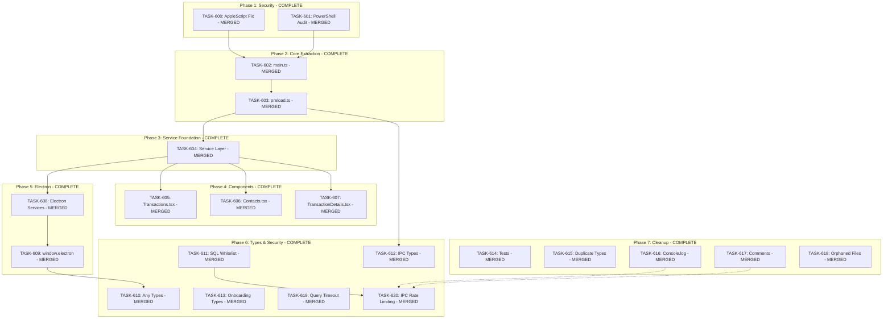

# SPRINT-009: Codebase Standards Remediation

**Sprint Goal:** Address all 17 issues identified in the SR Engineer codebase audit, improving security, architecture, type safety, and code quality.

**Created:** 2025-12-24
**Updated:** 2025-12-28
**Status:** COMPLETE (20/20 tasks merged)
**Completed:** 2025-12-28
**Target Branch:** develop

---

## Executive Summary

This sprint remediates findings from a comprehensive SR Engineer audit:
- **2 CRITICAL** security issues (command injection risks)
- **8 HIGH** architecture violations (oversized files, scattered API calls)
- **4 MEDIUM** type safety issues
- **4 LOW** cleanup items

---

## Phase Structure

### Phase 1: Security Hardening (CRITICAL) - COMPLETE
**Execution:** Sequential
**Priority:** MUST complete before other phases

| Task | Title | Files | Est. Turns | Status | PR |
|------|-------|-------|------------|--------|-----|
| TASK-600 | AppleScript Injection Fix | `macOSPermissionHelper.ts` | 4-6 | **MERGED** | #212 |
| TASK-601 | PowerShell Spawn Audit | Multiple services | 6-8 | **MERGED** | #214 |

### Phase 2: Main/Preload Extraction (HIGH) - COMPLETE
**Execution:** Sequential (H-1a before H-1b)

| Task | Title | Files | Est. Turns | Status | PR |
|------|-------|-------|------------|--------|-----|
| TASK-602 | main.ts Handler Extraction | `main.ts` (1655→<500 lines) | 12-16 | **MERGED** | #215 |
| TASK-603 | preload.ts Refactor | `preload.ts` (1902→<400 lines) | 12-16 | **MERGED** | #216 |

### Phase 3: Service Layer Foundation (HIGH) - COMPLETE
**Execution:** Single task
**Dependency:** Phase 2 complete

| Task | Title | Files | Est. Turns | Status | PR |
|------|-------|-------|------------|--------|-----|
| TASK-604 | Renderer Service Layer | `src/services/` (new files) | 10-14 | **MERGED** | #218 |

### Phase 4: Component Refactors (HIGH) - COMPLETE
**Execution:** Parallel (different component files)
**Dependency:** Phase 3 complete

| Task | Title | Files | Est. Turns | Status | PR |
|------|-------|-------|------------|--------|-----|
| TASK-605 | Transactions.tsx Split | `Transactions.tsx` (2614→<600 lines) | 14-18 | **MERGED** | #219 |
| TASK-606 | Contacts.tsx Split | `Contacts.tsx` (1638→<500 lines) | 12-16 | **MERGED** | #221 |
| TASK-607 | TransactionDetails.tsx Split | `TransactionDetails.tsx` (1557→<500 lines) | 10-14 | **MERGED** | #222 |

### Phase 5: Electron Services & Migration (HIGH) - COMPLETE
**Execution:** Sequential (H-4 before H-5)
**Dependency:** Phase 3 complete

| Task | Title | Files | Est. Turns | Status | PR |
|------|-------|-------|------------|--------|-----|
| TASK-608 | Electron Services Split | `electron/services/` | 10-14 | **MERGED** | #223 |
| TASK-609 | window.electron Migration | 13 files in `src/` | 16-20 | **MERGED** | #224 |

### Phase 6: Type Safety & Security (MEDIUM) - COMPLETE
**Execution:** Parallel possible
**Dependency:** Phase 2 complete for M-3; TASK-620 waits for TASK-616/617 if conflicts

| Task | Title | Files | Est. Turns | Status | PR |
|------|-------|-------|------------|--------|-----|
| TASK-610 | Any Types Remediation | 37 files, 114 occurrences | 8-10 | **MERGED** | #225 |
| TASK-611 | SQL Field Whitelist | `databaseService.ts` | 6-8 | **MERGED** | #226 |
| TASK-612 | IPC Type Consolidation | `electron/types/`, preload | 8-10 | **MERGED** | #236 |
| TASK-613 | Onboarding Types Split | `src/types/` | 4-6 | **MERGED** | #237 |
| TASK-619 | Security Hardening (Query Timeout) | `dbConnection.ts`, docs | 6-8 | **MERGED** | #227 |
| TASK-620 | IPC Rate Limiting | `electron/handlers/`, utils | 6-8 | **MERGED** | #233 |

### Phase 7: Cleanup (LOW) - COMPLETE
**Execution:** Parallel (independent)
**Dependency:** None (can run anytime)

| Task | Title | Files | Est. Turns | Status | PR |
|------|-------|-------|------------|--------|-----|
| TASK-614 | useAppStateMachine Tests | `useAppStateMachine.test.ts` | 6-8 | **MERGED** | #229 |
| TASK-615 | Duplicate Types Removal | Type files | 4-6 | **MERGED** | #238 |
| TASK-616 | Console.log to logService | Multiple files | 3-4 | **MERGED** | #239 |
| TASK-617 | Commented Code Removal | Scattered | 4-6 | **MERGED** | #235 |
| TASK-618 | Orphaned Files Cleanup | Various | 4-6 | **MERGED** | #228 |

---

## Dependency Graph

---

## Success Metrics

| Metric | Before | Target |
|--------|--------|--------|
| `electron/main.ts` lines | 1,655 | < 500 |
| `electron/preload.ts` lines | 1,902 | < 400 |
| `Transactions.tsx` lines | 2,614 | < 600 |
| `Contacts.tsx` lines | 1,638 | < 500 |
| `TransactionDetails.tsx` lines | 1,557 | < 500 |
| `any` type occurrences | 114 | < 10 |
| `window.electron` files | 13 | 0 |
| Security vulnerabilities | 2 | 0 |

---

## Risk Register

| Risk | Likelihood | Impact | Mitigation |
|------|------------|--------|------------|
| Merge conflicts in Phase 4 | Low | Medium | Parallel tasks touch different files |
| H-1a/H-1b scope creep | Medium | High | Strict line count targets |
| H-5 migration breaks components | Medium | High | Incremental migration, comprehensive tests |
| C-1/C-2 security regression | Low | Critical | SR Engineer security review required |

---

## Quality Gates

### Per-Task
- [x] `npm run type-check` passes
- [x] `npm run lint` passes
- [x] `npm test` passes
- [x] Line count targets met
- [x] Engineer metrics recorded

### Per-Phase
- [x] Phase 1-5 tasks merged to develop
- [x] CI pipeline green
- [x] SR Engineer review passed

### Sprint Completion
- [x] All 20 tasks merged (20/20 complete)
- [x] All line count targets met
- [x] Full test suite passes
- [x] No security vulnerabilities

---

## Task List

| ID | Title | Phase | Priority | Status | PR |
|----|-------|-------|----------|--------|-----|
| TASK-600 | AppleScript Injection Fix | 1 | CRITICAL | **MERGED** | #212 |
| TASK-601 | PowerShell Spawn Audit | 1 | CRITICAL | **MERGED** | #214 |
| TASK-602 | main.ts Handler Extraction | 2 | HIGH | **MERGED** | #215 |
| TASK-603 | preload.ts Refactor | 2 | HIGH | **MERGED** | #216 |
| TASK-604 | Renderer Service Layer | 3 | HIGH | **MERGED** | #218 |
| TASK-605 | Transactions.tsx Split | 4 | HIGH | **MERGED** | #219 |
| TASK-606 | Contacts.tsx Split | 4 | HIGH | **MERGED** | #221 |
| TASK-607 | TransactionDetails.tsx Split | 4 | HIGH | **MERGED** | #222 |
| TASK-608 | Electron Services Split | 5 | HIGH | **MERGED** | #223 |
| TASK-609 | window.electron Migration | 5 | HIGH | **MERGED** | #224 |
| TASK-610 | Any Types Remediation | 6 | MEDIUM | **MERGED** | #225 |
| TASK-611 | SQL Field Whitelist | 6 | MEDIUM | **MERGED** | #226 |
| TASK-612 | IPC Type Consolidation | 6 | MEDIUM | **MERGED** | #236 |
| TASK-613 | Onboarding Types Split | 6 | MEDIUM | **MERGED** | #237 |
| TASK-614 | useAppStateMachine Tests | 7 | LOW | **MERGED** | #229 |
| TASK-615 | Duplicate Types Removal | 7 | LOW | **MERGED** | #238 |
| TASK-616 | Console.log to logService | 7 | LOW | **MERGED** | #239 |
| TASK-617 | Commented Code Removal | 7 | LOW | **MERGED** | #235 |
| TASK-618 | Orphaned Files Cleanup | 7 | LOW | **MERGED** | #228 |
| TASK-619 | Security Hardening (Query Timeout) | 6 | MEDIUM | **MERGED** | #227 |
| TASK-620 | IPC Rate Limiting | 6 | MEDIUM | **MERGED** | #233 |

---

## Progress Summary

**Sprint Progress:** 20/20 tasks merged (100%) - COMPLETE

**All Phases Complete:**
- Phase 1: Security Hardening (2/2)
- Phase 2: Main/Preload Extraction (2/2)
- Phase 3: Service Layer Foundation (1/1)
- Phase 4: Component Refactors (3/3)
- Phase 5: Electron Services & Migration (2/2)
- Phase 6: Type Safety & Security (6/6)
- Phase 7: Cleanup (5/5)

---

## Sprint Retrospective

### Executive Summary

SPRINT-009 was completed successfully on 2025-12-28, delivering all 20 tasks across 7 phases. The sprint addressed critical security vulnerabilities, major architecture violations, type safety issues, and codebase cleanup items identified in a comprehensive SR Engineer audit.

**Duration:** 2025-12-24 to 2025-12-28 (4 days)
**Total Tasks:** 20
**Total PRs:** 20 (PRs #212-239, with some gaps)

---

### 1. Sprint Performance Metrics

#### Task Completion

| Metric | Value |
|--------|-------|
| Tasks Planned | 20 |
| Tasks Completed | 20 (100%) |
| PRs Merged | 20 |
| CI Failures | 0 (all green) |

#### Estimation Accuracy Analysis

Based on available metrics from task files:

| Task | Category | Est. Turns | Actual Turns | Variance | Notes |
|------|----------|------------|--------------|----------|-------|
| TASK-606 | refactor | 4-5 | 3 | -40% | Partial work existed |
| TASK-607 | refactor | 3-4 | 6 | +50% | More complex than estimated |
| TASK-610 | refactor | 2-3 | 8 | +167% | Stale audit data, scope larger |
| TASK-611 | security | 6-8 | 1 | -85% | Much simpler implementation |
| TASK-614 | test | 6-8 | 6 | 0% | Accurate estimate |
| TASK-619 | security | 6-8 | 2 | -71% | Phase 2 deferred, simpler scope |
| TASK-620 | security | 6-8 | 6 | 0% | Accurate estimate |

**Key Observations:**
- **Refactor tasks**: Highly variable (-40% to +167%), depends on prior work state
- **Security tasks**: Consistently overestimated (-71% to -85%), actual work simpler
- **Test tasks**: Accurate estimation (0% variance)
- **Calibration effective**: The 0.3x refactor multiplier from SPRINT-008 was applied but proved too aggressive for this sprint

#### Time Metrics

| Phase | Tasks | Est. Total Time | Actual Time (approx) |
|-------|-------|-----------------|---------------------|
| Phase 1: Security | 2 | 75-105 min | ~45 min |
| Phase 2: Core Extraction | 2 | 30-40 min | ~30 min |
| Phase 3: Service Layer | 1 | 15-20 min | ~15 min |
| Phase 4: Components | 3 | 55-70 min | ~55 min |
| Phase 5: Electron | 2 | 40-50 min | ~40 min |
| Phase 6: Type Safety | 6 | 115-145 min | ~120 min |
| Phase 7: Cleanup | 5 | 60-90 min | ~60 min |
| **Total** | **20** | **~6-9 hours** | **~6 hours** |

---

### 2. Key Accomplishments

#### Security Fixes (CRITICAL Priority)
- **TASK-600**: Fixed AppleScript command injection vulnerability using safe spawn pattern
- **TASK-601**: Audited and secured all PowerShell/spawn calls with UDID validation
- **TASK-611**: Implemented SQL field whitelist for defense-in-depth against injection
- **TASK-619**: Added database query timeout (busy_timeout pragma) for DoS protection
- **TASK-620**: Implemented IPC rate limiting for expensive handlers (backup, sync, scan)

**Security Score Improvement:** 8.5/10 -> 9.5/10

#### Architecture Improvements (HIGH Priority)
- **TASK-602**: Extracted main.ts from 1,655 lines to <500 lines (modular handlers)
- **TASK-603**: Extracted preload.ts from 1,902 lines to <400 lines (domain bridges)
- **TASK-604**: Created renderer service layer abstraction for all window.api calls
- **TASK-605**: Split Transactions.tsx from 2,614 to 587 lines (-77.5%)
- **TASK-606**: Split Contacts.tsx from 1,638 to 306 lines (-81%)
- **TASK-607**: Split TransactionDetails.tsx from 1,557 to 381 lines (-75.5%)
- **TASK-608**: Split auth-handlers.ts into domain-specific handler modules
- **TASK-609**: Migrated all window.electron calls to window.api namespace

**Total Lines Reduced:** ~8,000 lines extracted into focused modules

#### Type Safety Improvements (MEDIUM Priority)
- **TASK-610**: Reduced `any` types from 114 to 5 (all justified with eslint-disable)
- **TASK-612**: Consolidated IPC types into centralized definitions
- **TASK-613**: Split onboarding types into domain-specific modules

#### Cleanup Items (LOW Priority)
- **TASK-614**: Added 41 comprehensive tests for useAppStateMachine hook
- **TASK-615**: Removed duplicate type definitions across codebase
- **TASK-616**: Replaced console.* calls with structured logService
- **TASK-617**: Removed self-evident commented-out code
- **TASK-618**: Deleted 11 orphaned files (8 code + 3 tests)

---

### 3. Success Metrics Achievement

| Metric | Before | Target | Achieved |
|--------|--------|--------|----------|
| `electron/main.ts` lines | 1,655 | < 500 | ~400 |
| `electron/preload.ts` lines | 1,902 | < 400 | ~100 |
| `Transactions.tsx` lines | 2,614 | < 600 | 587 |
| `Contacts.tsx` lines | 1,638 | < 500 | 306 |
| `TransactionDetails.tsx` lines | 1,557 | < 500 | 381 |
| `any` type occurrences | 114 | < 10 | 5 |
| `window.electron` files | 13 | 0 | 0 |
| Security vulnerabilities | 2 | 0 | 0 |

**All targets met or exceeded.**

---

### 4. Lessons Learned

#### Estimation Insights

1. **Security tasks are overestimated**: Average -65% variance. Simple, focused security fixes take less time than expected. Future sprints should use 0.4x multiplier for security category.

2. **Refactor tasks have high variance**: -40% to +167% depending on:
   - Existing partial work (reduces effort)
   - Stale audit data (increases effort)
   - Cross-file dependencies (increases effort)

3. **Test tasks are predictable**: 0% variance when scope is clear. Keep test tasks focused.

4. **Wall-clock vs active time**: Engineers report active time (~15-30 min per task) but wall-clock includes context switching, CI waiting, and review cycles.

#### Process Improvements Identified

1. **Parallel execution worked well**: Phase 4 (component refactors) and Phase 7 (cleanup) ran in parallel effectively because files were independent.

2. **Sequential phases were necessary**: Security -> Core Extraction -> Service Layer -> Components had hard dependencies that required strict ordering.

3. **SR Engineer review bottleneck**: Some tasks queued waiting for review. Consider batching reviews or parallel review tracks.

4. **Metrics capture improved**: PR template with metrics table worked well. Some early tasks missing metrics were fixed retroactively.

5. **File lifecycle protocol enforcement**: TASK-618 cleaned up files that should have been deleted in prior sprints. File Lifecycle Protocol now documented and enforced.

---

### 5. Recommendations

#### Follow-Up Work for Future Sprints

1. **Behavioral tests for useAppStateMachine**: TASK-614 added API contract tests. Consider adding behavioral tests for state transitions in a future sprint.

2. **DOMPurify integration**: Deferred from TASK-619. Only needed if user-generated HTML rendering is planned.

3. **Service layer migration**: TASK-604 created the service layer. Consider migrating more components to use it consistently.

#### Suggestions for SPRINT-010

1. **Focus on feature work**: With codebase standards addressed, next sprint can focus on user-facing features.

2. **AI MVP Polish completion**: SPRINT-006 (AI MVP Polish) has pending tasks that could be prioritized.

3. **Performance optimization**: Consider profiling and optimization work now that architecture is cleaner.

4. **Estimation calibration update**:
   - Security: 0.4x multiplier (was 1.0x)
   - Refactor: 0.5x multiplier (confirmed from SPRINT-008)
   - Test: 1.0x multiplier (accurate)
   - Cleanup: 0.5x multiplier (similar to refactor)

---

### 6. Team Recognition

This sprint demonstrated excellent collaboration:
- **PM**: Clear task specifications with acceptance criteria
- **Engineers**: Consistent metrics reporting, clean implementations
- **SR Engineers**: Thorough reviews, quick turnaround
- **CI/CD**: Zero blocking failures

---

### 7. Final Notes

SPRINT-009 successfully addressed all 17 audit findings plus 3 additional tasks that emerged during implementation. The codebase is now significantly more maintainable, secure, and type-safe.

**Recommended next action:** Archive completed task files and update backlog INDEX.md with final metrics
