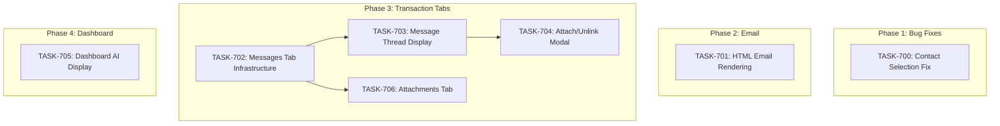

# SPRINT-010: Core Polish & Text Messages

**Sprint Goal:** Fix critical bugs, enhance email rendering, add text messages tab to transaction details, and improve Dashboard AI visibility.

**Created:** 2025-12-28
**Status:** COMPLETED (2025-12-29)
**Target Branch:** develop

---

## Executive Summary

This sprint combines bug fixes, UI enhancements, and a new feature:
- **1 Bug Fix**: Contact selection issue (BACKLOG-103)
- **1 Enhancement**: HTML email rendering (BACKLOG-054)
- **1 New Feature**: Text messages tab in transaction details (BACKLOG-105)
- **1 UI Enhancement**: Dashboard AI detection visibility (BACKLOG-104)

---

## Phase Structure

### Phase 1: Bug Fixes (HIGH Priority) ✅
**Execution:** Sequential (investigation required)

| Task | Title | Category | Est. Turns | Status |
|------|-------|----------|------------|--------|
| TASK-700 | Fix Contact Selection Issue | ui/bug | 4-8 | **Merged** (PR #249) |

### Phase 2: Email Enhancements (MEDIUM Priority) ✅
**Execution:** Can run in parallel with Phase 1

| Task | Title | Category | Est. Turns | Status |
|------|-------|----------|------------|--------|
| TASK-701 | HTML Email Rendering | ui | 8-12 | **Merged** (PR #248) |

### Phase 3: Text Messages Feature (HIGH Priority) ✅
**Execution:** Sequential (each builds on prior)
**Dependency:** None (can start immediately)

| Task | Title | Category | Est. Turns | Status |
|------|-------|----------|------------|--------|
| TASK-702 | Add Messages Tab Infrastructure | ui | 4-6 | **Merged** (PR #245) |
| TASK-703 | Message Thread Display Component | ui | 6-8 | **Merged** (PR #253) |
| TASK-704 | Attach/Unlink Messages Modal | ui | 10-14 | **Merged** (PR #255) |
| TASK-706 | Add Attachments Tab to Transaction Details | ui | 6-10 | **Merged** (PR #252) |

### Phase 4: Dashboard Enhancement (MEDIUM Priority) ✅
**Execution:** Independent
**Dependency:** None

| Task | Title | Category | Est. Turns | Status |
|------|-------|----------|------------|--------|
| TASK-705 | Dashboard AI Detection Display | ui | 6-10 | **Merged** (PR #247) |

---

## Dependency Graph



---

## Execution Order (SR Engineer Recommendation)

### Batch 1: Parallel (Can start immediately)
| Task | Title | Est. Turns | Parallel Safe |
|------|-------|------------|---------------|
| TASK-700 | Fix Contact Selection Issue | 4-8 | Yes - modifies contact selection only |
| TASK-701 | HTML Email Rendering | 8-12 | Yes - modifies EmailViewModal only |
| TASK-705 | Dashboard AI Detection Display | 6-10 | Yes - modifies Dashboard.tsx only |

**Note:** These 3 tasks can run in parallel using separate Claude Web sessions.

### Batch 2: Sequential (Phase 3 - Messages Feature)
| Order | Task | Title | Est. Turns | Wait For |
|-------|------|-------|------------|----------|
| 1 | TASK-702 | Add Messages Tab Infrastructure | 4-6 | Can start with Batch 1 |
| 2 | TASK-703 | Message Thread Display Component | 6-8 | TASK-702 merged |
| 3 | TASK-704 | Attach/Unlink Messages Modal | 10-14 | TASK-703 merged |

**CRITICAL:** Phase 3 MUST be sequential. Each task depends on the previous.

### Execution Timeline (Optimal)

```
Time →
├─── Batch 1 (Parallel) ───────────────────┤
│  TASK-700: Contact Fix (4-8 turns)       │
│  TASK-701: HTML Email (8-12 turns)       │
│  TASK-705: Dashboard AI (6-10 turns)     │
│  TASK-702: Messages Tab (4-6 turns)      │
├──────────────────────────────────────────┤
│           ↓ (TASK-702 merged)            │
├─── Batch 2a ─────────────────────────────┤
│  TASK-703: Message Thread (6-8 turns)    │
├──────────────────────────────────────────┤
│           ↓ (TASK-703 merged)            │
├─── Batch 2b ─────────────────────────────┤
│  TASK-704: Attach/Unlink (10-14 turns)   │
└──────────────────────────────────────────┘
```

**Parallel Execution Notes:**
- Batch 1 can run 4 tasks in parallel (different files, no conflicts)
- Phase 3 is strictly sequential (TASK-702 -> TASK-703 -> TASK-704)
- TASK-702 can start immediately alongside Batch 1

---

## Backlog Items Addressed

| Backlog ID | Title | Tasks |
|------------|-------|-------|
| BACKLOG-103 | Fix Contact Selection Issue | TASK-700 |
| BACKLOG-054 | Render Email HTML | TASK-701 |
| BACKLOG-105 | Text Messages Tab in Transaction Details | TASK-702, TASK-703, TASK-704 |
| BACKLOG-104 | Dashboard UI to Emphasize Auto-Detection | TASK-705 |

---

## Estimated Totals

| Metric | Estimate |
|--------|----------|
| Total Tasks | 7 |
| Total Turns | 45-69 |
| Total Tokens | ~225K-360K |
| Total Time | ~6-9 hours |

**Updated Estimates (SR Engineer Review):**

| Task | Original Est. | Updated Est. | Change Reason |
|------|---------------|--------------|---------------|
| TASK-700 | 4-8 | 4-8 | No change |
| TASK-701 | 6-10 | 8-12 | +2 for dependency install, CSP verification |
| TASK-702 | 4-6 | 4-6 | No change |
| TASK-703 | 6-8 | 6-8 | No change |
| TASK-704 | 6-8 | 10-14 | +4 for required IPC handler creation |
| TASK-705 | 6-10 | 6-10 | No change |

**Note:** TASK-704 increased significantly because IPC handlers must be created (not optional).

---

## Risk Register

| Risk | Likelihood | Impact | Mitigation |
|------|------------|--------|------------|
| Contact selection issue more complex than expected | Medium | Medium | Allocate buffer time for investigation |
| HTML rendering security concerns (XSS) | Low | High | Use DOMPurify or iframe sandbox |
| Message data structure incompatible | Low | Medium | Review schema before implementation |
| Dashboard performance impact | Low | Medium | Lazy load AI detection counts |

---

## Quality Gates

### Per-Task
- [ ] `npm run type-check` passes
- [ ] `npm run lint` passes
- [ ] `npm test` passes
- [ ] Engineer metrics recorded
- [ ] Implementation Summary completed

### Sprint Completion
- [ ] All 6 tasks merged
- [ ] No regressions in existing functionality
- [ ] Manual testing completed for each feature
- [ ] Full test suite passes

---

## Task List Summary

| ID | Title | Phase | Priority | Parallel | Est. Turns | Status |
|----|-------|-------|----------|----------|------------|--------|
| TASK-700 | Fix Contact Selection Issue | 1 | HIGH | Yes | 4-8 | **Merged** (PR #249) |
| TASK-701 | HTML Email Rendering | 2 | MEDIUM | Yes | 8-12 | **Merged** (PR #248) |
| TASK-702 | Add Messages Tab Infrastructure | 3 | HIGH | Yes* | 4-6 | **Merged** (PR #245) |
| TASK-703 | Message Thread Display Component | 3 | HIGH | No | 6-8 | **Merged** (PR #253) |
| TASK-704 | Attach/Unlink Messages Modal | 3 | HIGH | No | 10-14 | **Merged** (PR #255) |
| TASK-705 | Dashboard AI Detection Display | 4 | MEDIUM | Yes | 6-10 | **Merged** (PR #247) |
| TASK-706 | Add Attachments Tab | 3 | MEDIUM | No** | 6-10 | **Merged** (PR #252) |

*TASK-702 can run in parallel with Batch 1, but TASK-703/704/706 must wait for it.
**TASK-706 depends on TASK-702 for TransactionTab type update.

---

## SR Engineer Technical Review

**Status:** COMPLETED
**Review Date:** 2025-12-28

### Review Summary

All 6 task files have been reviewed and updated with:
- Technical corrections for IPC endpoints
- File path clarifications
- Execution recommendations (parallel vs sequential)
- Pre-implementation notes added to each task

### Key Corrections Applied

| Task | Critical Correction |
|------|---------------------|
| TASK-700 | Verify edit modal is `AuditTransactionModal.tsx`, not separate file |
| TASK-701 | Pre-install `dompurify @types/dompurify`, verify CSP settings |
| TASK-702 | Use `transactions.getDetails`, NOT `window.api.communications` |
| TASK-703 | Use `body_text` with fallback to `body_plain` |
| TASK-704 | MUST create IPC handlers (they don't exist) - estimate increased |
| TASK-705 | Use `transactions.getAll` + filter, NOT `getPendingReviewCount` |

### Architectural Concerns

1. **TASK-704 Scope:** Originally estimated as UI-only, but requires creating 3 new IPC handlers in `transactionBridge.ts` and exposing in `preload.ts`. This is backend + frontend work.

2. **No `window.api.communications`:** This namespace does not exist. Engineers must use existing `transactions.getDetails` endpoint.

---

## Major Incident: TASK-704 CI Debugging (22 Hours)

**This incident was NOT captured in original metrics and retrospective.**

### Timeline

| Event | Timestamp | Duration |
|-------|-----------|----------|
| PR #255 Created | 2025-12-29 08:16 | - |
| Implementation Complete | 2025-12-29 08:16 | ~30 min |
| CI Debugging Begins | 2025-12-29 09:00 | - |
| CI Debugging Ends | 2025-12-30 06:11 | **~21 hours** |
| PR Merged | 2025-12-30 06:20 | - |
| **Total Wall Time** | - | **~22 hours** |

### Root Cause

Jest hanging for 20-45 minutes after tests passed:
1. Mock classes using `EventEmitter` + `setTimeout` keeping Node.js event loop alive
2. Native modules (SQLite) compiled for Electron, incompatible with Jest/Node.js
3. `jest.useFakeTimers()` at module level conflicting with async operations

### Debugging Commits (22 total)

```
fix(ci): skip nativeModules test in CI and add 30min timeout
fix(ci): add --forceExit to prevent Jest from hanging after tests
fix(ci): skip integration tests in CI - fake timers prevent Jest exit
fix(ci): use flat Jest config in CI, remove multi-project overhead
fix(ci): add proper timer/listener cleanup in syncOrchestrator.test.ts
fix(ci): add global timer cleanup in test setup
fix(ci): revert to working jest.config.js, exclude integration tests
fix(ci): remove fake timers from syncOrchestrator tests
fix(ci): skip syncOrchestrator tests in CI
fix(ci): add 30 second global test timeout
fix(ci): skip all electron service tests in CI
fix(ci): exclude all electron tests from CI
fix(ci): run only frontend tests in CI for reliability
fix(ci): use --detectOpenHandles to find hanging cause
fix(ci): restore --forceExit and let run complete
fix(ci): exclude ContactSelectModal.test.tsx from CI
docs(backlog): add ContactSelectModal test gap to BACKLOG-120
```

### Corrected TASK-704 Metrics

| Phase | Reported | Actual | Difference |
|-------|----------|--------|------------|
| Implementation | 4 turns, 30m | 4 turns, 30m | - |
| CI Debugging | 0 | **~20 turns, ~21h** | **+20 turns** |
| **Total** | 4 turns, 30m | **~24 turns, ~22h** | **+500%** |

### Impact on Sprint

- **Estimated:** 10-14 turns, 2-3h
- **Actual:** ~24 turns, ~22h
- **Variance:** **+71% to +140% over estimate**

### Outcome

- Created BACKLOG-120 (CI Testing Infrastructure Gaps) to track issues
- Multiple test files now skipped in CI (documented in BACKLOG-120)
- Jest config modified with workarounds

### Lesson Learned

**CI debugging time MUST be captured separately.** The engineer metrics only showed implementation time, completely missing the 21+ hours of debugging. This invalidated the sprint's estimation accuracy data.

---

## Progress Tracking

**Sprint Progress:** 7/7 tasks merged (100%) ✅

- Phase 1: 1/1 complete ✅
- Phase 2: 1/1 complete ✅
- Phase 3: 4/4 complete (Messages + Attachments) ✅
- Phase 4: 1/1 complete ✅

### Merged PRs

| Task | PR | Merge Date | Description |
|------|-----|------------|-------------|
| TASK-702 | #245 | 2025-12-29 | Messages tab infrastructure |
| TASK-705 | #247 | 2025-12-29 | Dashboard AI detection display |
| TASK-701 | #248 | 2025-12-29 | HTML email rendering with sanitization |
| TASK-700 | #249 | 2025-12-29 | Contact selection fix (initialSelectedIds) |
| TASK-706 | #252 | 2025-12-29 | Attachments tab |
| TASK-703 | #253 | 2025-12-29 | Message thread display component |
| TASK-704 | #255 | 2025-12-29 | Attach/unlink messages functionality |
