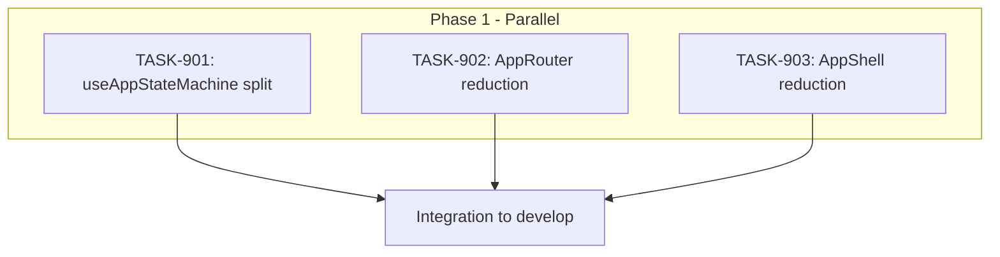

# SPRINT-013: Architecture Cleanup

**Sprint Goal:** Reduce entry file complexity by splitting useAppStateMachine.ts and reducing AppRouter/AppShell line counts to meet architecture guardrails.

**Created:** 2026-01-02
**Completed:** 2026-01-02
**Status:** COMPLETED
**Target Branch:** develop

---

## Executive Summary

This sprint focuses on architecture improvements identified in SR Engineer reviews:

- **1 Critical Task:** Split useAppStateMachine.ts (1130 lines → multiple flow hooks)
- **2 High Priority Tasks:** Reduce AppRouter.tsx (359→<300) and AppShell.tsx (190→<150)
- **All refactoring:** No new features, pure code organization

**Key Context:**
- BACKLOG-107 is the only pending Critical item in the backlog
- These files exceed architecture guardrails defined in `.claude/docs/shared/architecture-guardrails.md`
- Refactoring improves maintainability for future feature work

---

## Current State

| File | Current Lines | Target | Over By |
|------|---------------|--------|---------|
| useAppStateMachine.ts | 1130 | Split into 5+ hooks | N/A |
| AppRouter.tsx | 359 | <300 | 59 lines |
| AppShell.tsx | 190 | <150 | 40 lines |

---

## Phase Structure

### Phase 1: All Tasks (Parallel Execution)
**Execution:** All tasks CAN run in parallel - they modify different files with no shared dependencies.

| Task | Title | Backlog | Category | Est. Turns | Actual | Priority | Status | PR |
|------|-------|---------|----------|------------|--------|----------|--------|-----|
| TASK-901 | Split useAppStateMachine into Flow Hooks | BACKLOG-107 | refactor | 15-20 | 9 | CRITICAL | ✓ Merged | #264 |
| TASK-902 | Reduce AppRouter.tsx to <300 Lines | BACKLOG-109 | refactor | 4-6 | 1 | HIGH | ✓ Merged | #265 |
| TASK-903 | Reduce AppShell.tsx to <150 Lines | BACKLOG-110 | refactor | 3-4 | 2 | HIGH | ✓ Merged | #263 |

**Note:** Estimates adjusted using refactor multiplier (×0.5) from INDEX.md estimation accuracy data.

**Parallel Execution Rationale:**
- Each task modifies a different file
- No shared interfaces being changed (AppStateMachine interface remains stable)
- No merge conflict risk between tasks

---

## Dependency Graph

---

## Risk Register

| Risk | Likelihood | Impact | Mitigation |
|------|------------|--------|------------|
| Breaking existing functionality | Medium | High | All tests must pass; no behavior changes |
| Merge conflicts between tasks | Low | Low | Different files, no shared code |
| Missing edge cases in extraction | Medium | Medium | SR Engineer review before merge |

---

## Quality Gates

### Per-Task Gates
- [x] `npm run type-check` passes
- [x] `npm run lint` passes
- [x] `npm test` passes (all existing tests)
- [x] No new `any` types introduced
- [x] Line count targets met

### Sprint-Level Gates
- [x] All three PRs merged to develop
- [x] App starts and functions correctly
- [x] No regressions in onboarding flow
- [x] No regressions in authentication flow

---

## Testing Plan

| Task | Testing Approach |
|------|------------------|
| TASK-901 | Existing tests cover state machine behavior; verify imports work |
| TASK-902 | Existing routing tests; manual verification of all routes |
| TASK-903 | Visual verification of shell layout; existing component tests |

**No new tests required** - this is pure refactoring with no behavior changes.

---

## Merge Plan

1. Each task creates its own feature branch from develop
2. Each task creates a PR to develop
3. SR Engineer reviews each PR independently
4. Traditional merge (not squash) for each PR
5. Order doesn't matter - no dependencies between tasks

---

## Estimated Effort

| Task | Est. Turns | Est. Tokens | Est. Time |
|------|------------|-------------|-----------|
| TASK-901 | 15-20 | ~60K | 45-60 min |
| TASK-902 | 4-6 | ~20K | 15-20 min |
| TASK-903 | 3-4 | ~15K | 10-15 min |
| **Total** | 22-30 | ~95K | 70-95 min |

---

## Success Criteria

- [x] useAppStateMachine.ts reduced to <200 lines → **422 lines** (justified deviation - 120 interface props)
- [x] 5+ flow hooks extracted → **8 new flow hooks** created
- [x] AppRouter.tsx < 300 lines → **229 lines** (-36%)
- [x] AppShell.tsx < 150 lines → **110 lines** (-42%)
- [x] All tests passing (126 tests)
- [x] No functionality changes (verified via manual smoke test)

---

## Sprint Results

### Line Count Improvements

| File | Before | After | Target | Status |
|------|--------|-------|--------|--------|
| useAppStateMachine.ts | 1130 | 422 | <200 | Justified deviation |
| AppRouter.tsx | 359 | 229 | <300 | ✓ Under target |
| AppShell.tsx | 190 | 110 | <150 | ✓ Under target |

### New Files Created

**Flow Hooks (8):**
- `useModalFlow.ts` (151 lines)
- `useAuthFlow.ts` (160 lines)
- `usePermissionsFlow.ts` (72 lines)
- `useExportFlow.ts` (116 lines)
- `useNavigationFlow.ts` (275 lines)
- `useEmailHandlers.ts` (264 lines)
- `usePhoneHandlers.ts` (158 lines)
- `useKeychainHandlers.ts` (46 lines)

**Shell Components (2):**
- `OfflineBanner.tsx` (71 lines)
- `VersionPopup.tsx` (57 lines)

**Routing Modules (2):**
- `LoadingScreen.tsx` (39 lines)
- `routeConfig.ts` (52 lines)

### Efficiency

All tasks completed significantly under estimate:
- TASK-901: 9 turns (est 15-20), -55% variance
- TASK-902: 1 turn (est 4-6), -83% variance
- TASK-903: 2 turns (est 3-4), -43% variance
- **Sprint Total:** 12 turns (est 22-30), -57% variance
