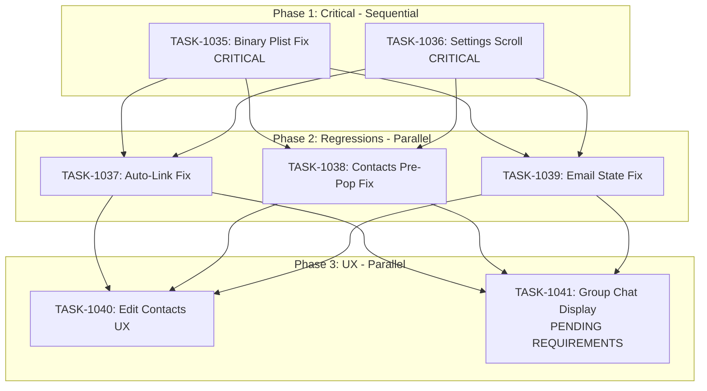

# Sprint Plan: SPRINT-034 - Stability Fixes

## Sprint Goal

Fix critical bugs and regressions found during testing, focusing on:
1. Data integrity (iMessage encoding corruption)
2. UI accessibility (Settings scroll)
3. Regression fixes from SPRINT-033
4. UX improvements for contact editing

## Sprint Status: PLANNING

**Created:** 2026-01-12
**Updated:** 2026-01-12
**Target Branch:** develop
**Estimated Duration:** 5-7 days
**Total Estimated Tokens:** ~290K (with SR review overhead + buffer)

---

## Context

### Source

This is a **STABILITY sprint** addressing critical bugs and regressions discovered during testing of SPRINT-033 deliverables. Focus is on fixing what's broken rather than adding new features.

### Priority Rationale

| Priority | Items Selected | Reason |
|----------|----------------|--------|
| CRITICAL | BACKLOG-215 (iMessage encoding) | ALL messages corrupted - data integrity violation |
| CRITICAL | BACKLOG-212 (Settings scroll) | Blocks access to Force Re-import feature |
| HIGH | BACKLOG-214 (Auto-link regression) | TASK-1031 may have regression |
| HIGH | BACKLOG-216 (Contacts pre-pop regression) | TASK-1030 still not working |
| HIGH | BACKLOG-211 (Email onboarding state) | Confusing UX, "All Caught Up" shown incorrectly |
| HIGH | BACKLOG-217 (Edit contacts UX) | User requested improvement |
| HIGH | BACKLOG-218 (Group chat display) | Needs requirements clarification |

### Key Findings

**BACKLOG-215 Root Cause Identified:**
- iMessage stores messages in `message.text` (plain) OR `message.attributedBody` (binary plist)
- TASK-1028 tried UTF-8/UTF-16/Latin1 text encoding fallback - WRONG approach
- The `attributedBody` field contains binary plist data (NSAttributedString serialization)
- Treating binary plist as text produces garbled CJK characters
- Reference: https://fatbobman.com/en/posts/deep-dive-into-imessage/

**BACKLOG-212 Investigation Status:**
- Two fix attempts failed (PR #410, #411)
- Simple CSS fixes (overflow-hidden removal, div restructure) did not work
- Needs deeper CSS/DOM hierarchy investigation

---

## In Scope

| Task | Backlog | Title | Est. Tokens | Phase | Priority |
|------|---------|-------|-------------|-------|----------|
| TASK-1035 | BACKLOG-215 | Fix iMessage Binary Plist Parsing | ~75K | 1 | CRITICAL |
| TASK-1036 | BACKLOG-212 | Fix Settings Modal Scroll (Deep Investigation) | ~40K | 1 | CRITICAL |
| TASK-1037 | BACKLOG-214 | Investigate/Fix Auto-Link Regression | ~30K | 2 | HIGH |
| TASK-1038 | BACKLOG-216 | Investigate/Fix Contacts Pre-Population Regression | ~25K | 2 | HIGH |
| TASK-1039 | BACKLOG-211 | Fix Email Onboarding State Mismatch | ~35K | 2 | HIGH |
| TASK-1040 | BACKLOG-217 | Edit Contacts Button Direct Modal | ~40K | 3 | HIGH |
| TASK-1041 | BACKLOG-218 | Group Chat Display (Pending Requirements) | ~30K | 3 | HIGH |

**Total Estimated (implementation):** ~275K tokens
**SR Review Overhead:** +35K (7 tasks)
**Buffer (10%):** ~30K
**Grand Total:** ~340K tokens

---

## Out of Scope / Deferred

| Backlog | Title | Reason |
|---------|-------|--------|
| BACKLOG-202 | Fix Test Regressions | SPRINT-032 scope |
| BACKLOG-203 | macOS Messages Tests | SPRINT-032 scope |
| Any new features | - | Stability focus only |

---

## Phase Plan

### Phase 1: Critical Fixes (Sequential - Highest Priority)

```
Phase 1 (Sequential)
├── TASK-1035: Fix iMessage Binary Plist Parsing (CRITICAL)
└── TASK-1036: Fix Settings Modal Scroll (CRITICAL)
```

**Why Phase 1 is Sequential:**
- TASK-1035 (encoding fix) changes iMessage import fundamentally
- TASK-1036 (settings scroll) blocks access to Force Re-import
- Both are critical blockers - must be fixed first
- Different files, but both need focused attention

**Files Affected:**
- TASK-1035: `macOSMessagesImportService.ts`, `messageParser.ts` (or new plist parser)
- TASK-1036: `Settings.tsx`, possibly modal wrapper components

**Integration checkpoint:** Both TASK-1035 and TASK-1036 must merge before Phase 2 begins

### Phase 2: Regression Fixes (Parallel Safe)

```
Phase 2 (Parallel)
├── TASK-1037: Investigate/Fix Auto-Link Regression
├── TASK-1038: Investigate/Fix Contacts Pre-Population Regression
└── TASK-1039: Fix Email Onboarding State Mismatch
```

**Why parallel is safe:**
- TASK-1037 modifies: `transactionService.ts` (auto-link flow)
- TASK-1038 modifies: `EditTransactionModal.tsx`, API handlers
- TASK-1039 modifies: `sessionHandlers.ts`, `AIStatusCard.tsx`
- Different services and UI components

**Potential conflict:** TASK-1037 and TASK-1038 may both touch transaction-related code.
SR Engineer to verify file matrix during technical review.

### Phase 3: UX Improvements (Parallel Safe)

```
Phase 3 (Parallel)
├── TASK-1040: Edit Contacts Button Direct Modal
└── TASK-1041: Group Chat Display (Pending Requirements)
```

**Why parallel is safe:**
- TASK-1040 modifies: Transaction detail view, contact modal extraction
- TASK-1041 modifies: Communication display in transaction details
- Different UI features

**IMPORTANT:** TASK-1041 is pending user requirements clarification.
Do NOT assign until requirements are defined.

---

## Dependency Graph



### YAML Edges

```yaml
dependency_graph:
  nodes:
    - id: TASK-1035
      type: task
      phase: 1
      title: "Fix iMessage Binary Plist Parsing"
      priority: critical
    - id: TASK-1036
      type: task
      phase: 1
      title: "Fix Settings Modal Scroll"
      priority: critical
    - id: TASK-1037
      type: task
      phase: 2
      title: "Investigate/Fix Auto-Link Regression"
      priority: high
    - id: TASK-1038
      type: task
      phase: 2
      title: "Investigate/Fix Contacts Pre-Population Regression"
      priority: high
    - id: TASK-1039
      type: task
      phase: 2
      title: "Fix Email Onboarding State Mismatch"
      priority: high
    - id: TASK-1040
      type: task
      phase: 3
      title: "Edit Contacts Button Direct Modal"
      priority: high
    - id: TASK-1041
      type: task
      phase: 3
      title: "Group Chat Display"
      priority: high
      status: pending_requirements

  edges:
    - from: TASK-1035
      to: TASK-1037
      type: depends_on
      reason: "Phase 2 starts after Phase 1 complete"
    - from: TASK-1035
      to: TASK-1038
      type: depends_on
      reason: "Phase 2 starts after Phase 1 complete"
    - from: TASK-1035
      to: TASK-1039
      type: depends_on
      reason: "Phase 2 starts after Phase 1 complete"
    - from: TASK-1036
      to: TASK-1037
      type: depends_on
      reason: "Settings scroll needed for testing re-import"
    - from: TASK-1036
      to: TASK-1038
      type: depends_on
      reason: "Phase 2 starts after Phase 1 complete"
    - from: TASK-1036
      to: TASK-1039
      type: depends_on
      reason: "Phase 2 starts after Phase 1 complete"
    - from: TASK-1037
      to: TASK-1040
      type: depends_on
      reason: "Phase 3 starts after Phase 2 complete"
    - from: TASK-1038
      to: TASK-1040
      type: depends_on
      reason: "Contact pre-pop fix needed before UX improvements"
    - from: TASK-1039
      to: TASK-1040
      type: depends_on
      reason: "Phase 3 starts after Phase 2 complete"
    - from: TASK-1037
      to: TASK-1041
      type: depends_on
      reason: "Phase 3 starts after Phase 2 complete"
    - from: TASK-1038
      to: TASK-1041
      type: depends_on
      reason: "Phase 3 starts after Phase 2 complete"
    - from: TASK-1039
      to: TASK-1041
      type: depends_on
      reason: "Phase 3 starts after Phase 2 complete"
```

---

## SR Engineer Technical Review

**Status:** PENDING
**Review Date:** TBD
**Reviewer:** TBD

### Review Needed

1. **File Matrix Analysis:** Identify shared files across tasks
2. **Parallel/Sequential Verification:** Confirm Phase 2 and 3 can run parallel
3. **Technical Considerations:** Add to each task file
4. **Risk Assessment:** Flag any architectural concerns

### Preliminary File Matrix (To Be Verified)

| File | Tasks | Preliminary Recommendation |
|------|-------|----------------------------|
| `macOSMessagesImportService.ts` | 1035 | No conflict |
| `messageParser.ts` | 1035 | No conflict |
| `Settings.tsx` | 1036 | No conflict |
| `transactionService.ts` | 1037, 1038 | Potential conflict - verify |
| `EditTransactionModal.tsx` | 1038, 1040 | Sequential (1038 first) |
| `sessionHandlers.ts` | 1039 | No conflict |
| `AIStatusCard.tsx` | 1039 | No conflict |
| `TransactionDetailView.tsx` | 1040, 1041 | Potential conflict - verify |

---

## Prerequisites / Environment Setup

Before starting sprint work, engineers must:
- [ ] `git checkout develop && git pull origin develop`
- [ ] `npm install`
- [ ] `npm rebuild better-sqlite3-multiple-ciphers`
- [ ] `npx electron-rebuild`
- [ ] Verify app starts: `npm run dev`
- [ ] Have iMessage database with corrupted messages for testing (TASK-1035)

---

## Testing & Quality Plan

### TASK-1035 (Binary Plist Parsing)
- **Goal:** All iMessage content displays correctly
- **Unit Tests:** Binary plist parsing with various formats
- **Integration Tests:** Re-import messages, verify text extraction
- **Manual Testing:** Verify no garbled characters in any chats
- **Regression:** Existing message data not corrupted

### TASK-1036 (Settings Scroll)
- **Goal:** Settings modal scrollable on all screen sizes
- **Manual Testing:** Test on 768px height minimum
- **Regression:** No visual regression to modal appearance
- **Verification:** Force Re-import feature accessible

### TASK-1037 (Auto-Link Regression)
- **Goal:** Contacts added to transactions auto-link communications
- **Unit Tests:** Verify auto-link service is called
- **Integration Tests:** Add contact, verify emails/messages linked
- **Logging:** Add diagnostic logging to identify silent failures

### TASK-1038 (Contacts Pre-Population Regression)
- **Goal:** Existing contacts appear when editing transaction
- **Unit Tests:** loadContactAssignments() returns correct data
- **Integration Tests:** Edit flow with multiple contacts/roles
- **Logging:** Add diagnostic logging to trace data flow

### TASK-1039 (Email Onboarding State)
- **Goal:** Consistent state between Settings and Dashboard
- **Unit Tests:** handleCheckEmailOnboarding edge cases
- **Integration Tests:** Token exists but flag false scenario
- **Manual Testing:** Verify correct prompts shown

### TASK-1040 (Edit Contacts UX)
- **Goal:** Direct modal access for contact editing
- **Manual Testing:** Button opens modal directly
- **Regression:** Full edit wizard still works

### TASK-1041 (Group Chat Display)
- **Goal:** TBD pending requirements
- **Tests:** TBD pending requirements

### CI Requirements
- All PRs must pass: `npm test`, `npm run type-check`, `npm run lint`
- No regressions in existing test coverage
- Test runs 3x without flakiness

---

## Progress Tracking

| Task | Phase | Status | Agent ID | Billable Tokens | Duration | PR |
|------|-------|--------|----------|-----------------|----------|-----|
| TASK-1035 | 1 | MERGED | a9f95fc / a0fe5ba | 432K (est 75K) | 40 min | #413 |
| TASK-1036 | 1 | MERGED | a90712f / a0b5ce7 | 219K (est 40K) | 9 min | #414 |
| TASK-1037 | 2 | MERGED | acb9d4c / a56f4ec | 463K (est 30K) | 10 min | #415 |
| TASK-1038 | 2 | MERGED | a8adaff / a1a7258 | 386K (est 25K) | 13 min | #416 |
| TASK-1039 | 2 | MERGED | a966044 / ad35a59 | 184K (est 35K) | 6 min | #417 |
| TASK-1040 | 3 | MERGED | a63b439 / a31c2ad | 156K (est 40K) | 6 min | #418 |
| TASK-1041 | 3 | BLOCKED (requirements) | - | - (est 30K) | - | - |

**Metrics Summary:**
- **6 of 7 tasks complete** (TASK-1041 blocked pending user requirements)
- **Total Billable Tokens:** ~1.84M (vs estimated ~245K for completed tasks)
- **Average Variance:** +651% over estimates
- **Total Duration:** ~84 min engineering time

---

## Risk Register

| Risk | Impact | Likelihood | Mitigation |
|------|--------|------------|------------|
| Binary plist parsing complexity | High | Medium | Use proven library (plist npm) or plutil CLI fallback |
| Settings scroll has deep root cause | Medium | Medium | Time-box investigation; may need human debugging |
| TASK-1037/1038 same root cause | Low | Medium | May be same code path issue - combine if so |
| TASK-1041 requirements unclear | Medium | High | Do NOT assign until user clarifies requirements |
| transactionService.ts conflicts | Medium | Medium | SR Engineer to verify; may need sequential execution |

---

## Blocking Issues

| Issue | Affected Tasks | Resolution |
|-------|----------------|------------|
| TASK-1041 needs requirements | TASK-1041 | User to provide specific requirements |

---

## Success Criteria

1. **CRITICAL:** iMessage text displays correctly without garbled characters
2. **CRITICAL:** Settings modal is fully scrollable, Force Re-import accessible
3. **HIGH:** Auto-link communications working after contact addition
4. **HIGH:** Contacts pre-populate correctly when editing transactions
5. **HIGH:** Email onboarding state is consistent across UI
6. **HIGH:** Edit contacts button provides direct modal access
7. **Quality:** All tests passing, no new flakiness
8. **Quality:** Regression tests added for each fix

---

## End-of-Sprint Validation Checklist

- [ ] All tasks merged to develop (except TASK-1041 if blocked)
- [ ] All CI checks passing
- [ ] All acceptance criteria verified
- [ ] Testing requirements met
- [ ] No unresolved conflicts
- [ ] Documentation updated (sprint plan, backlog INDEX)
- [ ] Manual testing of iMessage import with previously corrupted data
- [ ] Manual testing of Settings scroll on minimum screen height
- [ ] TASK-1041 requirements clarified or deferred to next sprint

---

## Unplanned Work Log

| Task | Source | Root Cause | Added Date | Est. Tokens | Actual Tokens |
|------|--------|------------|------------|-------------|---------------|
| - | - | - | - | - | - |

---

## Related Backlog Items

| ID | Title | Priority | Status | Sprint |
|----|-------|----------|--------|--------|
| BACKLOG-215 | iMessage Encoding Corruption (Binary Plist) | Critical | In Sprint | SPRINT-034 |
| BACKLOG-212 | Settings Popup Not Scrollable | Critical | In Sprint | SPRINT-034 |
| BACKLOG-214 | Auto-Link Not Working (TASK-1031 Regression) | High | In Sprint | SPRINT-034 |
| BACKLOG-216 | Contacts Not Pre-Populating (TASK-1030 Regression) | High | In Sprint | SPRINT-034 |
| BACKLOG-211 | Email Onboarding State Mismatch | High | In Sprint | SPRINT-034 |
| BACKLOG-217 | Edit Contacts Button UX | High | In Sprint | SPRINT-034 |
| BACKLOG-218 | Group Chat Display | High | In Sprint (blocked) | SPRINT-034 |

---

## Notes

- **This is a STABILITY sprint** - focus on fixing what's broken
- Each task needs proper testing before marking complete
- Add regression tests to prevent future recurrence
- TASK-1041 is blocked pending user requirements - do not assign until clarified
- Reference for TASK-1035: https://fatbobman.com/en/posts/deep-dive-into-imessage/
