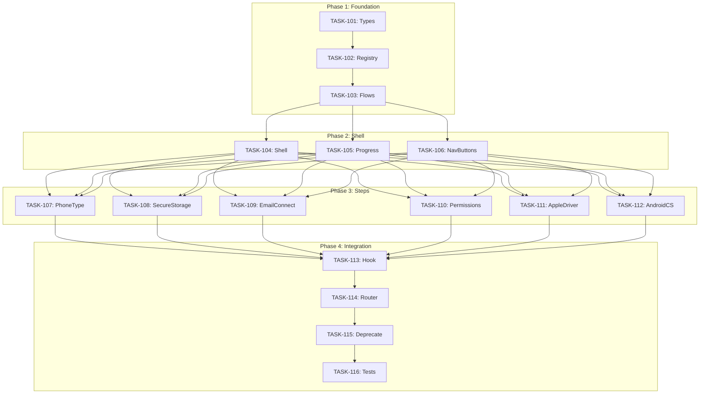

# Sprint Plan: Onboarding Flow Architecture Refactor

**Sprint ID:** ONBOARD-2024-01
**Duration:** 1 Sprint
**Branch:** `claude/fix-onboarding-flow-01QTesyUwNYxSQs4qSx8MZ1J`
**PM Authority:** Final authority on scope, sequencing, and merge readiness

---

## 1. Sprint Narrative / Goal

This sprint transforms the onboarding flow from a **fragmented, duplicated implementation** into a **centralized, configuration-driven architecture** that:

1. Establishes a **single source of truth** for step definitions, eliminating duplicate step arrays across 3+ files
2. Creates a **reusable step-per-file pattern** where each step owns its metadata and content
3. Implements **automatic progress bar generation** from the step registry
4. Adds **platform validation** that throws developer errors when steps are misconfigured
5. Enables **trivial adaptation to new platforms** (e.g., Linux) by defining a step order array

The goal is to enable **any future platform adaptation** to require only:
1. Creating any missing platform-specific step files
2. Defining the step order array for that platform
3. Everything else (progress bar, navigation, layout) auto-generates

We are **not** changing visible UX behavior in this sprint. The refactor is structural.

---

## 2. Explicit Out-of-Scope / Deferred

### Explicitly NOT in this sprint:

| Item | Reason |
|------|--------|
| **Visual redesign of onboarding** | Structural refactor only; UX unchanged |
| **Adding new onboarding steps** | Focus on architecture, not features |
| **Linux platform support** | Architecture enables it; implementation deferred |
| **Android full support** | Existing "Coming Soon" screen unchanged |
| **Email connection logic changes** | Only extracting to new pattern, not modifying |
| **State machine refactor** | Will integrate with existing `useAppStateMachine` |
| **Test migration/expansion** | Existing tests continue to work; new tests follow |
| **Removing old files immediately** | Deprecate-then-remove pattern for safety |

### Deferred Decisions:

| Decision | Deferred Until |
|----------|----------------|
| Step animation transitions | After architecture is stable |
| A/B testing different flows | After architecture supports it |
| Analytics integration per step | After step registry is proven |

---

## 3. Backlog Re-prioritization & Rationale

### Current State Analysis

| File | Lines | Problem |
|------|-------|---------|
| `EmailOnboardingScreen.tsx` | 1,019 | Monolithic, contains embedded progress indicator copy |
| `PermissionsScreen.tsx` | 863 | Duplicates layout pattern |
| `OnboardingWizard.tsx` | 802 | Different progress bar implementation |
| `PhoneTypeSelection.tsx` | 275 | Duplicates step array with different order |
| `SetupProgressIndicator.tsx` | 113 | Used inconsistently, step arrays differ |
| `KeychainExplanation.tsx` | 242 | Uses SetupProgressIndicator but hardcodes step 3 |
| `AndroidComingSoon.tsx` | 199 | No progress indicator at all |
| `AppleDriverSetup.tsx` | ~400 | Windows-only, separate layout |

**Critical Finding:** Step arrays in `SetupProgressIndicator.tsx` have Connect Email before Secure Storage, while `PhoneTypeSelection.tsx` has the opposite order. This is a **live bug**.

### Prioritized Backlog (This Sprint)

| Priority | Task ID | Title | Rationale |
|----------|---------|-------|-----------|
| P0 | TASK-101 | Create type definitions and interfaces | Foundation for all other work |
| P0 | TASK-102 | Create step registry infrastructure | Must exist before any step files |
| P0 | TASK-103 | Create flow definitions (macOS/Windows) | Defines platform orderings |
| P1 | TASK-104 | Create OnboardingShell layout wrapper | Shared layout for all steps |
| P1 | TASK-105 | Create unified ProgressIndicator | Reads from registry, replaces duplicates |
| P1 | TASK-106 | Create NavigationButtons component | Configurable back/next/skip |
| P2 | TASK-107 | Extract PhoneTypeStep | First step migration, validates pattern |
| P2 | TASK-108 | Extract SecureStorageStep | macOS-only step, tests platform gating |
| P2 | TASK-109 | Extract EmailConnectStep | Largest extraction, highest risk |
| P2 | TASK-110 | Extract PermissionsStep | macOS-only, validates pattern |
| P2 | TASK-111 | Extract AppleDriverStep | Windows-only, validates pattern |
| P2 | TASK-112 | Extract AndroidComingSoonStep | Edge case step |
| P3 | TASK-113 | Create useOnboardingFlow hook | Orchestrates step navigation |
| P3 | TASK-114 | Integrate with AppRouter | Wire new system to existing router |
| P4 | TASK-115 | Deprecate old components | Mark as deprecated, prep for removal |
| P4 | TASK-116 | Update tests | Ensure existing tests pass with new architecture |

---

## 4. Phase Plan (Parallel vs Sequential)

### Phase 1: Foundation (Sequential - Must Complete First)
**Branch:** `int/phase1-foundation`

```
TASK-101 → TASK-102 → TASK-103
   ↓           ↓           ↓
 Types     Registry     Flows
```

**Rationale:** All subsequent work depends on these type definitions and infrastructure. Cannot parallelize.

**Integration Checkpoint:**
- All type definitions compile
- Registry validates step IDs match
- Flow validation throws on misconfigured steps
- CI green

---

### Phase 2: Shell Components (Parallel After Phase 1)
**Branch:** `int/phase2-shell`

```
┌─────────────────┬─────────────────┬─────────────────┐
│   TASK-104      │   TASK-105      │   TASK-106      │
│ OnboardingShell │ ProgressIndicator│ NavigationBtns │
└─────────────────┴─────────────────┴─────────────────┘
```

**Rationale:** These three components have no dependencies on each other. They all consume types from Phase 1.

**Integration Checkpoint:**
- Shell renders without steps (empty state)
- ProgressIndicator renders from mock step array
- NavigationButtons renders all configurations
- CI green

---

### Phase 3: Step Extraction (Parallel After Phase 2)
**Branch:** `int/phase3-steps`

```
┌───────────┬───────────┬───────────┬───────────┬───────────┬───────────┐
│ TASK-107  │ TASK-108  │ TASK-109  │ TASK-110  │ TASK-111  │ TASK-112  │
│ PhoneType │ SecureStor│ EmailConn │ Permissns │ AppleDrvr │ AndroidCS │
└───────────┴───────────┴───────────┴───────────┴───────────┴───────────┘
```

**Rationale:** Each step is independent. No file conflicts. All follow same pattern from Phase 2.

**Critical Rule:** Each step file must compile and register independently. Steps cannot import from each other.

**Integration Checkpoint:**
- All 6 step files exist and compile
- All steps registered in STEP_REGISTRY
- Platform validation passes for macOS flow
- Platform validation passes for Windows flow
- CI green

---

### Phase 4: Integration (Sequential After Phase 3)
**Branch:** `int/phase4-integration`

```
TASK-113 → TASK-114 → TASK-115 → TASK-116
   ↓           ↓           ↓           ↓
 Hook      Router      Deprecate    Tests
```

**Rationale:** Each depends on the previous. Hook needs steps, Router needs hook, deprecation needs router working, tests validate everything.

**Integration Checkpoint:**
- Full onboarding flow works on macOS
- Full onboarding flow works on Windows
- Old components marked deprecated
- All existing tests pass
- CI green

---

### Final Integration
**Branch:** `main` ← `int/phase4-integration`

All phase branches merge in order. No phase skipping.

---

## 5. Merge Strategy (Hierarchical, Explicit Order)

### Branch Hierarchy

```
main
 │
 └── int/phase1-foundation
      │
      └── int/phase2-shell
           │
           └── int/phase3-steps
                │
                └── int/phase4-integration
```

### Merge Rules

| Rule | Description |
|------|-------------|
| **No direct main commits** | All work enters via PR |
| **Phase gates** | Phase N+1 cannot start until Phase N is merged |
| **CI required** | All merges require green CI |
| **Type-check required** | `npm run type-check` must pass |
| **Lint required** | `npm run lint` must pass |
| **Tests required** | `npm test` must pass |

### Merge Order (Strict)

```
1. TASK-101 → int/phase1-foundation
2. TASK-102 → int/phase1-foundation
3. TASK-103 → int/phase1-foundation
4. int/phase1-foundation → merge checkpoint (CI green)

5. TASK-104 → int/phase2-shell (parallel)
6. TASK-105 → int/phase2-shell (parallel)
7. TASK-106 → int/phase2-shell (parallel)
8. int/phase2-shell → merge checkpoint (CI green)

9. TASK-107 through TASK-112 → int/phase3-steps (parallel)
10. int/phase3-steps → merge checkpoint (CI green)

11. TASK-113 → int/phase4-integration
12. TASK-114 → int/phase4-integration
13. TASK-115 → int/phase4-integration
14. TASK-116 → int/phase4-integration
15. int/phase4-integration → merge checkpoint (CI green)

16. int/phase4-integration → main (final PR)
```

---

## 6. Task Dependency Graph

### Mermaid Diagram



### Machine-Readable Edges

```json
{
  "dependencies": [
    { "task": "TASK-102", "depends_on": ["TASK-101"] },
    { "task": "TASK-103", "depends_on": ["TASK-102"] },
    { "task": "TASK-104", "depends_on": ["TASK-103"] },
    { "task": "TASK-105", "depends_on": ["TASK-103"] },
    { "task": "TASK-106", "depends_on": ["TASK-103"] },
    { "task": "TASK-107", "depends_on": ["TASK-104", "TASK-105", "TASK-106"] },
    { "task": "TASK-108", "depends_on": ["TASK-104", "TASK-105", "TASK-106"] },
    { "task": "TASK-109", "depends_on": ["TASK-104", "TASK-105", "TASK-106"] },
    { "task": "TASK-110", "depends_on": ["TASK-104", "TASK-105", "TASK-106"] },
    { "task": "TASK-111", "depends_on": ["TASK-104", "TASK-105", "TASK-106"] },
    { "task": "TASK-112", "depends_on": ["TASK-104", "TASK-105", "TASK-106"] },
    { "task": "TASK-113", "depends_on": ["TASK-107", "TASK-108", "TASK-109", "TASK-110", "TASK-111", "TASK-112"] },
    { "task": "TASK-114", "depends_on": ["TASK-113"] },
    { "task": "TASK-115", "depends_on": ["TASK-114"] },
    { "task": "TASK-116", "depends_on": ["TASK-115"] }
  ],
  "conflicts_with": [
    { "task": "TASK-105", "conflicts_with": ["TASK-109"], "reason": "Both modify progress indicator pattern" }
  ],
  "merge_groups": {
    "phase1": ["TASK-101", "TASK-102", "TASK-103"],
    "phase2": ["TASK-104", "TASK-105", "TASK-106"],
    "phase3": ["TASK-107", "TASK-108", "TASK-109", "TASK-110", "TASK-111", "TASK-112"],
    "phase4": ["TASK-113", "TASK-114", "TASK-115", "TASK-116"]
  }
}
```

---

## 7. Risk Register

| Risk ID | Risk | Likelihood | Impact | Mitigation |
|---------|------|------------|--------|------------|
| R1 | EmailOnboardingScreen extraction breaks existing functionality | High | High | Extract incrementally, maintain backward compatibility during migration |
| R2 | State machine integration conflicts | Medium | High | Keep existing handlers, wrap with new system |
| R3 | Platform detection edge cases | Low | Medium | Use existing `usePlatform()` hook, proven pattern |
| R4 | Progress bar visual regression | Medium | Medium | Screenshot tests before/after each phase |
| R5 | Type inference issues with step registry | Medium | Low | Explicit types, no inference reliance |
| R6 | Circular dependency between steps | Low | High | Steps cannot import each other (enforced) |
| R7 | Pre-DB flow breaks | Medium | High | Test new user flow explicitly at each phase |

### Mitigation Details

**R1 Mitigation:**
- EmailOnboardingScreen.tsx remains functional during Phase 3
- New EmailConnectStep.tsx runs parallel until verified
- Only deprecate old file after Router integration works

**R2 Mitigation:**
- useOnboardingFlow hook wraps existing handlers
- No modification to AppStateMachine in this sprint
- Semantic methods like `handleSelectIPhone` remain unchanged

---

## 8. Decision Log

| Decision | Rationale | Tradeoffs | Date |
|----------|-----------|-----------|------|
| One file per step (not one file for all metadata) | Colocation of content and config; easier to find everything about a step | More files, but each is focused | Sprint Start |
| Keep existing state machine | Reduce risk; state machine works | New system adapts to old patterns | Sprint Start |
| Deprecate-then-remove pattern | Allows rollback if issues found | Temporary code duplication | Sprint Start |
| Progress bar reads from registry (not prop drilling) | Single source of truth | Slightly more complex initial setup | Sprint Start |
| Platform validation throws in dev only | Fails fast during development | Could miss edge cases in prod | Sprint Start |
| No step-to-step imports allowed | Prevents circular dependencies | Steps cannot share utilities directly | Sprint Start |

---

## 9. Compatibility & Migration Expectations

| Aspect | Expectation |
|--------|-------------|
| **Backward compatibility** | Required. Existing onboarding must work throughout migration |
| **Schema migrations** | Not applicable (no DB changes) |
| **API versioning** | Not applicable (no API changes) |
| **State shape changes** | None. Existing `AppStateMachine` unchanged |
| **Component props** | New components; old components unchanged until deprecated |

---

## 10. Concurrency & State Risks

| Risk | Description | Mitigation |
|------|-------------|------------|
| **Step registration race** | Steps register at import time | Use static registry, no dynamic registration |
| **Platform context timing** | Platform detection must be ready | usePlatform hook handles this |
| **Pre-DB flow state** | pendingOnboardingData in memory | No changes to this pattern |
| **OAuth callback handling** | Existing handlers remain | Wrap, don't replace |

---

## 11. Failure & Rollback Considerations

| Scenario | Rollback Plan |
|----------|---------------|
| **Phase 1 failure** | Delete `src/components/onboarding/` folder, no other changes |
| **Phase 2 failure** | Revert shell components, types remain usable |
| **Phase 3 failure** | Individual step files can be deleted; old components still work |
| **Phase 4 failure** | Router integration can be reverted; old routing still exists |
| **Full rollback** | Git revert entire feature branch; old code never deleted |

**Feature flag:** Not required. Old and new systems coexist during migration.

---

## 12. End-of-Sprint Integration Validation Plan

### Smoke Tests (Manual)

| Test | Platform | Steps |
|------|----------|-------|
| New user flow | macOS | Sign up → Phone Type → Secure Storage → Email → Permissions → Dashboard |
| New user flow | Windows | Sign up → Phone Type → Email → Apple Driver → Dashboard |
| Returning user flow | macOS | Login → Dashboard (no onboarding) |
| Android path | Both | Phone Type → Android → Coming Soon → Continue with Email |
| Skip email | Both | Phone Type → Email → Skip → continues correctly |
| Back navigation | Both | Navigate forward, then back through all steps |

### Regression Checks

| Check | Validation |
|-------|------------|
| Progress bar accuracy | Visual inspection: step numbers match actual position |
| Button visibility | Each step shows correct buttons per configuration |
| Platform gating | macOS-only steps don't appear on Windows |
| Skip text | Skip button shows configured description |
| Layout consistency | All steps use same card styling, alignment |

### Cross-Feature Checks

| Integration | Validation |
|-------------|------------|
| Auth flow | OAuth callback still triggers onboarding correctly |
| State persistence | Pending onboarding data persists across step navigation |
| Dashboard transition | Completing onboarding navigates to dashboard |
| Settings | Phone type can be changed in settings post-onboarding |

---

## 13. PM Self-Check

- [x] Sprint narrative exists
- [x] Out-of-scope is explicit
- [x] Every task has a task file (see section 14)
- [x] Every engineer has a prompt (see section 15)
- [x] Merge order is explicit
- [x] Integration checkpoints defined
- [x] CI gates enforced
- [x] Decision log updated

---

## 14. Task Files

*Each task file follows in separate documents below.*

---

## 15. Engineer Assignment Prompts

*Assignment prompts follow after task files.*
