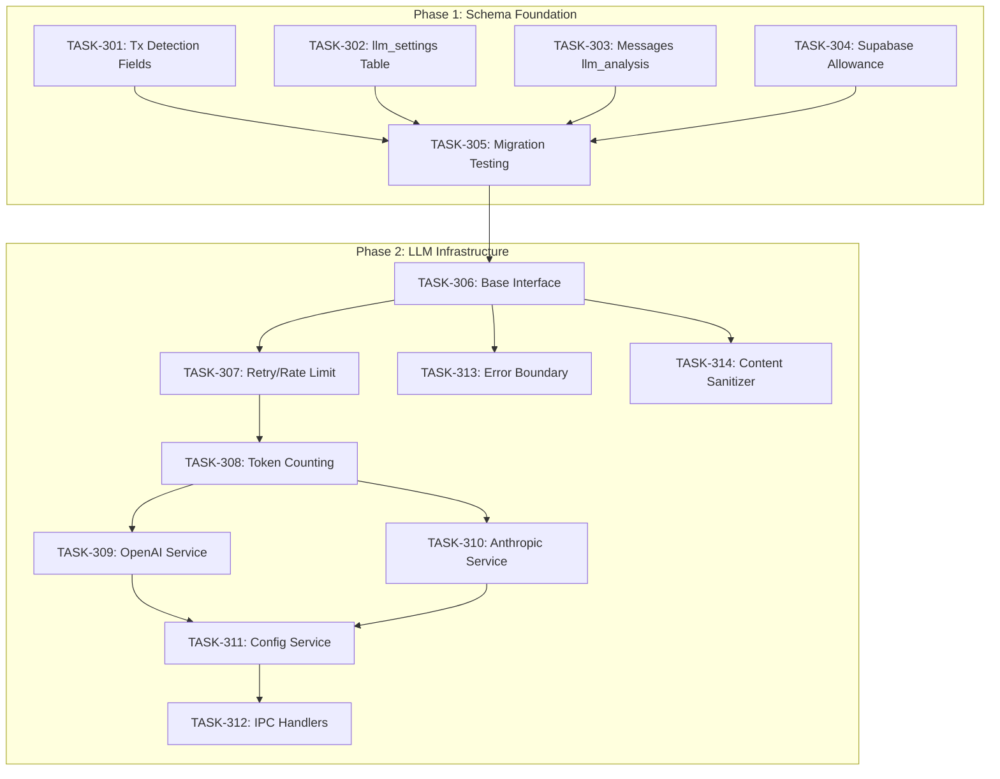

# Sprint Plan: SPRINT-004 - AI MVP Foundation

## Sprint Goal

Establish the database schema and LLM service infrastructure required for AI Transaction Auto-Detection. This sprint creates the foundation for AI-powered transaction detection by implementing schema changes for detection tracking and building the abstracted LLM service layer supporting both OpenAI and Anthropic providers.

## Prerequisites / Environment Setup

Before starting sprint work, engineers must:
- [ ] `git checkout develop && git pull origin develop`
- [ ] `npm install`
- [ ] `npm rebuild better-sqlite3-multiple-ciphers`
- [ ] `npx electron-rebuild`
- [ ] Verify app starts: `npm run dev`
- [ ] Verify tests pass: `npm test`

**Note**: Native module rebuilds are required after `npm install` or Node.js updates.

**Additional for this sprint:**
- [ ] Ensure no uncommitted schema changes from SPRINT-003 work

## In Scope

| ID | Title | Rationale |
|----|-------|-----------|
| BACKLOG-073 | AI MVP Phase 0 - Schema Foundation | Creates database tables and fields for LLM settings and detection tracking |
| BACKLOG-074 | AI MVP Phase 1 - LLM Infrastructure | Builds provider-agnostic LLM service layer with OpenAI/Anthropic support |

## Out of Scope / Deferred

| ID | Title | Reason |
|----|-------|--------|
| BACKLOG-075 | AI Analysis Tools | Requires LLM infrastructure complete first (SPRINT-005) |
| BACKLOG-076 | Hybrid Pipeline | Requires AI tools complete first (SPRINT-005) |
| BACKLOG-077 | Feedback Loop | Requires pipeline complete first (SPRINT-006) |
| BACKLOG-078 | UI Enhancements | Requires backend services first (SPRINT-006) |
| BACKLOG-079 | Integration Testing | End-to-end testing after all phases (SPRINT-006) |

## Reprioritized Backlog

| ID | Title | Priority | Est. Turns | Dependencies | Phase |
|----|-------|----------|------------|--------------|-------|
| TASK-301 | Add Detection Fields to Transactions | 1 | 5 | None | 1 |
| TASK-302 | Create llm_settings Table | 1 | 5 | None | 1 |
| TASK-303 | Add llm_analysis Field to Messages | 1 | 3 | None | 1 |
| TASK-304 | Supabase Platform Allowance Schema | 1 | 3 | None | 1 |
| TASK-305 | Migration Testing | 2 | 6 | TASK-301-304 | 1 |
| TASK-306 | LLM Base Interface and Abstract Class | 3 | 3 | Phase 1 | 2 |
| TASK-307 | LLM Retry and Rate Limiting | 4 | 3 | TASK-306 | 2 |
| TASK-308 | LLM Token Counting and Usage | 5 | 2 | TASK-307 | 2 |
| TASK-309 | OpenAI Service Implementation | 6 | 5 | TASK-308 | 2 |
| TASK-310 | Anthropic Service Implementation | 6 | 5 | TASK-308 | 2 |
| TASK-311 | LLM Config Service | 7 | 3 | TASK-309, TASK-310 | 2 |
| TASK-312 | LLM IPC Handlers | 8 | 2 | TASK-311 | 2 |
| TASK-313 | LLM Error Boundary Component | 6 | 3 | TASK-306 | 2 |
| TASK-314 | Content Sanitizer | 6 | 2 | TASK-306 | 2 |

**Total Estimated:** 50 turns (~4h)

## Phase Plan

### Phase 1: Schema Foundation (BACKLOG-073)

**Parallelizable tasks:**
- TASK-301: Add Detection Fields to Transactions Table (5 turns)
- TASK-302: Create llm_settings Table (5 turns)
- TASK-303: Add llm_analysis Field to Messages (3 turns)
- TASK-304: Supabase Platform Allowance Schema (3 turns)

**Sequential task:**
- TASK-305: Migration Testing (6 turns) - Depends on TASK-301-304

**Integration checkpoint**: All Phase 1 tasks merge to `int/schema-foundation`, CI must pass, Migration 008 verified on fresh and existing databases.

### Phase 2: LLM Infrastructure (BACKLOG-074)

**Sequential core (must complete in order):**
- TASK-306: LLM Base Interface and Abstract Class (3 turns)
- TASK-307: LLM Retry and Rate Limiting (3 turns)
- TASK-308: LLM Token Counting and Usage (2 turns)

**Parallel providers (after TASK-308):**
- TASK-309: OpenAI Service Implementation (5 turns)
- TASK-310: Anthropic Service Implementation (5 turns)

**Sequential config (after providers):**
- TASK-311: LLM Config Service (3 turns)
- TASK-312: LLM IPC Handlers (2 turns)

**Independent (after TASK-306):**
- TASK-313: LLM Error Boundary Component (3 turns)
- TASK-314: Content Sanitizer (2 turns)

**Integration checkpoint**: All Phase 2 tasks merge to `int/llm-infrastructure`, CI must pass, API key validation tested.

## Merge Plan

- **Main branch**: `develop`
- **Feature branch format**: `feature/TASK-XXX-<slug>`
- **Integration branches**:
  - `int/schema-foundation` (Phase 1)
  - `int/llm-infrastructure` (Phase 2)

**Merge order (explicit):**

### Phase 1 Merge Sequence
1. TASK-301 → int/schema-foundation
2. TASK-302 → int/schema-foundation (parallel with 301)
3. TASK-303 → int/schema-foundation (parallel with 301, 302)
4. TASK-304 → int/schema-foundation (parallel with 301, 302, 303)
5. TASK-305 → int/schema-foundation (after 301-304 merged)
6. int/schema-foundation → develop (SR Engineer review required)

### Phase 2 Merge Sequence
7. TASK-306 → int/llm-infrastructure
8. TASK-307 → int/llm-infrastructure (after 306)
9. TASK-308 → int/llm-infrastructure (after 307)
10. TASK-309 → int/llm-infrastructure (after 308)
11. TASK-310 → int/llm-infrastructure (parallel with 309)
12. TASK-313 → int/llm-infrastructure (after 306, parallel with 307-310)
13. TASK-314 → int/llm-infrastructure (after 306, parallel with 307-310)
14. TASK-311 → int/llm-infrastructure (after 309, 310)
15. TASK-312 → int/llm-infrastructure (after 311)
16. int/llm-infrastructure → develop (SR Engineer review required)

## Dependency Graph (Mermaid)



## Dependency Graph (YAML)

```yaml
dependency_graph:
  nodes:
    # Phase 1
    - id: TASK-301
      type: task
      phase: 1
      title: "Add Detection Fields to Transactions"
    - id: TASK-302
      type: task
      phase: 1
      title: "Create llm_settings Table"
    - id: TASK-303
      type: task
      phase: 1
      title: "Add llm_analysis Field to Messages"
    - id: TASK-304
      type: task
      phase: 1
      title: "Supabase Platform Allowance Schema"
    - id: TASK-305
      type: task
      phase: 1
      title: "Migration Testing"
    # Phase 2
    - id: TASK-306
      type: task
      phase: 2
      title: "LLM Base Interface"
    - id: TASK-307
      type: task
      phase: 2
      title: "Retry and Rate Limiting"
    - id: TASK-308
      type: task
      phase: 2
      title: "Token Counting"
    - id: TASK-309
      type: task
      phase: 2
      title: "OpenAI Service"
    - id: TASK-310
      type: task
      phase: 2
      title: "Anthropic Service"
    - id: TASK-311
      type: task
      phase: 2
      title: "Config Service"
    - id: TASK-312
      type: task
      phase: 2
      title: "IPC Handlers"
    - id: TASK-313
      type: task
      phase: 2
      title: "Error Boundary"
    - id: TASK-314
      type: task
      phase: 2
      title: "Content Sanitizer"
  edges:
    # Phase 1 dependencies
    - from: TASK-301
      to: TASK-305
      type: depends_on
    - from: TASK-302
      to: TASK-305
      type: depends_on
    - from: TASK-303
      to: TASK-305
      type: depends_on
    - from: TASK-304
      to: TASK-305
      type: depends_on
    # Phase 1 → Phase 2
    - from: TASK-305
      to: TASK-306
      type: depends_on
    # Phase 2 sequential core
    - from: TASK-306
      to: TASK-307
      type: depends_on
    - from: TASK-307
      to: TASK-308
      type: depends_on
    # Provider implementations
    - from: TASK-308
      to: TASK-309
      type: depends_on
    - from: TASK-308
      to: TASK-310
      type: depends_on
    # Config layer
    - from: TASK-309
      to: TASK-311
      type: depends_on
    - from: TASK-310
      to: TASK-311
      type: depends_on
    - from: TASK-311
      to: TASK-312
      type: depends_on
    # Independent after base
    - from: TASK-306
      to: TASK-313
      type: depends_on
    - from: TASK-306
      to: TASK-314
      type: depends_on
```

## Testing & Quality Plan (REQUIRED)

### Unit Testing

**New tests required for:**
- `electron/services/db/llmSettingsDbService.ts` - CRUD operations for llm_settings
- `electron/services/llm/baseLLMService.ts` - Abstract class, retry logic, rate limiting
- `electron/services/llm/openAIService.ts` - OpenAI API wrapper with mocked responses
- `electron/services/llm/anthropicService.ts` - Anthropic API wrapper with mocked responses
- `electron/services/llm/llmConfigService.ts` - Config management, budget enforcement
- `electron/services/llm/contentSanitizer.ts` - PII removal patterns

**Existing tests to update:**
- Migration tests - Add Migration 008 verification
- Database service tests - Add llm_settings table operations

### Coverage Expectations

- Coverage rules:
  - No regression from current coverage
  - New services must have >60% coverage
  - Critical paths (budget enforcement, API key encryption) must be tested

### Integration / Feature Testing

- Required scenarios:
  - Set API key → Validate → Display usage flow
  - Budget exceeded → Request blocked flow
  - LLM API failure → Graceful fallback display
  - Content sanitization removes PII patterns

### CI / CD Quality Gates

The following MUST pass before merge:
- [ ] Unit tests (npm test)
- [ ] Type checking (npm run type-check)
- [ ] Linting (npm run lint)
- [ ] Build step (npm run build)
- [ ] Security audit (npm audit)

### Backend Safeguards

- Existing behaviors preserved:
  - All existing transactions unaffected (new columns have defaults)
  - All existing messages unaffected (new column nullable)
  - No changes to existing IPC handlers
- Behaviors intentionally changed:
  - New IPC handlers for LLM operations added to main.ts
  - New preload bridge methods for LLM operations
- Tests protecting critical paths:
  - Migration rollback tested
  - Encryption of API keys verified

## Risk Register

| Risk | Likelihood | Impact | Mitigation |
|------|------------|--------|------------|
| Migration 008 conflicts with SPRINT-003 | Medium | High | Rebase before merge, test on branch with SPRINT-003 changes |
| LLM SDK breaking changes | Low | Medium | Pin SDK versions, wrap in adapters |
| Native module rebuild required | Medium | Medium | Document in task setup, add npm scripts |
| API key exposure in logs | Low | High | Never log API keys, encryption at rest |
| Rate limiting not sufficient | Medium | Medium | Conservative defaults, user-adjustable |

## Decision Log

### Decision: Parallel Execution with SPRINT-003

- **Date**: 2025-12-16
- **Context**: SPRINT-003 contains schema fixes (BACKLOG-038, 039) that BACKLOG-073 listed as dependencies
- **Decision**: Proceed with SPRINT-004 in parallel with SPRINT-003
- **Rationale**: Schema changes are additive (new columns/tables), no conflicts with existing column fixes
- **Impact**: Must coordinate merge order, rebase if needed

### Decision: Use Existing user_feedback Table

- **Date**: 2025-12-16
- **Context**: Original plan included new classification_feedback table
- **Decision**: Extend existing user_feedback table with new feedback_type values
- **Rationale**: Table already exists with appropriate structure, avoid duplication
- **Impact**: No new table needed, Phase 4 (BACKLOG-077) will extend existing table

### Decision: Security Approach (Option A + C)

- **Date**: 2025-12-16
- **Context**: Need to protect user data when sending to LLM providers
- **Decision**: Implement content sanitization (Option A) + consent flag (Option C)
- **Rationale**: Defense in depth - sanitize PII AND require user consent
- **Impact**: TASK-314 implements sanitizer, llm_data_consent field required before LLM use

## SR Engineer Review Checkpoints

| Checkpoint | Trigger | Reviewer Focus |
|------------|---------|----------------|
| Schema Review | After TASK-301-304 | Migration SQL correctness, TypeScript types match |
| Migration Test Review | After TASK-305 | Test coverage, rollback verified |
| LLM Base Review | After TASK-306-308 | Abstract patterns, error handling |
| Provider Review | After TASK-309-310 | SDK usage, response handling |
| Integration Review | Before develop merge | IPC handlers, preload bridge, security |

## End-of-Sprint Validation Checklist

### Phase 1 Complete
- [ ] Migration 008 runs on fresh database
- [ ] Migration 008 runs on existing database with data
- [ ] All new columns have proper defaults
- [ ] TypeScript types match schema exactly
- [ ] No regression in existing functionality

### Phase 2 Complete
- [ ] OpenAI key validation works
- [ ] Anthropic key validation works
- [ ] Usage tracking increments correctly
- [ ] Budget enforcement blocks when exceeded
- [ ] Content sanitization removes PII
- [ ] Error boundary shows user-friendly messages
- [ ] All CI checks pass

### Sprint Complete
- [ ] All 14 tasks merged to develop
- [ ] All engineer metrics collected
- [ ] Integration tested (set key → validate → check usage)
- [ ] Documentation updated (IPC API)
- [ ] Ready for SPRINT-005 (AI Tools)

---

## PM Metrics

**Sprint Planning:**
| Activity | Turns | Tokens (est.) | Time |
|----------|-------|---------------|------|
| Plan Agent | 1 | ~15K | 5 min |
| Sprint Plan Creation | 1 | ~20K | 10 min |
| Task File Creation | TBD | TBD | TBD |
| **PM Total** | TBD | TBD | TBD |

---

*Sprint created: 2025-12-16*
*PM: Agentic PM Agent*
*Source Backlog Items: BACKLOG-073, BACKLOG-074*
