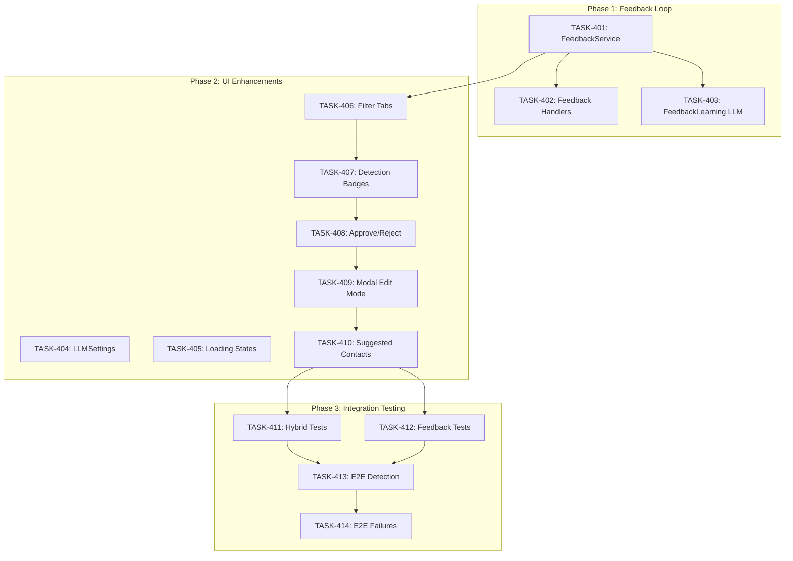

# Sprint Plan: SPRINT-006 - AI MVP Polish

## Sprint Goal

Complete the AI Transaction Auto-Detection MVP by implementing user feedback capture, UI enhancements for detection workflows, and comprehensive integration testing. This is the final sprint of the AI MVP project - delivering production-ready features that enable users to review, approve, and correct AI-detected transactions with full feedback loop for accuracy improvement.

## Prerequisites / Environment Setup

Before starting sprint work, engineers must:
- [ ] `git checkout develop && git pull origin develop`
- [ ] `npm install`
- [ ] `npm rebuild better-sqlite3-multiple-ciphers`
- [ ] `npx electron-rebuild`
- [ ] Verify app starts: `npm run dev`
- [ ] Verify tests pass: `npm test`

**Note**: Native module rebuilds are required after `npm install` or Node.js updates.

**Additional for this sprint:**
- [ ] Ensure SPRINT-005 changes are merged to develop (hybrid extraction pipeline)
- [ ] Verify hybrid extraction works: AI tools + pattern matching functional
- [ ] Review existing feedback infrastructure: `feedbackLearningService.ts`, `user_feedback` table

## In Scope

| ID | Title | Rationale |
|----|-------|-----------|
| BACKLOG-077 | AI MVP Phase 4 - Feedback Loop | Captures user corrections for accuracy improvement |
| BACKLOG-078 | AI MVP Phase 5 - UI Enhancements | User interface for detection review workflow |
| BACKLOG-079 | AI MVP Phase 6 - Integration Testing | End-to-end validation of complete AI pipeline |

## Out of Scope / Deferred

| ID | Title | Reason |
|----|-------|--------|
| - | Automatic prompt tuning from feedback | Future enhancement after feedback data collected |
| - | Multi-model A/B testing | Requires more usage data |
| - | Android message ingestion | Separate feature track |
| - | Real-time detection (background) | Post-MVP enhancement |

## Reprioritized Backlog

| ID | Title | Category | Priority | Est. Turns | Dependencies | Phase |
|----|-------|----------|----------|------------|--------------|-------|
| TASK-401 | Feedback Service for LLM corrections | service | 1 | 3 | None | 1 |
| TASK-402 | Feedback IPC handlers extension | ipc | 2 | 2 | TASK-401 | 1 |
| TASK-403 | FeedbackLearningService LLM analysis | service | 3 | 3 | TASK-401 | 1 |
| TASK-404 | LLMSettings component | ui | 4 | 3 | None | 2 |
| TASK-405 | LLM Loading States component | ui | 4 | 2 | None | 2 |
| TASK-406 | Detection status filter tabs | ui | 5 | 3 | TASK-401 | 2 |
| TASK-407 | Detection badges | ui | 6 | 3 | TASK-406 | 2 |
| TASK-408 | Approve/Reject actions | ui | 7 | 2 | TASK-407 | 2 |
| TASK-409 | AuditTransactionModal edit mode | ui | 8 | 2 | None | 2 |
| TASK-410 | Suggested contacts display | ui | 9 | 2 | TASK-409 | 2 |
| TASK-411 | Hybrid extraction integration tests | test | 10 | 5 | Phase 2 | 3 |
| TASK-412 | Feedback loop integration tests | test | 10 | 3 | Phase 2 | 3 |
| TASK-413 | E2E auto-detection flow test | test | 11 | 3 | TASK-411, TASK-412 | 3 |
| TASK-414 | E2E failure scenario tests | test | 12 | 2 | TASK-413 | 3 |

**Total Estimated:** 34 turns (~4h)

---

## SR Technical Review (Pre-Implementation)

**REQUIRED before any implementation begins.**

SR Engineer must review all task files and add SR Engineer Review Notes to each:

### Review Request

```
Tasks to review: TASK-401 through TASK-414
Task files: .claude/plans/tasks/TASK-4XX.md
```

### Expected Classifications

| Task | Expected Classification | Branch From | Branch Into |
|------|------------------------|-------------|-------------|
| TASK-401 | Sequential (Phase 1 start) | develop | int/ai-polish |
| TASK-402 | Sequential (after 401) | int/ai-polish | int/ai-polish |
| TASK-403 | Sequential (after 401) | int/ai-polish | int/ai-polish |
| TASK-404 | Parallel (Phase 2) | int/ai-polish | int/ai-polish |
| TASK-405 | Parallel (with 404) | int/ai-polish | int/ai-polish |
| TASK-406 | Sequential (after Phase 1) | int/ai-polish | int/ai-polish |
| TASK-407 | Sequential (after 406) | int/ai-polish | int/ai-polish |
| TASK-408 | Sequential (after 407) | int/ai-polish | int/ai-polish |
| TASK-409 | Sequential (after 408) | int/ai-polish | int/ai-polish |
| TASK-410 | Sequential (after 409) | int/ai-polish | int/ai-polish |
| TASK-411 | Parallel (Phase 3) | int/ai-polish | int/ai-polish |
| TASK-412 | Parallel (with 411) | int/ai-polish | int/ai-polish |
| TASK-413 | Sequential (after 411,412) | int/ai-polish | int/ai-polish |
| TASK-414 | Sequential (final) | int/ai-polish | int/ai-polish |

---

## Phase Plan

### Phase 1: Feedback Loop (BACKLOG-077)

**Sequential tasks:**
- TASK-401: Feedback Service for LLM corrections (3 turns)
- TASK-402: Feedback IPC handlers extension (2 turns) - after TASK-401
- TASK-403: FeedbackLearningService LLM analysis (3 turns) - after TASK-401

**Integration checkpoint**: All Phase 1 tasks merge to `int/ai-polish`, CI must pass, feedback API callable from renderer.

### Phase 2: UI Enhancements (BACKLOG-078)

**Parallelizable tasks:**
- TASK-404: LLMSettings component (3 turns)
- TASK-405: LLM Loading States component (2 turns)

**Sequential tasks (TransactionList modifications):**
- TASK-406: Detection status filter tabs (3 turns) - after Phase 1
- TASK-407: Detection badges (3 turns) - after TASK-406
- TASK-408: Approve/Reject actions (2 turns) - after TASK-407

**Sequential tasks (Other components):**
- TASK-409: AuditTransactionModal edit mode (2 turns) - after TASK-408
- TASK-410: Suggested contacts display (2 turns) - after TASK-409

**Integration checkpoint**: All Phase 2 tasks merge to `int/ai-polish`, CI must pass, UI flows work end-to-end.

### Phase 3: Integration Testing (BACKLOG-079)

**Parallelizable tasks:**
- TASK-411: Hybrid extraction integration tests (5 turns)
- TASK-412: Feedback loop integration tests (3 turns)

**Sequential tasks:**
- TASK-413: E2E auto-detection flow test (3 turns) - after TASK-411, TASK-412
- TASK-414: E2E failure scenario tests (2 turns) - after TASK-413

**Integration checkpoint**: All Phase 3 tasks merge to `int/ai-polish`, ALL tests pass, ready for develop merge.

## Merge Plan

- **Main branch**: `develop`
- **Feature branch format**: `feature/TASK-XXX-<slug>`
- **Integration branch**: `int/ai-polish`

**Merge order (explicit):**

### Phase 1 Merge Sequence
1. Create `int/ai-polish` from `develop`
2. TASK-401 → int/ai-polish
3. TASK-402 → int/ai-polish (after 401)
4. TASK-403 → int/ai-polish (after 401)
5. Phase 1 checkpoint: CI passes, feedback API verified

### Phase 2 Merge Sequence
6. TASK-404 → int/ai-polish (parallel)
7. TASK-405 → int/ai-polish (parallel with 404)
8. TASK-406 → int/ai-polish (sequential)
9. TASK-407 → int/ai-polish (after 406)
10. TASK-408 → int/ai-polish (after 407)
11. TASK-409 → int/ai-polish (after 408)
12. TASK-410 → int/ai-polish (after 409)
13. Phase 2 checkpoint: CI passes, UI verified

### Phase 3 Merge Sequence
14. TASK-411 → int/ai-polish (parallel)
15. TASK-412 → int/ai-polish (parallel with 411)
16. TASK-413 → int/ai-polish (after 411, 412)
17. TASK-414 → int/ai-polish (final task)
18. Phase 3 checkpoint: ALL tests pass

### Final Merge
19. int/ai-polish → develop (SR Engineer review required)

## Dependency Graph (Mermaid)



## Dependency Graph (YAML)

```yaml
dependency_graph:
  nodes:
    # Phase 1
    - id: TASK-401
      type: task
      phase: 1
      title: "Feedback Service for LLM corrections"
      category: service
    - id: TASK-402
      type: task
      phase: 1
      title: "Feedback IPC handlers extension"
      category: ipc
    - id: TASK-403
      type: task
      phase: 1
      title: "FeedbackLearningService LLM analysis"
      category: service
    # Phase 2
    - id: TASK-404
      type: task
      phase: 2
      title: "LLMSettings component"
      category: ui
    - id: TASK-405
      type: task
      phase: 2
      title: "LLM Loading States component"
      category: ui
    - id: TASK-406
      type: task
      phase: 2
      title: "Detection status filter tabs"
      category: ui
    - id: TASK-407
      type: task
      phase: 2
      title: "Detection badges"
      category: ui
    - id: TASK-408
      type: task
      phase: 2
      title: "Approve/Reject actions"
      category: ui
    - id: TASK-409
      type: task
      phase: 2
      title: "AuditTransactionModal edit mode"
      category: ui
    - id: TASK-410
      type: task
      phase: 2
      title: "Suggested contacts display"
      category: ui
    # Phase 3
    - id: TASK-411
      type: task
      phase: 3
      title: "Hybrid extraction integration tests"
      category: test
    - id: TASK-412
      type: task
      phase: 3
      title: "Feedback loop integration tests"
      category: test
    - id: TASK-413
      type: task
      phase: 3
      title: "E2E auto-detection flow test"
      category: test
    - id: TASK-414
      type: task
      phase: 3
      title: "E2E failure scenario tests"
      category: test
  edges:
    # Phase 1 dependencies
    - from: TASK-401
      to: TASK-402
      type: depends_on
    - from: TASK-401
      to: TASK-403
      type: depends_on
    # Phase 1 -> Phase 2
    - from: TASK-401
      to: TASK-406
      type: depends_on
    # Phase 2 UI chain
    - from: TASK-406
      to: TASK-407
      type: depends_on
    - from: TASK-407
      to: TASK-408
      type: depends_on
    - from: TASK-408
      to: TASK-409
      type: depends_on
    - from: TASK-409
      to: TASK-410
      type: depends_on
    # Phase 2 -> Phase 3
    - from: TASK-410
      to: TASK-411
      type: depends_on
    - from: TASK-410
      to: TASK-412
      type: depends_on
    # Phase 3 dependencies
    - from: TASK-411
      to: TASK-413
      type: depends_on
    - from: TASK-412
      to: TASK-413
      type: depends_on
    - from: TASK-413
      to: TASK-414
      type: depends_on
```

## Testing & Quality Plan (REQUIRED)

### Unit Testing

**New tests required for:**
- `electron/services/feedbackService.ts` - Feedback capture logic
- `electron/services/feedbackLearningService.ts` - LLM accuracy tracking
- `electron/feedback-handlers.ts` - IPC handler tests
- `src/components/settings/LLMSettings.tsx` - Settings component
- `src/components/LLMLoadingStates.tsx` - Loading state component

**Existing tests to update:**
- `electron/services/__tests__/transactionService.test.ts` - Add approve/reject flow tests

### Coverage Expectations

- Coverage rules:
  - No regression from current coverage
  - New services must have >70% coverage
  - UI components: snapshot tests + interaction tests
  - Integration tests in Phase 3 cover end-to-end paths

### Integration / Feature Testing

- Required scenarios:
  - Feedback recorded on transaction approve
  - Feedback recorded on transaction reject with reason
  - Feedback stats calculate correctly
  - LLM settings save and load
  - API key validation works
  - Consent required before first LLM use
  - Detection filters work (All/Confirmed/Pending/Rejected)
  - Badges display correctly
  - Approve/reject actions update status
  - Edit mode pre-fills transaction data
  - E2E: import → detect → review → confirm

### CI / CD Quality Gates

The following MUST pass before merge:
- [ ] Unit tests (npm test)
- [ ] Integration tests (Phase 3)
- [ ] Type checking (npm run type-check)
- [ ] Linting (npm run lint)
- [ ] Build step (npm run build)
- [ ] Security audit (npm audit)

### Backend Safeguards

- Existing behaviors preserved:
  - Manual transaction creation unchanged
  - Existing feedback types still work
  - Pattern-only extraction still available
- Behaviors intentionally changed:
  - New feedback types added for LLM-specific corrections
  - FeedbackLearningService tracks accuracy by provider/model
- Tests protecting critical paths:
  - Feedback table integrity
  - Transaction status transitions
  - API key encryption

## Risk Register

| Risk | Likelihood | Impact | Mitigation |
|------|------------|--------|------------|
| TransactionList.tsx merge conflicts | High | Medium | Sequential tasks (406→407→408), no parallel mods |
| Feedback API surface changes mid-sprint | Medium | High | Lock API in TASK-401, enforce via SR review |
| E2E test flakiness | Medium | Medium | Run tests 3x, add retry logic, explicit waits |
| UI consent flow blocks users | Low | High | Test consent modal thoroughly, clear messaging |
| Core file conflicts (main.ts, preload.ts) | Low | High | Batch handler registration in TASK-402 only |
| Performance regression from UI additions | Low | Medium | Profile TransactionList after badge additions |

## Decision Log

### Decision: Integration Branch Strategy

- **Date**: 2025-12-18
- **Context**: SPRINT-006 is final AI MVP sprint with low risk tolerance
- **Decision**: Use `int/ai-polish` integration branch instead of direct develop merges
- **Rationale**:
  - Final sprint must not destabilize develop
  - Multiple UI components modified across tasks
  - Rollback capability if testing finds issues
- **Impact**: All feature branches merge to int/ai-polish, final SR review before develop merge

### Decision: Sequential TransactionList Modifications

- **Date**: 2025-12-18
- **Context**: TASK-406, 407, 408 all modify TransactionList.tsx
- **Decision**: Strictly sequential execution, no parallelization
- **Rationale**: Merge conflicts would cause significant rework
- **Impact**: Phase 2 UI chain takes longer but safer

### Decision: Extended Feedback Types

- **Date**: 2025-12-18
- **Context**: Need to track LLM-specific feedback separately from manual corrections
- **Decision**: Add new feedback_type enum values instead of new table
- **Rationale**: Reuse existing user_feedback infrastructure, simpler implementation
- **Impact**: TASK-401 adds: transaction_approved, transaction_rejected, transaction_edited, contact_role_corrected, communication_unlinked, communication_added

## SR Engineer Review Checkpoints

| Checkpoint | Trigger | Reviewer Focus |
|------------|---------|----------------|
| Feedback API Review | After TASK-401 | API surface stability, table changes |
| IPC Handler Review | After TASK-402 | Main/preload changes, security |
| UI Component Review | After Phase 2 | Visual design, accessibility |
| Test Coverage Review | After Phase 3 | Coverage thresholds, test quality |
| Final Integration Review | Before develop merge | End-to-end flow, performance |

## End-of-Sprint Validation Checklist

### Phase 1 Complete
- [ ] FeedbackService saves to user_feedback table
- [ ] Extended feedback types recorded correctly
- [ ] IPC handlers registered and callable
- [ ] FeedbackLearningService tracks accuracy by provider
- [ ] CI passes on int/ai-polish

### Phase 2 Complete
- [ ] LLMSettings saves/loads API keys securely
- [ ] Consent required before first LLM use
- [ ] Detection filters work (All/Confirmed/Pending/Rejected)
- [ ] Badges display correctly (AI Detected, confidence pills)
- [ ] Approve/reject actions update status
- [ ] Feedback recorded on all user actions
- [ ] Edit mode pre-fills transaction data
- [ ] Loading states display during processing
- [ ] CI passes on int/ai-polish

### Phase 3 Complete
- [ ] All integration tests pass (>70% coverage)
- [ ] E2E detection flow test passes
- [ ] E2E failure scenarios handled gracefully
- [ ] Performance: <5s for 100 emails
- [ ] No memory leaks detected
- [ ] CI passes, ready for develop merge

### Sprint Complete
- [ ] All 14 tasks merged to int/ai-polish
- [ ] int/ai-polish merged to develop
- [ ] All engineer metrics collected
- [ ] AI MVP feature complete and production-ready
- [ ] Ready for beta testing

---

## PM Metrics

**Sprint Planning:**
| Activity | Turns | Tokens (est.) | Time |
|----------|-------|---------------|------|
| Plan Agent | 1 | ~35K | 3 min |
| Sprint Plan Creation | 1 | ~30K | 15 min |
| Task File Creation | TBD | TBD | TBD |
| **PM Total** | TBD | TBD | TBD |

---

*Sprint created: 2025-12-18*
*PM: Agentic PM Agent*
*Source Backlog Items: BACKLOG-077, BACKLOG-078, BACKLOG-079*
