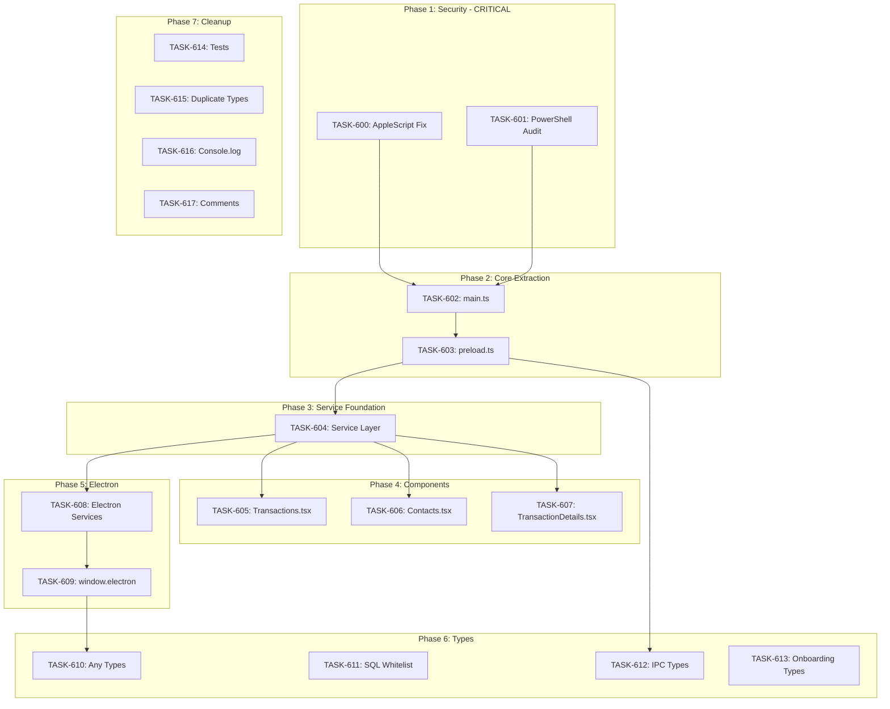

# SPRINT-009: Codebase Standards Remediation

**Sprint Goal:** Address all 17 issues identified in the SR Engineer codebase audit, improving security, architecture, type safety, and code quality.

**Created:** 2025-12-24
**Status:** Active
**Target Branch:** develop

---

## Executive Summary

This sprint remediates findings from a comprehensive SR Engineer audit:
- **2 CRITICAL** security issues (command injection risks)
- **8 HIGH** architecture violations (oversized files, scattered API calls)
- **4 MEDIUM** type safety issues
- **4 LOW** cleanup items

---

## Phase Structure

### Phase 1: Security Hardening (CRITICAL)
**Execution:** Sequential
**Priority:** MUST complete before other phases

| Task | Title | Files | Est. Turns |
|------|-------|-------|------------|
| TASK-600 | AppleScript Injection Fix | `macOSPermissionHelper.ts` | 4-6 |
| TASK-601 | PowerShell Spawn Audit | Multiple services | 6-8 |

### Phase 2: Main/Preload Extraction (HIGH)
**Execution:** Sequential (H-1a before H-1b)

| Task | Title | Files | Est. Turns |
|------|-------|-------|------------|
| TASK-602 | main.ts Handler Extraction | `main.ts` (1655→<500 lines) | 12-16 |
| TASK-603 | preload.ts Refactor | `preload.ts` (1902→<400 lines) | 12-16 |

### Phase 3: Service Layer Foundation (HIGH)
**Execution:** Single task
**Dependency:** Phase 2 complete

| Task | Title | Files | Est. Turns |
|------|-------|-------|------------|
| TASK-604 | Renderer Service Layer | `src/services/` (new files) | 10-14 |

### Phase 4: Component Refactors (HIGH)
**Execution:** Parallel (different component files)
**Dependency:** Phase 3 complete

| Task | Title | Files | Est. Turns |
|------|-------|-------|------------|
| TASK-605 | Transactions.tsx Split | `Transactions.tsx` (2614→<600 lines) | 14-18 |
| TASK-606 | Contacts.tsx Split | `Contacts.tsx` (1638→<500 lines) | 12-16 |
| TASK-607 | TransactionDetails.tsx Split | `TransactionDetails.tsx` (1557→<500 lines) | 10-14 |

### Phase 5: Electron Services & Migration (HIGH)
**Execution:** Sequential (H-4 before H-5)
**Dependency:** Phase 3 complete

| Task | Title | Files | Est. Turns |
|------|-------|-------|------------|
| TASK-608 | Electron Services Split | `electron/services/` | 10-14 |
| TASK-609 | window.electron Migration | 13 files in `src/` | 16-20 |

### Phase 6: Type Safety (MEDIUM)
**Execution:** Parallel possible
**Dependency:** Phase 2 complete for M-3

| Task | Title | Files | Est. Turns |
|------|-------|-------|------------|
| TASK-610 | Any Types Remediation | 37 files, 114 occurrences | 8-10 |
| TASK-611 | SQL Field Whitelist | `databaseService.ts` | 6-8 |
| TASK-612 | IPC Type Consolidation | `electron/types/`, preload | 8-10 |
| TASK-613 | Onboarding Types Split | `src/types/` | 4-6 |

### Phase 7: Cleanup (LOW)
**Execution:** Parallel (independent)
**Dependency:** None (can run anytime)

| Task | Title | Files | Est. Turns |
|------|-------|-------|------------|
| TASK-614 | useAppStateMachine Tests | `useAppStateMachine.test.ts` | 6-8 |
| TASK-615 | Duplicate Types Removal | Type files | 4-6 |
| TASK-616 | Console.log to logService | Multiple files | 3-4 |
| TASK-617 | Commented Code Removal | Scattered | 4-6 |

---

## Dependency Graph

---

## Success Metrics

| Metric | Before | Target |
|--------|--------|--------|
| `electron/main.ts` lines | 1,655 | < 500 |
| `electron/preload.ts` lines | 1,902 | < 400 |
| `Transactions.tsx` lines | 2,614 | < 600 |
| `Contacts.tsx` lines | 1,638 | < 500 |
| `TransactionDetails.tsx` lines | 1,557 | < 500 |
| `any` type occurrences | 114 | < 10 |
| `window.electron` files | 13 | 0 |
| Security vulnerabilities | 2 | 0 |

---

## Risk Register

| Risk | Likelihood | Impact | Mitigation |
|------|------------|--------|------------|
| Merge conflicts in Phase 4 | Low | Medium | Parallel tasks touch different files |
| H-1a/H-1b scope creep | Medium | High | Strict line count targets |
| H-5 migration breaks components | Medium | High | Incremental migration, comprehensive tests |
| C-1/C-2 security regression | Low | Critical | SR Engineer security review required |

---

## Quality Gates

### Per-Task
- [ ] `npm run type-check` passes
- [ ] `npm run lint` passes
- [ ] `npm test` passes
- [ ] Line count targets met
- [ ] Engineer metrics recorded

### Per-Phase
- [ ] All phase tasks merged to develop
- [ ] CI pipeline green
- [ ] SR Engineer review passed

### Sprint Completion
- [ ] All 18 tasks merged
- [ ] All line count targets met
- [ ] Full test suite passes
- [ ] No security vulnerabilities

---

## Task List

| ID | Title | Phase | Priority | Status |
|----|-------|-------|----------|--------|
| TASK-600 | AppleScript Injection Fix | 1 | CRITICAL | Pending |
| TASK-601 | PowerShell Spawn Audit | 1 | CRITICAL | Pending |
| TASK-602 | main.ts Handler Extraction | 2 | HIGH | Pending |
| TASK-603 | preload.ts Refactor | 2 | HIGH | Pending |
| TASK-604 | Renderer Service Layer | 3 | HIGH | Pending |
| TASK-605 | Transactions.tsx Split | 4 | HIGH | Pending |
| TASK-606 | Contacts.tsx Split | 4 | HIGH | Pending |
| TASK-607 | TransactionDetails.tsx Split | 4 | HIGH | Pending |
| TASK-608 | Electron Services Split | 5 | HIGH | Pending |
| TASK-609 | window.electron Migration | 5 | HIGH | Pending |
| TASK-610 | Any Types Remediation | 6 | MEDIUM | Pending |
| TASK-611 | SQL Field Whitelist | 6 | MEDIUM | Pending |
| TASK-612 | IPC Type Consolidation | 6 | MEDIUM | Pending |
| TASK-613 | Onboarding Types Split | 6 | MEDIUM | Pending |
| TASK-614 | useAppStateMachine Tests | 7 | LOW | Pending |
| TASK-615 | Duplicate Types Removal | 7 | LOW | Pending |
| TASK-616 | Console.log to logService | 7 | LOW | Pending |
| TASK-617 | Commented Code Removal | 7 | LOW | Pending |
