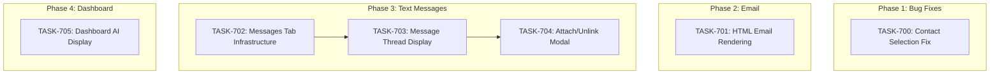

# SPRINT-010: Core Polish & Text Messages

**Sprint Goal:** Fix critical bugs, enhance email rendering, add text messages tab to transaction details, and improve Dashboard AI visibility.

**Created:** 2025-12-28
**Status:** Planning
**Target Branch:** develop

---

## Executive Summary

This sprint combines bug fixes, UI enhancements, and a new feature:
- **1 Bug Fix**: Contact selection issue (BACKLOG-103)
- **1 Enhancement**: HTML email rendering (BACKLOG-054)
- **1 New Feature**: Text messages tab in transaction details (BACKLOG-105)
- **1 UI Enhancement**: Dashboard AI detection visibility (BACKLOG-104)

---

## Phase Structure

### Phase 1: Bug Fixes (HIGH Priority)
**Execution:** Sequential (investigation required)

| Task | Title | Category | Est. Turns | Status |
|------|-------|----------|------------|--------|
| TASK-700 | Fix Contact Selection Issue | ui/bug | 4-8 | Pending |

### Phase 2: Email Enhancements (MEDIUM Priority)
**Execution:** Can run in parallel with Phase 1

| Task | Title | Category | Est. Turns | Status |
|------|-------|----------|------------|--------|
| TASK-701 | HTML Email Rendering | ui | 6-10 | Pending |

### Phase 3: Text Messages Feature (HIGH Priority)
**Execution:** Sequential (each builds on prior)
**Dependency:** None (can start immediately)

| Task | Title | Category | Est. Turns | Status |
|------|-------|----------|------------|--------|
| TASK-702 | Add Messages Tab Infrastructure | ui | 4-6 | Pending |
| TASK-703 | Message Thread Display Component | ui | 6-8 | Pending |
| TASK-704 | Attach/Unlink Messages Modal | ui | 6-8 | Pending |

### Phase 4: Dashboard Enhancement (MEDIUM Priority)
**Execution:** Independent
**Dependency:** None

| Task | Title | Category | Est. Turns | Status |
|------|-------|----------|------------|--------|
| TASK-705 | Dashboard AI Detection Display | ui | 6-10 | Pending |

---

## Dependency Graph

**Parallel Execution Notes:**
- Phase 1 and Phase 2 can run in parallel (different files)
- Phase 3 is strictly sequential (TASK-702 -> TASK-703 -> TASK-704)
- Phase 4 is independent and can run in parallel with any phase

---

## Backlog Items Addressed

| Backlog ID | Title | Tasks |
|------------|-------|-------|
| BACKLOG-103 | Fix Contact Selection Issue | TASK-700 |
| BACKLOG-054 | Render Email HTML | TASK-701 |
| BACKLOG-105 | Text Messages Tab in Transaction Details | TASK-702, TASK-703, TASK-704 |
| BACKLOG-104 | Dashboard UI to Emphasize Auto-Detection | TASK-705 |

---

## Estimated Totals

| Metric | Estimate |
|--------|----------|
| Total Tasks | 6 |
| Total Turns | 32-50 |
| Total Tokens | ~160K-250K |
| Total Time | ~4-6 hours |

**Note:** Estimates based on ui category (1.0x multiplier). Actual may vary based on investigation findings for TASK-700.

---

## Risk Register

| Risk | Likelihood | Impact | Mitigation |
|------|------------|--------|------------|
| Contact selection issue more complex than expected | Medium | Medium | Allocate buffer time for investigation |
| HTML rendering security concerns (XSS) | Low | High | Use DOMPurify or iframe sandbox |
| Message data structure incompatible | Low | Medium | Review schema before implementation |
| Dashboard performance impact | Low | Medium | Lazy load AI detection counts |

---

## Quality Gates

### Per-Task
- [ ] `npm run type-check` passes
- [ ] `npm run lint` passes
- [ ] `npm test` passes
- [ ] Engineer metrics recorded
- [ ] Implementation Summary completed

### Sprint Completion
- [ ] All 6 tasks merged
- [ ] No regressions in existing functionality
- [ ] Manual testing completed for each feature
- [ ] Full test suite passes

---

## Task List Summary

| ID | Title | Phase | Priority | Status |
|----|-------|-------|----------|--------|
| TASK-700 | Fix Contact Selection Issue | 1 | HIGH | Pending |
| TASK-701 | HTML Email Rendering | 2 | MEDIUM | Pending |
| TASK-702 | Add Messages Tab Infrastructure | 3 | HIGH | Pending |
| TASK-703 | Message Thread Display Component | 3 | HIGH | Pending |
| TASK-704 | Attach/Unlink Messages Modal | 3 | HIGH | Pending |
| TASK-705 | Dashboard AI Detection Display | 4 | MEDIUM | Pending |

---

## SR Engineer Technical Review

**Status:** Awaiting Review

Before task assignment, SR Engineer must review:
1. Identify shared file dependencies across tasks
2. Confirm parallel vs sequential execution recommendations
3. Add technical considerations to each task file
4. Flag any architectural concerns

---

## Progress Tracking

**Sprint Progress:** 0/6 tasks merged (0%)

- Phase 1: 0/1 complete
- Phase 2: 0/1 complete
- Phase 3: 0/3 complete
- Phase 4: 0/1 complete
