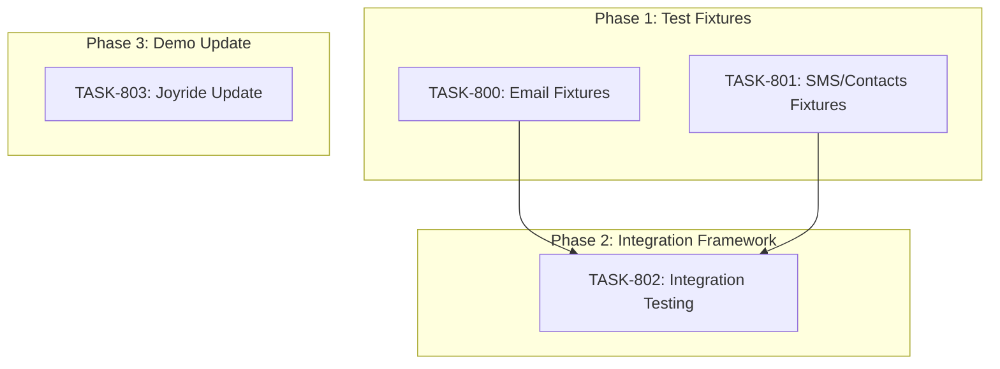

# SPRINT-011: Testing Infrastructure & Demo

**Sprint Goal:** Create comprehensive test fixtures for emails and text messages, establish an integration testing framework with fake data, and update the Joyride demo for new AI detection features.

**Created:** 2025-12-28
**Status:** Planning
**Target Branch:** develop

---

## Executive Summary

This sprint focuses on testing infrastructure to enable reproducible testing across the application:
- **2 Test Fixture Tasks:** Create realistic fake data for emails and SMS/iMessage
- **1 Integration Framework Task:** Build testing sandbox using fake data
- **1 Demo Update Task:** Update Joyride tour for AI detection features (BACKLOG-014)

---

## Phase Structure

### Phase 1: Test Fixtures (HIGH Priority)
**Execution:** Can run in parallel (different data domains)

| Task | Title | Category | Est. Turns | Status |
|------|-------|----------|------------|--------|
| TASK-800 | Create Fake Email Mailbox Fixtures | test | 8-12 | Pending |
| TASK-801 | Create Fake SMS/iMessage and Contacts Fixtures | test | 10-14 | Pending |

### Phase 2: Integration Framework (HIGH Priority)
**Execution:** Sequential (depends on Phase 1)
**Dependency:** TASK-800, TASK-801

| Task | Title | Category | Est. Turns | Status |
|------|-------|----------|------------|--------|
| TASK-802 | Integration Testing Framework with Fake Data | test | 12-18 | Pending |

### Phase 3: Demo Update (MEDIUM Priority)
**Execution:** Independent (can run parallel with Phase 2)
**Dependency:** None

| Task | Title | Category | Est. Turns | Status |
|------|-------|----------|------------|--------|
| TASK-803 | Update Joyride Demo for AI Detection | ui | 6-10 | Pending |

---

## Dependency Graph

**Parallel Execution Notes:**
- TASK-800 and TASK-801 can run in parallel (independent fixture domains)
- TASK-802 depends on both TASK-800 and TASK-801
- TASK-803 is independent and can run in parallel with any phase

---

## Backlog Items Addressed

| Backlog ID | Title | Tasks |
|------------|-------|-------|
| BACKLOG-106 | Fake Email Mailbox Fixtures | TASK-800 |
| BACKLOG-107 | Fake SMS/Contacts Fixtures | TASK-801 |
| BACKLOG-108 | Integration Testing Framework | TASK-802 |
| BACKLOG-014 | Update Joyride Demo for New Users | TASK-803 |

---

## Estimated Totals

| Metric | Estimate |
|--------|----------|
| Total Tasks | 4 |
| Total Turns | 36-54 |
| Total Tokens | ~150K-220K |
| Total Time | ~4-6 hours |

---

## Risk Register

| Risk | Likelihood | Impact | Mitigation |
|------|------------|--------|------------|
| Test fixtures too simplistic | Medium | Medium | Include edge cases and realistic scenarios |
| Integration tests flaky | Medium | High | Use deterministic data and mock timers |
| Joyride tour conflicts with existing | Low | Low | Use unique localStorage keys |
| Performance impact from large fixtures | Low | Medium | Use lazy loading for test data |

---

## Quality Gates

### Per-Task
- [ ] `npm run type-check` passes
- [ ] `npm run lint` passes
- [ ] `npm test` passes
- [ ] Engineer metrics recorded
- [ ] Implementation Summary completed

### Sprint Completion
- [ ] All 4 tasks merged
- [ ] Test fixtures are realistic and comprehensive
- [ ] Integration tests are reproducible
- [ ] Joyride tour reflects current AI features
- [ ] Full test suite passes

---

## Task List Summary

| ID | Title | Phase | Priority | Status |
|----|-------|-------|----------|--------|
| TASK-800 | Create Fake Email Mailbox Fixtures | 1 | HIGH | Pending |
| TASK-801 | Create Fake SMS/iMessage and Contacts Fixtures | 1 | HIGH | Pending |
| TASK-802 | Integration Testing Framework with Fake Data | 2 | HIGH | Pending |
| TASK-803 | Update Joyride Demo for AI Detection | 3 | MEDIUM | Pending |

---

## Technical Context

### Existing Test Patterns

**Email Fixtures (reference: `electron/services/extraction/__tests__/fixtures/`):**
- `accuracy-test-emails.json` - 60 emails with metadata, labels, expected results
- `accuracy-test-helpers.ts` - Loading, filtering, conversion utilities

**Message Parser Tests (reference: `electron/services/__tests__/iosMessagesParser.test.ts`):**
- Creates in-memory SQLite databases matching iOS schema
- Uses Apple epoch timestamps (nanoseconds since 2001-01-01)

**API Mocking (reference: `electron/services/__tests__/gmailFetchService.test.ts`):**
- Jest mocks for external APIs
- Mock token records for OAuth simulation

### Key Files to Reference

| Purpose | File |
|---------|------|
| Email fixture pattern | `electron/services/extraction/__tests__/fixtures/accuracy-test-emails.json` |
| Message parser tests | `electron/services/__tests__/iosMessagesParser.test.ts` |
| Gmail mock pattern | `electron/services/__tests__/gmailFetchService.test.ts` |
| Contact parser tests | `electron/services/__tests__/iosContactsParser.test.ts` |
| Tour steps config | `src/config/tourSteps.ts` |
| Tour hook | `src/hooks/useTour.ts` |

---

## SR Engineer Technical Review

**Status:** COMPLETED
**Review Date:** 2025-12-28
**Reviewer:** SR Engineer

### Review Summary

All 4 tasks have been reviewed and approved. Technical notes added to each task file.

### Execution Order - CONFIRMED

**Batch 1 (Parallel):**
- TASK-800 - Email fixtures (independent, no shared files)
- TASK-801 - SMS/contacts fixtures (independent, no shared files)
- TASK-803 - Joyride update (independent, different domain)

**Batch 2 (Sequential, after Batch 1):**
- TASK-802 - Integration testing (depends on TASK-800 + TASK-801 for fixtures)

### Shared File Matrix

| File | Tasks | Risk |
|------|-------|------|
| `jest.config.js` | TASK-802 | LOW - only one task modifies |
| Fixture directories | TASK-800, TASK-801 (different dirs) | None |
| `src/config/tourSteps.ts` | TASK-803 only | None |

### Key Technical Notes

1. **TASK-800/801:** Follow existing fixture patterns in `accuracy-test-emails.json`
2. **TASK-801:** Apple epoch timestamp formula verified (nanoseconds since 2001)
3. **TASK-802:** Use in-memory SQLite for test isolation, mock at API client level
4. **TASK-803:** Verify AI UI elements exist before adding data-tour attributes

### Recommendations

1. Start TASK-800, TASK-801, TASK-803 in parallel for maximum efficiency
2. TASK-802 must wait for both fixture tasks to merge
3. All tasks can target `develop` directly (no integration branch needed)
4. Sprint is well-structured with low conflict risk

---

## Progress Tracking

**Sprint Progress:** 0/4 tasks merged (0%)

- Phase 1: 0/2 complete
- Phase 2: 0/1 complete
- Phase 3: 0/1 complete
