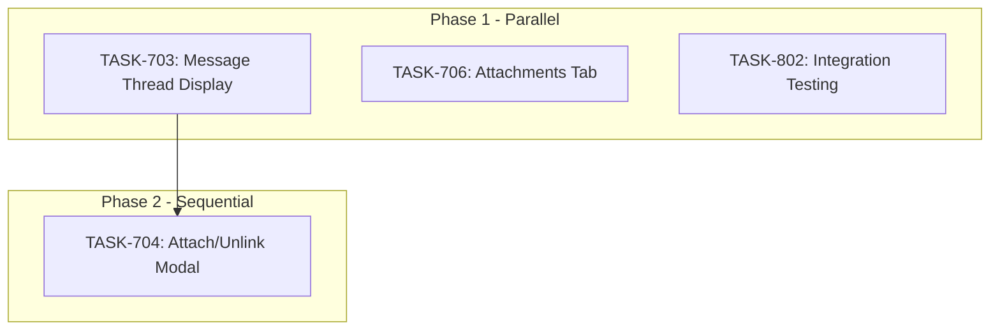

# Sprint Plan: SPRINT-012: Completion Batch

## Sprint Goal

Complete remaining tasks from SPRINT-010 and SPRINT-011 that were deferred or dependent on other work. This sprint focuses on finishing the Messages tab functionality (thread display, attach/unlink modal) and establishing the integration testing framework. Phase 1 tasks can run in parallel using git worktrees, while Phase 2 depends on TASK-703 completion.

## Prerequisites / Environment Setup

Before starting sprint work, engineers must:
- [ ] `git checkout develop && git pull origin develop`
- [ ] `npm install`
- [ ] `npm rebuild better-sqlite3-multiple-ciphers`
- [ ] `npx electron-rebuild`
- [ ] Verify app starts: `npm run dev`
- [ ] Verify tests pass: `npm test`

**Note**: Native module rebuilds are required after `npm install` or Node.js updates.

## In Scope

- TASK-703 Message Thread Display Component -- Completes Messages tab UI from SPRINT-010
- TASK-706 Add Attachments Tab -- Adds email attachment viewing to Transaction Details
- TASK-802 Integration Testing Framework -- Infrastructure for E2E testing without external dependencies
- TASK-704 Attach/Unlink Messages Modal -- Completes message management functionality

## Out of Scope / Deferred

- TASK-700 through TASK-702 -- Already completed in previous sprints
- TASK-800, TASK-801 -- Fixture tasks (prerequisites for TASK-802, already completed)
- Message search functionality -- Future enhancement
- Attachment preview/OCR -- Future enhancement

## Reprioritized Backlog (Top N)

| ID | Title | Priority | Rationale | Dependencies | Conflicts |
|----|-------|----------|-----------|--------------|-----------|
| TASK-703 | Message Thread Display | 1 | Blocks TASK-704 | TASK-702 (merged) | None |
| TASK-706 | Attachments Tab | 1 | Independent UI work | TASK-702 (merged) | None |
| TASK-802 | Integration Testing Framework | 1 | Independent infra work | TASK-800, TASK-801 (merged) | None |
| TASK-704 | Attach/Unlink Messages Modal | 2 | Requires thread display | TASK-702, TASK-703 | None |

## Phase Plan

### Phase 1: Parallel UI & Infrastructure (Parallelizable)

- TASK-703: Message Thread Display Component (6-8 turns, ~1h)
- TASK-706: Add Attachments Tab (6-10 turns, ~1h)
- TASK-802: Integration Testing Framework (12-18 turns, ~2h)

**Execution Method:** Git worktrees (Mad-task-703, Mad-task-706, Mad-task-802)

**Integration checkpoint**: All tasks merge to `develop`, CI must pass before Phase 2.

### Phase 2: Message Management (Sequential)

- TASK-704: Attach/Unlink Messages Modal (10-14 turns, ~2h) -- depends on TASK-703

**Integration checkpoint**: TASK-704 merges to `develop`, CI must pass.

## Merge Plan

- **Main branch**: `develop`
- **Feature branch format**: `feature/TASK-<NNN>-<slug>`
- **Integration branches** (if needed): None -- direct to develop
- **Merge order** (explicit):
  1. TASK-703 -> develop (unblocks TASK-704)
  2. TASK-706 -> develop (independent)
  3. TASK-802 -> develop (independent)
  4. TASK-704 -> develop (after TASK-703 merged)

## Dependency Graph (Mermaid)



## Dependency Graph (YAML)

```yaml
dependency_graph:
  nodes:
    - id: TASK-703
      type: task
      phase: 1
      title: Message Thread Display Component
      branch: feature/TASK-703-message-thread-display
      parallel_safe: true
    - id: TASK-706
      type: task
      phase: 1
      title: Add Attachments Tab
      branch: feature/TASK-706-attachments-tab
      parallel_safe: true
    - id: TASK-802
      type: task
      phase: 1
      title: Integration Testing Framework
      branch: feature/TASK-802-integration-testing
      parallel_safe: true
    - id: TASK-704
      type: task
      phase: 2
      title: Attach/Unlink Messages Modal
      branch: feature/TASK-704-attach-unlink-messages
      parallel_safe: false
  edges:
    - from: TASK-703
      to: TASK-704
      type: depends_on
      reason: Thread display must exist before adding unlink buttons
```

## Testing & Quality Plan (REQUIRED)

### Unit Testing

- New tests required for:
  - TASK-703: MessageThreadCard.test.tsx, MessageBubble.test.tsx, thread grouping utilities
  - TASK-706: TransactionAttachmentsTab.test.tsx, AttachmentCard.test.tsx
  - TASK-802: TestSandbox tests, mock provider tests
  - TASK-704: AttachMessagesModal.test.tsx, UnlinkMessageModal.test.tsx
- Existing tests to update:
  - TransactionMessagesTab.test.tsx (thread integration)
  - TransactionDetails.test.tsx (new tabs)

### Coverage Expectations

- Coverage rules:
  - No regression from current coverage
  - New UI components should have basic render tests
  - New utilities should have logic tests
  - Integration tests (TASK-802) add new test category

### Integration / Feature Testing

- Required scenarios:
  - Message threads render correctly with mixed inbound/outbound
  - Attachments tab shows email attachments grouped by email
  - Integration sandbox can run sync and detection pipelines
  - Attach modal can select and link messages
  - Unlink confirmation works and refreshes UI

### CI / CD Quality Gates

The following MUST pass before merge:
- [ ] Unit tests
- [ ] Integration tests (after TASK-802)
- [ ] Coverage checks
- [ ] Type checking
- [ ] Linting / formatting
- [ ] Build step

### Backend Revamp Safeguards (if applicable)

- Existing behaviors preserved:
  - Email display remains unchanged
  - Transaction details existing tabs unmodified
  - Database schema unchanged
- Behaviors intentionally changed:
  - TASK-704 adds new IPC handlers for message linking
- Tests protecting critical paths:
  - Existing transaction service tests
  - Communication service tests

## Risk Register

| Risk | Likelihood | Impact | Mitigation |
|------|------------|--------|------------|
| TASK-704 IPC handlers more complex than estimated | Medium | Medium | Clear implementation notes in task file, can split if needed |
| Thread grouping edge cases | Low | Low | Detailed implementation notes provided |
| attachment_metadata JSON parsing issues | Low | Medium | SR review notes include handling guidance |
| Integration test flakiness | Medium | Low | Use deterministic data, fake timers |

## Decision Log

### Decision: Use Git Worktrees for Phase 1 Parallel Execution

- **Date**: 2025-12-28
- **Context**: Phase 1 has 3 independent tasks that can run in parallel
- **Decision**: Use git worktrees (Mad-task-703, Mad-task-706, Mad-task-802) instead of separate branches
- **Rationale**: Worktrees allow true parallel development without merge conflicts, each engineer works in isolated filesystem
- **Impact**: Faster sprint completion, requires cleanup after merges

### Decision: TASK-704 Requires New IPC Handlers

- **Date**: 2025-12-28
- **Context**: Message linking/unlinking APIs don't exist
- **Decision**: TASK-704 scope includes creating transactionBridge.ts handlers
- **Rationale**: Cannot defer - functionality requires backend support
- **Impact**: Increased estimate (10-14 turns vs original 6-8)

## Sprint Estimates Summary

| Task | Estimated Turns | Estimated Tokens | Estimated Time |
|------|-----------------|------------------|----------------|
| TASK-703 | 6-8 | ~35K-45K | ~1h |
| TASK-706 | 6-10 | ~30K-50K | ~1h |
| TASK-802 | 12-18 | ~60K-90K | ~2h |
| TASK-704 | 10-14 | ~55K-75K | ~2h |
| **Sprint Total** | **34-50** | **~180K-260K** | **~6-8h** |

## Branch Information

| Task | Branch Name | Branch From | Branch Into |
|------|-------------|-------------|-------------|
| TASK-703 | feature/TASK-703-message-thread-display | develop | develop |
| TASK-706 | feature/TASK-706-attachments-tab | develop | develop |
| TASK-802 | feature/TASK-802-integration-testing | develop | develop |
| TASK-704 | feature/TASK-704-attach-unlink-messages | develop | develop |

## End-of-Sprint Validation Checklist

- [ ] All tasks merged to develop
- [ ] All CI checks passing
- [ ] All acceptance criteria verified
- [ ] Testing requirements met
- [ ] No unresolved conflicts
- [ ] Documentation updated (if applicable)
- [ ] Ready for release (if applicable)
- [ ] **Worktree cleanup complete** (see below)

## Worktree Cleanup (Post-Sprint)

Phase 1 uses git worktrees for parallel execution. Clean them up after all PRs merge:

```bash
# List current worktrees
git worktree list

# Remove sprint worktrees
git worktree remove Mad-task-703 --force
git worktree remove Mad-task-706 --force
git worktree remove Mad-task-802 --force

# Or bulk cleanup
for wt in Mad-task-*; do [ -d "$wt" ] && git worktree remove "$wt" --force; done

# Verify cleanup
git worktree list
```

**Note:** Orphaned worktrees consume disk space and clutter IDE file browsers.

---

## Sprint Status

**Status:** In Progress
**Created:** 2025-12-28
**Target Branch:** develop

### Task Status Tracking

| Task | Status | PR | Notes |
|------|--------|-----|-------|
| TASK-703 | Pending | - | Phase 1 |
| TASK-706 | Pending | - | Phase 1 |
| TASK-802 | Pending | - | Phase 1 |
| TASK-704 | Blocked | - | Waiting for TASK-703 |
