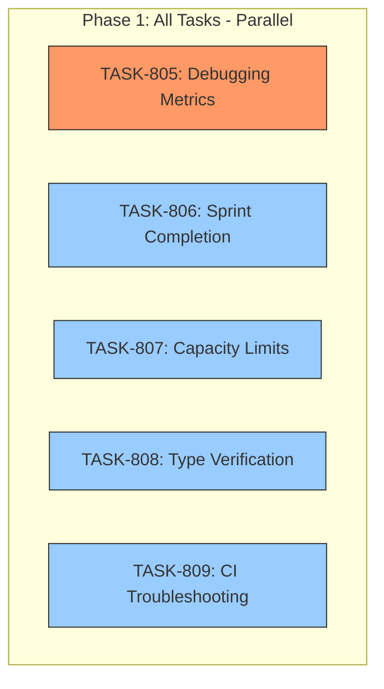

# SPRINT-012: Process & Documentation Improvements

**Sprint Goal:** Implement process improvements and documentation updates identified in SPRINT-010 and SPRINT-011 retrospectives to prevent recurring issues with debugging metrics, sprint completion tracking, capacity planning, type verification, and CI troubleshooting.

**Created:** 2026-01-01
**Status:** PLANNING
**Target Branch:** develop

---

## Executive Summary

This sprint focuses on process and documentation improvements derived from retrospective analysis:

- **2 High Priority Tasks:** Enforce debugging metrics (BACKLOG-126), Sub-agent permission fix (BACKLOG-130)
- **4 Medium Priority Tasks:** Sprint completion checklist, capacity limits, type verification, CI troubleshooting
- **All documentation tasks:** No code changes, pure process/config improvement

**Key Context:**
- All items originated from SPRINT-010 and SPRINT-011 retrospectives
- BACKLOG-126 addresses a 22-hour debugging incident where metrics reported "0"
- Remaining tasks prevent recurring patterns identified in retrospectives

---

## Phase Structure

### Phase 1: All Tasks (Parallel Execution)
**Execution:** All tasks can run in parallel - no shared files, all independent documentation

| Task | Title | Backlog | Category | Est. Turns | Priority | Status |
|------|-------|---------|----------|------------|----------|--------|
| TASK-805 | Enforce Debugging Metrics with Commit Verification | BACKLOG-126 | docs | 2-3 | HIGH | Pending |
| TASK-806 | Add Sprint Completion Checklist to PM Workflow | BACKLOG-124 | docs | 1-2 | MEDIUM | Pending |
| TASK-807 | Add Sprint Capacity Limits to PM Workflow | BACKLOG-127 | docs | 1-2 | MEDIUM | Pending |
| TASK-808 | Add Type Verification Checklist for Fixture Tasks | BACKLOG-128 | docs | 1-2 | MEDIUM | Pending |
| TASK-809 | Create CI Troubleshooting Documentation | BACKLOG-129 | docs | 1-2 | MEDIUM | Pending |
| TASK-810 | Add Sub-Agent Permission Guidance | BACKLOG-130 | docs/config | 1-2 | HIGH | Pending |

**Parallel Execution Rationale:**
- All tasks modify different documentation files
- No shared dependencies
- No merge conflict risk
- Pure documentation sprint

---

## Dependency Graph

**Legend:**
- Orange: HIGH priority
- Blue: MEDIUM priority

**Parallel Execution Notes:**
- All 5 tasks can execute simultaneously
- No dependencies between tasks
- Each task modifies distinct files
- Merge order is irrelevant

---

## File Modification Matrix

| Task | Files Modified | Potential Conflicts |
|------|---------------|---------------------|
| TASK-805 | `PR-SOP.md`, `engineer.md`, `metrics-templates.md` | None |
| TASK-806 | `backlog-maintenance.md`, `plan-first-protocol.md` | None |
| TASK-807 | `sprint-selection.md` | None |
| TASK-808 | `task-file-authoring.md` | None |
| TASK-809 | NEW `ci-troubleshooting.md`, `CLAUDE.md` | None |
| TASK-810 | `engineer.md`, `.claude/settings.json` | None |

---

## Backlog Items Addressed

| Backlog ID | Title | Task | Priority |
|------------|-------|------|----------|
| BACKLOG-126 | Enforce Debugging Metrics with Commit Verification | TASK-805 | High |
| BACKLOG-124 | Add Sprint Completion Checklist to PM Workflow | TASK-806 | Medium |
| BACKLOG-127 | Add Sprint Capacity Limits to PM Workflow | TASK-807 | Medium |
| BACKLOG-128 | Add Type Verification Checklist for Fixture Tasks | TASK-808 | Medium |
| BACKLOG-129 | Create CI Troubleshooting Documentation | TASK-809 | Medium |
| BACKLOG-130 | Sub-Agent Permission Auto-Denial Fix | TASK-810 | High |

---

## Estimated Totals

| Metric | Estimate | Notes |
|--------|----------|-------|
| Total Tasks | 6 | All documentation/config |
| Total Turns | 6-11 | Applying docs category × 0.5 adjustment |
| Total Tokens | ~25K-45K | Documentation is lower token cost |
| Total Time | ~45-90 min | Low complexity documentation |

**Estimation Notes:**
- Documentation tasks historically complete faster than code tasks
- BACKLOG estimates were 10-12 turns total, applying 0.5x multiplier for docs
- No debugging expected (pure documentation)

---

## Risk Register

| Risk | Likelihood | Impact | Mitigation |
|------|------------|--------|------------|
| Content already exists elsewhere | Low | Low | Cross-reference existing docs before adding |
| Too much process overhead | Medium | Medium | Keep checklists concise and actionable |
| Engineers ignore new documentation | Medium | High | Integrate into existing workflows, not new docs |

---

## Quality Gates

### Per-Task
- [ ] Content is clear and actionable
- [ ] Examples provided where helpful
- [ ] Cross-references to related docs
- [ ] Markdown formatting correct
- [ ] No duplicate content with existing docs

### Sprint Completion
- [ ] All 5 tasks merged
- [ ] Documentation is discoverable (indexed properly)
- [ ] No conflicting guidance across documents
- [ ] BACKLOG items marked complete
- [ ] INDEX.md updated with completion info

---

## Testing & Quality Plan

### Documentation Quality Checks

For each task:
- [ ] Markdown renders correctly (no broken links, formatting)
- [ ] Examples are copy-paste ready
- [ ] Terminology is consistent with existing docs
- [ ] No contradictions with existing guidance

### Integration Verification

- [ ] New sections integrate with existing document flow
- [ ] Cross-references are valid (file paths exist)
- [ ] CLAUDE.md reference to ci-troubleshooting.md works

---

## Task List Summary

| ID | Title | Phase | Priority | Est. Turns | Status |
|----|-------|-------|----------|------------|--------|
| TASK-805 | Enforce Debugging Metrics with Commit Verification | 1 | HIGH | 2-3 | Pending |
| TASK-806 | Add Sprint Completion Checklist to PM Workflow | 1 | MEDIUM | 1-2 | Pending |
| TASK-807 | Add Sprint Capacity Limits to PM Workflow | 1 | MEDIUM | 1-2 | Pending |
| TASK-808 | Add Type Verification Checklist for Fixture Tasks | 1 | MEDIUM | 1-2 | Pending |
| TASK-809 | Create CI Troubleshooting Documentation | 1 | MEDIUM | 1-2 | Pending |
| TASK-810 | Add Sub-Agent Permission Guidance | 1 | HIGH | 1-2 | Pending |

---

## Technical Context

### Existing Documentation Structure

| Directory | Purpose |
|-----------|---------|
| `.claude/docs/` | Process documents (PR-SOP, ENGINEER-WORKFLOW) |
| `.claude/docs/shared/` | Shared references (metrics, git, etc.) |
| `.claude/agents/` | Agent configurations |
| `.claude/skills/agentic-pm/modules/` | PM workflow modules |

### Files to Be Modified

| File | Task | Change Type |
|------|------|-------------|
| `.claude/docs/PR-SOP.md` | TASK-805 | Add section 9.4 |
| `.claude/agents/engineer.md` | TASK-805 | Add debugging tracking section |
| `.claude/docs/shared/metrics-templates.md` | TASK-805 | Add validation section |
| `.claude/skills/agentic-pm/modules/backlog-maintenance.md` | TASK-806 | Add checklist section |
| `.claude/docs/shared/plan-first-protocol.md` | TASK-806 | Add PM responsibility reference |
| `.claude/skills/agentic-pm/modules/sprint-selection.md` | TASK-807 | Add capacity section |
| `.claude/skills/agentic-pm/modules/task-file-authoring.md` | TASK-808 | Add fixture section |
| `.claude/docs/shared/ci-troubleshooting.md` | TASK-809 | NEW FILE |
| `CLAUDE.md` | TASK-809 | Add reference to new doc |

---

## SR Engineer Technical Review

**Status:** PENDING
**Requested:** 2026-01-01

### Review Request

Please review the 5 task files and confirm:
1. File modification assignments are correct
2. Parallel execution is safe (no shared file conflicts)
3. Content specifications are complete
4. No architectural concerns with documentation structure

### Task Files for Review

- `.claude/plans/tasks/TASK-805-debugging-metrics-enforcement.md`
- `.claude/plans/tasks/TASK-806-sprint-completion-checklist.md`
- `.claude/plans/tasks/TASK-807-sprint-capacity-limits.md`
- `.claude/plans/tasks/TASK-808-type-verification-checklist.md`
- `.claude/plans/tasks/TASK-809-ci-troubleshooting-docs.md`
- `.claude/plans/tasks/TASK-810-subagent-permission-guidance.md`

---

## Progress Tracking

**Sprint Progress:** 0/6 tasks merged (0%)

- Phase 1: 0/6 complete

### Merged PRs
| Task | PR | Merge Date | Description |
|------|-----|------------|-------------|
| - | - | - | - |
