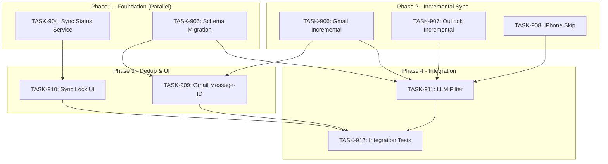

# SPRINT-014: Feature/Performance Focus

**Sprint Goal:** Improve sync reliability and performance by handling backup conflicts, implementing incremental sync, and laying foundation for email deduplication.

**Created:** 2026-01-02
**Status:** PLANNING
**Target Branch:** develop

---

## Executive Summary

This sprint addresses three backlog items focused on sync performance and reliability:

- **1 Critical Task:** BACKLOG-032 - Handle backup already in progress (UX)
- **2 High Priority Tasks:** BACKLOG-090 (Incremental Sync), BACKLOG-091 Phase 1 (Dedup Foundation)

**Key Context:**
- BACKLOG-091 is estimated at 2 sprints; we're implementing Phase 1 only (schema + Gmail Message-ID)
- These items share touch points in sync services - careful sequencing required
- Expected LLM cost reduction: 50-90% for returning users

---

## Backlog Items

| ID | Title | Priority | Scope This Sprint |
|----|-------|----------|-------------------|
| BACKLOG-032 | Handle Backup Already in Progress | Critical | Full |
| BACKLOG-090 | Incremental Sync - Only Process New Data | High | Full |
| BACKLOG-091 | Prevent Duplicate Emails Across Providers | High | Phase 1 only (schema + Gmail) |

---

## Phase Structure

### Phase 1: Foundation (Parallel)

| Task | Title | Backlog | Category | Est. Turns | Priority | Status |
|------|-------|---------|----------|------------|----------|--------|
| TASK-904 | Sync Status Service & IPC | BACKLOG-032 | service | 4-6 | CRITICAL | Pending |
| TASK-905 | Database Schema Migration - Dedup Columns | BACKLOG-091 | schema | 3-4 | HIGH | Pending |

**Parallel Safe:** Yes - different file domains (services vs database)

### Phase 2: Incremental Sync (After Phase 1)

| Task | Title | Backlog | Category | Est. Turns | Priority | Status |
|------|-------|---------|----------|------------|----------|--------|
| TASK-906 | Gmail Incremental Fetch | BACKLOG-090 | service | 4-6 | HIGH | Pending |
| TASK-907 | Outlook Incremental Fetch | BACKLOG-090 | service | 4-6 | HIGH | Pending |
| TASK-908 | iPhone Sync Skip Unchanged Backups | BACKLOG-090 | service | 3-4 | HIGH | Pending |

**Parallel Safe:** TASK-906 and TASK-907 can run in parallel. TASK-908 is independent.

### Phase 3: Dedup & UI (After Phase 2)

| Task | Title | Backlog | Category | Est. Turns | Priority | Status |
|------|-------|---------|----------|------------|----------|--------|
| TASK-909 | Gmail Message-ID Header Extraction | BACKLOG-091 | service | 3-4 | HIGH | Pending |
| TASK-910 | Sync Lock UI Component | BACKLOG-032 | ui | 3-4 | CRITICAL | Pending |

**Note:** TASK-909 MUST rebase on TASK-906 (both modify gmailFetchService.ts)

### Phase 4: Integration

| Task | Title | Backlog | Category | Est. Turns | Priority | Status |
|------|-------|---------|----------|------------|----------|--------|
| TASK-911 | LLM Pipeline Filter Update | BACKLOG-090/091 | service | 2-3 | HIGH | Pending |
| TASK-912 | Integration Testing | ALL | test | 4-6 | HIGH | Pending |

---

## Dependency Graph

---

## Risk Register

| Risk | Likelihood | Impact | Mitigation |
|------|------------|--------|------------|
| Schema migration locks table | Low | Medium | SQLite ADD COLUMN is fast; test with 100K+ messages |
| Merge conflict in gmailFetchService.ts | High | Medium | Strict sequencing: TASK-906 before TASK-909 |
| Sync timestamp set prematurely | Medium | High | Only update after successful DB persistence |
| Race condition in sync lock | Medium | High | Global singleton lock in main process |

---

## Quality Gates

### Per-Task Gates
- [ ] `npm run type-check` passes
- [ ] `npm run lint` passes
- [ ] `npm test` passes (all existing tests)
- [ ] New functionality has tests

### Sprint-Level Gates
- [ ] All PRs merged to develop
- [ ] Sync lock UI prevents double-sync
- [ ] Incremental sync verified (log shows "Fetched X new messages since Y")
- [ ] Gmail Message-ID extraction rate >95%
- [ ] LLM calls reduced for returning users

---

## Testing Plan

| Task | Testing Approach |
|------|------------------|
| TASK-904 | Unit test status propagation; mock BackupService.isRunning |
| TASK-905 | Migration test on empty/populated databases |
| TASK-906/907 | Mock API responses with date filtering |
| TASK-908 | Test backup modification time comparison |
| TASK-909 | Test Message-ID extraction from various email formats |
| TASK-910 | Component test for lock banner display |
| TASK-911 | Verify SQL query excludes duplicates and analyzed messages |
| TASK-912 | Full integration test suite |

---

## Estimated Effort

| Task | Est. Turns | Est. Tokens | Est. Time |
|------|------------|-------------|-----------|
| TASK-904 | 4-6 | ~20K | 20-30 min |
| TASK-905 | 3-4 | ~15K | 15-20 min |
| TASK-906 | 4-6 | ~20K | 20-30 min |
| TASK-907 | 4-6 | ~20K | 20-30 min |
| TASK-908 | 3-4 | ~15K | 15-20 min |
| TASK-909 | 3-4 | ~15K | 15-20 min |
| TASK-910 | 3-4 | ~15K | 15-20 min |
| TASK-911 | 2-3 | ~10K | 10-15 min |
| TASK-912 | 4-6 | ~25K | 25-35 min |
| **Total** | 30-43 | ~155K | 2.5-4 hrs |

**Note:** Service category tasks - no adjustment factor applied (need more data).

---

## Out of Scope (Deferred to SPRINT-015)

These items from BACKLOG-091 are intentionally deferred:

- Outlook Message-ID extraction
- Content hash fallback for emails without Message-ID
- Full duplicate linking logic (populating `duplicate_of`)
- UI duplicate indicator
- Backfill migration for existing emails

---

## Success Criteria

- [ ] User sees "sync in progress" message when backup running
- [ ] Second sync only fetches new emails (verified via logs)
- [ ] iPhone backup skip when unchanged (verified via logs)
- [ ] Gmail Message-ID header stored for >95% of emails
- [ ] LLM only processes unanalyzed, non-duplicate messages
- [ ] All 9 tasks merged with tests passing
