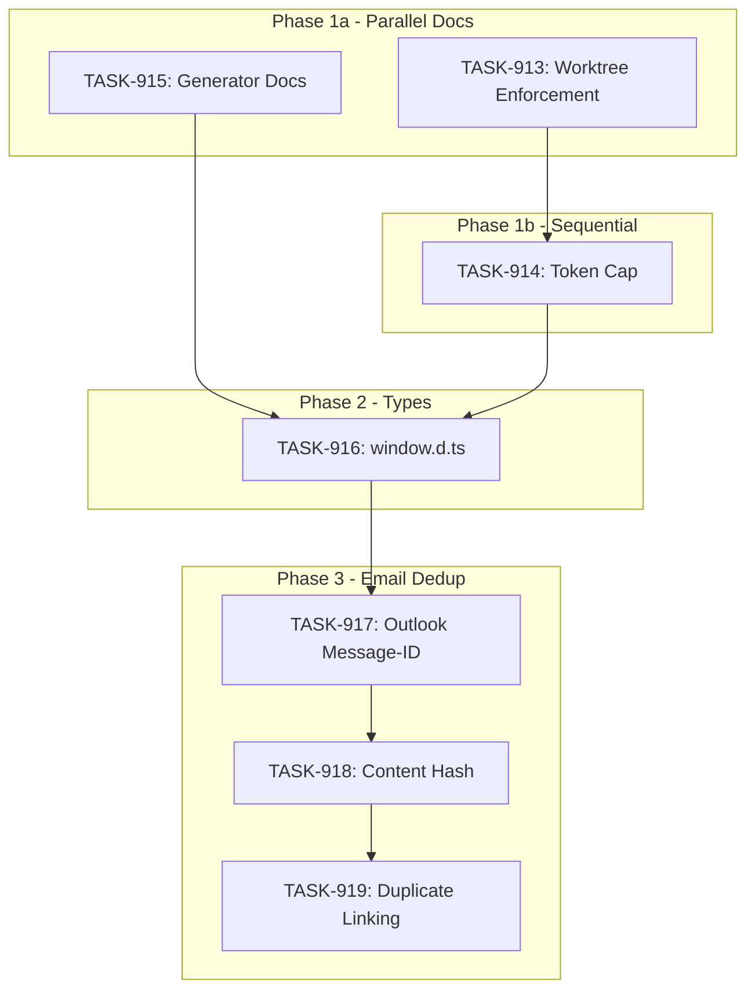

# SPRINT-015: Infrastructure Stabilization

**Sprint Goal:** Stabilize agent infrastructure to prevent token overconsumption incidents, then lay groundwork for email deduplication Phase 2. Address root causes from SPRINT-014 retrospective before continuing feature work.

**Created:** 2026-01-02
**Status:** PLANNED
**Target Branch:** develop

---

## Executive Summary

This sprint addresses infrastructure issues identified in SPRINT-014 retrospective before continuing feature work:

| Priority | Item | Description | Root Cause |
|----------|------|-------------|------------|
| CRITICAL | BACKLOG-132 | Mandatory worktrees for parallel agents | ~18M tokens burned |
| HIGH | BACKLOG-133 | Token cap with early reporting | Runaway agents undetected |
| MEDIUM | BACKLOG-135 | window.d.ts type definitions | ~6M tokens from type debugging |
| HIGH | BACKLOG-121 | Generator approach for large fixtures | 32K token limit hit |
| HIGH | BACKLOG-091 Phase 2 | Email dedup (Outlook + content hash) | Feature continuation |

**Sprint Strategy:**
- **Phase 1 (Parallel):** All documentation/process tasks (BACKLOG-132, 133, 121)
- **Phase 2 (Sequential):** Type definitions fix (BACKLOG-135)
- **Phase 3 (Sequential):** Email dedup Phase 2 (BACKLOG-091)

---

## Backlog Items

| ID | Title | Priority | Scope | Category |
|----|-------|----------|-------|----------|
| BACKLOG-132 | Mandatory Worktree for Parallel/Background Agents | Critical | Full | docs/process |
| BACKLOG-133 | Engineer Token Cap with Early Reporting | High | Full | docs/process |
| BACKLOG-135 | Fix window.d.ts Type Definitions | Medium | Full | tech-debt |
| BACKLOG-121 | Generator Approach Guidance for Large Fixtures | High | Full | docs |
| BACKLOG-091 | Prevent Duplicate Emails (Phase 2) | High | Partial | service |

---

## Task Breakdown

### TASK-913: Mandatory Worktree Enforcement (BACKLOG-132)

**Category:** docs
**Raw Estimate:** 3-4 turns, ~15K tokens, 20-30 min
**Adjusted Estimate (docs x 0.5):** 2-3 turns, ~8K tokens, 10-15 min

**Deliverables:**
- Update `.claude/agents/engineer.md` - make worktree MANDATORY for background agents
- Update `.claude/docs/shared/git-branching.md` - add worktree requirement
- Update `CLAUDE.md` - add incident warning

### TASK-914: Token Cap with Early Reporting (BACKLOG-133)

**Category:** docs
**Raw Estimate:** 4-6 turns, ~20K tokens, 30-45 min
**Adjusted Estimate (docs x 0.5):** 2-3 turns, ~10K tokens, 15-25 min

**Deliverables:**
- Update `.claude/agents/engineer.md` - add 4x token cap logic
- Update task template with token cap field
- Add token cap workflow documentation

### TASK-915: Generator Approach Documentation (BACKLOG-121)

**Category:** docs
**Raw Estimate:** 2-3 turns, ~10K tokens, 20-30 min
**Adjusted Estimate (docs x 0.5):** 1-2 turns, ~5K tokens, 10-15 min

**Deliverables:**
- New `.claude/docs/shared/large-fixture-generation.md`
- Update `.claude/skills/agentic-pm/modules/task-file-authoring.md`
- Update `.claude/docs/shared/plan-first-protocol.md`

### TASK-916: Fix window.d.ts Type Definitions (BACKLOG-135)

**Category:** tech-debt (types)
**Raw Estimate:** 2-3 turns, ~10K tokens, 15-20 min
**Adjustment Factor:** TBD (no historical data for types category)
**Adjusted Estimate:** 2-3 turns, ~10K tokens, 15-20 min

**Deliverables:**
- Audit `electron/preload/deviceBridge.ts` exports
- Update `src/window.d.ts` with missing types
- Verify `getUnifiedStatus()` and sync APIs properly typed

### TASK-917: Outlook Message-ID Extraction (BACKLOG-091 Phase 2a)

**Category:** service
**Raw Estimate:** 4-6 turns, ~20K tokens, 25-35 min
**Adjustment Factor:** 1.0 (need more service data)
**Adjusted Estimate:** 4-6 turns, ~20K tokens, 25-35 min

**Deliverables:**
- Extract Message-ID from Outlook `internetMessageHeaders` or `internetMessageId`
- Store in `message_id_header` column (created in SPRINT-014 TASK-905)
- Unit tests for extraction

### TASK-918: Content Hash Fallback (BACKLOG-091 Phase 2b)

**Category:** service
**Raw Estimate:** 4-5 turns, ~18K tokens, 25-30 min
**Adjustment Factor:** 1.0
**Adjusted Estimate:** 4-5 turns, ~18K tokens, 25-30 min

**Deliverables:**
- Implement `computeEmailHash()` function
- Hash: subject + from + sentDate + first 500 chars of body
- Store in `content_hash` column
- Apply to new emails during sync

### TASK-919: Duplicate Linking Logic (BACKLOG-091 Phase 2c)

**Category:** service
**Raw Estimate:** 4-6 turns, ~20K tokens, 25-35 min
**Adjustment Factor:** 1.0
**Adjusted Estimate:** 4-6 turns, ~20K tokens, 25-35 min

**Deliverables:**
- Detect duplicates during email storage (Message-ID or content hash match)
- Populate `duplicate_of` field pointing to original
- Skip LLM analysis for duplicates (already done in TASK-911)
- Integration tests

---

## Phase Structure

### Phase 1a: Documentation/Process (Parallel)

These tasks modify documentation files with NO overlap:

| Task | Title | Estimated | Files |
|------|-------|-----------|-------|
| TASK-913 | Mandatory Worktree Enforcement | 2-3 turns | engineer.md, git-branching.md, CLAUDE.md |
| TASK-915 | Generator Approach Documentation | 1-2 turns | shared docs, task-file-authoring.md |

**Parallel Safe:** Yes - TASK-913 and TASK-915 have no shared files
**Token Cap:** Each task has 4x cap applied

### Phase 1b: Token Cap Documentation (Sequential after 1a)

| Task | Title | Estimated | Files | Depends On |
|------|-------|-----------|-------|------------|
| TASK-914 | Token Cap with Early Reporting | 2-3 turns | engineer.md, task template | TASK-913 |

**CRITICAL:** TASK-914 MUST wait for TASK-913 to merge. Both modify `engineer.md`.
**Token Cap:** 4x cap applied

### Phase 2: Type Definitions (Sequential after Phase 1b)

| Task | Title | Estimated | Dependencies |
|------|-------|-----------|--------------|
| TASK-916 | Fix window.d.ts Types | 2-3 turns | Phase 1 complete (TASK-913, TASK-914, TASK-915) |

**Why Sequential:** TASK-916 modifies core type definitions that could affect IDE autocomplete during documentation work. First code task - ensures clean docs baseline.

### Phase 3: Email Dedup (Sequential)

| Task | Title | Estimated | Dependencies |
|------|-------|-----------|--------------|
| TASK-917 | Outlook Message-ID Extraction | 4-6 turns | TASK-916 (type safety) |
| TASK-918 | Content Hash Fallback | 4-5 turns | TASK-917 (build on dedup infrastructure) |
| TASK-919 | Duplicate Linking Logic | 4-6 turns | TASK-917, TASK-918 |

**Why Sequential:**
- TASK-917 and TASK-918 both modify outlookFetchService.ts
- TASK-919 depends on both dedup mechanisms being in place
- Schema columns already exist from SPRINT-014 TASK-905

---

## Dependency Graph



**Key Change (SR Engineer Review 2026-01-02):** TASK-913 and TASK-914 both modify `engineer.md`.
Original plan marked them as parallel - CORRECTED to sequential (T913 -> T914) to prevent merge conflicts.

---

## Estimated Effort

| Task | Category | Raw Est | Adjusted Est | Tokens | Time |
|------|----------|---------|--------------|--------|------|
| TASK-913 | docs | 3-4 | 2-3 turns | ~8K | 10-15 min |
| TASK-914 | docs | 4-6 | 2-3 turns | ~10K | 15-25 min |
| TASK-915 | docs | 2-3 | 1-2 turns | ~5K | 10-15 min |
| TASK-916 | types | 2-3 | 2-3 turns | ~10K | 15-20 min |
| TASK-917 | service | 4-6 | 4-6 turns | ~20K | 25-35 min |
| TASK-918 | service | 4-5 | 4-5 turns | ~18K | 25-30 min |
| TASK-919 | service | 4-6 | 4-6 turns | ~20K | 25-35 min |
| **Total** | - | 23-33 | **19-28 turns** | **~91K** | **2-3 hrs** |

**Notes:**
- Documentation tasks use x0.5 adjustment factor per INDEX.md
- Service tasks use x1.0 (insufficient historical data)
- All tasks have 4x token cap enforced

---

## Risk Register

| Risk | Likelihood | Impact | Mitigation |
|------|------------|--------|------------|
| Phase 1 parallel agents conflict | Low | High | Worktree isolation MANDATORY (meta: applying our own fix) |
| Token cap too aggressive (4x) | Medium | Low | PM can override per-task |
| Outlook API lacks Message-ID | Low | Medium | Fall back to content hash only |
| Content hash collisions | Low | Low | Hash includes timestamp, very unlikely |
| Type changes break existing code | Low | Medium | Run full test suite before merge |

---

## Quality Gates

### Per-Task Gates
- [ ] `npm run type-check` passes
- [ ] `npm run lint` passes
- [ ] `npm test` passes
- [ ] Token cap not exceeded (4x estimate)
- [ ] Worktree used for parallel tasks

### Sprint-Level Gates
- [ ] All 7 tasks merged to develop
- [ ] SPRINT-014 root causes addressed (worktrees, token caps)
- [ ] window.d.ts includes all preload bridge exports
- [ ] Outlook Message-ID extraction rate >90%
- [ ] Content hash computed for all new emails
- [ ] Duplicate emails linked correctly

---

## Testing Plan

| Task | Testing Approach |
|------|------------------|
| TASK-913 | Manual verification of engineer.md changes |
| TASK-914 | Manual verification of token cap documentation |
| TASK-915 | Manual verification of fixture docs |
| TASK-916 | `npm run type-check` - no new errors |
| TASK-917 | Unit test Outlook Message-ID extraction |
| TASK-918 | Unit test content hash computation |
| TASK-919 | Integration test duplicate detection and linking |

---

## Worktree Requirements (ENFORCED)

**CRITICAL:** This sprint enforces mandatory worktrees for all parallel work.

### Phase 1a Parallel Execution (TASK-913 and TASK-915 ONLY)

```bash
# ONLY these two tasks can run in parallel
git -C /Users/daniel/Documents/Mad worktree add ../Mad-task-913 -b docs/TASK-913-worktree-enforcement develop
git -C /Users/daniel/Documents/Mad worktree add ../Mad-task-915 -b docs/TASK-915-generator-docs develop
```

### Phase 1b Sequential (TASK-914 - AFTER TASK-913 merged)

```bash
# WAIT for TASK-913 to merge, then pull and create worktree
git -C /Users/daniel/Documents/Mad pull origin develop
git -C /Users/daniel/Documents/Mad worktree add ../Mad-task-914 -b docs/TASK-914-token-cap develop
```

**WARNING:** TASK-914 shares `engineer.md` with TASK-913. Sequential execution REQUIRED.

### Worktree Cleanup (Post-Sprint)

```bash
git worktree remove Mad-task-913 --force
git worktree remove Mad-task-914 --force
git worktree remove Mad-task-915 --force
git worktree list  # Verify cleanup
```

---

## Out of Scope (Deferred to SPRINT-016+)

- BACKLOG-091 remaining items:
  - UI duplicate indicator
  - Backfill migration for existing emails
- BACKLOG-134 expansion (already partially addressed)
- New feature work until infrastructure is stable

---

## Success Criteria

- [ ] No token overconsumption incidents (each task < 4x estimate)
- [ ] Worktree isolation verified for all parallel work
- [ ] All documentation updates reflect SPRINT-014 lessons
- [ ] window.d.ts matches preload bridge exports
- [ ] Email dedup Phase 2 infrastructure complete
- [ ] Ready to continue feature work in SPRINT-016

---

## Decision Log

### Decision: Infrastructure before features

- **Date:** 2026-01-02
- **Context:** SPRINT-014 burned ~18M tokens on race conditions, ~6M on type issues
- **Decision:** Address root causes before continuing BACKLOG-091 Phase 2
- **Rationale:** Prevent similar incidents from compounding
- **Impact:** Delays feature work by 1 sprint, but prevents 10x+ token waste

### Decision: 4x token cap as default

- **Date:** 2026-01-02
- **Context:** Need to detect runaway agents early
- **Decision:** Use 4x estimated tokens as soft cap (report, don't hard-fail)
- **Rationale:** Balances detection with flexibility for complex tasks
- **Impact:** PM notified at 4x, can extend or abort

### Decision: Phase 1 parallel despite applying worktree fix (REVISED)

- **Date:** 2026-01-02
- **Context:** Applying our own worktree fix while needing to use worktrees
- **Decision:** Phase 1a (TASK-913, TASK-915) parallel; Phase 1b (TASK-914) sequential
- **Rationale:** TASK-913 and TASK-914 both modify engineer.md - sequential required
- **Impact:** Validates fix while applying it; avoids engineer.md merge conflict

### Decision: Sequence TASK-913 before TASK-914 (SR Engineer Review)

- **Date:** 2026-01-02
- **Context:** SR Engineer review identified file conflict - both tasks modify engineer.md
- **Decision:** TASK-914 must wait for TASK-913 to merge before starting
- **Rationale:** Prevents merge conflicts; worktree isolation alone does not solve shared file edits
- **Impact:** Phase 1 takes slightly longer (~10-15 min delay) but guarantees clean merges

---

## End-of-Sprint Validation Checklist

- [ ] All 7 tasks merged to develop
- [ ] All CI checks passing
- [ ] All acceptance criteria verified
- [ ] Testing requirements met
- [ ] No unresolved conflicts
- [ ] Documentation updated
- [ ] Worktree cleanup complete
- [ ] INDEX.md updated with sprint completion
- [ ] Phase retro report created

---

## SR Engineer Technical Review Request

**Sprint:** SPRINT-015 - Infrastructure Stabilization
**Tasks:** TASK-913, TASK-914, TASK-915, TASK-916, TASK-917, TASK-918, TASK-919

### Review Needed

1. Verify parallel safety for Phase 1 (TASK-913, 914, 915)
2. Confirm sequential execution necessary for Phase 2-3
3. Review file touch points for potential conflicts
4. Add branch info to each task file
5. Flag any architectural concerns

### Task Files

After task files are created, SR Engineer should review:
- `.claude/plans/tasks/TASK-913-*.md`
- `.claude/plans/tasks/TASK-914-*.md`
- `.claude/plans/tasks/TASK-915-*.md`
- `.claude/plans/tasks/TASK-916-*.md`
- `.claude/plans/tasks/TASK-917-*.md`
- `.claude/plans/tasks/TASK-918-*.md`
- `.claude/plans/tasks/TASK-919-*.md`
