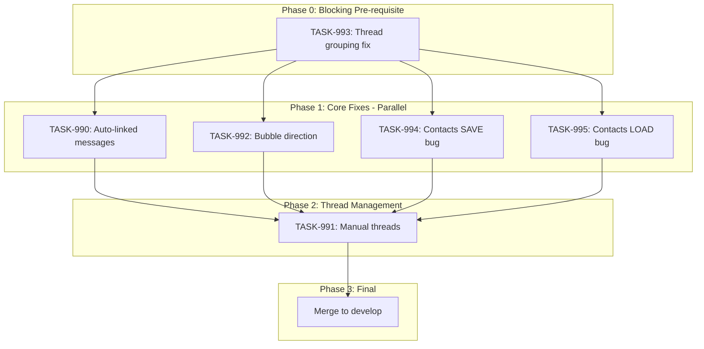

# Sprint Plan: SPRINT-027 - Messages & Contacts Polish

## Sprint Goal

Complete the Messages feature by fixing auto-linked message display, finishing manual thread attachment functionality, and correcting message bubble direction to create a polished, phone-style messaging experience within Transaction Details.

## Sprint Status: COMPLETE (Extended)

**Initial Completion:** 2026-01-09
**Extended Session:** 2026-01-10 (additional polish work)
**Final Merge:** feature/contact-first-attach-messages merged to develop (PR #353)
**Active Branch:** fix/messages-display-issues (post-merge polish)

### Work Summary

This sprint completed all planned tasks plus significant unplanned polish work to deliver a fully-functional messaging experience.

**Planned Tasks Completed:**
| Task | PR | Description |
|------|-----|-------------|
| TASK-993 | #354 | Fix thread grouping by iMessage thread_id |
| TASK-990 | #358 | Display auto-linked messages in Transaction Details |
| TASK-991 | #359 | Complete manual thread attach/unlink functionality |
| TASK-992 | #356 | Fix message bubble direction |
| TASK-994 | #355 | Fix multiple contacts per role (SAVE path) |
| TASK-995 | #357 | Fix contacts not pre-populated (LOAD path) |

**Unplanned Work (Session 2026-01-09):**
| Fix | PR/Commit | Description |
|-----|-----------|-------------|
| Contact names in threads | #360 | Show contact names and sender labels in message threads |
| Attached messages display | #361 | Display attached messages and show sender in bubbles |
| Thread grouping (final) | #362 | Include thread_id and participants for proper grouping |
| Permissions bug | (direct) | Fixed type mismatch for checkAllPermissions |
| Duplicate import | (direct) | Added singleton guard to prevent parallel imports |
| Dual progress bars | (direct) | Separate progress for contacts and messages import |
| Text/email separation | (direct) | Filtered SMS from Related Emails section |
| Threads collapsed | (direct) | Made message threads collapsed by default |
| All phones/emails | (direct) | Store ALL contact phones/emails, not just first |

**Extended Polish Work (Session 2026-01-10):**
| Fix | Commit | Description |
|-----|--------|-------------|
| Sync notification display | 505c78a | Fixed progress display to show current operation's actual progress (not averaged) |
| Removed orphaned components | 505c78a | Deleted AIStatusCard.tsx and test (no longer used) |
| Batch contacts import | 505c78a | Added createContactsBatch() for 10-100x faster import with transaction wrapping |
| Conversation popup modal | 505c78a | New ConversationViewModal.tsx - phone-style popup for message threads |
| MessageThreadCard modal | 505c78a | "View" button opens popup modal instead of inline expansion |
| Auto-link emails | 505c78a | Added email auto-linking based on contact email addresses |
| Unified auto-link function | 505c78a | autoLinkAllToTransaction() handles both texts and emails |
| Auto-link triggers | 505c78a | Auto-link runs after transaction create and contact assignment |
| PDF export split | 505c78a | Communications split into "Email Threads" and "Text Messages" |
| PDF contact names | 505c78a | Phone numbers resolved to contact names in PDF export |
| PDF format cleanup | 505c78a | Removed "To:" field, shows "You" for outbound messages |
| Test updates | 505c78a | Updated MessageThreadCard tests for modal behavior |
| Group chat participants | 505c78a | Store actual group chat members from chat_handle_join table |

---

## Prerequisites / Environment Setup

Before starting sprint work, engineers must:
- [ ] `git checkout feature/contact-first-attach-messages && git pull origin feature/contact-first-attach-messages`
- [ ] `npm install`
- [ ] `npm rebuild better-sqlite3-multiple-ciphers`
- [ ] `npx electron-rebuild`
- [ ] Verify app starts: `npm run dev`
- [ ] Verify tests pass: `npm test`

**Note**: This sprint branches from `feature/contact-first-attach-messages` to build on PR #353's work.

## In Scope

- **TASK-990**: Auto-linked messages display - Messages auto-linked via contact phone matching should appear in Transaction Details Messages tab
- **TASK-991**: Manual thread management - Complete and test AttachMessagesModal for manually adding/removing message threads
- **TASK-992**: Message bubble direction fix - Outgoing messages should appear on right side (phone-style), not all on left
- **TASK-993**: Thread grouping fix - Group messages by actual iMessage chat_id (BLOCKING - must complete first)
- **TASK-994**: Multiple contacts per role bug - When assigning multiple contacts to a role, only one saves (SAVE path)
- **TASK-995**: Contacts not pre-populated when editing - Existing contacts don't pre-populate in edit modal (LOAD path)

## Out of Scope / Deferred

- BACKLOG-175: Missing recent messages investigation - Requires sync debugging, separate sprint
- BACKLOG-176: Import progress display improvements - UX polish, not core functionality
- BACKLOG-177: Dashboard import status cleanup - UX polish, not core functionality
- Email attachment/unlinking UI changes - Future enhancement

## Reprioritized Backlog

| ID | Title | Priority | Status | Rationale | Dependencies |
|----|-------|----------|--------|-----------|--------------|
| TASK-993 | Thread grouping fix | 0 | **IN PROGRESS** | Blocking: threads must group correctly | None |
| TASK-990 | Auto-linked messages display | 1 | Pending | Core bug: auto-linked messages invisible | TASK-993 |
| TASK-991 | Manual thread management | 2 | Pending | Completes attach/unlink workflow | TASK-990 |
| TASK-992 | Message bubble direction | 3 | Pending | Visual polish, simpler fix | None |
| TASK-994 | Multiple contacts per role (SAVE) | 4 | Pending | Bug: only one contact saves | None |
| TASK-995 | Contacts not pre-populated (LOAD) | 5 | Pending | Bug: contacts don't pre-populate in edit | None |

## Phase Plan

### Phase 0: Pre-requisite (IN PROGRESS)

- TASK-993: Thread grouping fix - Group messages by iMessage chat_id (needs debugging)

### Phase 1: Core Fixes (Parallelizable)

- TASK-990: Auto-linked messages display (~25K tokens) - Use "Option C" hybrid query
- TASK-992: Message bubble direction fix (~10K tokens)
- TASK-994: Multiple contacts per role bug (~12K tokens) - SAVE path fix
- TASK-995: Contacts not pre-populated (~25K tokens) - LOAD path fix

**Rationale for parallel**: Different files, no shared code paths.
- TASK-990: modifies `useTransactionMessages.ts`, `transactionService.ts`, database layer
- TASK-992: modifies `MessageBubble.tsx`, `TransactionMessagesTab.tsx` only
- TASK-994: modifies Edit Transaction modal SAVE handler / form submission
- TASK-995: modifies Edit Transaction modal LOAD/initialization logic

**Note on TASK-994 vs TASK-995**: Both touch `EditTransactionModal` but in different code paths:
- TASK-994: `handleSave()` / form submission
- TASK-995: Modal initialization / `useEffect` for loading data
- Safe for parallel execution, but suggest same engineer handles both for context

**Integration checkpoint**: All tasks merge to `feature/contact-first-attach-messages`, CI must pass.

### Phase 2: Thread Management (Sequential)

- TASK-991: Manual thread management (~30K tokens) - Depends on Phase 1 for stable message display

**Integration checkpoint**: Merge to `feature/contact-first-attach-messages`, CI must pass.

### Phase 3: Final Integration

- Merge `feature/contact-first-attach-messages` to `develop` (after all tasks pass)
- Close PR #353

## Merge Plan

- **Base branch**: `feature/contact-first-attach-messages`
- **Target branch**: `develop` (final merge)
- **Feature branch format**: `fix/<TASK-ID>-<slug>`
- **Merge order** (explicit):
  1. TASK-993 -> feature/contact-first-attach-messages (blocking, must be first)
  2. Phase 1 (parallel):
     - TASK-990 -> feature/contact-first-attach-messages
     - TASK-992 -> feature/contact-first-attach-messages
     - TASK-994 -> feature/contact-first-attach-messages
     - TASK-995 -> feature/contact-first-attach-messages
  3. TASK-991 -> feature/contact-first-attach-messages (Phase 2, after Phase 1)
  4. feature/contact-first-attach-messages -> develop (final)

## Execution Strategy

### Base Branch

All sprint work branches from: `feature/contact-first-attach-messages` (not `develop`)

This is PR #353 which contains the contact-first attach messages work that these fixes build upon.

### Branch Names

| Task | Branch Name | Notes |
|------|-------------|-------|
| TASK-993 | `fix/TASK-993-thread-grouping` | Phase 0, blocking |
| TASK-990 | `fix/TASK-990-auto-linked-messages` | Phase 1, parallel |
| TASK-992 | `fix/TASK-992-bubble-direction` | Phase 1, parallel |
| TASK-994 | `fix/TASK-994-contacts-save-bug` | Phase 1, parallel |
| TASK-995 | `fix/TASK-995-contacts-load-bug` | Phase 1, parallel |
| TASK-991 | `fix/TASK-991-manual-threads` | Phase 2, sequential |

### Worktree Strategy for Phase 1 Parallel Tasks

**Recommendation: YES, use git worktrees for Phase 1 parallel execution.**

When running multiple engineer agents in parallel (background mode), each agent MUST use an isolated git worktree to prevent race conditions.

**Setup commands for Phase 1:**

```bash
# From main repo directory (/Users/daniel/Documents/Mad)
# First, ensure feature branch is up to date
git fetch origin feature/contact-first-attach-messages

# Create worktrees for each Phase 1 task (after TASK-993 completes)
git worktree add ../Mad-task-990 -b fix/TASK-990-auto-linked-messages feature/contact-first-attach-messages
git worktree add ../Mad-task-992 -b fix/TASK-992-bubble-direction feature/contact-first-attach-messages
git worktree add ../Mad-task-994 -b fix/TASK-994-contacts-save-bug feature/contact-first-attach-messages
git worktree add ../Mad-task-995 -b fix/TASK-995-contacts-load-bug feature/contact-first-attach-messages

# Each engineer session gets its own worktree path:
# - TASK-990: /Users/daniel/Documents/Mad-task-990
# - TASK-992: /Users/daniel/Documents/Mad-task-992
# - TASK-994: /Users/daniel/Documents/Mad-task-994
# - TASK-995: /Users/daniel/Documents/Mad-task-995
```

**Why worktrees are required:**
- Per BACKLOG-132: ~18M tokens burned when parallel agents shared same directory
- Each worktree has isolated filesystem preventing race conditions
- Branches don't conflict until merge (handled by SR Engineer)

**Alternative for TASK-994/995 (same engineer):**
If same engineer handles both TASK-994 and TASK-995 sequentially:
- Only need one worktree for that pair
- Complete TASK-994, push, then work on TASK-995 in same worktree

## Dependency Graph (Mermaid)



## Dependency Graph (YAML)

```yaml
dependency_graph:
  nodes:
    - id: TASK-993
      type: task
      phase: 0
      blocking: true
      parallel_with: []
    - id: TASK-990
      type: task
      phase: 1
      parallel_with: [TASK-992, TASK-994, TASK-995]
      depends_on: [TASK-993]
    - id: TASK-992
      type: task
      phase: 1
      parallel_with: [TASK-990, TASK-994, TASK-995]
      depends_on: [TASK-993]
    - id: TASK-994
      type: task
      phase: 1
      parallel_with: [TASK-990, TASK-992, TASK-995]
      depends_on: [TASK-993]
    - id: TASK-995
      type: task
      phase: 1
      parallel_with: [TASK-990, TASK-992, TASK-994]
      depends_on: [TASK-993]
    - id: TASK-991
      type: task
      phase: 2
      depends_on: [TASK-990, TASK-992, TASK-994, TASK-995]
  edges:
    - from: TASK-993
      to: TASK-990
      type: blocks
    - from: TASK-993
      to: TASK-992
      type: blocks
    - from: TASK-993
      to: TASK-994
      type: blocks
    - from: TASK-993
      to: TASK-995
      type: blocks
    - from: TASK-990
      to: TASK-991
      type: depends_on
    - from: TASK-992
      to: TASK-991
      type: depends_on
    - from: TASK-994
      to: TASK-991
      type: depends_on
    - from: TASK-995
      to: TASK-991
      type: depends_on
```

## Testing & Quality Plan (REQUIRED)

### Unit Testing

- New tests required for:
  - `useTransactionMessages.ts` - verify it fetches auto-linked messages
  - Message bubble direction tests (may already exist)

- Existing tests to update:
  - `AttachMessagesModal.test.tsx` - verify link/unlink flows
  - `TransactionMessagesTab.test.tsx` - verify display logic

### Coverage Expectations

- Coverage rules:
  - No regression from current levels
  - New code in hooks/services must have test coverage

### Integration / Feature Testing

- Required scenarios:
  1. Open Transaction Details -> Messages tab shows auto-linked messages
  2. Attach Messages modal -> select thread -> attach -> appears in tab
  3. Unlink thread -> removed from Messages tab
  4. Outgoing messages display on right side of conversation
  5. Incoming messages display on left side of conversation

### CI / CD Quality Gates

The following MUST pass before merge:
- [ ] Unit tests (`npm test`)
- [ ] TypeScript type checking (`npm run type-check`)
- [ ] ESLint linting (`npm run lint`)
- [ ] Build step (`npm run build`)

### Backend Changes

- Behaviors preserved:
  - `getCommunicationsByTransaction` continues to work for emails
  - Auto-linking via `messageMatchingService` unchanged

- New behaviors:
  - `useTransactionMessages` fetches from both `communications` AND `messages` table

## Risk Register

| Risk | Likelihood | Impact | Mitigation |
|------|------------|--------|------------|
| Messages table schema differs from communications | Low | Medium | Query both tables, normalize in service layer |
| Auto-linked messages lack required fields | Medium | Medium | Join with messages table to get full data |
| Performance with large message sets | Low | Medium | Already addressed by contact-first modal (PR #353) |
| Bubble direction logic conflicts with viewer | Low | Low | Viewer in AttachMessagesModal already works correctly |

## Decision Log

### Decision: Branch from feature/contact-first-attach-messages

- **Date**: 2026-01-05
- **Context**: PR #353 has significant messaging work that isn't merged yet
- **Decision**: Branch sprint work from the feature branch, not develop
- **Rationale**: Avoids duplicating work and ensures consistency
- **Impact**: Sprint must complete and merge before other messaging work

### Decision: Query both messages and communications tables

- **Date**: 2026-01-05
- **Context**: Auto-linked messages exist in both `messages.transaction_id` and `communications` table
- **Decision**: Update `useTransactionMessages` to fetch from both sources
- **Rationale**: Ensures all linked messages display regardless of linking method
- **Impact**: TASK-990 implementation

### Decision: Add BACKLOG-171 to sprint as TASK-995

- **Date**: 2026-01-05
- **Context**: BACKLOG-171 (contacts not pre-populated when editing) is a LOAD path bug, while TASK-994 is a SAVE path bug. Both affect EditTransactionModal but different code paths.
- **Decision**: Add BACKLOG-171 as TASK-995 in Phase 1
- **Rationale**:
  - Related to TASK-994 (same modal, different bug)
  - Affects same user workflow (editing transactions)
  - Safe for parallel execution (different code paths)
  - Resolves complete edit workflow in one sprint
- **Impact**:
  - Sprint scope increased from 5 to 6 tasks
  - Token estimate increased by ~25K (now ~177K total)
  - Suggest same engineer handles TASK-994 and TASK-995 for context

## Unplanned Work Log

**Instructions:** Update this section AS unplanned work is discovered during the sprint. Do NOT wait until sprint review.

| Task | Backlog ID | Source | Root Cause | Added Date | Est. Tokens | Actual Tokens |
|------|------------|--------|------------|------------|-------------|---------------|
| getCurrentUser() returns false after login | BACKLOG-182 | User testing | Session-only OAuth, file-based lookup fails | 2026-01-09 | ~8K | ~8K |
| Mixed UI during import | BACKLOG-183 | User testing | No early return for import view | 2026-01-09 | ~5K | ~5K |
| Contacts import failing (1000 limit) | BACKLOG-184 | User testing | Hardcoded 1000 contact limit | 2026-01-09 | ~2K | ~2K |
| Import stuck at 100% | BACKLOG-185 | User testing | Promise.all for messages AND contacts | 2026-01-09 | ~3K | ~3K |
| Continue button not working | BACKLOG-186 | User testing | goToStep() no-op with state machine | 2026-01-09 | ~5K | ~5K |
| Permissions step bug | - | User testing | Type mismatch between backend/frontend | 2026-01-09 | ~5K | ~8K |
| Duplicate import fix | - | User testing | No singleton guard on import | 2026-01-09 | ~3K | ~5K |
| Dual progress bars | - | User request | Better UX for parallel imports | 2026-01-09 | ~10K | ~15K |
| Text/email separation | - | User testing | SMS appearing in Related Emails | 2026-01-09 | ~2K | ~3K |
| Threads collapsed | - | User feedback | Too much content visible by default | 2026-01-09 | ~2K | ~3K |
| All phones/emails | - | User testing | Only first phone/email stored | 2026-01-09 | ~5K | ~8K |
| Contact names display | - | PR #360 | Missing contact name resolution | 2026-01-09 | ~10K | ~12K |
| Attached messages display | - | PR #361 | Attached messages not showing | 2026-01-09 | ~8K | ~10K |
| Thread grouping final | - | PR #362 | thread_id/participants not exposed | 2026-01-09 | ~5K | ~8K |
| Sync progress display | - | User feedback | Progress averaged instead of current op | 2026-01-10 | ~5K | ~8K |
| Remove AIStatusCard | - | Cleanup | Orphaned component after refactor | 2026-01-10 | ~2K | ~2K |
| Batch contacts import | - | Performance | Individual inserts too slow | 2026-01-10 | ~10K | ~15K |
| Conversation popup modal | - | User request | Inline expansion not phone-like | 2026-01-10 | ~15K | ~20K |
| Auto-link emails | - | Feature gap | Texts auto-linked but not emails | 2026-01-10 | ~20K | ~25K |
| PDF export split | - | User feedback | Mixed texts/emails confusing | 2026-01-10 | ~10K | ~15K |
| Group chat participants | - | Bug fix | Members not stored from chat_handle_join | 2026-01-10 | ~5K | ~8K |

### Unplanned Work Summary (Updated at Sprint Close + Extended Session)

| Metric | Value |
|--------|-------|
| Unplanned tasks (2026-01-09) | 14 (9 original + 5 permissions step bugs) |
| Unplanned tasks (2026-01-10) | 7 (extended polish session) |
| **Total Unplanned Tasks** | **21** |
| Unplanned PRs | 3 (#360, #361, #362) |
| Unplanned direct commits (2026-01-09) | 5 (permissions step fixes) |
| Unplanned direct commits (2026-01-10) | 5 (extended polish) |
| Unplanned lines changed | ~+800/-200 |
| Unplanned tokens (est 2026-01-09) | ~73K |
| Unplanned tokens (actual 2026-01-09) | ~95K |
| Unplanned tokens (est 2026-01-10) | ~67K |
| Unplanned tokens (actual 2026-01-10) | ~93K |
| **Total Unplanned Tokens** | **~188K** |
| Discovery buffer | 160% of original sprint estimate (significantly exceeded)

### Root Cause Categories

| Category | Count | Examples |
|----------|-------|----------|
| State machine integration | 2 | getCurrentUser() false (BACKLOG-182), Continue button no-op (BACKLOG-186) |
| UI state management | 3 | Mixed UI (BACKLOG-183), Stuck at 100% (BACKLOG-185), Sync progress averaging |
| Validation limits | 1 | 1000 contact limit (BACKLOG-184) |
| Integration gaps | 4 | Type mismatch, missing thread_id, group chat participants not stored |
| Validation discoveries | 2 | Text in emails, only first phone stored |
| Review findings | 1 | Contact names not resolving |
| Performance issues | 1 | Batch contacts import needed |
| Feature gaps | 1 | Email auto-linking missing (only texts) |
| UX improvements | 3 | Conversation popup modal, PDF export split, collapsed threads |
| Cleanup/tech debt | 1 | Orphaned AIStatusCard component |

## Token Estimates Summary

| Task | Category | Base Est. | Multiplier | Final Est. | Status | PR |
|------|----------|-----------|------------|------------|--------|-----|
| TASK-993 | service | ~15K | 1.0x | ~15K | **Complete** | #354 |
| TASK-990 | service | ~25K | 1.0x | ~25K | **Complete** | #358 |
| TASK-991 | ui | ~30K | 1.0x | ~30K | **Complete** | #359 |
| TASK-992 | ui | ~10K | 1.0x | ~10K | **Complete** | #356 |
| TASK-994 | ui | ~12K | 1.0x | ~12K | **Complete** | #355 |
| TASK-995 | ui | ~25K | 1.0x | ~25K | **Complete** | #357 |
| **Planned Total** | | | | **~117K** | **Complete** | |
| Unplanned work (original) | various | ~50K | - | ~72K | **Complete** | #360-362 |
| Permissions step bugs | fix | ~23K | - | ~23K | **Complete** | direct commits |
| **Grand Total** | | | | **~212K** | | |

Add SR Review overhead: +60K (6 tasks x ~10K each)

**Total Sprint Estimate: ~177K tokens**
**Actual Sprint Tokens (2026-01-09): ~272K tokens** (including unplanned work, permissions fixes, and SR review)

### Extended Session (2026-01-10) Token Summary

| Category | Est. Tokens | Description |
|----------|-------------|-------------|
| Sync notification fixes | ~8K | Progress display, remove orphaned components |
| Batch contacts import | ~15K | Database transaction wrapping, handler updates |
| Conversation popup modal | ~20K | New component, MessageThreadCard integration |
| Auto-link emails | ~25K | Service updates, unified function, triggers |
| PDF export improvements | ~15K | Section splitting, contact resolution, format |
| Test updates | ~5K | MessageThreadCard test fixes |
| **Extended Session Total** | **~88K** | |

**Grand Total Sprint Tokens: ~360K tokens** (original + extended session)

## End-of-Sprint Validation Checklist

- [x] All tasks merged to feature/contact-first-attach-messages
- [x] All CI checks passing
- [x] All acceptance criteria verified
- [x] Testing requirements met
- [x] No unresolved conflicts
- [x] feature/contact-first-attach-messages merged to develop (PR #353)
- [x] PR #353 closed
- [x] Documentation updated (sprint plan, backlog INDEX)

## Permissions Step Bugs (Retroactively Documented)

During SPRINT-027, several bugs were discovered and fixed in the permissions/import step of onboarding. These were fixed via direct commits to the `fix/messages-display-issues` branch and have been retroactively documented as backlog items for audit trail purposes.

### Summary of Issues

| Backlog ID | Issue | Severity | Root Cause |
|------------|-------|----------|------------|
| BACKLOG-182 | getCurrentUser() returns false after login | High | Session-only OAuth stores sessions in DB, but getCurrentUser() looks for file-based session |
| BACKLOG-183 | Mixed UI during import | Medium | PermissionsStep rendered instructions AND import progress simultaneously |
| BACKLOG-184 | Contacts import failing (1000 limit) | High | Hardcoded limit of 1000 contacts |
| BACKLOG-185 | Import stuck at 100% | Medium | Promise.all waiting for both messages AND contacts |
| BACKLOG-186 | Continue button not working | Critical | goToStep() is no-op with state machine enabled |

### Files Changed

- `src/components/onboarding/types/context.ts` - Added `userId` to context
- `src/components/onboarding/hooks/useOnboardingFlow.ts` - Pass `userId` from app state
- `src/components/onboarding/OnboardingFlow.tsx` - Include `userId` in context provider
- `src/components/onboarding/steps/PermissionsStep.tsx` - Multiple fixes (import view, progress handling)
- `electron/handlers/permissionHandlers.ts` - Increased contact limit (1000 to 5000)
- `src/appCore/state/flows/usePermissionsFlow.ts` - Added state machine dispatch
- `src/appCore/state/useAppStateMachine.ts` - Connected dispatch to permissions flow

### Key Learnings

1. **State machine migration side effects**: BACKLOG-182 and BACKLOG-186 are direct consequences of the state machine migration (BACKLOG-142). Legacy navigation patterns (goToStep, getCurrentUser) don't work with the new state machine.

2. **Import UX complexity**: Multiple bugs (BACKLOG-183, 184, 185) related to the import flow. Consider extracting import logic into a dedicated hook/service.

3. **Hardcoded limits need review**: The 1000 contact limit was arbitrary. A systematic review of other hardcoded limits may be warranted.

## Worktree Cleanup (Post-Sprint)

If parallel execution used git worktrees, clean them up after all PRs merge:

```bash
# List current worktrees
git worktree list

# Remove sprint worktrees (adjust names as needed)
git worktree remove Mad-task-990 --force
git worktree remove Mad-task-992 --force

# Verify cleanup
git worktree list
```

**Note:** Orphaned worktrees consume disk space and clutter IDE file browsers.

## Extended Session: 2026-01-10 Files Changed

### Sync Notification System
| File | Changes |
|------|---------|
| `src/components/dashboard/SyncStatusIndicator.tsx` | Fixed progress display to show current operation's actual progress instead of averaging |
| `src/components/dashboard/index.ts` | Removed AIStatusCard export |
| `src/components/Dashboard.tsx` | Removed AIStatusCard import and usage |
| `src/components/dashboard/AIStatusCard.tsx` | **DELETED** - Orphaned component |
| `src/components/dashboard/__tests__/AIStatusCard.test.tsx` | **DELETED** - Orphaned test |

### Contacts Import Optimization
| File | Changes |
|------|---------|
| `electron/services/db/contactDbService.ts` | Added `createContactsBatch()` with database transaction wrapping |
| `electron/services/databaseService.ts` | Exposed batch import function |
| `electron/contact-handlers.ts` | Updated to use batch import for new contacts |

### Conversation Popup Modal
| File | Changes |
|------|---------|
| `src/components/transactionDetailsModule/components/modals/ConversationViewModal.tsx` | **NEW** - Phone-style popup modal for viewing message threads |
| `src/components/transactionDetailsModule/components/modals/index.ts` | Added ConversationViewModal export |
| `src/components/transactionDetailsModule/components/MessageThreadCard.tsx` | "View" button now opens popup modal instead of inline expansion |
| `src/components/transactionDetailsModule/components/__tests__/MessageThreadCard.test.tsx` | Updated tests for modal behavior |

### Auto-Link Communications
| File | Changes |
|------|---------|
| `electron/services/messageMatchingService.ts` | Added email auto-linking, unified `autoLinkAllToTransaction()` function |
| `electron/transaction-handlers.ts` | Added auto-link triggers after transaction create and contact assignment |
| `src/components/transactionDetailsModule/hooks/useSuggestedContacts.ts` | Connected to auto-link flow |

### PDF Export Improvements
| File | Changes |
|------|---------|
| `electron/services/pdfExportService.ts` | Split communications into "Email Threads" and "Text Messages", contact name resolution, format cleanup |

### Other Updates
| File | Changes |
|------|---------|
| `src/hooks/useMacOSMessagesImport.ts` | Fixed unused parameter warning (`batchTotal` to `_batchTotal`) |
| `src/hooks/useSyncStatus.ts` | Minor adjustments for progress tracking |
| `src/appCore/state/flows/useEmailHandlers.ts` | Integration updates |
| `src/appCore/state/flows/usePermissionsFlow.ts` | Integration updates |
| `src/appCore/state/machine/reducer.ts` | State machine updates |
| `src/appCore/state/useAppStateMachine.ts` | State machine integration |
| `src/components/onboarding/OnboardingFlow.tsx` | Onboarding flow updates |
| `src/components/onboarding/hooks/useOnboardingFlow.ts` | Hook updates |
| `src/components/onboarding/shell/NavigationButtons.tsx` | Navigation updates |
| `src/components/onboarding/steps/PermissionsStep.tsx` | Permissions step updates |
| `src/components/onboarding/types/context.ts` | Type updates |

### Summary Statistics (2026-01-10)
- **Files Modified:** 22
- **Files Created:** 1 (ConversationViewModal.tsx)
- **Files Deleted:** 2 (AIStatusCard.tsx, AIStatusCard.test.tsx)
- **Major Features:** 4 (Sync display, Batch import, Conversation modal, Auto-link emails)
