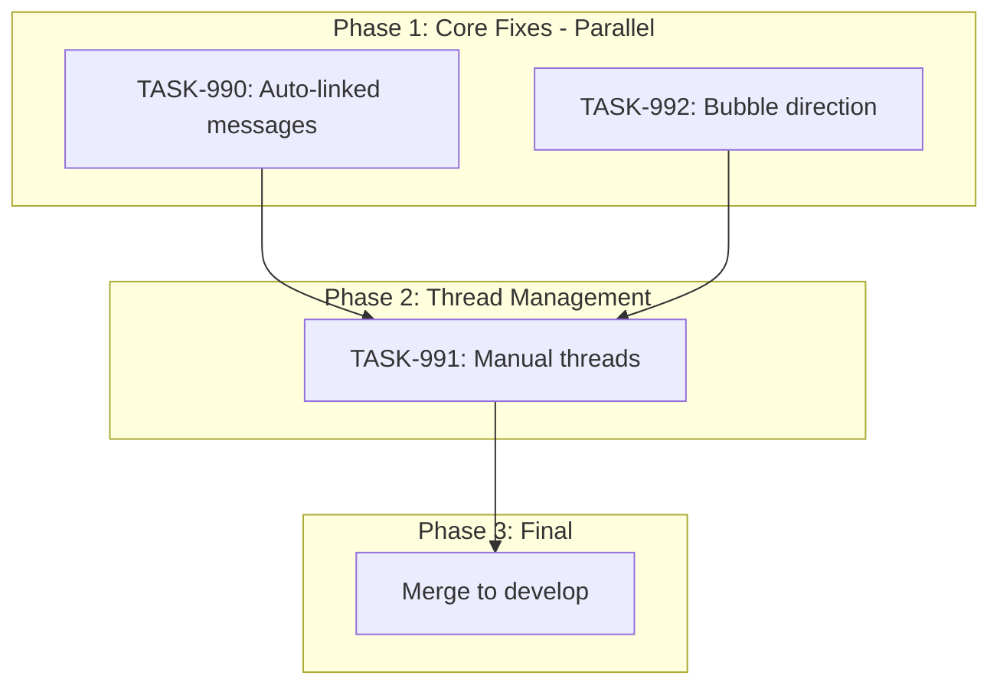

# Sprint Plan: SPRINT-027 - Messages & Contacts Polish

## Sprint Goal

Complete the Messages feature by fixing auto-linked message display, finishing manual thread attachment functionality, and correcting message bubble direction to create a polished, phone-style messaging experience within Transaction Details.

## Prerequisites / Environment Setup

Before starting sprint work, engineers must:
- [ ] `git checkout feature/contact-first-attach-messages && git pull origin feature/contact-first-attach-messages`
- [ ] `npm install`
- [ ] `npm rebuild better-sqlite3-multiple-ciphers`
- [ ] `npx electron-rebuild`
- [ ] Verify app starts: `npm run dev`
- [ ] Verify tests pass: `npm test`

**Note**: This sprint branches from `feature/contact-first-attach-messages` to build on PR #353's work.

## In Scope

- **TASK-990**: Auto-linked messages display - Messages auto-linked via contact phone matching should appear in Transaction Details Messages tab
- **TASK-991**: Manual thread management - Complete and test AttachMessagesModal for manually adding/removing message threads
- **TASK-992**: Message bubble direction fix - Outgoing messages should appear on right side (phone-style), not all on left

## Out of Scope / Deferred

- BACKLOG-175: Missing recent messages investigation - Requires sync debugging, separate sprint
- BACKLOG-176: Import progress display improvements - UX polish, not core functionality
- BACKLOG-177: Dashboard import status cleanup - UX polish, not core functionality
- Email attachment/unlinking UI changes - Future enhancement

## Reprioritized Backlog (Top 3)

| ID | Title | Priority | Rationale | Dependencies | Conflicts |
|----|-------|----------|-----------|--------------|-----------|
| TASK-990 | Auto-linked messages display | 1 | Core bug: auto-linked messages invisible | None | None |
| TASK-991 | Manual thread management | 2 | Completes attach/unlink workflow | TASK-990 (parallel ok) | None |
| TASK-992 | Message bubble direction | 3 | Visual polish, simpler fix | None | None |

## Phase Plan

### Phase 1: Core Fixes (Parallelizable)

- TASK-990: Auto-linked messages display (~25K tokens)
- TASK-992: Message bubble direction fix (~10K tokens)

**Rationale for parallel**: Different files, no shared code paths.
- TASK-990: modifies `useTransactionMessages.ts`, `transactionService.ts`, database layer
- TASK-992: modifies `MessageBubble.tsx`, `TransactionMessagesTab.tsx` only

**Integration checkpoint**: Both tasks merge to `feature/contact-first-attach-messages`, CI must pass.

### Phase 2: Thread Management (Sequential)

- TASK-991: Manual thread management (~30K tokens) - Depends on Phase 1 for stable message display

**Integration checkpoint**: Merge to `feature/contact-first-attach-messages`, CI must pass.

### Phase 3: Final Integration

- Merge `feature/contact-first-attach-messages` to `develop` (after all tasks pass)
- Close PR #353

## Merge Plan

- **Base branch**: `feature/contact-first-attach-messages`
- **Target branch**: `develop` (final merge)
- **Feature branch format**: `fix/<TASK-ID>-<slug>`
- **Merge order** (explicit):
  1. TASK-990 -> feature/contact-first-attach-messages
  2. TASK-992 -> feature/contact-first-attach-messages
  3. TASK-991 -> feature/contact-first-attach-messages (after Phase 1)
  4. feature/contact-first-attach-messages -> develop (final)

## Dependency Graph (Mermaid)



## Dependency Graph (YAML)

```yaml
dependency_graph:
  nodes:
    - id: TASK-990
      type: task
      phase: 1
      parallel_with: [TASK-992]
    - id: TASK-992
      type: task
      phase: 1
      parallel_with: [TASK-990]
    - id: TASK-991
      type: task
      phase: 2
      depends_on: [TASK-990, TASK-992]
  edges:
    - from: TASK-990
      to: TASK-991
      type: depends_on
    - from: TASK-992
      to: TASK-991
      type: depends_on
```

## Testing & Quality Plan (REQUIRED)

### Unit Testing

- New tests required for:
  - `useTransactionMessages.ts` - verify it fetches auto-linked messages
  - Message bubble direction tests (may already exist)

- Existing tests to update:
  - `AttachMessagesModal.test.tsx` - verify link/unlink flows
  - `TransactionMessagesTab.test.tsx` - verify display logic

### Coverage Expectations

- Coverage rules:
  - No regression from current levels
  - New code in hooks/services must have test coverage

### Integration / Feature Testing

- Required scenarios:
  1. Open Transaction Details -> Messages tab shows auto-linked messages
  2. Attach Messages modal -> select thread -> attach -> appears in tab
  3. Unlink thread -> removed from Messages tab
  4. Outgoing messages display on right side of conversation
  5. Incoming messages display on left side of conversation

### CI / CD Quality Gates

The following MUST pass before merge:
- [ ] Unit tests (`npm test`)
- [ ] TypeScript type checking (`npm run type-check`)
- [ ] ESLint linting (`npm run lint`)
- [ ] Build step (`npm run build`)

### Backend Changes

- Behaviors preserved:
  - `getCommunicationsByTransaction` continues to work for emails
  - Auto-linking via `messageMatchingService` unchanged

- New behaviors:
  - `useTransactionMessages` fetches from both `communications` AND `messages` table

## Risk Register

| Risk | Likelihood | Impact | Mitigation |
|------|------------|--------|------------|
| Messages table schema differs from communications | Low | Medium | Query both tables, normalize in service layer |
| Auto-linked messages lack required fields | Medium | Medium | Join with messages table to get full data |
| Performance with large message sets | Low | Medium | Already addressed by contact-first modal (PR #353) |
| Bubble direction logic conflicts with viewer | Low | Low | Viewer in AttachMessagesModal already works correctly |

## Decision Log

### Decision: Branch from feature/contact-first-attach-messages

- **Date**: 2026-01-05
- **Context**: PR #353 has significant messaging work that isn't merged yet
- **Decision**: Branch sprint work from the feature branch, not develop
- **Rationale**: Avoids duplicating work and ensures consistency
- **Impact**: Sprint must complete and merge before other messaging work

### Decision: Query both messages and communications tables

- **Date**: 2026-01-05
- **Context**: Auto-linked messages exist in both `messages.transaction_id` and `communications` table
- **Decision**: Update `useTransactionMessages` to fetch from both sources
- **Rationale**: Ensures all linked messages display regardless of linking method
- **Impact**: TASK-990 implementation

## Unplanned Work Log

**Instructions:** Update this section AS unplanned work is discovered during the sprint. Do NOT wait until sprint review.

| Task | Source | Root Cause | Added Date | Est. Tokens | Actual Tokens |
|------|--------|------------|------------|-------------|---------------|
| - | - | - | - | - | - |

### Unplanned Work Summary (Updated at Sprint Close)

| Metric | Value |
|--------|-------|
| Unplanned tasks | 0 |
| Unplanned PRs | 0 |
| Unplanned lines changed | +0/-0 |
| Unplanned tokens (est) | 0 |
| Unplanned tokens (actual) | 0 |
| Discovery buffer | 0% |

### Root Cause Categories

| Category | Count | Examples |
|----------|-------|----------|
| Integration gaps | 0 | State machine not wired |
| Validation discoveries | 0 | Edge case found during testing |
| Review findings | 0 | SR Engineer identified issue |
| Dependency discoveries | 0 | Task X requires Task Y first |
| Scope expansion | 0 | Feature needs more edge cases |

## Token Estimates Summary

| Task | Category | Base Est. | Multiplier | Final Est. |
|------|----------|-----------|------------|------------|
| TASK-990 | service | ~30K | 0.5x | ~15K |
| TASK-991 | ui | ~30K | 1.0x | ~30K |
| TASK-992 | ui | ~10K | 1.0x | ~10K |
| **Total** | | | | **~55K** |

Add SR Review overhead: +30K (3 tasks x ~10K each)

**Total Sprint Estimate: ~85K tokens**

## End-of-Sprint Validation Checklist

- [ ] All tasks merged to feature/contact-first-attach-messages
- [ ] All CI checks passing
- [ ] All acceptance criteria verified
- [ ] Testing requirements met
- [ ] No unresolved conflicts
- [ ] feature/contact-first-attach-messages merged to develop
- [ ] PR #353 closed
- [ ] Documentation updated (if applicable)

## Worktree Cleanup (Post-Sprint)

If parallel execution used git worktrees, clean them up after all PRs merge:

```bash
# List current worktrees
git worktree list

# Remove sprint worktrees (adjust names as needed)
git worktree remove Mad-task-990 --force
git worktree remove Mad-task-992 --force

# Verify cleanup
git worktree list
```

**Note:** Orphaned worktrees consume disk space and clutter IDE file browsers.
