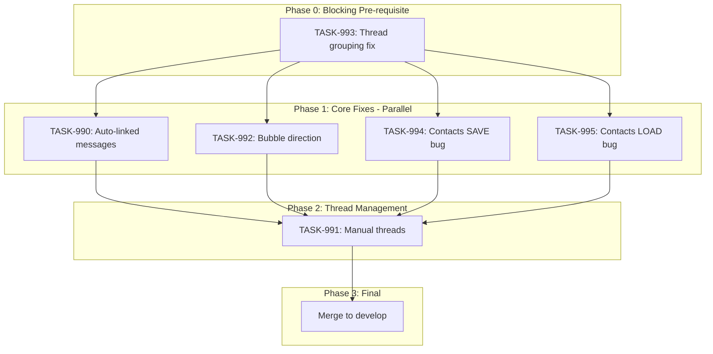

# Sprint Plan: SPRINT-027 - Messages & Contacts Polish

## Sprint Goal

Complete the Messages feature by fixing auto-linked message display, finishing manual thread attachment functionality, and correcting message bubble direction to create a polished, phone-style messaging experience within Transaction Details.

## Current Task Assignment: TASK-993 (BLOCKING)

**Status**: Ready for Engineer Assignment
**Date**: 2026-01-05

### Assignment Message for Engineer

```
## Task Assignment: TASK-993

**Title:** Fix Thread Grouping by Participants
**Sprint:** SPRINT-027
**Execution:** Sequential (BLOCKING - must complete before Phase 1)
**Priority:** 0 (Highest)

### Branch Information
**Branch From:** feature/contact-first-attach-messages
**Branch Into:** feature/contact-first-attach-messages
**Branch Name:** fix/TASK-993-thread-grouping

**Estimated Tokens:** ~15K

### Before Starting
Read the task file: `.claude/plans/tasks/TASK-993-fix-thread-grouping-by-participants.md`

### Core Problem
Messages should group by iMessage chat_id (thread_id), but currently cluster into single thread.
Investigation needed:
1. Check if thread_id is populated in messages table
2. Check if getMessagesByContact query returns thread_id
3. Fix the query/types/grouping logic

### Workflow Reminder
1. Create branch from feature/contact-first-attach-messages
2. Record your Agent ID immediately
3. Debug and fix the issue
4. Complete task file Implementation Summary
5. Create PR with Agent ID noted
6. Request SR Engineer review

**Full workflow:** `.claude/docs/ENGINEER-WORKFLOW.md`
```

---

## Prerequisites / Environment Setup

Before starting sprint work, engineers must:
- [ ] `git checkout feature/contact-first-attach-messages && git pull origin feature/contact-first-attach-messages`
- [ ] `npm install`
- [ ] `npm rebuild better-sqlite3-multiple-ciphers`
- [ ] `npx electron-rebuild`
- [ ] Verify app starts: `npm run dev`
- [ ] Verify tests pass: `npm test`

**Note**: This sprint branches from `feature/contact-first-attach-messages` to build on PR #353's work.

## In Scope

- **TASK-990**: Auto-linked messages display - Messages auto-linked via contact phone matching should appear in Transaction Details Messages tab
- **TASK-991**: Manual thread management - Complete and test AttachMessagesModal for manually adding/removing message threads
- **TASK-992**: Message bubble direction fix - Outgoing messages should appear on right side (phone-style), not all on left
- **TASK-993**: Thread grouping fix - Group messages by actual iMessage chat_id (BLOCKING - must complete first)
- **TASK-994**: Multiple contacts per role bug - When assigning multiple contacts to a role, only one saves (SAVE path)
- **TASK-995**: Contacts not pre-populated when editing - Existing contacts don't pre-populate in edit modal (LOAD path)

## Out of Scope / Deferred

- BACKLOG-175: Missing recent messages investigation - Requires sync debugging, separate sprint
- BACKLOG-176: Import progress display improvements - UX polish, not core functionality
- BACKLOG-177: Dashboard import status cleanup - UX polish, not core functionality
- Email attachment/unlinking UI changes - Future enhancement

## Reprioritized Backlog

| ID | Title | Priority | Status | Rationale | Dependencies |
|----|-------|----------|--------|-----------|--------------|
| TASK-993 | Thread grouping fix | 0 | **IN PROGRESS** | Blocking: threads must group correctly | None |
| TASK-990 | Auto-linked messages display | 1 | Pending | Core bug: auto-linked messages invisible | TASK-993 |
| TASK-991 | Manual thread management | 2 | Pending | Completes attach/unlink workflow | TASK-990 |
| TASK-992 | Message bubble direction | 3 | Pending | Visual polish, simpler fix | None |
| TASK-994 | Multiple contacts per role (SAVE) | 4 | Pending | Bug: only one contact saves | None |
| TASK-995 | Contacts not pre-populated (LOAD) | 5 | Pending | Bug: contacts don't pre-populate in edit | None |

## Phase Plan

### Phase 0: Pre-requisite (IN PROGRESS)

- TASK-993: Thread grouping fix - Group messages by iMessage chat_id (needs debugging)

### Phase 1: Core Fixes (Parallelizable)

- TASK-990: Auto-linked messages display (~25K tokens) - Use "Option C" hybrid query
- TASK-992: Message bubble direction fix (~10K tokens)
- TASK-994: Multiple contacts per role bug (~12K tokens) - SAVE path fix
- TASK-995: Contacts not pre-populated (~25K tokens) - LOAD path fix

**Rationale for parallel**: Different files, no shared code paths.
- TASK-990: modifies `useTransactionMessages.ts`, `transactionService.ts`, database layer
- TASK-992: modifies `MessageBubble.tsx`, `TransactionMessagesTab.tsx` only
- TASK-994: modifies Edit Transaction modal SAVE handler / form submission
- TASK-995: modifies Edit Transaction modal LOAD/initialization logic

**Note on TASK-994 vs TASK-995**: Both touch `EditTransactionModal` but in different code paths:
- TASK-994: `handleSave()` / form submission
- TASK-995: Modal initialization / `useEffect` for loading data
- Safe for parallel execution, but suggest same engineer handles both for context

**Integration checkpoint**: All tasks merge to `feature/contact-first-attach-messages`, CI must pass.

### Phase 2: Thread Management (Sequential)

- TASK-991: Manual thread management (~30K tokens) - Depends on Phase 1 for stable message display

**Integration checkpoint**: Merge to `feature/contact-first-attach-messages`, CI must pass.

### Phase 3: Final Integration

- Merge `feature/contact-first-attach-messages` to `develop` (after all tasks pass)
- Close PR #353

## Merge Plan

- **Base branch**: `feature/contact-first-attach-messages`
- **Target branch**: `develop` (final merge)
- **Feature branch format**: `fix/<TASK-ID>-<slug>`
- **Merge order** (explicit):
  1. TASK-993 -> feature/contact-first-attach-messages (blocking, must be first)
  2. Phase 1 (parallel):
     - TASK-990 -> feature/contact-first-attach-messages
     - TASK-992 -> feature/contact-first-attach-messages
     - TASK-994 -> feature/contact-first-attach-messages
     - TASK-995 -> feature/contact-first-attach-messages
  3. TASK-991 -> feature/contact-first-attach-messages (Phase 2, after Phase 1)
  4. feature/contact-first-attach-messages -> develop (final)

## Execution Strategy

### Base Branch

All sprint work branches from: `feature/contact-first-attach-messages` (not `develop`)

This is PR #353 which contains the contact-first attach messages work that these fixes build upon.

### Branch Names

| Task | Branch Name | Notes |
|------|-------------|-------|
| TASK-993 | `fix/TASK-993-thread-grouping` | Phase 0, blocking |
| TASK-990 | `fix/TASK-990-auto-linked-messages` | Phase 1, parallel |
| TASK-992 | `fix/TASK-992-bubble-direction` | Phase 1, parallel |
| TASK-994 | `fix/TASK-994-contacts-save-bug` | Phase 1, parallel |
| TASK-995 | `fix/TASK-995-contacts-load-bug` | Phase 1, parallel |
| TASK-991 | `fix/TASK-991-manual-threads` | Phase 2, sequential |

### Worktree Strategy for Phase 1 Parallel Tasks

**Recommendation: YES, use git worktrees for Phase 1 parallel execution.**

When running multiple engineer agents in parallel (background mode), each agent MUST use an isolated git worktree to prevent race conditions.

**Setup commands for Phase 1:**

```bash
# From main repo directory (/Users/daniel/Documents/Mad)
# First, ensure feature branch is up to date
git fetch origin feature/contact-first-attach-messages

# Create worktrees for each Phase 1 task (after TASK-993 completes)
git worktree add ../Mad-task-990 -b fix/TASK-990-auto-linked-messages feature/contact-first-attach-messages
git worktree add ../Mad-task-992 -b fix/TASK-992-bubble-direction feature/contact-first-attach-messages
git worktree add ../Mad-task-994 -b fix/TASK-994-contacts-save-bug feature/contact-first-attach-messages
git worktree add ../Mad-task-995 -b fix/TASK-995-contacts-load-bug feature/contact-first-attach-messages

# Each engineer session gets its own worktree path:
# - TASK-990: /Users/daniel/Documents/Mad-task-990
# - TASK-992: /Users/daniel/Documents/Mad-task-992
# - TASK-994: /Users/daniel/Documents/Mad-task-994
# - TASK-995: /Users/daniel/Documents/Mad-task-995
```

**Why worktrees are required:**
- Per BACKLOG-132: ~18M tokens burned when parallel agents shared same directory
- Each worktree has isolated filesystem preventing race conditions
- Branches don't conflict until merge (handled by SR Engineer)

**Alternative for TASK-994/995 (same engineer):**
If same engineer handles both TASK-994 and TASK-995 sequentially:
- Only need one worktree for that pair
- Complete TASK-994, push, then work on TASK-995 in same worktree

## Dependency Graph (Mermaid)



## Dependency Graph (YAML)

```yaml
dependency_graph:
  nodes:
    - id: TASK-993
      type: task
      phase: 0
      blocking: true
      parallel_with: []
    - id: TASK-990
      type: task
      phase: 1
      parallel_with: [TASK-992, TASK-994, TASK-995]
      depends_on: [TASK-993]
    - id: TASK-992
      type: task
      phase: 1
      parallel_with: [TASK-990, TASK-994, TASK-995]
      depends_on: [TASK-993]
    - id: TASK-994
      type: task
      phase: 1
      parallel_with: [TASK-990, TASK-992, TASK-995]
      depends_on: [TASK-993]
    - id: TASK-995
      type: task
      phase: 1
      parallel_with: [TASK-990, TASK-992, TASK-994]
      depends_on: [TASK-993]
    - id: TASK-991
      type: task
      phase: 2
      depends_on: [TASK-990, TASK-992, TASK-994, TASK-995]
  edges:
    - from: TASK-993
      to: TASK-990
      type: blocks
    - from: TASK-993
      to: TASK-992
      type: blocks
    - from: TASK-993
      to: TASK-994
      type: blocks
    - from: TASK-993
      to: TASK-995
      type: blocks
    - from: TASK-990
      to: TASK-991
      type: depends_on
    - from: TASK-992
      to: TASK-991
      type: depends_on
    - from: TASK-994
      to: TASK-991
      type: depends_on
    - from: TASK-995
      to: TASK-991
      type: depends_on
```

## Testing & Quality Plan (REQUIRED)

### Unit Testing

- New tests required for:
  - `useTransactionMessages.ts` - verify it fetches auto-linked messages
  - Message bubble direction tests (may already exist)

- Existing tests to update:
  - `AttachMessagesModal.test.tsx` - verify link/unlink flows
  - `TransactionMessagesTab.test.tsx` - verify display logic

### Coverage Expectations

- Coverage rules:
  - No regression from current levels
  - New code in hooks/services must have test coverage

### Integration / Feature Testing

- Required scenarios:
  1. Open Transaction Details -> Messages tab shows auto-linked messages
  2. Attach Messages modal -> select thread -> attach -> appears in tab
  3. Unlink thread -> removed from Messages tab
  4. Outgoing messages display on right side of conversation
  5. Incoming messages display on left side of conversation

### CI / CD Quality Gates

The following MUST pass before merge:
- [ ] Unit tests (`npm test`)
- [ ] TypeScript type checking (`npm run type-check`)
- [ ] ESLint linting (`npm run lint`)
- [ ] Build step (`npm run build`)

### Backend Changes

- Behaviors preserved:
  - `getCommunicationsByTransaction` continues to work for emails
  - Auto-linking via `messageMatchingService` unchanged

- New behaviors:
  - `useTransactionMessages` fetches from both `communications` AND `messages` table

## Risk Register

| Risk | Likelihood | Impact | Mitigation |
|------|------------|--------|------------|
| Messages table schema differs from communications | Low | Medium | Query both tables, normalize in service layer |
| Auto-linked messages lack required fields | Medium | Medium | Join with messages table to get full data |
| Performance with large message sets | Low | Medium | Already addressed by contact-first modal (PR #353) |
| Bubble direction logic conflicts with viewer | Low | Low | Viewer in AttachMessagesModal already works correctly |

## Decision Log

### Decision: Branch from feature/contact-first-attach-messages

- **Date**: 2026-01-05
- **Context**: PR #353 has significant messaging work that isn't merged yet
- **Decision**: Branch sprint work from the feature branch, not develop
- **Rationale**: Avoids duplicating work and ensures consistency
- **Impact**: Sprint must complete and merge before other messaging work

### Decision: Query both messages and communications tables

- **Date**: 2026-01-05
- **Context**: Auto-linked messages exist in both `messages.transaction_id` and `communications` table
- **Decision**: Update `useTransactionMessages` to fetch from both sources
- **Rationale**: Ensures all linked messages display regardless of linking method
- **Impact**: TASK-990 implementation

### Decision: Add BACKLOG-171 to sprint as TASK-995

- **Date**: 2026-01-05
- **Context**: BACKLOG-171 (contacts not pre-populated when editing) is a LOAD path bug, while TASK-994 is a SAVE path bug. Both affect EditTransactionModal but different code paths.
- **Decision**: Add BACKLOG-171 as TASK-995 in Phase 1
- **Rationale**:
  - Related to TASK-994 (same modal, different bug)
  - Affects same user workflow (editing transactions)
  - Safe for parallel execution (different code paths)
  - Resolves complete edit workflow in one sprint
- **Impact**:
  - Sprint scope increased from 5 to 6 tasks
  - Token estimate increased by ~25K (now ~177K total)
  - Suggest same engineer handles TASK-994 and TASK-995 for context

## Unplanned Work Log

**Instructions:** Update this section AS unplanned work is discovered during the sprint. Do NOT wait until sprint review.

| Task | Source | Root Cause | Added Date | Est. Tokens | Actual Tokens |
|------|--------|------------|------------|-------------|---------------|
| - | - | - | - | - | - |

### Unplanned Work Summary (Updated at Sprint Close)

| Metric | Value |
|--------|-------|
| Unplanned tasks | 0 |
| Unplanned PRs | 0 |
| Unplanned lines changed | +0/-0 |
| Unplanned tokens (est) | 0 |
| Unplanned tokens (actual) | 0 |
| Discovery buffer | 0% |

### Root Cause Categories

| Category | Count | Examples |
|----------|-------|----------|
| Integration gaps | 0 | State machine not wired |
| Validation discoveries | 0 | Edge case found during testing |
| Review findings | 0 | SR Engineer identified issue |
| Dependency discoveries | 0 | Task X requires Task Y first |
| Scope expansion | 0 | Feature needs more edge cases |

## Token Estimates Summary

| Task | Category | Base Est. | Multiplier | Final Est. | Status |
|------|----------|-----------|------------|------------|--------|
| TASK-993 | service | ~15K | 1.0x | ~15K | In Progress (Phase 0) |
| TASK-990 | service | ~25K | 1.0x | ~25K | Pending (Phase 1) |
| TASK-991 | ui | ~30K | 1.0x | ~30K | Pending (Phase 2) |
| TASK-992 | ui | ~10K | 1.0x | ~10K | Pending (Phase 1) |
| TASK-994 | ui | ~12K | 1.0x | ~12K | Pending (Phase 1) |
| TASK-995 | ui | ~25K | 1.0x | ~25K | Pending (Phase 1) |
| **Total** | | | | **~117K** | |

Add SR Review overhead: +60K (6 tasks x ~10K each)

**Total Sprint Estimate: ~177K tokens**

## End-of-Sprint Validation Checklist

- [ ] All tasks merged to feature/contact-first-attach-messages
- [ ] All CI checks passing
- [ ] All acceptance criteria verified
- [ ] Testing requirements met
- [ ] No unresolved conflicts
- [ ] feature/contact-first-attach-messages merged to develop
- [ ] PR #353 closed
- [ ] Documentation updated (if applicable)

## Worktree Cleanup (Post-Sprint)

If parallel execution used git worktrees, clean them up after all PRs merge:

```bash
# List current worktrees
git worktree list

# Remove sprint worktrees (adjust names as needed)
git worktree remove Mad-task-990 --force
git worktree remove Mad-task-992 --force

# Verify cleanup
git worktree list
```

**Note:** Orphaned worktrees consume disk space and clutter IDE file browsers.
