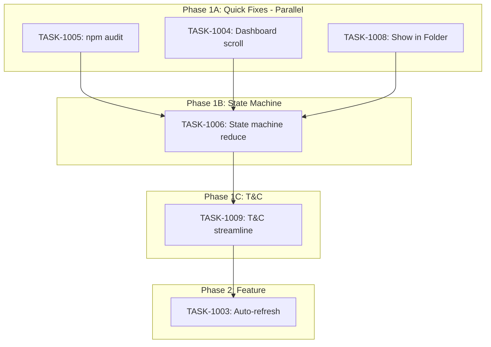

# Sprint Plan: SPRINT-028 - Stability & UX Polish

## Sprint Goal

Improve application stability, UX polish, and developer hygiene with bug fixes, architecture cleanup, and quality-of-life enhancements.

## Sprint Status: COMPLETE

**Created:** 2026-01-10
**Started:** 2026-01-10
**Completed:** 2026-01-10
**Target Branch:** develop
**Estimated Duration:** 3-4 days
**Actual Duration:** 1 day
**Total Estimated Tokens:** ~140K (with SR review overhead + buffer)

---

## Context

### Recent Sprint History

| Sprint | Status | Focus | Outcome |
|--------|--------|-------|---------|
| SPRINT-027 | Complete | Messages & Contacts Polish | 6 planned + 21 unplanned tasks, ~360K tokens |
| SPRINT-026 | Partially Complete | UI Polish & Agent Safety | Many items completed via PRs |
| SPRINT-024 | Partially Complete | Quality & Coverage | Auth test fix merged |

### Items Already Fixed (Not in Sprint)

| Item | PR/Status | Notes |
|------|-----------|-------|
| BACKLOG-157 (Auth Handler Test) | PR #321 | Already merged |
| BACKLOG-165 (Duplicate Contacts) | PR #346 | Already merged |
| BACKLOG-166 (Platform Detection) | PR #344 | Already merged |
| BACKLOG-167 (Status Options) | Already implemented | `hasManualTransactions` filtering exists |
| Worktree Cleanup | Not needed | No orphaned worktrees |

---

## Prerequisites / Environment Setup

Before starting sprint work, engineers must:
- [x] `git checkout develop && git pull origin develop`
- [x] `npm install`
- [x] `npm rebuild better-sqlite3-multiple-ciphers`
- [x] `npx electron-rebuild`
- [x] Verify app starts: `npm run dev`
- [x] Verify tests pass: `npm test`

---

## In Scope

| Task | Backlog | Title | Est. Tokens | Phase |
|------|---------|-------|-------------|-------|
| TASK-1005 | - | npm audit fix (security) | ~2K | 1A |
| TASK-1004 | BACKLOG-155 | Dashboard scroll fix | ~10K | 1A |
| TASK-1008 | BACKLOG-169 | Show in Folder button after export | ~5K | 1A |
| TASK-1006 | BACKLOG-150 | Reduce useAppStateMachine.ts | ~10K | 1B |
| TASK-1009 | BACKLOG-181 | Streamline T&C onboarding step | ~15K | 1C |
| TASK-1003 | BACKLOG-156 | Auto-refresh data sources on app load | ~40K | 2 |

**Total Estimated (implementation):** ~82K tokens
**SR Review Overhead:** +38K (6 tasks)
**Buffer (10%):** ~12K
**Grand Total:** ~140K tokens

---

## Removed from Sprint (Pre-Start Verification)

| Task | Reason |
|------|--------|
| TASK-1010 (Housekeeping) | No orphaned worktrees exist |
| TASK-1007 (Status Options) | Already implemented in BulkActionBar.tsx |

---

## Phase Plan

### Phase 1A: Quick Fixes (Parallel - No File Overlap)

These 3 tasks touch completely separate file sets and can run in parallel.

```
TASK-1005: npm audit fix ────────────────┐
TASK-1004: Dashboard scroll fix ─────────┼─── All parallel
TASK-1008: Show in Folder button ────────┘
```

**File Sets (verified no overlap):**

| Task | Files |
|------|-------|
| TASK-1005 | `package.json`, `package-lock.json` |
| TASK-1004 | `src/components/Dashboard/`, `AppShell.tsx`, CSS |
| TASK-1008 | `system-handlers.ts`, `systemBridge.ts`, `ExportModal.tsx` |

**Worktree Setup (for parallel execution):**
```bash
git worktree add ../Mad-task-1004 -b fix/TASK-1004-dashboard-scroll develop
git worktree add ../Mad-task-1005 -b fix/TASK-1005-npm-audit develop
git worktree add ../Mad-task-1008 -b feature/TASK-1008-show-in-folder develop
```

---

### Phase 1B: State Machine Refactor (Sequential - After 1A)

```
TASK-1006: Reduce useAppStateMachine.ts
```

**Must complete after Phase 1A** because:
- State machine is imported by many components
- Refactor must be isolated to prevent merge conflicts

**Files:**
- `src/appCore/state/useAppStateMachine.ts`
- Possibly new `src/appCore/state/returnHelpers.ts`

---

### Phase 1C: T&C Streamline (Sequential - After 1B)

```
TASK-1009: Streamline T&C onboarding step
```

**Must complete after Phase 1B** because:
- `WelcomeTerms.tsx` uses state machine APIs for terms acceptance
- If TASK-1006 changes the return structure, TASK-1009 needs to work with the final API

**Files:**
- `src/components/WelcomeTerms.tsx`
- `src/components/onboarding/` (possibly)

---

### Phase 2: Feature Enhancement (After All Phase 1)

```
TASK-1003: Auto-refresh data sources on app load
```

**Depends on:** All Phase 1 tasks merged (clean, stable foundation)

**Files:**
- `src/appCore/state/` (state machine integration)
- `electron/services/` (sync services)
- Dashboard components (progress indicator)

---

## Dependency Graph



---

## Execution Timeline

| Step | Tasks | Mode | Depends On |
|------|-------|------|------------|
| 1 | TASK-1005, 1004, 1008 | Parallel (3 agents) | - |
| 2 | TASK-1006 | Sequential | Step 1 complete |
| 3 | TASK-1009 | Sequential | Step 2 complete |
| 4 | TASK-1003 | Sequential | Step 3 complete |

---

## Token Estimates Summary

| Task | Category | Base Est. | SR Overhead | Total |
|------|----------|-----------|-------------|-------|
| TASK-1005 | security | ~2K | +5K | ~7K |
| TASK-1004 | fix/ui | ~10K | +8K | ~18K |
| TASK-1008 | feature | ~5K | +5K | ~10K |
| TASK-1006 | refactor | ~10K | +8K | ~18K |
| TASK-1009 | fix/ux | ~15K | +8K | ~23K |
| TASK-1003 | service | ~40K | +15K | ~55K |
| **Total** | | **~82K** | **+49K** | **~131K** |

**Buffer (10%):** ~13K
**Grand Total with Buffer:** ~144K tokens

---

## Progress Tracking

| Task | Phase | Status | Agent ID | Tokens | Duration | PR |
|------|-------|--------|----------|--------|----------|-----|
| TASK-1005 | 1A | Complete | - | ~5K | - | #364 |
| TASK-1004 | 1A | Complete | - | ~8K | - | #365 |
| TASK-1008 | 1A | Complete | - | ~10K | - | #366 |
| TASK-1006 | 1B | Complete | - | ~15K | - | #367 |
| TASK-1009 | 1C | Complete | - | ~12K | - | #368 |
| TASK-1003 | 2 | Complete | abbd1c7 | ~35K | - | #369 |

---

## Success Criteria

1. **Security:** No high-severity npm vulnerabilities
2. **Architecture:** useAppStateMachine.ts under 400 lines
3. **UX Polish:** Dashboard scroll fixed, T&C streamlined
4. **Feature:** Show in Folder works
5. **Daily UX:** Auto-refresh works on app load
6. **Quality:** All tests passing

---

## End-of-Sprint Validation Checklist

- [x] All tasks merged to develop
- [x] All CI checks passing
- [x] All acceptance criteria verified
- [x] Testing requirements met
- [x] No unresolved conflicts
- [x] Documentation updated (sprint plan, backlog INDEX)

---

## Unplanned Work Log

| Task | Source | Root Cause | Added Date | Est. Tokens | Actual Tokens |
|------|--------|------------|------------|-------------|---------------|
| - | - | - | - | - | - |
