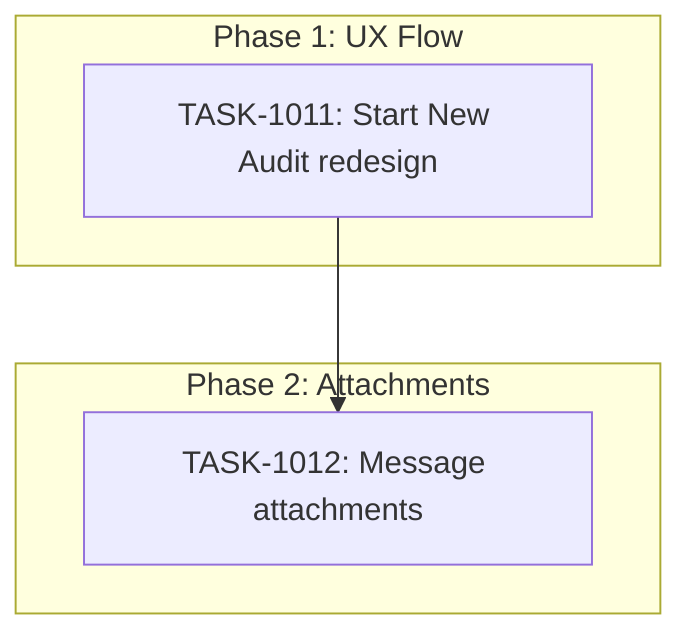

# Sprint Plan: SPRINT-029 - UX Improvements & Message Attachments

## Sprint Goal

Improve user experience with redesigned "Start New Audit" flow and add message attachment support for audit completeness.

## Sprint Status: IN PROGRESS

**Created:** 2026-01-10
**Started:** 2026-01-10
**Target Branch:** develop
**Estimated Duration:** 3-4 days
**Total Estimated Tokens:** ~90K (with SR review overhead + buffer)

---

## Context

### Recent Sprint History

| Sprint | Status | Focus | Outcome |
|--------|--------|-------|---------|
| SPRINT-028 | Complete | Stability & UX Polish | 6 tasks, message parser fix, sync UI redesign |
| SPRINT-027 | Complete | Messages & Contacts Polish | Thread-based display, manual attach |

### Session Fixes (Already on develop)

These items were fixed during the SPRINT-028 session:
- Message text truncation (parser fix)
- Auto-refresh once per session
- Settings "coming soon" reordering  
- Sync status priority fix
- Sync status UI with all 3 types (Emails/Messages/Contacts)
- Clickable export file path

---

## In Scope

| Task | Backlog | Title | Est. Tokens | Phase |
|------|---------|-------|-------------|-------|
| TASK-1011 | BACKLOG-174 | Redesign "Start New Audit" flow | ~30K | 1 |
| TASK-1012 | BACKLOG-187 | Message attachments (images/GIFs) | ~50K | 2 |

**Total Estimated (implementation):** ~80K tokens
**SR Review Overhead:** +16K (2 tasks)
**Buffer (10%):** ~10K
**Grand Total:** ~106K tokens

---

## Phase Plan

### Phase 1: UX Flow Redesign

```
TASK-1011: Redesign "Start New Audit" flow
```

**Goal:** When user clicks "Start New Audit":
1. Show pending/AI-detected transactions first
2. Provide "View Active Transactions" option
3. Offer manual creation as secondary option

**Files:**
- `src/components/Dashboard.tsx` or new routing
- May reuse `PendingTransactionsSection` component
- State management updates

---

### Phase 2: Message Attachments

```
TASK-1012: Display attachments in text messages
```

**Goal:** Import and display images/GIFs from text messages

**Implementation:**
1. Query macOS Messages `attachment` table
2. Copy files to app storage
3. Display inline in message bubbles
4. Handle missing attachments gracefully

**Files:**
- `electron/services/macOSMessagesImportService.ts`
- `src/components/transactionDetailsModule/components/modals/ConversationViewModal.tsx`
- New attachment storage service
- Database schema update for attachment metadata

---

## Dependency Graph



---

## Prerequisites / Environment Setup

Before starting sprint work, engineers must:
- [ ] `git checkout develop && git pull origin develop`
- [ ] `npm install`
- [ ] `npm rebuild better-sqlite3-multiple-ciphers`
- [ ] `npx electron-rebuild`
- [ ] Verify app starts: `npm run dev`
- [ ] Verify tests pass: `npm test`

---

## Progress Tracking

| Task | Phase | Status | Agent ID | Tokens | Duration | PR |
|------|-------|--------|----------|--------|----------|-----|
| TASK-1011 | 1 | Not Started | - | - | - | - |
| TASK-1012 | 2 | Not Started | - | - | - | - |

---

## Success Criteria

1. **UX:** "Start New Audit" shows pending transactions first
2. **UX:** Manual entry available as secondary option
3. **Feature:** Images/GIFs display inline in message threads
4. **Feature:** Attachments imported from macOS Messages
5. **Quality:** All tests passing

---

## End-of-Sprint Validation Checklist

- [ ] All tasks merged to develop
- [ ] All CI checks passing
- [ ] All acceptance criteria verified
- [ ] Testing requirements met
- [ ] No unresolved conflicts
- [ ] Documentation updated (sprint plan, backlog INDEX)

---

## Unplanned Work Log

| Task | Source | Root Cause | Added Date | Est. Tokens | Actual Tokens |
|------|--------|------------|------------|-------------|---------------|
| - | - | - | - | - | - |
