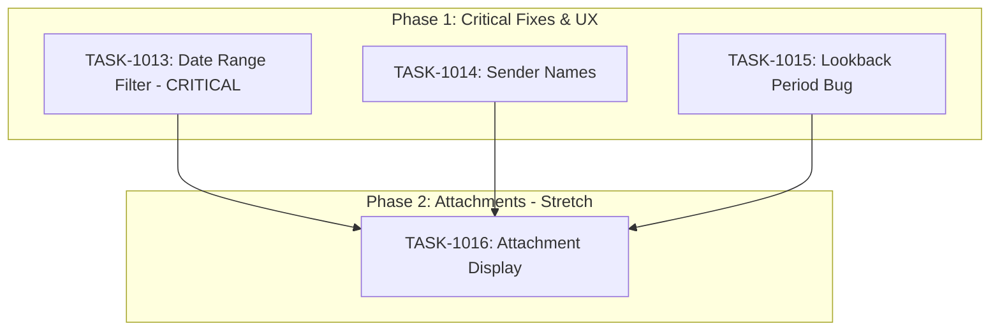

# Sprint Plan: SPRINT-030 - Message & Transaction UX Improvements

## Sprint Goal

Fix critical app freeze when adding contacts with extensive message history, improve group chat UX, and address message-related bugs and features.

## Sprint Status: PLANNED

**Created:** 2026-01-10
**Target Branch:** develop
**Estimated Duration:** 2-3 days
**Total Estimated Tokens:** ~130K (with SR review overhead + buffer)

---

## Context

### Recent Sprint History

| Sprint | Status | Focus | Outcome |
|--------|--------|-------|---------|
| SPRINT-029 | Complete | UX Improvements | Start new audit redesign, message attachments display |
| SPRINT-028 | Complete | Stability & UX Polish | 6 tasks, message parser fix, sync UI redesign |
| SPRINT-027 | Complete | Messages & Contacts Polish | Thread-based display, manual attach |

### Critical Issue

**BACKLOG-190** is the top priority because the app freezes when users add contacts with extensive message history. The root cause is unbounded message linking - ALL messages from a contact are linked instead of filtering by transaction date range.

---

## In Scope

| Task | Backlog | Title | Est. Tokens | Phase |
|------|---------|-------|-------------|-------|
| TASK-1013 | BACKLOG-190 | Transaction Date Range for Message Linking | ~20K | 1 |
| TASK-1014 | BACKLOG-180 | Show Sender Name on Group Chat Messages | ~25K | 1 |
| TASK-1015 | BACKLOG-188 | Fix Scan Lookback Period Setting Persistence | ~15K | 1 |
| TASK-1016 | BACKLOG-187 | Display Attachments (Images/GIFs) in Messages | ~55K | 2 (stretch) |

**Total Estimated (implementation):** ~115K tokens
**SR Review Overhead:** +20K (4 tasks)
**Buffer (10%):** ~12K
**Grand Total:** ~147K tokens

---

## Out of Scope / Deferred

| Backlog | Title | Reason |
|---------|-------|--------|
| BACKLOG-189 | Configurable Attachment Size Limit | Depends on BACKLOG-187; defer to next sprint |

---

## Phase Plan

### Phase 1: Critical Fixes & UX (Parallel Safe)

```
Phase 1 (Parallel)
├── TASK-1013: Transaction Date Range for Message Linking (CRITICAL)
├── TASK-1014: Show Sender Name on Group Chat Messages
└── TASK-1015: Fix Scan Lookback Period Setting Persistence
```

**Why parallel is safe:**
- TASK-1013 modifies: `AddressVerificationStep.tsx`, `useAuditTransaction.ts`, `messageMatchingService.ts`, `schema.sql`
- TASK-1014 modifies: `MessageBubble.tsx`, `ConversationViewModal.tsx`, `ThreadListItem.tsx`
- TASK-1015 modifies: `Settings.tsx`, `preference-handlers.ts`
- **No shared file conflicts** - each task touches different files

**Integration checkpoint:** All Phase 1 PRs must pass CI before Phase 2

### Phase 2: Attachment Display (Stretch Goal)

```
Phase 2 (Sequential - after Phase 1)
└── TASK-1016: Display Attachments (Images/GIFs) in Messages
```

**Why sequential:**
- Large feature (~50K tokens)
- Requires schema changes
- Touches import service that may be affected by Phase 1 stability

**Note:** This is a stretch goal. If Phase 1 takes longer than expected, TASK-1016 may be deferred.

---

## Dependency Graph



### YAML Edges

```yaml
dependency_graph:
  nodes:
    - id: TASK-1013
      type: task
      phase: 1
      title: "Transaction Date Range for Message Linking"
      priority: critical
    - id: TASK-1014
      type: task
      phase: 1
      title: "Show Sender Name on Group Chat Messages"
      priority: high
    - id: TASK-1015
      type: task
      phase: 1
      title: "Fix Scan Lookback Period Setting Persistence"
      priority: medium
    - id: TASK-1016
      type: task
      phase: 2
      title: "Display Attachments in Messages"
      priority: stretch

  edges:
    - from: TASK-1013
      to: TASK-1016
      type: depends_on
      reason: "Phase 2 starts after Phase 1 complete"
    - from: TASK-1014
      to: TASK-1016
      type: depends_on
      reason: "Phase 2 starts after Phase 1 complete"
    - from: TASK-1015
      to: TASK-1016
      type: depends_on
      reason: "Phase 2 starts after Phase 1 complete"
```

---

## Prerequisites / Environment Setup

Before starting sprint work, engineers must:
- [ ] `git checkout develop && git pull origin develop`
- [ ] `npm install`
- [ ] `npm rebuild better-sqlite3-multiple-ciphers`
- [ ] `npx electron-rebuild`
- [ ] Verify app starts: `npm run dev`
- [ ] Verify tests pass: `npm test`

---

## Testing & Quality Plan

### TASK-1013 (Date Range Filter)
- **Unit Tests:** Filter logic in messageMatchingService.ts
- **Integration:** Verify transaction date range persists
- **Manual:** Add contact with 1000+ messages, verify no freeze

### TASK-1014 (Sender Names)
- **Unit Tests:** Sender name extraction logic
- **Integration:** Group chat message display
- **Manual:** Verify names show correctly in group threads

### TASK-1015 (Lookback Period)
- **Unit Tests:** Preference persistence
- **Integration:** Setting survives app restart
- **Manual:** Change setting, restart, verify persisted

### TASK-1016 (Attachments)
- **Unit Tests:** Attachment import and storage
- **Integration:** Attachment display in message bubbles
- **Manual:** Verify images/GIFs render correctly

### CI Requirements
- All PRs must pass: `npm test`, `npm run type-check`, `npm run lint`
- No regressions in existing test coverage

---

## Progress Tracking

| Task | Phase | Status | Agent ID | Tokens | Duration | PR |
|------|-------|--------|----------|--------|----------|-----|
| TASK-1013 | 1 | Pending | - | - | - | - |
| TASK-1014 | 1 | Pending | - | - | - | - |
| TASK-1015 | 1 | Pending | - | - | - | - |
| TASK-1016 | 2 | Pending | - | - | - | - |

---

## Risk Register

| Risk | Impact | Likelihood | Mitigation |
|------|--------|------------|------------|
| Date range filter doesn't fully solve freeze | High | Low | Test with real user data before merge |
| Attachment feature exceeds token budget | Medium | Medium | Mark as stretch, defer if needed |
| Settings persistence requires backend debug | Low | Medium | Log all persistence calls for diagnosis |

---

## Success Criteria

1. **Critical:** App no longer freezes when adding contacts with many messages
2. **UX:** Group chat messages show sender names
3. **Bug Fix:** Lookback period setting persists correctly
4. **Feature (stretch):** Images/GIFs display inline in messages
5. **Quality:** All tests passing, no regressions

---

## End-of-Sprint Validation Checklist

- [ ] All tasks merged to develop
- [ ] All CI checks passing
- [ ] All acceptance criteria verified
- [ ] Testing requirements met
- [ ] No unresolved conflicts
- [ ] Documentation updated (sprint plan, backlog INDEX)

---

## Unplanned Work Log

| Task | Source | Root Cause | Added Date | Est. Tokens | Actual Tokens |
|------|--------|------------|------------|-------------|---------------|
| - | - | - | - | - | - |
