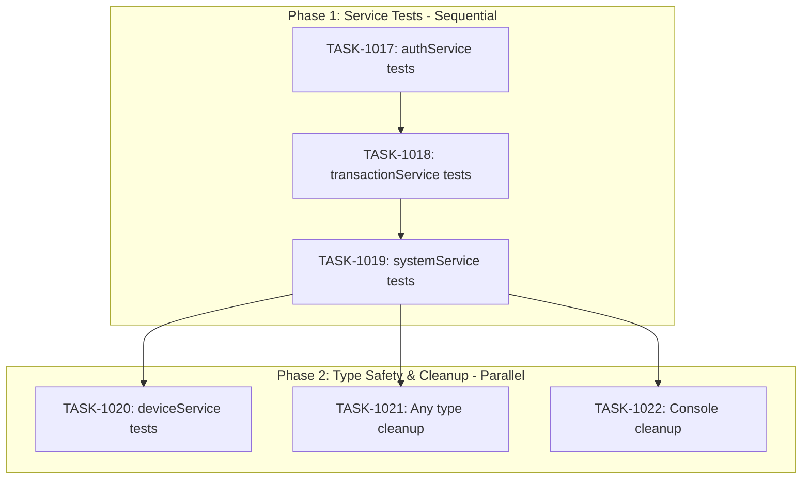

# Sprint Plan: SPRINT-031 - Codebase Health & Technical Debt

## Sprint Goal

Address critical codebase health issues identified in the senior engineer review: improve service layer test coverage, clean up any types, and remove console statements.

## Sprint Status: PLANNED

**Created:** 2026-01-10
**Target Branch:** develop
**Estimated Duration:** 3-4 days
**Total Estimated Tokens:** ~185K (with SR review overhead + buffer)

---

## Context

### Source

This sprint addresses issues from the Senior Engineer Codebase Health Review (2026-01-10).

### Priority Rationale

| Priority | Items Selected | Reason |
|----------|----------------|--------|
| Critical | BACKLOG-191 (Service layer tests) | 0% coverage on 781 lines of core business logic |
| High | BACKLOG-115 (Any types) | 85 any types reduce type safety |
| Medium | BACKLOG-192 (Console cleanup) | Quick win, affects debugging |

### Items Deferred to Later Sprints

| Item | Priority | Reason for Deferral |
|------|----------|---------------------|
| BACKLOG-193 (databaseService refactor) | High | Large scope, needs tests first |
| BACKLOG-194 (Context tests) | Medium | Lower priority than service tests |
| BACKLOG-195 (Large hook tests) | Medium | Lower priority than service tests |
| BACKLOG-196 (Settings TODOs) | Low | UX only, not blocking |
| BACKLOG-197 (Stricter TS rules) | Low | Depends on BACKLOG-115 |
| BACKLOG-198 (Component decomposition) | Low | Maintainability, not urgent |

---

## In Scope

| Task | Backlog | Title | Est. Tokens | Revised Est. | Phase |
|------|---------|-------|-------------|--------------|-------|
| TASK-1017 | BACKLOG-191 | Add Tests for authService.ts | ~25K | ~25K | 1 |
| TASK-1018 | BACKLOG-191 | Add Tests for transactionService.ts | ~35K | ~35K | 1 |
| TASK-1019 | BACKLOG-191 | Add Tests for systemService.ts | ~25K | ~25K | 1 |
| TASK-1020 | BACKLOG-191 | Add Tests for deviceService.ts | ~30K | ~35-40K | 2 |
| TASK-1021 | BACKLOG-115 | Clean Up Any Types in Handlers (Part 1) | ~40K | ~25-30K | 2 |
| TASK-1022 | BACKLOG-192 | Remove Console Statements (High-Priority Files) | ~15K | ~15K | 2 |

**Revised Estimates (SR Engineer Review 2026-01-10):**
- TASK-1020: Increased due to 782-line file with 4 API domains
- TASK-1021: Decreased - actual any count is 18, not 26+

**Total Estimated (implementation):** ~165K tokens (revised)
**SR Review Overhead:** +30K (6 tasks)
**Buffer (10%):** ~20K
**Grand Total:** ~215K tokens

---

## Out of Scope / Deferred

| Backlog | Title | Reason |
|---------|-------|--------|
| BACKLOG-115 Part 2 | Remaining any types | Scope control - Part 1 targets high-priority handlers |
| BACKLOG-192 Phase 2 | Remaining console statements | Part 1 addresses worst offenders |
| BACKLOG-193 | databaseService refactor | Large scope, defer to next sprint |

---

## Phase Plan

### Phase 1: Service Layer Test Coverage (Sequential - Same Test Infrastructure)

```
Phase 1 (Sequential)
├── TASK-1017: Add Tests for authService.ts
├── TASK-1018: Add Tests for transactionService.ts
└── TASK-1019: Add Tests for systemService.ts
```

**Why sequential:**
- All tasks create test files in same directory
- Share common mock patterns for window.api
- First task establishes testing patterns for subsequent tasks
- Merge conflicts possible if parallel

**Integration checkpoint:** All Phase 1 PRs must pass CI

### Phase 2: Type Safety & Cleanup (Parallel Safe)

```
Phase 2 (Parallel)
├── TASK-1020: Add Tests for deviceService.ts
├── TASK-1021: Clean Up Any Types in Handlers (Part 1)
└── TASK-1022: Remove Console Statements (High-Priority Files)
```

**Why parallel is safe:**
- TASK-1020 creates: `src/services/__tests__/deviceService.test.ts`
- TASK-1021 modifies: `electron/handlers/conversationHandlers.ts`, `electron/handlers/outlookHandlers.ts`
- TASK-1022 modifies: `src/components/onboarding/steps/PermissionsStep.tsx`, `src/hooks/useAutoRefresh.ts`, `src/components/Settings.tsx`
- **No shared file conflicts** - each task touches different files

---

## Dependency Graph



### YAML Edges

```yaml
dependency_graph:
  nodes:
    - id: TASK-1017
      type: task
      phase: 1
      title: "Add Tests for authService.ts"
      priority: critical
    - id: TASK-1018
      type: task
      phase: 1
      title: "Add Tests for transactionService.ts"
      priority: critical
    - id: TASK-1019
      type: task
      phase: 1
      title: "Add Tests for systemService.ts"
      priority: critical
    - id: TASK-1020
      type: task
      phase: 2
      title: "Add Tests for deviceService.ts"
      priority: high
    - id: TASK-1021
      type: task
      phase: 2
      title: "Clean Up Any Types in Handlers"
      priority: high
    - id: TASK-1022
      type: task
      phase: 2
      title: "Remove Console Statements"
      priority: medium

  edges:
    - from: TASK-1017
      to: TASK-1018
      type: depends_on
      reason: "Sequential - same test directory"
    - from: TASK-1018
      to: TASK-1019
      type: depends_on
      reason: "Sequential - same test directory"
    - from: TASK-1019
      to: TASK-1020
      type: depends_on
      reason: "Phase 2 starts after Phase 1 complete"
    - from: TASK-1019
      to: TASK-1021
      type: depends_on
      reason: "Phase 2 starts after Phase 1 complete"
    - from: TASK-1019
      to: TASK-1022
      type: depends_on
      reason: "Phase 2 starts after Phase 1 complete"
```

---

## SR Engineer Technical Review Summary

**Review Date:** 2026-01-10
**Reviewer:** SR Engineer (Claude)
**Status:** APPROVED - Ready for Implementation

### Corrections Made

| Task | Issue | Correction |
|------|-------|------------|
| TASK-1020 | deviceService.ts is 782 lines with 4 API domains | Increased estimate from 30K to 35-40K |
| TASK-1021 | any type count was overestimated | Corrected: 6+9+3=18 types (not 26+), reduced estimate |
| TASK-1022 | Settings.tsx has 15 console statements | Corrected from 12, total now 49 |

### Dependency Analysis

```
Phase 1 (SEQUENTIAL - establishes mocking patterns):
TASK-1017 → TASK-1018 → TASK-1019
     │           │           │
     │           │           └──┬──────────────────────┐
     │           │              │                      │
     │           └──────────────┼──────────────────────┼─────────────────┐
     └──────────────────────────┼──────────────────────┼─────────────────┼──────────────────┐
                                v                      v                 v                  v
Phase 2 (PARALLEL - no shared files):
                          TASK-1020            TASK-1021           TASK-1022
                      (deviceService)      (any cleanup)     (console cleanup)
```

### Shared Resources

| Resource | Tasks Using It | Risk |
|----------|---------------|------|
| `src/services/__tests__/` directory | TASK-1017, 1018, 1019, 1020 | Low - different files |
| window.api mocking pattern | All test tasks | Low - pattern established in TASK-1017 |
| `src/hooks/__tests__/useAutoRefresh.test.ts` | TASK-1022 | Medium - must update test assertions |

### Key Technical Notes for Engineers

1. **TASK-1017 establishes the mocking pattern** - Reference `src/hooks/__tests__/useAutoRefresh.test.ts` for existing patterns
2. **TASK-1018 needs two API mocks** - `window.api.transactions` AND `window.api.feedback`
3. **TASK-1020 has 4 API domains** - device, backup, drivers, sync - largest scope
4. **TASK-1022 has test dependencies** - `useAutoRefresh.test.ts` expects console.error calls

### Recommendations

1. **Phase 1 should remain sequential** - Mock pattern needs to be established and validated before reuse
2. **Phase 2 is safe for parallel execution** - No file conflicts between tasks
3. **TASK-1022 requires test updates** - Add to acceptance criteria

---

## Prerequisites / Environment Setup

Before starting sprint work, engineers must:
- [ ] `git checkout develop && git pull origin develop`
- [ ] `npm install`
- [ ] `npm rebuild better-sqlite3-multiple-ciphers`
- [ ] `npx electron-rebuild`
- [ ] Verify app starts: `npm run dev`
- [ ] Verify tests pass: `npm test`

---

## Testing & Quality Plan

### TASK-1017 (authService tests)
- **Unit Tests:** Login, logout, session restore, token refresh
- **Coverage Target:** >60%
- **Mock Requirements:** window.api.auth

### TASK-1018 (transactionService tests)
- **Unit Tests:** CRUD operations, status changes, validation
- **Coverage Target:** >60%
- **Mock Requirements:** window.api.transactions

### TASK-1019 (systemService tests)
- **Unit Tests:** Platform detection, file operations, export
- **Coverage Target:** >60%
- **Mock Requirements:** window.api.system

### TASK-1020 (deviceService tests)
- **Unit Tests:** Device registration, sync status, backup
- **Coverage Target:** >60%
- **Mock Requirements:** window.api.device

### TASK-1021 (Any type cleanup)
- **Type Safety:** Replace any with proper interfaces
- **CI Requirement:** No new type errors

### TASK-1022 (Console cleanup)
- **Removal:** Remove debug console.log statements
- **Preservation:** Keep intentional error logging
- **CI Requirement:** All tests pass

### CI Requirements
- All PRs must pass: `npm test`, `npm run type-check`, `npm run lint`
- No regressions in existing test coverage
- Test runs 3x without flakiness

---

## Progress Tracking

| Task | Phase | Status | Agent ID | Tokens | Duration | PR |
|------|-------|--------|----------|--------|----------|-----|
| TASK-1017 | 1 | Pending | - | - | - | - |
| TASK-1018 | 1 | Pending | - | - | - | - |
| TASK-1019 | 1 | Pending | - | - | - | - |
| TASK-1020 | 2 | Pending | - | - | - | - |
| TASK-1021 | 2 | Pending | - | - | - | - |
| TASK-1022 | 2 | Pending | - | - | - | - |

---

## Risk Register

| Risk | Impact | Likelihood | Mitigation |
|------|--------|------------|------------|
| Mock complexity for window.api | Medium | Medium | Establish pattern in TASK-1017, reuse |
| Any type cleanup reveals deeper issues | Medium | Low | Scope Part 1 to focus files only |
| Console removal breaks error logging | Low | Low | Review each removal, keep console.error |
| Test flakiness in new tests | Medium | Medium | Run 3x locally before PR |

---

## Success Criteria

1. **Critical:** Service layer test coverage >60% for all 4 files
2. **Type Safety:** Any types in target handlers reduced by >50%
3. **Code Quality:** Console statements in focus files reduced to <5
4. **Quality:** All tests passing, no regressions

---

## End-of-Sprint Validation Checklist

- [ ] All tasks merged to develop
- [ ] All CI checks passing
- [ ] All acceptance criteria verified
- [ ] Testing requirements met
- [ ] No unresolved conflicts
- [ ] Documentation updated (sprint plan, backlog INDEX)

---

## Unplanned Work Log

| Task | Source | Root Cause | Added Date | Est. Tokens | Actual Tokens |
|------|--------|------------|------------|-------------|---------------|
| - | - | - | - | - | - |

---

## Related Backlog Items Created

This sprint responds to the Senior Engineer Codebase Health Review:

| ID | Title | Priority | Sprint |
|----|-------|----------|--------|
| BACKLOG-191 | Add Test Coverage for Core Service Layer | Critical | SPRINT-031 |
| BACKLOG-192 | Clean Up Console Statements (186 Remaining) | Medium | SPRINT-031 (partial) |
| BACKLOG-193 | Refactor databaseService.ts (1,223 Lines) | High | Future |
| BACKLOG-194 | Add Test Coverage for Contexts | Medium | Future |
| BACKLOG-195 | Add Test Coverage for Large Hooks | Medium | Future |
| BACKLOG-196 | Implement or Remove Settings.tsx TODOs | Low | Future |
| BACKLOG-197 | Enable Stricter TypeScript Rules | Low | Future |
| BACKLOG-198 | Decompose Large Component Files | Low | Future |

**Pre-existing items also addressed:**
| ID | Title | Priority | Sprint |
|----|-------|----------|--------|
| BACKLOG-115 | Address Remaining any Types in Electron Handlers | Medium | SPRINT-031 (partial) |
