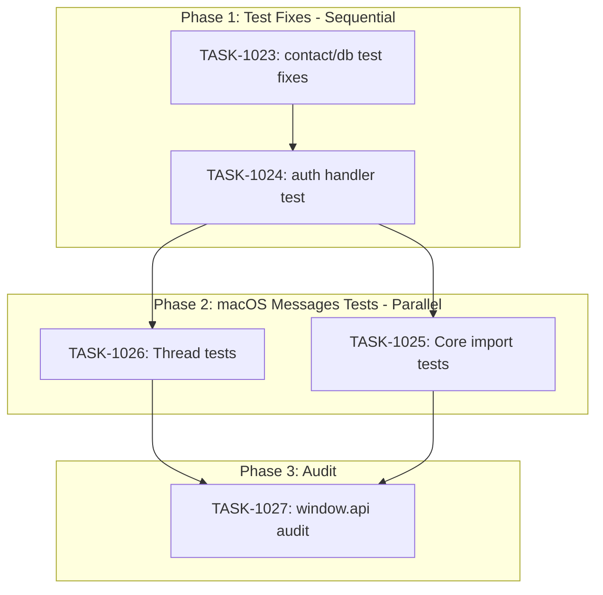

# Sprint Plan: SPRINT-032 - Bug Fixes & Stability

## Sprint Goal

Fix test regressions, improve test coverage for macOS Messages import, and begin window.api service abstraction to improve code stability and testability.

## Sprint Status: PLANNED

**Created:** 2026-01-11
**Target Branch:** develop
**Estimated Duration:** 3-4 days
**Total Estimated Tokens:** ~145K (with SR review overhead + buffer)

---

## Context

### Source

This sprint addresses critical stability issues and testing gaps identified during recent development:
1. Test regressions in contact-handlers and databaseService (blocking CI)
2. Insufficient test coverage for macOSMessagesImportService (risk area)
3. Direct window.api calls in components (architecture debt)
4. Pending auth handler test fix from SPRINT-024

### Priority Rationale

| Priority | Items Selected | Reason |
|----------|----------------|--------|
| Critical | BACKLOG-202 (Test regressions) | CI blocker, must fix first |
| High | BACKLOG-157 (Auth handler test) | Also blocking CI completion |
| High | BACKLOG-203 (macOS Messages tests) | High-use feature with parsing risk |
| Medium | BACKLOG-204 Phase 1 (window.api audit) | Foundation for later refactoring |

### Items Deferred to Later Sprints

| Item | Priority | Reason for Deferral |
|------|----------|---------------------|
| BACKLOG-204 Phase 2-3 | Medium | Phase 1 needed first |
| BACKLOG-191 (remaining) | Critical | Continue in SPRINT-031 |
| BACKLOG-111 | High | Depends on service tests |

---

## In Scope

| Task | Backlog | Title | Est. Tokens | Phase |
|------|---------|-------|-------------|-------|
| TASK-1023 | BACKLOG-202 | Fix Test Regressions (contact-handlers/databaseService) | ~20K | 1 |
| TASK-1024 | BACKLOG-157 | Fix Auth Handler Integration Test | ~15K | 1 |
| TASK-1025 | BACKLOG-203 | Add Tests for macOSMessagesImportService - Core | ~25K | 2 |
| TASK-1026 | BACKLOG-203 | Add Tests for macOSMessagesImportService - Threads | ~20K | 2 |
| TASK-1027 | BACKLOG-204 | Audit window.api Calls in Components | ~15K | 3 |

**Total Estimated (implementation):** ~95K tokens
**SR Review Overhead:** +25K (5 tasks)
**Buffer (10%):** ~12K
**Grand Total:** ~132K tokens

---

## Out of Scope / Deferred

| Backlog | Title | Reason |
|---------|-------|--------|
| BACKLOG-204 Phase 2-3 | Service extension and migration | Large scope, audit needed first |
| BACKLOG-193 | databaseService refactor | Need tests before refactor |
| BACKLOG-158 | AuditTransactionModal decomposition | Not urgent, defer to later |

---

## Phase Plan

### Phase 1: Critical Test Fixes (Sequential - Same Test Infrastructure)

```
Phase 1 (Sequential)
├── TASK-1023: Fix Test Regressions (contact-handlers/databaseService)
└── TASK-1024: Fix Auth Handler Integration Test
```

**Why sequential:**
- Both modify test infrastructure/mocks
- TASK-1023 may reveal patterns useful for TASK-1024
- CI must pass between tasks to validate fixes

**Integration checkpoint:** All Phase 1 PRs must pass CI completely

### Phase 2: macOS Messages Test Coverage (Parallel Safe)

```
Phase 2 (Parallel)
├── TASK-1025: Add Tests for macOSMessagesImportService - Core
└── TASK-1026: Add Tests for macOSMessagesImportService - Threads
```

**Why parallel is safe:**
- TASK-1025 creates: `macOSMessagesImportService.core.test.ts`
- TASK-1026 creates: `macOSMessagesImportService.threads.test.ts`
- Different test files, no shared dependencies

### Phase 3: Architecture Audit (Independent)

```
Phase 3
└── TASK-1027: Audit window.api Calls in Components
```

**Output:** Documentation of all window.api calls for future refactoring

---

## Dependency Graph



### YAML Edges

```yaml
dependency_graph:
  nodes:
    - id: TASK-1023
      type: task
      phase: 1
      title: "Fix Test Regressions (contact-handlers/databaseService)"
      priority: critical
    - id: TASK-1024
      type: task
      phase: 1
      title: "Fix Auth Handler Integration Test"
      priority: high
    - id: TASK-1025
      type: task
      phase: 2
      title: "Add Tests for macOSMessagesImportService - Core"
      priority: high
    - id: TASK-1026
      type: task
      phase: 2
      title: "Add Tests for macOSMessagesImportService - Threads"
      priority: high
    - id: TASK-1027
      type: task
      phase: 3
      title: "Audit window.api Calls in Components"
      priority: medium

  edges:
    - from: TASK-1023
      to: TASK-1024
      type: depends_on
      reason: "Sequential - both fix test infrastructure"
    - from: TASK-1024
      to: TASK-1025
      type: depends_on
      reason: "Phase 2 starts after Phase 1 complete"
    - from: TASK-1024
      to: TASK-1026
      type: depends_on
      reason: "Phase 2 starts after Phase 1 complete"
    - from: TASK-1025
      to: TASK-1027
      type: depends_on
      reason: "Phase 3 starts after Phase 2 complete"
    - from: TASK-1026
      to: TASK-1027
      type: depends_on
      reason: "Phase 3 starts after Phase 2 complete"
```

---

## SR Engineer Technical Review

**Status:** PENDING REVIEW

### Review Request

Before implementation, SR Engineer should review:
1. Test regression root cause hypotheses
2. Shared file dependencies across tasks
3. Parallel vs sequential execution recommendations
4. Branch strategy recommendations

---

## Prerequisites / Environment Setup

Before starting sprint work, engineers must:
- [ ] `git checkout develop && git pull origin develop`
- [ ] `npm install`
- [ ] `npm rebuild better-sqlite3-multiple-ciphers`
- [ ] `npx electron-rebuild`
- [ ] Verify app starts: `npm run dev`
- [ ] Run tests to see current failures: `npm test`

---

## Testing & Quality Plan

### TASK-1023 (Test Regression Fixes)
- **Goal:** All contact-handler and databaseService tests pass
- **Approach:** Investigate failures, fix either tests or code
- **CI Requirement:** Full test suite passing

### TASK-1024 (Auth Handler Test)
- **Goal:** auth-handlers integration test passes
- **Approach:** Fix session restoration test
- **CI Requirement:** 749/749 tests passing

### TASK-1025 (macOS Messages Core Tests)
- **Unit Tests:** Message parsing, contact matching, error handling
- **Coverage Target:** >60% for core functions
- **Mock Requirements:** SQLite database, file system

### TASK-1026 (macOS Messages Thread Tests)
- **Unit Tests:** Thread grouping, participant resolution
- **Coverage Target:** >60% for thread functions
- **Mock Requirements:** Same as TASK-1025

### TASK-1027 (window.api Audit)
- **Deliverable:** Markdown document listing all window.api calls
- **Format:** Categorized by domain with file locations
- **No code changes** - documentation only

### CI Requirements
- All PRs must pass: `npm test`, `npm run type-check`, `npm run lint`
- No regressions in existing test coverage
- Test runs 3x without flakiness

---

## Progress Tracking

| Task | Phase | Status | Agent ID | Tokens | Duration | PR |
|------|-------|--------|----------|--------|----------|-----|
| TASK-1023 | 1 | Pending | - | - | - | - |
| TASK-1024 | 1 | Pending | - | - | - | - |
| TASK-1025 | 2 | Pending | - | - | - | - |
| TASK-1026 | 2 | Pending | - | - | - | - |
| TASK-1027 | 3 | Pending | - | - | - | - |

---

## Risk Register

| Risk | Impact | Likelihood | Mitigation |
|------|--------|------------|------------|
| Test regressions have deep root cause | High | Medium | Time-box investigation, escalate if > 2 hours |
| macOS Messages tests require complex mocking | Medium | Medium | Reference existing attachment tests for patterns |
| window.api audit reveals more debt than expected | Low | High | Document but don't expand scope |
| Test fixes cause other regressions | High | Low | Run full suite after each fix |

---

## Success Criteria

1. **Critical:** All CI tests passing (100%)
2. **Test Coverage:** macOSMessagesImportService core >60%
3. **Documentation:** Complete window.api usage audit
4. **Quality:** No new test flakiness introduced

---

## End-of-Sprint Validation Checklist

- [ ] All tasks merged to develop
- [ ] All CI checks passing
- [ ] All acceptance criteria verified
- [ ] Testing requirements met
- [ ] No unresolved conflicts
- [ ] Documentation updated (sprint plan, backlog INDEX)

---

## Unplanned Work Log

| Task | Source | Root Cause | Added Date | Est. Tokens | Actual Tokens |
|------|--------|------------|------------|-------------|---------------|
| - | - | - | - | - | - |

---

## Related Backlog Items

| ID | Title | Priority | Status | Sprint |
|----|-------|----------|--------|--------|
| BACKLOG-202 | Fix Test Regressions | Critical | Pending | SPRINT-032 |
| BACKLOG-157 | Fix Auth Handler Test | High | Pending | SPRINT-032 |
| BACKLOG-203 | Add macOSMessagesImportService Tests | High | Pending | SPRINT-032 |
| BACKLOG-204 | Abstract window.api Calls | Medium | Pending (Phase 1) | SPRINT-032 |
