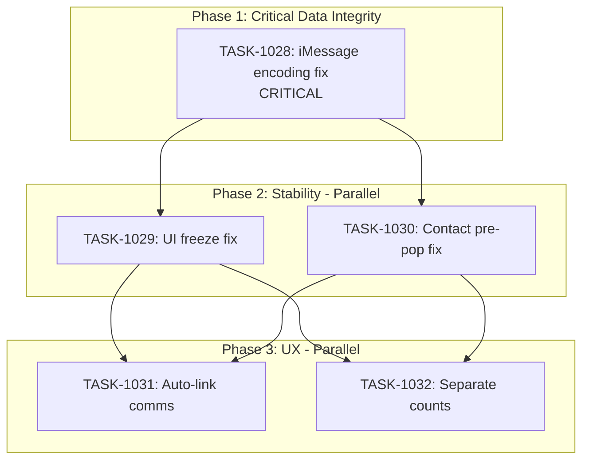

# Sprint Plan: SPRINT-033 - iMessage Stability & UX Polish

## Sprint Goal

Fix critical iMessage text encoding corruption that causes data loss, resolve UI freezing during large imports, fix regression in contact pre-population, and improve communication count display.

## Sprint Status: IN PROGRESS (Phase 3 In Review)

**Created:** 2026-01-11
**Updated:** 2026-01-12
**Target Branch:** develop
**Estimated Duration:** 4-5 days
**Total Estimated Tokens:** ~210K (with SR review overhead + buffer)

---

## Context

### Source

This sprint addresses critical stability and data integrity issues with the iMessage/communications feature:

1. **CRITICAL**: Text encoding corruption losing message content (U+FFFD replacement chars)
2. **HIGH**: UI freezing during sync (160+ seconds with 677K messages)
3. **HIGH**: Contacts not pre-populating in Edit Transaction (TASK-995 incomplete)
4. **MEDIUM**: Auto-link communications when contact added
5. **MEDIUM**: Separate email/text counts on transaction cards

### Priority Rationale

| Priority | Items Selected | Reason |
|----------|----------------|--------|
| Critical | BACKLOG-209 (iMessage encoding) | Data integrity violation - audit tool losing data |
| High | BACKLOG-206 (UI freezing) | App becomes unusable during large imports |
| High | BACKLOG-210 (contacts pre-populate) | Regression from incomplete fix, user friction |
| Medium | BACKLOG-207 (auto-link comms) | UX improvement, builds on existing infra |
| Medium | BACKLOG-208 (separate counts) | UI clarity improvement |

### Items Deferred to Later Sprints

| Item | Priority | Reason for Deferral |
|------|----------|---------------------|
| BACKLOG-202 | Critical | SPRINT-032 scope - test regressions |
| BACKLOG-203 | High | SPRINT-032 scope - macOS Messages tests |
| BACKLOG-204 | Medium | SPRINT-032 scope - window.api audit |

---

## In Scope

| Task | Backlog | Title | Est. Tokens | Phase |
|------|---------|-------|-------------|-------|
| TASK-1028 | BACKLOG-209 | Fix iMessage Text Encoding Corruption | ~60K | 1 |
| TASK-1029 | BACKLOG-206 | Fix UI Freezing During iMessage Import | ~30K | 2 |
| TASK-1030 | BACKLOG-210 | Fix Contacts Not Pre-Populating (TASK-995 Incomplete) | ~20K | 2 |
| TASK-1031 | BACKLOG-207 | Auto-Link Communications When Contact Added | ~40K | 3 |
| TASK-1032 | BACKLOG-208 | Separate Email/Text Counts on Transaction Cards | ~20K | 3 |

**Total Estimated (implementation):** ~170K tokens
**SR Review Overhead:** +25K (5 tasks)
**Buffer (10%):** ~20K
**Grand Total:** ~215K tokens

---

## Out of Scope / Deferred

| Backlog | Title | Reason |
|---------|-------|--------|
| BACKLOG-202 | Fix Test Regressions | SPRINT-032 scope |
| BACKLOG-203 | macOS Messages Tests | SPRINT-032 scope |
| Worker Thread approach for BACKLOG-206 | Full isolation | Async chunking is faster to implement |

---

## Phase Plan

### Phase 1: Critical Data Integrity Fix (Sequential - Must Complete First)

```
Phase 1 (Sequential)
└── TASK-1028: Fix iMessage Text Encoding Corruption (CRITICAL)
```

**Why first and sequential:**
- Data integrity is non-negotiable for an audit tool
- Must be fixed before any other iMessage work
- Changes to message parsing affect all downstream features

**Integration checkpoint:** TASK-1028 must merge before Phase 2 begins

### Phase 2: Stability & Regression Fixes (Parallel Safe)

```
Phase 2 (Parallel)
├── TASK-1029: Fix UI Freezing During iMessage Import
└── TASK-1030: Fix Contacts Not Pre-Populating
```

**Why parallel is safe:**
- TASK-1029 modifies: `macOSMessagesImportService.ts`, IPC handlers, progress UI
- TASK-1030 modifies: `EditTransactionModal.tsx`, `transactionService.ts`
- Different services, no shared file conflicts

### Phase 3: UX Improvements (Parallel Safe)

```
Phase 3 (Parallel)
├── TASK-1031: Auto-Link Communications When Contact Added
└── TASK-1032: Separate Email/Text Counts on Transaction Cards
```

**Why parallel is safe:**
- TASK-1031 modifies: `transactionService.ts` (contact add flow), notification UI
- TASK-1032 modifies: `TransactionCard.tsx`, database query
- Different features, different UI components

**Note:** TASK-1031 touches `transactionService.ts` which TASK-1030 also touches.
If SR Engineer identifies conflicts, these may need to be sequential.

---

## Dependency Graph



### YAML Edges

```yaml
dependency_graph:
  nodes:
    - id: TASK-1028
      type: task
      phase: 1
      title: "Fix iMessage Text Encoding Corruption"
      priority: critical
    - id: TASK-1029
      type: task
      phase: 2
      title: "Fix UI Freezing During iMessage Import"
      priority: high
    - id: TASK-1030
      type: task
      phase: 2
      title: "Fix Contacts Not Pre-Populating"
      priority: high
    - id: TASK-1031
      type: task
      phase: 3
      title: "Auto-Link Communications When Contact Added"
      priority: medium
    - id: TASK-1032
      type: task
      phase: 3
      title: "Separate Email/Text Counts on Transaction Cards"
      priority: medium

  edges:
    - from: TASK-1028
      to: TASK-1029
      type: depends_on
      reason: "Encoding must be fixed before import improvements"
    - from: TASK-1028
      to: TASK-1030
      type: depends_on
      reason: "Phase 2 starts after Phase 1 complete"
    - from: TASK-1029
      to: TASK-1031
      type: depends_on
      reason: "Phase 3 starts after Phase 2 complete"
    - from: TASK-1029
      to: TASK-1032
      type: depends_on
      reason: "Phase 3 starts after Phase 2 complete"
    - from: TASK-1030
      to: TASK-1031
      type: depends_on
      reason: "Auto-link uses contact-transaction association"
    - from: TASK-1030
      to: TASK-1032
      type: depends_on
      reason: "Phase 3 starts after Phase 2 complete"
```

---

## SR Engineer Technical Review

**Status:** COMPLETE
**Review Date:** 2026-01-11
**Reviewer:** SR Engineer (Claude Opus 4.5)

### Review Summary

All 5 tasks are **APPROVED** for implementation. Key findings:

1. **TASK-1028 (CRITICAL):** Technically feasible. Current `messageParser.ts` has fallback but only uses UTF-8. Multi-encoding approach is correct.

2. **TASK-1029 (HIGH):** Existing code already has chunking/yielding. Root cause likely in initial query loading 600K+ messages at once. May need pagination.

3. **TASK-1030 (HIGH):** Code path appears correct. Root cause needs investigation - time-boxed to 2 hours.

4. **TASK-1031 (MEDIUM):** Existing linking infrastructure available. Recommend creating separate `autoLinkService.ts` to avoid merge conflicts.

5. **TASK-1032 (MEDIUM):** Straightforward UI change. No conflicts.

### Revised Execution Order (IMPORTANT)

**Original plan had Phase 2 and Phase 3 as "Parallel Safe" - THIS IS INCORRECT.**

**Actual constraints:**
| Task | Safe To Parallel With |
|------|----------------------|
| TASK-1028 | None - Must be first |
| TASK-1029 | TASK-1030 only (different files) |
| TASK-1030 | TASK-1029 only (different files) |
| TASK-1031 | TASK-1032 only - BUT must wait for TASK-1030 |
| TASK-1032 | TASK-1031 only (different files) |

### Shared File Matrix

| File | Tasks | Recommendation |
|------|-------|----------------|
| `macOSMessagesImportService.ts` | 1028, 1029 | Sequential |
| `transactionService.ts` | 1030, 1031 | Sequential |
| `EditTransactionModal.tsx` | 1030, 1031 | Sequential |
| `messageParser.ts` | 1028 only | No conflict |
| `TransactionCard.tsx` | 1032 only | No conflict |

### Risk Register Update

| Risk | Severity | Mitigation |
|------|----------|------------|
| TASK-1029 needs more than chunking | MEDIUM | If pagination insufficient, escalate for Worker Thread consideration |
| TASK-1030 root cause unknown | MEDIUM | Time-box investigation to 2 hours |
| Merge conflicts Phase 3 | LOW | Execute TASK-1030 before TASK-1031 |

### Blockers

**None identified.** Sprint is ready for implementation.

---

## Prerequisites / Environment Setup

Before starting sprint work, engineers must:
- [ ] `git checkout develop && git pull origin develop`
- [ ] `npm install`
- [ ] `npm rebuild better-sqlite3-multiple-ciphers`
- [ ] `npx electron-rebuild`
- [ ] Verify app starts: `npm run dev`
- [ ] Confirm large iMessage database available for testing (or create mock data)

---

## Testing & Quality Plan

### TASK-1028 (iMessage Encoding Fix)
- **Goal:** All text content preserved without data loss
- **Unit Tests:** Multiple encoding scenarios (UTF-8, UTF-16 LE/BE, Latin-1)
- **Integration Tests:** Re-import previously corrupted messages
- **Regression:** No existing messages lost or altered incorrectly

### TASK-1029 (UI Freeze Fix)
- **Goal:** UI remains responsive during 600K+ message imports
- **Manual Testing:** Import large database, verify UI responsiveness
- **Performance:** No more than 10% slower than current
- **Cancellation:** Test cancel operation mid-import

### TASK-1030 (Contact Pre-Population Fix)
- **Goal:** Existing contacts appear when editing transaction
- **Unit Tests:** loadContactAssignments() with mock data
- **Integration Tests:** Edit flow with multiple contacts/roles
- **Regression:** New transaction creation still works

### TASK-1031 (Auto-Link Communications)
- **Goal:** Contacts added to transactions auto-link relevant comms
- **Unit Tests:** Search by email, search by phone, date filtering
- **Integration Tests:** Full add-contact flow with verification
- **Performance:** < 2 seconds for typical contact

### TASK-1032 (Separate Counts)
- **Goal:** Accurate separate counts for emails and texts
- **Unit Tests:** Query returns correct counts by type
- **UI Tests:** Correct display for various combinations
- **Regression:** No degradation in transaction list performance

### CI Requirements
- All PRs must pass: `npm test`, `npm run type-check`, `npm run lint`
- No regressions in existing test coverage
- Test runs 3x without flakiness

---

## Progress Tracking

| Task | Phase | Status | Agent ID | Tokens | Duration | PR |
|------|-------|--------|----------|--------|----------|-----|
| TASK-1028 | 1 | MERGED | - | ~60K (est) | - | #404 |
| TASK-1029 | 2 | MERGED | - | ~30K (est) | - | #405 |
| TASK-1030 | 2 | MERGED | - | ~20K (est) | - | #406 |
| TASK-1031 | 3 | IN REVIEW | ac9f2c4 | ~35K (est) | - | #407 |
| TASK-1032 | 3 | IN REVIEW | a1779d9 | ~18K (est) | - | #408 |

---

## Risk Register

| Risk | Impact | Likelihood | Mitigation |
|------|--------|------------|------------|
| Encoding fix breaks existing imports | High | Medium | Test with real corrupted samples before deploy |
| Worker Thread needed instead of chunking | Medium | Low | Chunking should be sufficient; escalate if needed |
| Contact pre-pop has deep root cause | Medium | Medium | Time-box investigation to 2 hours |
| Auto-link performance with large DBs | Medium | Medium | Add pagination/limits if needed |
| transactionService.ts conflicts (TASK-1030 + TASK-1031) | Medium | Medium | SR Engineer will assess; may need sequential |

---

## Success Criteria

1. **Critical:** No data loss during iMessage import
2. **Critical:** UI remains responsive during imports
3. **High:** Contacts pre-populate correctly when editing transactions
4. **Medium:** Auto-linking works for new contact additions
5. **Medium:** Transaction cards show accurate email/text counts
6. **Quality:** All tests passing, no new flakiness

---

## End-of-Sprint Validation Checklist

- [ ] All tasks merged to develop
- [ ] All CI checks passing
- [ ] All acceptance criteria verified
- [ ] Testing requirements met
- [ ] No unresolved conflicts
- [ ] Documentation updated (sprint plan, backlog INDEX)
- [ ] Re-import test with large iMessage database passes

---

## Unplanned Work Log

| Task | Source | Root Cause | Added Date | Est. Tokens | Actual Tokens |
|------|--------|------------|------------|-------------|---------------|
| - | - | - | - | - | - |

---

## Related Backlog Items

| ID | Title | Priority | Status | Sprint |
|----|-------|----------|--------|--------|
| BACKLOG-209 | Fix iMessage Text Encoding Corruption | Critical | In Sprint | SPRINT-033 |
| BACKLOG-206 | Fix UI Freezing During iMessage Sync/Import | High | In Sprint | SPRINT-033 |
| BACKLOG-210 | Fix Contacts Not Pre-Populating | High | In Sprint | SPRINT-033 |
| BACKLOG-207 | Auto-Link Communications When Contact Added | Medium | In Sprint | SPRINT-033 |
| BACKLOG-208 | Separate Email/Text Counts on Transaction Cards | Medium | In Sprint | SPRINT-033 |
