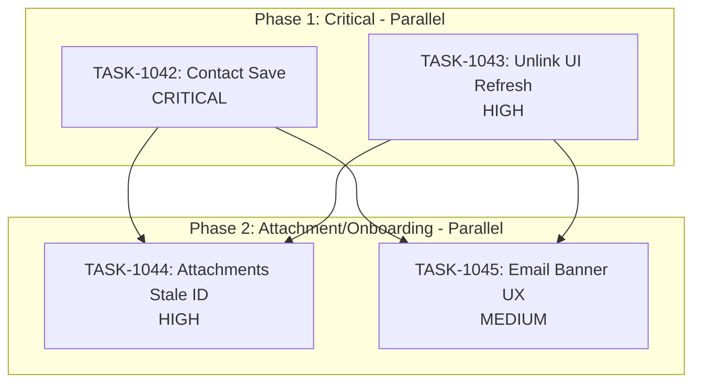

# Sprint Plan: SPRINT-035 - Contact and Communication Fixes

## Sprint Goal

Fix critical UX issues blocking user workflow, focusing on:
1. Contact persistence when editing transactions
2. UI state refresh after communication operations
3. iMessage attachment display (stale ID fix)
4. Email setup banner functionality

## Sprint Status: PLANNING

**Created:** 2026-01-13
**Updated:** 2026-01-13
**Target Branch:** develop
**Estimated Duration:** 3-5 days
**Total Estimated Tokens:** ~200K (with SR review overhead + buffer)

---

## Context

### Source

This sprint addresses bugs discovered during SPRINT-034 testing. User is actively testing the application and these issues are blocking their workflow.

### Priority Rationale

| Priority | Items Selected | Reason |
|----------|----------------|--------|
| CRITICAL | BACKLOG-222 (Contact save) | Data not persisting - user workflow broken |
| HIGH | BACKLOG-220 (Unlink UI refresh) | UI shows stale data after operations |
| HIGH | BACKLOG-221 (Attachments stale ID) | Images not displaying despite existing |
| MEDIUM | BACKLOG-224 (Email banner UX) | Onboarding flow broken - button non-functional |

### Items NOT Included

| Backlog | Title | Reason |
|---------|-------|--------|
| BACKLOG-218 | Group chat display | Still pending requirements clarification |
| BACKLOG-223 | Text status indicator | Enhancement, not blocking |
| BACKLOG-225 | Video attachment support | Low priority enhancement |
| BACKLOG-226 | URL preview formatting | Low priority enhancement |

---

## In Scope

| Task | Backlog | Title | Est. Tokens | Phase | Priority |
|------|---------|-------|-------------|-------|----------|
| TASK-1042 | BACKLOG-222 | Fix Contact Save When Editing Transaction | ~40K | 1 | CRITICAL |
| TASK-1043 | BACKLOG-220 | Fix Unlink Communications UI Refresh | ~35K | 1 | HIGH |
| TASK-1044 | BACKLOG-221 | Fix iMessage Attachments Stale ID | ~45K | 2 | HIGH |
| TASK-1045 | BACKLOG-224 | Fix Email Setup Banner UX | ~30K | 2 | MEDIUM |

**Total Estimated (implementation):** ~150K tokens
**SR Review Overhead:** +20K (4 tasks)
**Buffer (20%):** ~35K
**Grand Total:** ~205K tokens

---

## Out of Scope / Deferred

| Backlog | Title | Reason |
|---------|-------|--------|
| BACKLOG-218 | Group Chat Display | Pending user requirements clarification |
| BACKLOG-223 | Text Status Indicator | Enhancement - defer to next sprint |
| BACKLOG-225 | Video Attachment Support | Low priority enhancement |
| BACKLOG-226 | URL Preview Formatting | Low priority enhancement |

---

## Phase Plan

### Phase 1: Critical Data/UI Fixes (Parallel Safe)

```
Phase 1 (Parallel)
+-- TASK-1042: Fix Contact Save When Editing Transaction (CRITICAL)
+-- TASK-1043: Fix Unlink Communications UI Refresh (HIGH)
```

**Why parallel is safe:**
- TASK-1042 modifies: `EditTransactionModal.tsx`, `transactionDbService.ts` (contact save flow)
- TASK-1043 modifies: Transaction detail communication components, state invalidation
- Different code paths - contact editing vs. communication unlinking

**Potential overlap:** Both may touch transaction detail views. SR Engineer to verify file matrix.

### Phase 2: Attachment and Onboarding Fixes (Parallel Safe)

```
Phase 2 (Parallel)
+-- TASK-1044: Fix iMessage Attachments Stale ID (HIGH)
+-- TASK-1045: Fix Email Setup Banner UX (MEDIUM)
```

**Why parallel is safe:**
- TASK-1044 modifies: `macOSMessagesImportService.ts`, attachment database layer
- TASK-1045 modifies: Dashboard banner component, email onboarding state
- Completely different features

---

## Dependency Graph



### YAML Edges

```yaml
dependency_graph:
  nodes:
    - id: TASK-1042
      type: task
      phase: 1
      title: "Fix Contact Save When Editing Transaction"
      priority: critical
    - id: TASK-1043
      type: task
      phase: 1
      title: "Fix Unlink Communications UI Refresh"
      priority: high
    - id: TASK-1044
      type: task
      phase: 2
      title: "Fix iMessage Attachments Stale ID"
      priority: high
    - id: TASK-1045
      type: task
      phase: 2
      title: "Fix Email Setup Banner UX"
      priority: medium

  edges:
    - from: TASK-1042
      to: TASK-1044
      type: depends_on
      reason: "Phase 2 starts after Phase 1 complete"
    - from: TASK-1042
      to: TASK-1045
      type: depends_on
      reason: "Phase 2 starts after Phase 1 complete"
    - from: TASK-1043
      to: TASK-1044
      type: depends_on
      reason: "Phase 2 starts after Phase 1 complete"
    - from: TASK-1043
      to: TASK-1045
      type: depends_on
      reason: "Phase 2 starts after Phase 1 complete"
```

---

## SR Engineer Technical Review

**Status:** PENDING
**Review Date:** TBD
**Reviewer:** TBD

### Review Needed

1. **File Matrix Analysis:** Identify shared files across tasks
2. **Parallel/Sequential Verification:** Confirm Phase 1 and 2 can run parallel
3. **Technical Considerations:** Add to each task file
4. **Risk Assessment:** Flag any architectural concerns

### Preliminary File Matrix (To Be Verified)

| File | Tasks | Preliminary Recommendation |
|------|-------|----------------------------|
| `EditTransactionModal.tsx` | 1042 | No conflict |
| `transactionDbService.ts` | 1042 | No conflict |
| Transaction detail components | 1043 | No conflict |
| `macOSMessagesImportService.ts` | 1044 | No conflict |
| Attachment DB layer | 1044 | No conflict |
| Dashboard banner component | 1045 | No conflict |
| Email onboarding state | 1045 | No conflict |

---

## Prerequisites / Environment Setup

Before starting sprint work, engineers must:
- [ ] `git checkout develop && git pull origin develop`
- [ ] `npm install`
- [ ] `npm rebuild better-sqlite3-multiple-ciphers`
- [ ] `npx electron-rebuild`
- [ ] Verify app starts: `npm run dev`
- [ ] Have test transactions with contacts for TASK-1042
- [ ] Have linked communications for TASK-1043 testing
- [ ] Have iMessage data with attachments for TASK-1044

---

## Testing & Quality Plan

### TASK-1042 (Contact Save)
- **Goal:** Contact changes persist after editing transaction
- **Unit Tests:** Save handler collects updated contact state
- **Integration Tests:** Add/remove/modify contacts, verify persistence
- **Manual Testing:** Full edit flow with multiple contacts
- **Regression:** Existing contact assignment functionality preserved

### TASK-1043 (Unlink UI Refresh)
- **Goal:** UI updates immediately after unlinking communications
- **Unit Tests:** State invalidation triggers after unlink
- **Integration Tests:** Unlink email/message, verify UI update
- **Manual Testing:** No page refresh required
- **Regression:** Link operations still work

### TASK-1044 (Attachments Stale ID)
- **Goal:** Picture attachments display in conversation view
- **Unit Tests:** Attachment lookup uses correct identifiers
- **Integration Tests:** Re-import messages, verify attachments linked
- **Manual Testing:** All image types display correctly
- **Regression:** GIF attachments still work

### TASK-1045 (Email Banner UX)
- **Goal:** Banner "Continue Setup" button works, auto-dismisses after setup
- **Unit Tests:** Button click handler triggers email setup flow
- **Integration Tests:** Complete email setup, verify banner dismisses
- **Manual Testing:** Both Gmail and Outlook flows
- **Regression:** Banner reappears only when appropriate

### CI Requirements
- All PRs must pass: `npm test`, `npm run type-check`, `npm run lint`
- No regressions in existing test coverage
- Test runs 3x without flakiness

---

## Progress Tracking

| Task | Phase | Status | Agent ID | Billable Tokens | Duration | PR |
|------|-------|--------|----------|-----------------|----------|-----|
| TASK-1042 | 1 | PENDING | - | - (est 40K) | - | - |
| TASK-1043 | 1 | PENDING | - | - (est 35K) | - | - |
| TASK-1044 | 2 | PENDING | - | - (est 45K) | - | - |
| TASK-1045 | 2 | PENDING | - | - (est 30K) | - | - |

---

## Risk Register

| Risk | Impact | Likelihood | Mitigation |
|------|--------|------------|------------|
| Contact save has multiple state sources | Medium | Medium | Trace data flow from UI to DB |
| Stale attachment ID fix may require re-import | High | Low | Design fix to preserve existing data |
| Email banner state scattered across components | Medium | Medium | Consolidate state management |
| Phase 1 file overlap | Medium | Low | SR review to confirm safe for parallel |

---

## Blocking Issues

| Issue | Affected Tasks | Resolution |
|-------|----------------|------------|
| None currently | - | - |

---

## Success Criteria

1. **CRITICAL:** Contact changes persist after editing transactions
2. **HIGH:** UI updates immediately after unlinking communications
3. **HIGH:** Picture attachments display in conversation view
4. **MEDIUM:** Email setup banner button works and auto-dismisses
5. **Quality:** All tests passing, no new flakiness
6. **Quality:** Regression tests added for each fix

---

## End-of-Sprint Validation Checklist

- [ ] All tasks merged to develop
- [ ] All CI checks passing
- [ ] All acceptance criteria verified
- [ ] Testing requirements met
- [ ] No unresolved conflicts
- [ ] Documentation updated (sprint plan, backlog INDEX)
- [ ] Manual testing of contact save flow
- [ ] Manual testing of unlink communication flow
- [ ] Manual testing of iMessage attachment display
- [ ] Manual testing of email banner setup flow

---

## Unplanned Work Log

| Task | Source | Root Cause | Added Date | Est. Tokens | Actual Tokens |
|------|--------|------------|------------|-------------|---------------|
| - | - | - | - | - | - |

---

## Related Backlog Items

| ID | Title | Priority | Status | Sprint |
|----|-------|----------|--------|--------|
| BACKLOG-222 | Contact Save When Editing Transaction | Critical | In Sprint | SPRINT-035 |
| BACKLOG-220 | Unlink Communications UI Refresh | High | In Sprint | SPRINT-035 |
| BACKLOG-221 | iMessage Attachments Stale ID | High | In Sprint | SPRINT-035 |
| BACKLOG-224 | Email Setup Banner UX | Medium | In Sprint | SPRINT-035 |

---

## Notes

- This sprint focuses on UX fixes that are blocking user workflow
- BACKLOG-218 (Group Chat Display) remains pending user requirements - do not include until clarified
- BACKLOG-223 (Text Status) is enhancement work - defer to next sprint
- All tasks should include diagnostic logging to prevent future debugging difficulty
