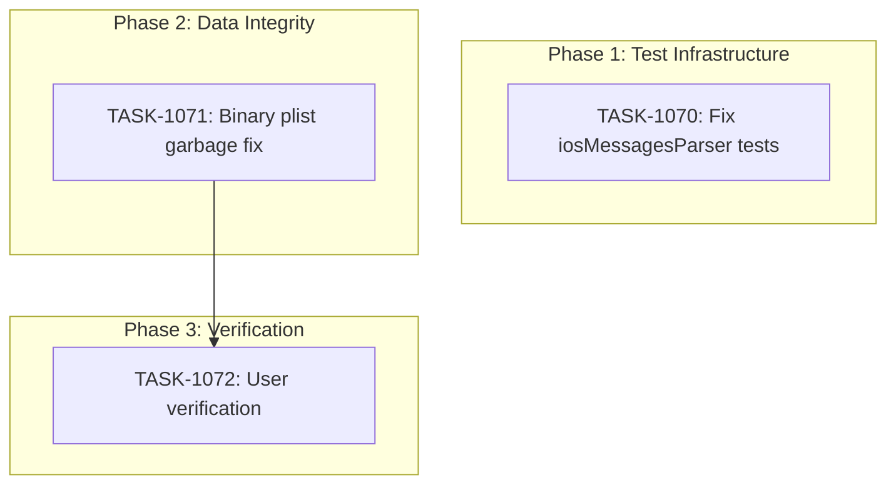

# SPRINT-038: Test Infrastructure & Data Integrity

**Created:** 2026-01-15
**Status:** PLANNING
**Branch:** `develop` (tasks branch from develop)

---

## Sprint Goal

Fix broken test infrastructure and resolve remaining message parsing data integrity issues. This sprint addresses: (1) 20 failing iosMessagesParser tests due to mock database setup issues, (2) binary plist garbage text that still appears in some messages despite previous fixes, and (3) user verification that deterministic parsing improvements work correctly.

## Problem Statement

### Current State

| Issue | Status | Impact |
|-------|--------|--------|
| iosMessagesParser tests | 20/46 failing | Test suite unreliable, coverage metrics inaccurate |
| Binary plist garbage text | Still appearing | User-facing data corruption in message display |
| Deterministic parsing | Unverified | Unknown if SPRINT-036 improvements work for real data |

**Root Causes:**

1. `iosMessagesParser.test.ts` mock database doesn't match actual iOS Messages schema
2. `looksLikeBinaryGarbage` detection misses UTF-16 interpreted binary patterns
3. No user verification of parsing improvements on real data

### Target State

- All 46 iosMessagesParser tests passing
- No garbage text in message display
- User confirmation that parsing works correctly

---

## Prerequisites / Environment Setup

Before starting sprint work, engineers must:
- [ ] `git checkout develop && git pull origin develop`
- [ ] `npm install`
- [ ] `npm rebuild better-sqlite3-multiple-ciphers`
- [ ] `npx electron-rebuild`
- [ ] Verify app starts: `npm run dev`
- [ ] Run failing tests to confirm state: `npm test -- --testPathPattern=iosMessagesParser`

**Note**: Native module rebuilds are required after `npm install` or Node.js updates.

---

## Scope

### In-Scope

1. **TASK-1070**: Fix `iosMessagesParser.test.ts` failing tests (20 tests)
2. **TASK-1071**: Complete binary plist garbage text fix
3. **TASK-1072**: User verification for deterministic parsing

### Out-of-Scope / Deferred

- **Unhandled rejection handlers** - Moved to Sprint A (technical debt)
- **iOS Messages parser feature expansion** - Only fix existing tests
- **New message parsing features** - Only fix existing garbage text issue
- **Full test coverage improvement** - That was SPRINT-037 scope

---

## Reprioritized Backlog

| ID | Title | Priority | Rationale | Dependencies | Conflicts |
|----|-------|----------|-----------|--------------|-----------|
| TASK-1070 | Fix iosMessagesParser test failures | 1 | Blocking test reliability | None | None |
| TASK-1071 | Binary plist garbage text fix | 2 | User-facing data integrity | None | None |
| TASK-1072 | User verification | 3 | Validate SPRINT-036 work | TASK-1071 | None |

---

## Phase Plan

### Phase 1: Test Infrastructure Fix (Sequential)

**Goal:** Fix all failing iosMessagesParser tests to restore test suite reliability.

| Task | Description | Est. Tokens | Depends On |
|------|-------------|-------------|------------|
| TASK-1070 | Fix iosMessagesParser.test.ts mock database issues | ~40K | - |

**Rationale:** Test infrastructure must be reliable before we can trust test results for other fixes.

**Integration checkpoint:** All 46 tests pass (`npm test -- --testPathPattern=iosMessagesParser`). CI must pass.

### Phase 2: Data Integrity Fix (Sequential)

**Goal:** Eliminate remaining garbage text in message display.

| Task | Description | Est. Tokens | Depends On |
|------|-------------|-------------|------------|
| TASK-1071 | Complete binary plist garbage text detection/handling | ~50K | - |

**Note:** TASK-1070 and TASK-1071 touch different files and could run in parallel if SR Engineer approves.

**Integration checkpoint:** No garbage text in diagnostic output. CI must pass.

### Phase 3: User Verification (Sequential)

**Goal:** Confirm with user that parsing improvements work correctly on their real data.

| Task | Description | Est. Tokens | Depends On |
|------|-------------|-------------|------------|
| TASK-1072 | User verification of message parsing | ~10K | TASK-1071 |

**Integration checkpoint:** User confirms no garbage text, messages display correctly.

---

## Merge Plan

- **Main branch**: `develop`
- **Feature branch format**: `fix/task-XXX-description`
- **Merge order** (explicit):
  1. TASK-1070 -> develop
  2. TASK-1071 -> develop
  3. TASK-1072 -> develop (if code changes needed)

**Note:** No integration branch needed - tasks are sequential and touch different files.

---

## Dependency Graph (Mermaid)



## Dependency Graph (YAML)

```yaml
dependency_graph:
  nodes:
    - id: TASK-1070
      type: task
      phase: 1
      title: Fix iosMessagesParser test failures
    - id: TASK-1071
      type: task
      phase: 2
      title: Binary plist garbage text fix
    - id: TASK-1072
      type: task
      phase: 3
      title: User verification
  edges:
    - from: TASK-1071
      to: TASK-1072
      type: depends_on
```

---

## Testing & Quality Plan (REQUIRED)

### Unit Testing

- **TASK-1070**: Fix existing tests (no new tests, fix mock setup)
- **TASK-1071**: Update existing tests for improved garbage detection
- **TASK-1072**: No code changes expected unless user finds issues

### Coverage Expectations

| Metric | Current | After Sprint |
|--------|---------|--------------|
| iosMessagesParser tests passing | 26/46 | 46/46 |
| Garbage text occurrences | >0 | 0 |

### Integration / Feature Testing

- Manual testing with user's real data (TASK-1072)

### CI / CD Quality Gates

The following MUST pass before merge:
- [x] Unit tests
- [x] Type checking
- [x] Linting
- [x] Build step

### Backend Revamp Safeguards

Not applicable - fixes do not change core parsing behavior, only improve edge case handling.

---

## Risk Register

| Risk | Likelihood | Impact | Mitigation |
|------|------------|--------|------------|
| Mock database fixes break other tests | Low | Medium | Run full test suite after mock changes |
| Garbage detection too aggressive | Medium | Medium | Test with known good messages |
| User finds new parsing issues | Medium | Low | Create follow-up backlog items |
| Binary plist detection causes regression | Low | High | Comprehensive test coverage |

---

## Decision Log

| # | Decision | Rationale | Date |
|---|----------|-----------|------|
| 1 | Separate test fix from parser fix | Different concerns, different files | 2026-01-15 |
| 2 | User verification as separate task | Cannot automate validation of "looks right" | 2026-01-15 |
| 3 | Defer unhandled rejection handlers | Technical debt, not blocking user experience | 2026-01-15 |

---

## Files Affected

| File | Changes | Task |
|------|---------|------|
| `electron/services/__tests__/iosMessagesParser.test.ts` | Fix mock database setup | TASK-1070 |
| `electron/services/iosMessagesParser.ts` | Possible minor fixes | TASK-1070 |
| `electron/utils/messageParser.ts` | Improve garbage detection | TASK-1071 |
| `electron/utils/encodingUtils.ts` | Possible encoding improvements | TASK-1071 |

---

## Metrics Tracking

### Token Estimates by Phase

| Phase | Tasks | Est. Tokens | Category | Multiplier | Adjusted |
|-------|-------|-------------|----------|------------|----------|
| Phase 1 | 1 | ~40K | test | 0.9x | ~36K |
| Phase 2 | 1 | ~50K | service | 0.5x | ~25K |
| Phase 3 | 1 | ~10K | test | 0.9x | ~9K |
| **Total** | **3** | **~100K** | - | - | **~70K** |

**SR Review Overhead:** +15K per task = +45K
**Sprint Total Estimate:** ~115K tokens

---

## Task Files

- `.claude/plans/tasks/TASK-1070-fix-ios-messages-parser-tests.md`
- `.claude/plans/tasks/TASK-1071-binary-plist-garbage-fix.md`
- `.claude/plans/tasks/TASK-1072-user-verification-parsing.md`

---

## Unplanned Work Log

**Instructions:** Update this section AS unplanned work is discovered during the sprint. Do NOT wait until sprint review.

| Task | Source | Root Cause | Added Date | Est. Tokens | Actual Tokens |
|------|--------|------------|------------|-------------|---------------|
| - | - | - | - | - | - |

### Unplanned Work Summary (Updated at Sprint Close)

| Metric | Value |
|--------|-------|
| Unplanned tasks | 0 |
| Unplanned PRs | 0 |
| Unplanned lines changed | +0/-0 |
| Unplanned tokens (est) | 0 |
| Unplanned tokens (actual) | 0 |
| Discovery buffer | 0% |

---

## End-of-Sprint Validation Checklist

- [ ] All 3 tasks merged to develop
- [ ] All 46 iosMessagesParser tests passing
- [ ] No garbage text in message display
- [ ] User verification complete
- [ ] No regressions in existing functionality
- [ ] Phase retro report created

---

## Sprint Review Criteria

### Definition of Done

- [ ] All 3 tasks merged to develop
- [ ] CI green on all PRs
- [ ] iosMessagesParser tests: 46/46 passing
- [ ] User confirms no garbage text

### Success Metrics

| Metric | Current | Target | Verified |
|--------|---------|--------|----------|
| iosMessagesParser tests passing | 26/46 | 46/46 | [ ] |
| Garbage text occurrences | >0 | 0 | [ ] |
| User satisfaction | Unverified | Confirmed | [ ] |
