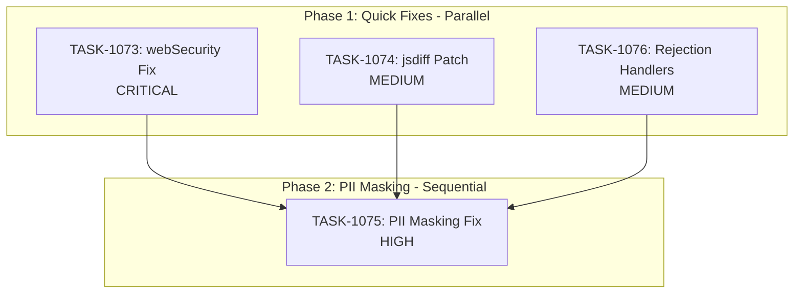

# Sprint Plan: SPRINT-039 - Security Hardening

## Sprint Goal

Address critical security vulnerabilities identified in SR Engineer audits, including:
1. Disabled webSecurity in OAuth popup windows
2. npm dependency vulnerability (jsdiff DoS)
3. Incomplete PII masking in LLM pipeline
4. Missing global unhandled rejection handlers

## Sprint Status: PLANNING

**Created:** 2026-01-15
**Updated:** 2026-01-15
**Target Branch:** develop
**Estimated Duration:** 2-3 days
**Total Estimated Tokens:** ~140K (with SR review overhead + buffer)

---

## Context

### Source

This sprint addresses security vulnerabilities identified during SR Engineer audits and npm audit reports. Security issues take priority over feature work.

### Priority Rationale

| Priority | Items Selected | Reason |
|----------|----------------|--------|
| CRITICAL | BACKLOG-232 (webSecurity disabled) | Security hole in OAuth flow |
| HIGH | BACKLOG-236 (PII masking) | Privacy/compliance risk with LLM calls |
| MEDIUM | BACKLOG-235 (jsdiff DoS) | npm audit vulnerability |
| MEDIUM | BACKLOG-233 (unhandled rejections) | App stability/crash prevention |

### Items NOT Included

| Backlog | Title | Reason |
|---------|-------|--------|
| Other security items | TBD | Address in future security sprint |

---

## In Scope

| Task | Backlog | Title | Est. Tokens | Phase | Priority |
|------|---------|-------|-------------|-------|----------|
| TASK-1073 | BACKLOG-232 | Fix disabled webSecurity in OAuth popup windows | ~30K | 1 | CRITICAL |
| TASK-1074 | BACKLOG-235 | Patch jsdiff DoS vulnerability | ~15K | 1 | MEDIUM |
| TASK-1075 | BACKLOG-236 | Fix incomplete PII masking in LLM pipeline | ~50K | 2 | HIGH |
| TASK-1076 | BACKLOG-233 | Add global unhandled rejection handlers | ~15K | 1 | MEDIUM |

**Total Estimated (implementation):** ~110K tokens
**SR Review Overhead:** +20K (4 tasks)
**Buffer (10%):** ~13K
**Grand Total:** ~143K tokens

---

## Out of Scope / Deferred

| Backlog | Title | Reason |
|---------|-------|--------|
| Other security items | TBD | Future security sprint |

---

## Phase Plan

### Phase 1: Quick Security Fixes (Parallel Safe)

```
Phase 1 (Parallel)
+-- TASK-1073: Fix disabled webSecurity in OAuth popup windows (CRITICAL)
+-- TASK-1074: Patch jsdiff DoS vulnerability (MEDIUM)
+-- TASK-1076: Add global unhandled rejection handlers (MEDIUM)
```

**Why parallel is safe:**
- TASK-1073 modifies: `googleAuthHandlers.ts`, `microsoftAuthHandlers.ts` (OAuth BrowserWindow config)
- TASK-1074 modifies: `package.json`, `package-lock.json` (dependency update only)
- TASK-1076 modifies: `electron/main.ts` (global handlers at startup)
- Completely different files and concerns

### Phase 2: PII Masking Enhancement (Sequential after Phase 1)

```
Phase 2 (Sequential)
+-- TASK-1075: Fix incomplete PII masking in LLM pipeline (HIGH)
```

**Why sequential:**
- More complex task requiring deeper investigation
- Touches LLM service layer which may have dependencies on app stability (Phase 1)
- Higher risk of rework if done in parallel with startup fixes

---

## Dependency Graph



### YAML Edges

```yaml
dependency_graph:
  nodes:
    - id: TASK-1073
      type: task
      phase: 1
      title: "Fix disabled webSecurity in OAuth popup windows"
      priority: critical
    - id: TASK-1074
      type: task
      phase: 1
      title: "Patch jsdiff DoS vulnerability"
      priority: medium
    - id: TASK-1075
      type: task
      phase: 2
      title: "Fix incomplete PII masking in LLM pipeline"
      priority: high
    - id: TASK-1076
      type: task
      phase: 1
      title: "Add global unhandled rejection handlers"
      priority: medium

  edges:
    - from: TASK-1073
      to: TASK-1075
      type: depends_on
      reason: "Phase 2 starts after Phase 1 complete"
    - from: TASK-1074
      to: TASK-1075
      type: depends_on
      reason: "Phase 2 starts after Phase 1 complete"
    - from: TASK-1076
      to: TASK-1075
      type: depends_on
      reason: "Phase 2 starts after Phase 1 complete"
```

---

## SR Engineer Technical Review

**Status:** APPROVED
**Review Date:** 2026-01-15
**Reviewer:** SR Engineer (Claude Opus 4.5)

### Review Summary

All tasks have been reviewed and approved. The sprint is well-structured with correct phasing and no file conflicts.

### File Matrix Analysis (VERIFIED)

| File | Tasks | Risk | Verification |
|------|-------|------|--------------|
| `electron/handlers/googleAuthHandlers.ts` | 1073 | No conflict | CONFIRMED - 4 BrowserWindow instances with `webSecurity: false` |
| `electron/handlers/microsoftAuthHandlers.ts` | 1073 | No conflict | CONFIRMED - 3 BrowserWindow instances with `webSecurity: false` |
| `package.json` | 1074 | No conflict | CONFIRMED - diff is transitive via jest/ts-node |
| `package-lock.json` | 1074 | No conflict | CONFIRMED |
| `electron/services/llm/contentSanitizer.ts` | 1075 | No conflict | CONFIRMED - already has comprehensive PII patterns |
| `electron/main.ts` | 1076 | No conflict | CONFIRMED - no existing global handlers |

### Parallel/Sequential Verification

**Phase 1 Parallel Safety: CONFIRMED**
- TASK-1073: Modifies OAuth handlers only
- TASK-1074: Modifies package files only
- TASK-1076: Modifies main.ts startup only
- No shared files, completely independent concerns

**Phase 2 Sequential Requirement: APPROPRIATE**
- TASK-1075 is correctly placed in Phase 2 due to complexity and testing requirements

### Technical Observations

1. **TASK-1073**: The OAuth handlers use `webSecurity: false` AND `allowRunningInsecureContent: true`. Both should be removed. The handlers also strip CSP headers which may be acceptable for OAuth flows.

2. **TASK-1074**: The jsdiff vulnerability is transitive through jest/ts-node chain. May need `npm audit fix` or override in package.json.

3. **TASK-1075**: The contentSanitizer.ts already exists with good patterns. The task is about verification and gap analysis, not building from scratch. Bank account pattern may over-match (8-17 digits catches many numbers).

4. **TASK-1076**: No existing global handlers in main.ts. Clean implementation path.

---

## Prerequisites / Environment Setup

Before starting sprint work, engineers must:
- [ ] `git checkout develop && git pull origin develop`
- [ ] `npm install`
- [ ] `npm rebuild better-sqlite3-multiple-ciphers`
- [ ] `npx electron-rebuild`
- [ ] Verify app starts: `npm run dev`
- [ ] Run `npm audit` to see current vulnerability state
- [ ] Have Google/Microsoft OAuth credentials for testing TASK-1073

---

## Testing & Quality Plan

### TASK-1073 (webSecurity OAuth Fix)
- **Goal:** OAuth flows work with webSecurity enabled
- **Unit Tests:** OAuth handler configuration tests
- **Integration Tests:** Complete OAuth flow for both Google and Microsoft
- **Manual Testing:** Sign in with both providers, verify token exchange works
- **Regression:** Existing OAuth functionality preserved

### TASK-1074 (jsdiff Vulnerability)
- **Goal:** npm audit shows no high/critical vulnerabilities
- **Unit Tests:** N/A (dependency update)
- **Integration Tests:** Verify any code using jsdiff still works
- **Manual Testing:** Run `npm audit` to confirm fix
- **Regression:** No breaking changes in diff functionality

### TASK-1075 (PII Masking)
- **Goal:** All PII masked before LLM calls
- **Unit Tests:** Test masking for emails, phones, addresses, SSNs
- **Integration Tests:** LLM call with PII content, verify masked in logs
- **Manual Testing:** Process real transaction emails, verify no PII in LLM requests
- **Regression:** LLM summarization still works correctly

### TASK-1076 (Unhandled Rejections)
- **Goal:** App handles uncaught exceptions gracefully
- **Unit Tests:** Handler registration and error logging
- **Integration Tests:** Trigger unhandled rejection, verify no crash
- **Manual Testing:** Force an unhandled rejection, verify app recovers
- **Regression:** Normal error handling unchanged

### CI Requirements
- All PRs must pass: `npm test`, `npm run type-check`, `npm run lint`
- `npm audit` must show no high/critical vulnerabilities (TASK-1074)
- No regressions in existing test coverage

---

## Progress Tracking

| Task | Phase | Status | Agent ID | Billable Tokens | Duration | PR |
|------|-------|--------|----------|-----------------|----------|-----|
| TASK-1073 | 1 | PENDING | - | - (est 30K) | - | - |
| TASK-1074 | 1 | PENDING | - | - (est 15K) | - | - |
| TASK-1075 | 2 | PENDING | - | - (est 50K) | - | - |
| TASK-1076 | 1 | PENDING | - | - (est 15K) | - | - |

---

## Risk Register

| Risk | Impact | Likelihood | Mitigation |
|------|--------|------------|------------|
| webSecurity re-enable breaks OAuth | High | Medium | Test both providers thoroughly before merge |
| jsdiff update introduces breaking changes | Medium | Low | Check changelog, run tests |
| PII patterns miss edge cases | High | Medium | Comprehensive regex testing, manual review |
| Unhandled rejection handler too aggressive | Medium | Low | Log-only approach, no auto-restart |

---

## Blocking Issues

| Issue | Affected Tasks | Resolution |
|-------|----------------|------------|
| None currently | - | - |

---

## Success Criteria

1. **CRITICAL:** OAuth flows work with webSecurity enabled
2. **HIGH:** All PII (emails, phones, addresses) masked before LLM calls
3. **MEDIUM:** npm audit shows no high/critical vulnerabilities
4. **MEDIUM:** Unhandled promise rejections logged without crashing app
5. **Quality:** All tests passing, no new flakiness

---

## End-of-Sprint Validation Checklist

- [ ] All tasks merged to develop
- [ ] All CI checks passing
- [ ] All acceptance criteria verified
- [ ] Testing requirements met
- [ ] No unresolved conflicts
- [ ] Documentation updated (sprint plan, backlog INDEX)
- [ ] Manual testing of Google OAuth flow
- [ ] Manual testing of Microsoft OAuth flow
- [ ] `npm audit` shows no high/critical vulnerabilities
- [ ] Verify PII masking in LLM calls (log review)
- [ ] Test unhandled rejection handling

---

## Unplanned Work Log

| Task | Source | Root Cause | Added Date | Est. Tokens | Actual Tokens |
|------|--------|------------|------------|-------------|---------------|
| - | - | - | - | - | - |

---

## Related Backlog Items

| ID | Title | Priority | Status | Sprint |
|----|-------|----------|--------|--------|
| BACKLOG-232 | Disabled webSecurity in OAuth Windows | Critical | In Sprint | SPRINT-039 |
| BACKLOG-235 | jsdiff DoS Vulnerability | Medium | In Sprint | SPRINT-039 |
| BACKLOG-236 | Incomplete PII Masking in LLM Pipeline | High | In Sprint | SPRINT-039 |
| BACKLOG-233 | Missing Unhandled Rejection Handlers | Medium | In Sprint | SPRINT-039 |

---

## Notes

- This sprint focuses on security vulnerabilities - all tasks are security-related
- webSecurity fix (TASK-1073) is CRITICAL - disabled web security is a significant risk
- PII masking (TASK-1075) is HIGH priority due to compliance implications
- Dependency update (TASK-1074) should be straightforward but requires regression testing
- This sprint runs in parallel with SPRINT-038 (Test/Data Integrity) as Sprint A
