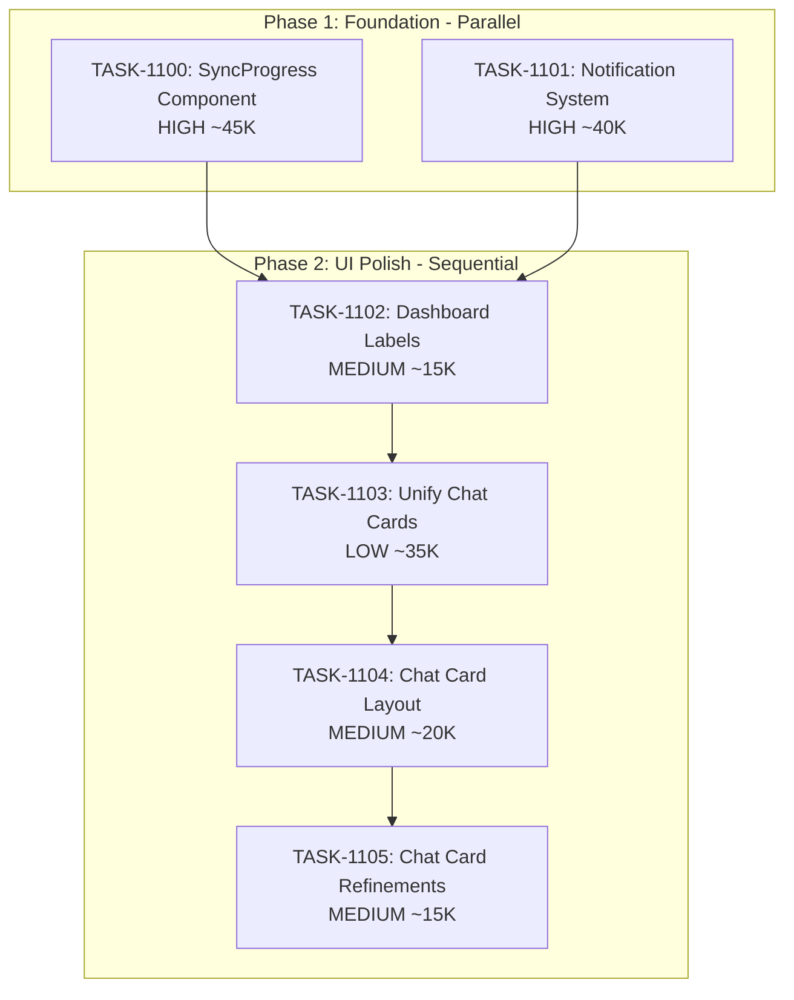

# Sprint Plan: SPRINT-040 - UI Design System Foundation

## Sprint Goal

Establish foundational UI patterns for consistency across the application:
1. Create reusable SyncProgress component with variants (compact, standard, detailed)
2. Unify notification/toast system with centralized API
3. Improve Dashboard button labels and layout (quick win)
4. Unify Chat/Group Chat card components

## Sprint Status: PLANNING

**Created:** 2026-01-16
**Updated:** 2026-01-16
**Target Branch:** develop
**Estimated Duration:** 3-4 days
**Total Estimated Tokens:** ~175K (with SR review overhead + buffer)

---

## Context

### Source

User requested a design sprint focused on UI consistency and component architecture. The goal is to build reusable foundation components first, then use them in features.

### Priority Rationale

| Priority | Items Selected | Reason |
|----------|----------------|--------|
| HIGH | BACKLOG-290 (Sync Progress Component) | Foundation for consistent progress UI across app |
| HIGH | BACKLOG-289 (Unified Notifications) | App-wide pattern for user feedback |
| MEDIUM | BACKLOG-288 (Dashboard Labels) | Quick win - visible UX improvement |
| LOW | BACKLOG-286 (Unify Chat Cards) | Component consolidation, lower priority |

### Items NOT Included This Sprint

| Backlog | Title | Reason |
|---------|-------|--------|
| BACKLOG-023 | Detailed Sync Progress | Depends on BACKLOG-290; schedule for follow-up sprint |
| BACKLOG-008 | New Transaction Flow | Depends on sync components; schedule for follow-up sprint |
| BACKLOG-291 | Enhanced Error Diagnostics | Lower priority, can use existing ErrorBoundary |

---

## In Scope

| Task | Backlog | Title | Est. Tokens | Phase | Priority |
|------|---------|-------|-------------|-------|----------|
| TASK-1100 | BACKLOG-290 | Reusable SyncProgress Component | ~45K | 1 | HIGH |
| TASK-1101 | BACKLOG-289 | Unified Notification System | ~40K | 1 | HIGH |
| TASK-1102 | BACKLOG-288 | Simplify Dashboard Button Labels | ~15K | 2 | MEDIUM |
| TASK-1103 | BACKLOG-286 | Unify Chat/Group Chat Cards | ~35K | 2 | LOW |
| TASK-1104 | N/A | Chat Card Layout Consistency | ~20K | 2 | MEDIUM |
| TASK-1105 | N/A | Chat Card Layout Refinements | ~15K | 2 | MEDIUM |

**Total Estimated (implementation):** ~170K tokens
**SR Review Overhead:** +36K (6 tasks, ~6K each)
**Buffer (10%):** ~21K
**Grand Total:** ~227K tokens

---

## Out of Scope / Deferred

| Backlog | Title | Reason |
|---------|-------|--------|
| BACKLOG-023 | Detailed Sync Progress | Use TASK-1100 component; separate follow-up sprint |
| BACKLOG-008 | New Transaction Flow | Use TASK-1100 component; separate follow-up sprint |
| BACKLOG-291 | Enhanced Error Diagnostics | Can leverage TASK-1101 notifications; defer |

---

## Phase Plan

### Phase 1: Foundation Components (Parallel Safe)

```
Phase 1 (Parallel)
+-- TASK-1100: Reusable SyncProgress Component (HIGH)
+-- TASK-1101: Unified Notification System (HIGH)
```

**Why parallel is safe:**
- TASK-1100 creates NEW files: `src/components/ui/SyncProgress/`
- TASK-1101 creates NEW files: `src/components/ui/Notification/`, `src/contexts/NotificationContext.tsx`
- Both tasks create new components in separate directories
- No shared file modifications in Phase 1
- App.tsx will be modified by TASK-1101 (adding provider) but this is isolated

### Phase 2: UI Polish (Sequential after Phase 1)

```
Phase 2 (Sequential after Phase 1 merges)
+-- TASK-1102: Simplify Dashboard Button Labels (MEDIUM)
    |
    +-- TASK-1103: Unify Chat/Group Chat Cards (LOW)
        |
        +-- TASK-1104: Chat Card Layout Consistency (MEDIUM)
            |
            +-- TASK-1105: Chat Card Layout Refinements (MEDIUM)
```

**Why sequential:**
- TASK-1102 is quick (~15K) - merges first to reduce conflict window
- TASK-1103 may use notification system from TASK-1101 for unlink feedback
- TASK-1104 modifies same file as TASK-1103 (MessageThreadCard.tsx) - must run after
- TASK-1105 modifies same file as TASK-1104 (MessageThreadCard.tsx) - must run after
- Ensures foundation components are available before UI polish tasks

---

## Dependency Graph



### YAML Edges

```yaml
dependency_graph:
  nodes:
    - id: TASK-1100
      type: task
      phase: 1
      title: "Reusable SyncProgress Component"
      priority: high
      est_tokens: 45K
    - id: TASK-1101
      type: task
      phase: 1
      title: "Unified Notification System"
      priority: high
      est_tokens: 40K
    - id: TASK-1102
      type: task
      phase: 2
      title: "Simplify Dashboard Button Labels"
      priority: medium
      est_tokens: 15K
    - id: TASK-1103
      type: task
      phase: 2
      title: "Unify Chat/Group Chat Cards"
      priority: low
      est_tokens: 35K
    - id: TASK-1104
      type: task
      phase: 2
      title: "Chat Card Layout Consistency"
      priority: medium
      est_tokens: 20K
    - id: TASK-1105
      type: task
      phase: 2
      title: "Chat Card Layout Refinements"
      priority: medium
      est_tokens: 15K

  edges:
    - from: TASK-1100
      to: TASK-1102
      type: depends_on
      reason: "Phase 2 starts after Phase 1 complete"
    - from: TASK-1101
      to: TASK-1102
      type: depends_on
      reason: "Phase 2 starts after Phase 1 complete"
    - from: TASK-1102
      to: TASK-1103
      type: depends_on
      reason: "Sequential within Phase 2"
    - from: TASK-1103
      to: TASK-1104
      type: depends_on
      reason: "Both modify MessageThreadCard.tsx"
    - from: TASK-1104
      to: TASK-1105
      type: depends_on
      reason: "Both modify MessageThreadCard.tsx"
```

---

## SR Engineer Technical Review

**Status:** APPROVED
**Review Date:** 2026-01-16
**Reviewer:** SR Engineer (claude-opus-4-5)

### Review Summary

Sprint plan is **APPROVED** with minor technical notes. Phase 1 parallel execution is safe as analyzed. Token estimates are reasonable.

**Key Findings:**
1. Phase 1 tasks (1100, 1101) are truly parallel-safe - no shared file modifications
2. App.tsx modification in TASK-1101 is isolated (adding provider wrapper)
3. Phase 2 sequential ordering is correct
4. Token estimates appear reasonable based on scope complexity

### File Matrix Analysis (VERIFIED)

| File | Tasks | Risk | Verification | Notes |
|------|-------|------|--------------|-------|
| `src/components/ui/SyncProgress/` (NEW) | 1100 | Low | CONFIRMED | New directory - no conflicts |
| `src/components/ui/Notification/` (NEW) | 1101 | Low | CONFIRMED | New directory - no conflicts |
| `src/contexts/NotificationContext.tsx` (NEW) | 1101 | Low | CONFIRMED | New file - existing contexts pattern |
| `src/hooks/useNotification.ts` (NEW) | 1101 | Low | CONFIRMED | New file - no collision with useToast.ts |
| `src/App.tsx` | 1101 | **Low** | VERIFIED | Only 35 lines - wrapping AppShell with provider |
| `src/components/Dashboard.tsx` | 1102 | Low | CONFIRMED | Text changes + arrow relocation only |
| `src/components/transactionDetailsModule/components/MessageThreadCard.tsx` | 1103, 1104, 1105 | Medium | CONFIRMED | Style unification (1103), layout consistency (1104), refinements (1105) - sequential |

### Parallel/Sequential Verification

**Phase 1 - PARALLEL SAFE:** CONFIRMED

| Check | TASK-1100 | TASK-1101 | Conflict? |
|-------|-----------|-----------|-----------|
| Creates `src/components/ui/` subdirectory | `SyncProgress/` | `Notification/` | NO - different dirs |
| Modifies App.tsx | No | Yes (provider wrap) | NO - only 1101 touches |
| Modifies existing hooks | No | No | NO - both create new |
| Modifies existing components | No | No | NO |

**Phase 2 - SEQUENTIAL:** CONFIRMED
- TASK-1102 (Dashboard) must wait for Phase 1 to establish patterns
- TASK-1103 (Chat Cards) follows 1102 to reduce conflict window

### Architecture Compliance

- [x] App.tsx stays within 70-line budget (currently 35 lines, adding provider stays under)
- [x] New components follow ui/ directory structure
- [x] Context pattern matches existing AuthContext, NetworkContext, PlatformContext
- [x] No architecture boundary violations identified

---

## Prerequisites / Environment Setup

Before starting sprint work, engineers must:
- [ ] `git checkout develop && git pull origin develop`
- [ ] `npm install`
- [ ] `npm rebuild better-sqlite3-multiple-ciphers`
- [ ] `npx electron-rebuild`
- [ ] Verify app starts: `npm run dev`
- [ ] Review existing components:
  - `src/components/iphone/SyncProgress.tsx` (current sync progress)
  - `src/components/Toast.tsx` (current toast implementation)
  - `src/hooks/useToast.ts` (current toast hook)
  - `src/components/Dashboard.tsx` (dashboard layout)
  - `src/components/transactionDetailsModule/components/MessageThreadCard.tsx` (chat cards)

---

## Testing & Quality Plan

### TASK-1100 (SyncProgress Component)
- **Goal:** Reusable progress component with 3 variants
- **Unit Tests:** Test each variant (compact, standard, detailed)
- **Unit Tests:** Test progress states (percentage, indeterminate, complete, error)
- **Unit Tests:** Test step rendering and status transitions
- **Integration Tests:** N/A (pure UI component)
- **Manual Testing:** Visual review of all variants in Storybook or test page
- **Regression:** Existing iPhone sync still works

### TASK-1101 (Notification System)
- **Goal:** Unified notification API available app-wide
- **Unit Tests:** NotificationContext provider and useNotification hook
- **Unit Tests:** Toast rendering for all types (success, error, warning, info)
- **Unit Tests:** Auto-dismiss and manual dismiss
- **Integration Tests:** Trigger notification from different components
- **Manual Testing:** Test notifications in various app states
- **Regression:** Existing toast functionality preserved during migration

### TASK-1102 (Dashboard Labels)
- **Goal:** Simplified, cleaner dashboard buttons
- **Unit Tests:** Dashboard component renders correct labels
- **Integration Tests:** N/A (text changes only)
- **Manual Testing:** Visual review of dashboard layout
- **Regression:** Dashboard navigation still works

### TASK-1103 (Unify Chat Cards)
- **Goal:** Single ThreadCard component for individual and group chats
- **Unit Tests:** Test both variants render correctly
- **Unit Tests:** Test props handling for both chat types
- **Integration Tests:** Cards work in transaction details view
- **Manual Testing:** Visual review of both chat types
- **Regression:** View/Unlink functionality preserved

### TASK-1104 (Chat Card Layout Consistency)
- **Goal:** Consistent layout between individual and group chat cards
- **Unit Tests:** Individual chat shows date range
- **Unit Tests:** Individual chat message badge is inline with title
- **Integration Tests:** Cards display correctly in transaction details view
- **Manual Testing:** Visual comparison of both card types side by side
- **Regression:** All existing card functionality preserved

### TASK-1105 (Chat Card Layout Refinements)
- **Goal:** Remove redundant info, restructure layout for better hierarchy
- **Unit Tests:** Update tests that assert phone number or "X people" pill
- **Integration Tests:** Cards display correctly in transaction details view
- **Manual Testing:** Visual review of simplified layout
- **Regression:** View/Unlink functionality preserved

### CI Requirements
- All PRs must pass: `npm test`, `npm run type-check`, `npm run lint`
- No regressions in existing test coverage
- Run tests 3x to verify no flakiness

---

## Progress Tracking

| Task | Phase | Status | Agent ID | Billable Tokens | Duration | PR |
|------|-------|--------|----------|-----------------|----------|-----|
| TASK-1100 | 1 | PENDING | - | - (est 45K) | - | - |
| TASK-1101 | 1 | PENDING | - | - (est 40K) | - | - |
| TASK-1102 | 2 | PENDING | - | - (est 15K) | - | - |
| TASK-1103 | 2 | PENDING | - | - (est 35K) | - | - |
| TASK-1104 | 2 | PENDING | - | - (est 20K) | - | - |
| TASK-1105 | 2 | PENDING | - | - (est 15K) | - | - |

---

## Risk Register

| Risk | Impact | Likelihood | Mitigation |
|------|--------|------------|------------|
| SyncProgress component doesn't cover all use cases | Medium | Low | Review existing sync UIs, define clear API |
| Notification migration breaks existing toasts | High | Medium | Incremental migration, keep old hooks during transition |
| Dashboard label changes affect i18n | Low | Low | Check for i18n usage (none expected) |
| Chat card unification loses functionality | Medium | Medium | Preserve all existing props and behaviors |

---

## Blocking Issues

| Issue | Affected Tasks | Resolution |
|-------|----------------|------------|
| None currently | - | - |

---

## Success Criteria

1. **SyncProgress Component:** Single component with 3 variants used for progress display
2. **Notification System:** Unified `notify.success/error/warning/info` API available everywhere
3. **Dashboard Labels:** Cleaner labels ("New Audit", "All Audits", "Contacts")
4. **Chat Cards:** Single `ThreadCard` component for individual and group chats
5. **Chat Card Layout:** Consistent layout (badge position, date range) for both card types
6. **Chat Card Refinements:** Simplified layout (no phone, no people pill, restructured hierarchy)
7. **Quality:** All tests passing, no flakiness, no coverage regression

---

## End-of-Sprint Validation Checklist

- [ ] All tasks merged to develop
- [ ] All CI checks passing
- [ ] All acceptance criteria verified
- [ ] Testing requirements met
- [ ] No unresolved conflicts
- [ ] Documentation updated (sprint plan, backlog INDEX)
- [ ] Manual testing of SyncProgress variants
- [ ] Manual testing of notification system
- [ ] Manual testing of Dashboard navigation
- [ ] Manual testing of chat cards in transaction details
- [ ] Visual comparison of individual vs group chat cards for layout consistency
- [ ] Visual verification of refined layout (no phone, no people pill)

---

## Unplanned Work Log

| Task | Source | Root Cause | Added Date | Est. Tokens | Actual Tokens |
|------|--------|------------|------------|-------------|---------------|
| TASK-1104 | Testing | Layout inconsistency discovered - badge position and date range differences | 2026-01-17 | ~20K | - |
| TASK-1105 | Testing | Layout refinements discovered - redundant phone/people info, suboptimal hierarchy | 2026-01-17 | ~15K | - |

---

## Related Backlog Items

| ID | Title | Priority | Status | Sprint |
|----|-------|----------|--------|--------|
| BACKLOG-290 | Reusable Sync Progress Component | Medium | In Sprint | SPRINT-040 |
| BACKLOG-289 | Unified Notification System | Medium | In Sprint | SPRINT-040 |
| BACKLOG-288 | Simplify Dashboard Button Labels | Low | In Sprint | SPRINT-040 |
| BACKLOG-286 | Unify Chat Card and Group Chat Card | Low | In Sprint | SPRINT-040 |

---

## Follow-Up Sprint Candidates

After SPRINT-040 completes, these items can use the new components:

| ID | Title | Dependency |
|----|-------|------------|
| BACKLOG-023 | Detailed Sync Progress | Uses TASK-1100 SyncProgress component |
| BACKLOG-008 | New Transaction Flow | Uses TASK-1100 for iPhone sync prompt |
| BACKLOG-291 | Enhanced Error Diagnostics | Uses TASK-1101 notifications |

---

## Notes

- This sprint focuses on establishing UI patterns, not consuming them
- Phase 1 tasks create NEW files/directories (parallel safe)
- Phase 2 tasks modify existing files (sequential)
- TASK-1101 (Notifications) may need to migrate existing useToast usages gradually
- Consider creating a Storybook or test page for visual review of new components
