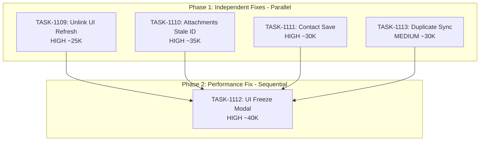

# Sprint Plan: SPRINT-041 - Bug Fixes Sprint

## Sprint Goal

Fix 5 user-facing bugs affecting core transaction and messaging functionality:
1. Unlink communications UI not refreshing after unlink action
2. iMessage attachments not displaying due to stale message_id references
3. Contact changes not saving when editing transaction
4. UI freeze when viewing messages to attach
5. Duplicate macOS Messages sync on dashboard load

## Sprint Status: OPEN

**Created:** 2026-01-17
**Target Branch:** develop
**Estimated Duration:** 2-3 days
**Total Estimated Tokens:** ~195K (with SR review overhead)

---

## Context

### Source

User reported multiple bugs affecting daily workflow. All are high-priority user-facing issues that block core functionality.

### Priority Rationale

| Priority | Items Selected | Reason |
|----------|----------------|--------|
| HIGH | BACKLOG-220 (Unlink UI) | Core workflow - users must refresh page to see changes |
| HIGH | BACKLOG-221 (Attachments) | Data integrity - attachments exist but don't display |
| HIGH | BACKLOG-222 (Contact Save) | Core workflow - changes silently lost |
| HIGH | BACKLOG-228 (UI Freeze) | Blocks core workflow - app becomes unresponsive |
| MEDIUM | BACKLOG-293 (Duplicate Sync) | Performance - 678K messages processed twice |

---

## In Scope

| Task | Backlog | Title | Est. Tokens | Phase | Priority |
|------|---------|-------|-------------|-------|----------|
| TASK-1109 | BACKLOG-220 | Fix Unlink Communications UI Refresh | ~25K | 1 | HIGH |
| TASK-1110 | BACKLOG-221 | Fix iMessage Attachments Stale ID | ~35K | 1 | HIGH |
| TASK-1111 | BACKLOG-222 | Fix Contact Changes Not Saving | ~30K | 1 | HIGH |
| TASK-1112 | BACKLOG-228 | Fix UI Freeze in AttachMessagesModal | ~40K | 2 | HIGH |
| TASK-1113 | BACKLOG-293 | Fix Duplicate macOS Messages Sync | ~30K | 1 | MEDIUM |

**Total Estimated (implementation):** ~160K tokens
**SR Review Overhead:** +25K (5 tasks, ~5K each)
**Buffer (10%):** ~10K
**Grand Total:** ~195K tokens

---

## Out of Scope / Deferred

| Item | Reason |
|------|--------|
| Full attachment re-import automation | TASK-1110 provides repair function; full automation deferred |
| Contact form validation improvements | Separate UX enhancement, not a bug |
| Message search performance optimization | Separate optimization effort |

---

## Phase Plan

### Phase 1: Independent Fixes (Parallel Safe)

```
Phase 1 (Parallel)
+-- TASK-1109: Fix Unlink UI Refresh (HIGH) - TransactionMessagesTab.tsx
+-- TASK-1110: Fix iMessage Attachments (HIGH) - macOSMessagesImportService.ts
+-- TASK-1111: Fix Contact Save (HIGH) - EditContactsModal.tsx
+-- TASK-1113: Fix Duplicate Sync (MEDIUM) - useMacOSMessagesImport.ts, BackgroundServices.tsx
```

**Why parallel is safe:**
- TASK-1109 modifies `TransactionMessagesTab.tsx` - isolated UI component
- TASK-1110 modifies `macOSMessagesImportService.ts` - backend service, no UI overlap
- TASK-1111 modifies `EditContactsModal.tsx` - separate modal, no shared state with 1109
- TASK-1113 modifies `useMacOSMessagesImport.ts` - hook file, no overlap with other tasks

**No shared file conflicts in Phase 1.**

### Phase 2: Performance Fix (After Phase 1)

```
Phase 2 (Sequential after Phase 1)
+-- TASK-1112: Fix UI Freeze in AttachMessagesModal (HIGH)
```

**Why Phase 2:**
- TASK-1112 may need insights from TASK-1110 (attachment handling patterns)
- More complex investigation required - benefits from stable codebase
- May touch multiple components depending on root cause

---

## Dependency Graph



### YAML Edges

```yaml
dependency_graph:
  nodes:
    - id: TASK-1109
      type: task
      phase: 1
      title: "Fix Unlink Communications UI Refresh"
      priority: high
      est_tokens: 25K
    - id: TASK-1110
      type: task
      phase: 1
      title: "Fix iMessage Attachments Stale ID"
      priority: high
      est_tokens: 35K
    - id: TASK-1111
      type: task
      phase: 1
      title: "Fix Contact Changes Not Saving"
      priority: high
      est_tokens: 30K
    - id: TASK-1112
      type: task
      phase: 2
      title: "Fix UI Freeze in AttachMessagesModal"
      priority: high
      est_tokens: 40K
    - id: TASK-1113
      type: task
      phase: 1
      title: "Fix Duplicate macOS Messages Sync"
      priority: medium
      est_tokens: 30K

  edges:
    - from: TASK-1109
      to: TASK-1112
      type: depends_on
      reason: "Phase 2 starts after Phase 1 complete"
    - from: TASK-1110
      to: TASK-1112
      type: depends_on
      reason: "Phase 2 starts after Phase 1 complete"
    - from: TASK-1111
      to: TASK-1112
      type: depends_on
      reason: "Phase 2 starts after Phase 1 complete"
    - from: TASK-1113
      to: TASK-1112
      type: depends_on
      reason: "Phase 2 starts after Phase 1 complete"
```

---

## SR Engineer Technical Review

**Status:** APPROVED
**Review Date:** 2026-01-17
**Reviewer:** SR Engineer (Claude Opus 4.5)

### Review Summary

Pre-implementation technical review complete. All 5 tasks analyzed for parallel safety, file conflicts, and architectural concerns.

**Key Findings:**
1. Phase 1 tasks (TASK-1109, 1110, 1111, 1113) are confirmed PARALLEL SAFE - no shared file conflicts
2. Phase 2 task (TASK-1112) correctly deferred - benefits from stable codebase and may reference Phase 1 patterns
3. Token estimates are reasonable based on task complexity
4. No architectural concerns or blockers identified

### File Matrix Analysis

| File | Tasks | Risk | Notes |
|------|-------|------|-------|
| `src/components/transactionDetailsModule/components/TransactionMessagesTab.tsx` | 1109 | Low | Isolated UI component, `onMessagesChanged` callback flows from parent |
| `src/components/TransactionDetails.tsx` | 1109 (parent) | Low | Parent provides `refreshMessages` via `useTransactionMessages` hook |
| `electron/services/macOSMessagesImportService.ts` | 1110 | Medium | Backend service only - no renderer overlap |
| `src/components/transactionDetailsModule/components/modals/EditContactsModal.tsx` | 1111 | Low | Isolated modal, no shared state with 1109 |
| `src/components/transactionDetailsModule/components/modals/AttachMessagesModal.tsx` | 1112 | Medium | Phase 2 - performance investigation |
| `src/hooks/useMacOSMessagesImport.ts` | 1113 | Low | Hook file, module-level sync guard likely fix |
| `src/appCore/BackgroundServices.tsx` | 1113 | Very Low | Only consumes hook, unlikely to need modification |

### Parallel/Sequential Verification

**Phase 1 - PARALLEL SAFE (Confirmed):**

| Task | Primary File(s) | Secondary File(s) | Conflicts With |
|------|-----------------|-------------------|----------------|
| TASK-1109 | `TransactionMessagesTab.tsx` | `TransactionDetails.tsx` (possible) | None |
| TASK-1110 | `macOSMessagesImportService.ts` | Schema/migrations (possible) | None |
| TASK-1111 | `EditContactsModal.tsx` | None expected | None |
| TASK-1113 | `useMacOSMessagesImport.ts` | `BackgroundServices.tsx` (unlikely) | None |

**Analysis:**
- TASK-1109 and TASK-1111 are both in `transactionDetailsModule/components/modals/` but modify different files
- TASK-1109 may touch `TransactionDetails.tsx` (parent), but 1111 does not
- TASK-1110 is purely backend (`electron/services/`)
- TASK-1113 is in `src/hooks/` and `src/appCore/` - no overlap with transaction components

**Phase 2 - SEQUENTIAL (Correct):**
- TASK-1112 deferred to Phase 2 is correct - performance investigation benefits from stable codebase
- May reference patterns from TASK-1110 (attachment handling)

### Token Estimate Validation

| Task | PM Estimate | SR Assessment | Notes |
|------|-------------|---------------|-------|
| TASK-1109 | ~25K | Reasonable | Callback chain tracing may be quick or slow |
| TASK-1110 | ~35K | Reasonable | Schema migration adds complexity |
| TASK-1111 | ~30K | Reasonable | State debugging may vary |
| TASK-1112 | ~40K | Reasonable | Performance profiling is unpredictable |
| TASK-1113 | ~30K | May be lower (~20K) | Module-level guard is straightforward |

**Total Estimate:** ~160K implementation + ~35K SR review = ~195K
**Assessment:** Reasonable buffer, no concerns

---

## Prerequisites / Environment Setup

Before starting sprint work, engineers must:
- [ ] `git checkout develop && git pull origin develop`
- [ ] `npm install`
- [ ] `npm rebuild better-sqlite3-multiple-ciphers`
- [ ] `npx electron-rebuild`
- [ ] Verify app starts: `npm run dev`
- [ ] Review related files:
  - `src/components/transactionDetailsModule/components/TransactionMessagesTab.tsx`
  - `src/components/transactionDetailsModule/components/modals/EditContactsModal.tsx`
  - `src/components/transactionDetailsModule/components/modals/AttachMessagesModal.tsx`
  - `electron/services/macOSMessagesImportService.ts`
  - `src/hooks/useMacOSMessagesImport.ts`

---

## Testing & Quality Plan

### TASK-1109 (Unlink UI Refresh)
- **Goal:** UI immediately updates after unlink
- **Unit Tests:** Test that state updates after successful unlink
- **Integration Tests:** N/A (UI state management)
- **Manual Testing:**
  1. Link messages to transaction
  2. Unlink messages
  3. Verify immediate UI update (no refresh needed)
- **Regression:** Unlink functionality still works

### TASK-1110 (iMessage Attachments)
- **Goal:** Attachments display correctly after import
- **Unit Tests:** Test attachment linking during import
- **Integration Tests:** Test end-to-end attachment display
- **Manual Testing:**
  1. Import macOS messages with attachments
  2. View conversation with attachments
  3. Verify images display (not "[Attachment]" placeholder)
- **Regression:** Existing attachment functionality preserved

### TASK-1111 (Contact Save)
- **Goal:** Contact changes persist after save
- **Unit Tests:** Test save handler collects updated state
- **Integration Tests:** Test full edit-save-reload cycle
- **Manual Testing:**
  1. Open transaction with contacts
  2. Add/remove/modify contacts
  3. Save changes
  4. Reload - verify changes persisted
- **Regression:** Existing contact loading works

### TASK-1112 (UI Freeze)
- **Goal:** AttachMessagesModal remains responsive
- **Unit Tests:** N/A (performance fix)
- **Integration Tests:** N/A
- **Manual Testing:**
  1. Open Attach Messages modal with large message database
  2. Navigate contacts and threads
  3. Verify UI remains responsive throughout
- **Regression:** Attach functionality still works

### TASK-1113 (Duplicate Sync)
- **Goal:** Sync triggers exactly once on dashboard load
- **Unit Tests:** Test sync guard prevents duplicate triggers
- **Integration Tests:** N/A
- **Manual Testing:**
  1. Login and navigate to dashboard
  2. Check logs - sync should appear only once
  3. Refresh page - should not trigger another sync
- **Regression:** Initial sync still works for new users

### CI Requirements
- All PRs must pass: `npm test`, `npm run type-check`, `npm run lint`
- No regressions in existing test coverage
- Run tests 3x to verify no flakiness

---

## Progress Tracking

| Task | Phase | Status | Agent ID | Billable Tokens | Duration | PR |
|------|-------|--------|----------|-----------------|----------|-----|
| TASK-1109 | 1 | PENDING | - | - | - | - |
| TASK-1110 | 1 | PENDING | - | - | - | - |
| TASK-1111 | 1 | PENDING | - | - | - | - |
| TASK-1112 | 2 | PENDING | - | - | - | - |
| TASK-1113 | 1 | PENDING | - | - | - | - |

---

## Risk Register

| Risk | Impact | Likelihood | Mitigation |
|------|--------|------------|------------|
| Attachment fix requires schema changes | High | Low | Prefer code-only solution; schema changes need migration |
| UI freeze has multiple causes | Medium | Medium | Start with profiling; may need follow-up task |
| Duplicate sync fix affects new user flow | Medium | Low | Test new user onboarding separately |
| Contact save fix reveals deeper state issues | Medium | Low | Scope to immediate fix; log findings for follow-up |

---

## Blocking Issues

| Issue | Affected Tasks | Resolution |
|-------|----------------|------------|
| None currently | - | - |

---

## Success Criteria

1. **Unlink UI:** Unlinking communication immediately removes it from UI (no refresh needed)
2. **Attachments:** Picture attachments display in conversation view after import
3. **Contact Save:** Adding/removing contacts during edit persists after save
4. **UI Freeze:** Attach Messages modal opens without freeze, UI remains responsive
5. **Duplicate Sync:** Sync triggers exactly once on dashboard load
6. **Quality:** All tests passing, no flakiness, no coverage regression

---

## End-of-Sprint Validation Checklist

- [ ] All tasks merged to develop
- [ ] All CI checks passing
- [ ] All acceptance criteria verified
- [ ] Testing requirements met
- [ ] No unresolved conflicts
- [ ] Documentation updated (sprint plan, backlog INDEX)
- [ ] Manual testing of all 5 bug fixes
- [ ] Regression testing of affected features

---

## Related Backlog Items

| ID | Title | Priority | Status | Sprint |
|----|-------|----------|--------|--------|
| BACKLOG-220 | Unlink Communications UI Not Refreshing | High | Open | SPRINT-041 |
| BACKLOG-221 | iMessage Attachments Not Displaying | High | Open | SPRINT-041 |
| BACKLOG-222 | Contact Changes Not Saving | High | Open | SPRINT-041 |
| BACKLOG-228 | UI Freeze When Viewing Messages | High | Open | SPRINT-041 |
| BACKLOG-293 | Duplicate macOS Messages Sync | Medium | Open | SPRINT-041 |

---

## Notes

- All Phase 1 tasks are independent and can run in parallel
- TASK-1112 (UI freeze) is Phase 2 because it may require deeper investigation
- Consider running Phase 1 tasks in separate Claude Web sessions for parallelism
- All tasks are bug fixes - use `fix/` branch prefix
