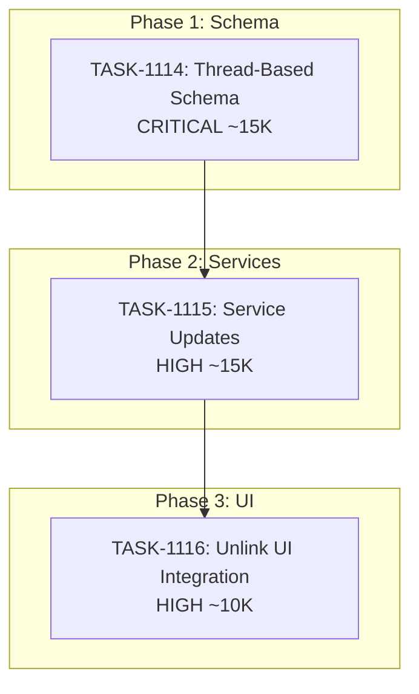

# Sprint Plan: SPRINT-042 - Database Schema Alignment Sprint

## Sprint Goal

Fix database architecture to properly align services with the thread-based communications model. This sprint addresses findings from the SR Engineer database schema audit and enables the Unlink UI fix that was blocked by architectural issues.

## Sprint Status: PLANNING

**Created:** 2026-01-17
**Target Branch:** develop
**Estimated Duration:** 3-5 days
**Total Estimated Tokens:** ~50K (with SR review overhead)

---

## Context

### Why This Sprint?

SPRINT-041 marked BACKLOG-220 (Unlink Communications UI) as complete via PR #450, but user testing revealed the fix was insufficient. Investigation showed the root cause is architectural:

1. The `communications` table links by `message_id` (individual messages)
2. UI operates on conversation threads (`thread_id`)
3. Unlinking creates a mismatch - UI expects thread-level operations, backend operates message-by-message

### Stashed Work Available

A thread-based schema refactor was started but deferred:
- **Stash:** `stash@{0}: TASK-1109-thread-based-schema-refactor-deferred`
- **Files:** 7 files, 502 insertions, 619 deletions
- **Scope:** schema.sql, communicationDbService.ts, transactionService.ts, databaseService.ts

### Schema Audit Reference

Full audit findings on branch `research/database-schema-audit`:
- Document: `.claude/docs/DATABASE-SCHEMA-AUDIT.md`
- **14 architectural findings** identified
- Critical: Duplicate junction tables, stale column references

---

## In Scope

| Task | Backlog | Title | Est. Tokens | Phase | Priority |
|------|---------|-------|-------------|-------|----------|
| TASK-1114 | BACKLOG-296 | Thread-Based Communications Schema | ~15K | 1 | CRITICAL |
| TASK-1115 | BACKLOG-296 | Service Updates (autoLink, exports) | ~15K | 2 | HIGH |
| TASK-1116 | BACKLOG-220 | Unlink UI Integration | ~10K | 3 | HIGH |

**Total Estimated (implementation):** ~40K tokens
**SR Review Overhead:** +10K (3 tasks, ~3K each)
**Buffer (10%):** ~5K
**Grand Total:** ~55K tokens

---

## Out of Scope / Deferred

| Item | Reason |
|------|--------|
| FINDING-01: Duplicate junction tables | Separate cleanup sprint |
| FINDING-03: Orphaned feedback service | Low impact, separate cleanup |
| FINDING-04: Dead FK columns | Future cleanup |
| Index optimization (FINDING-11) | Performance tuning sprint |

This sprint focuses narrowly on thread-based linking to unblock BACKLOG-220.

---

## Phase Plan

### Phase 1: Schema Changes

```
Phase 1 (Sequential)
+-- TASK-1114: Thread-Based Communications Schema
    - Modify communications table to use thread_id as primary join key
    - Add migration for existing data
    - Update communicationDbService.ts queries
```

**Why sequential:** Schema changes must complete before service updates.

### Phase 2: Service Updates

```
Phase 2 (Sequential after Phase 1)
+-- TASK-1115: Service Updates (autoLink, exports)
    - Update autoLinkService.ts to link by thread
    - Update enhancedExportService.ts, folderExportService.ts, pdfExportService.ts
    - Update transactionDbService.ts JOIN patterns
```

**Why sequential:** Depends on new schema being in place.

### Phase 3: UI Integration

```
Phase 3 (Sequential after Phase 2)
+-- TASK-1116: Unlink UI Integration
    - Verify unlink operates on thread level
    - Test UI refresh behavior
    - Complete BACKLOG-220 acceptance criteria
```

**Why sequential:** Depends on services working correctly.

---

## Dependency Graph



### YAML Edges

```yaml
dependency_graph:
  nodes:
    - id: TASK-1114
      type: task
      phase: 1
      title: "Thread-Based Communications Schema"
      priority: critical
      est_tokens: 15K
    - id: TASK-1115
      type: task
      phase: 2
      title: "Service Updates (autoLink, exports)"
      priority: high
      est_tokens: 15K
    - id: TASK-1116
      type: task
      phase: 3
      title: "Unlink UI Integration"
      priority: high
      est_tokens: 10K

  edges:
    - from: TASK-1114
      to: TASK-1115
      type: depends_on
      reason: "Services depend on new schema"
    - from: TASK-1115
      to: TASK-1116
      type: depends_on
      reason: "UI depends on services working correctly"
```

---

## Prerequisites / Environment Setup

Before starting sprint work, engineers must:
- [ ] `git checkout develop && git pull origin develop`
- [ ] Review stashed work: `git stash show -p stash@{0}`
- [ ] Review schema audit: `git show research/database-schema-audit:.claude/docs/DATABASE-SCHEMA-AUDIT.md`
- [ ] Understand current schema: `electron/database/schema.sql` (lines 696-750)
- [ ] Review affected services:
  - `electron/services/db/communicationDbService.ts`
  - `electron/services/autoLinkService.ts`
  - `electron/services/enhancedExportService.ts`
  - `electron/services/folderExportService.ts`
  - `electron/services/pdfExportService.ts`
  - `electron/services/db/transactionDbService.ts`

---

## Testing & Quality Plan

### TASK-1114 (Schema Changes)
- **Goal:** Communications link by thread_id, migration preserves data
- **Unit Tests:** Test new schema constraints, migration script
- **Integration Tests:** Verify existing data accessible via new queries
- **Manual Testing:**
  1. Run migration on existing database
  2. Verify communications still display in transaction view
  3. Verify no data loss
- **Regression:** All existing communication features work

### TASK-1115 (Service Updates)
- **Goal:** Services correctly query/update by thread
- **Unit Tests:** Test each service method with new schema
- **Integration Tests:** Test auto-linking creates thread-level links
- **Manual Testing:**
  1. Auto-link emails - verify thread linked, not individual messages
  2. Export transaction - verify counts are correct
  3. View communications in transaction - all messages in thread appear
- **Regression:** Exports produce valid output

### TASK-1116 (Unlink UI Integration)
- **Goal:** BACKLOG-220 acceptance criteria complete
- **Unit Tests:** Test unlink handler behavior
- **Integration Tests:** Full unlink flow
- **Manual Testing:**
  1. Link a conversation to transaction
  2. Click unlink on any message in the thread
  3. Verify ENTIRE thread is removed from transaction view
  4. NO page refresh required
  5. Verify in database - communications record deleted
- **Regression:** Link functionality still works

### CI Requirements
- All PRs must pass: `npm test`, `npm run type-check`, `npm run lint`
- Database migration tests must pass
- No regressions in existing test coverage

---

## Progress Tracking

| Task | Phase | Status | Agent ID | Billable Tokens | Duration | PR |
|------|-------|--------|----------|-----------------|----------|-----|
| TASK-1114 | 1 | TODO | - | - | - | - |
| TASK-1115 | 2 | TODO | - | - | - | - |
| TASK-1116 | 3 | TODO | - | - | - | - |

---

## Risk Register

| Risk | Impact | Likelihood | Mitigation |
|------|--------|------------|------------|
| Stashed work is outdated | Medium | Medium | Verify stash applies cleanly; may need manual merge |
| Migration fails on user data | High | Low | Thorough testing with real-world data patterns |
| Export format changes break downstream | High | Medium | Compare before/after exports; verify structure |
| Thread grouping logic differs between channels | Medium | Medium | Test both email and iMessage flows |

---

## Blocking Issues

| Issue | Affected Tasks | Resolution |
|-------|----------------|------------|
| None currently | - | - |

---

## Success Criteria

1. **Schema:** Communications link by thread_id, not message_id
2. **Services:** All affected services query correctly
3. **Auto-Link:** Links create one communication record per thread per transaction
4. **Unlink:** Unlinking removes thread from transaction (not individual messages)
5. **UI:** Immediate refresh after unlink (BACKLOG-220 complete)
6. **Exports:** Correct communication counts and content
7. **Quality:** All tests passing, no data loss

---

## Related Backlog Items

| ID | Title | Priority | Status | Sprint |
|----|-------|----------|--------|--------|
| BACKLOG-220 | Unlink Communications UI Not Refreshing | High | REOPENED | SPRINT-042 |
| BACKLOG-296 | Database Schema Alignment | High | In Progress | SPRINT-042 |

---

## References

- **Schema Audit:** `research/database-schema-audit` branch
- **Audit Document:** `.claude/docs/DATABASE-SCHEMA-AUDIT.md`
- **Stashed Work:** `stash@{0}: TASK-1109-thread-based-schema-refactor-deferred`
- **Previous Attempt:** SPRINT-041, PR #450

---

## Notes

- This is a focused, short sprint to fix a specific architectural issue
- Stashed work provides significant head start (~50% of implementation)
- Strictly sequential execution - each phase depends on the previous
- Consider creating backup of user database before migration
