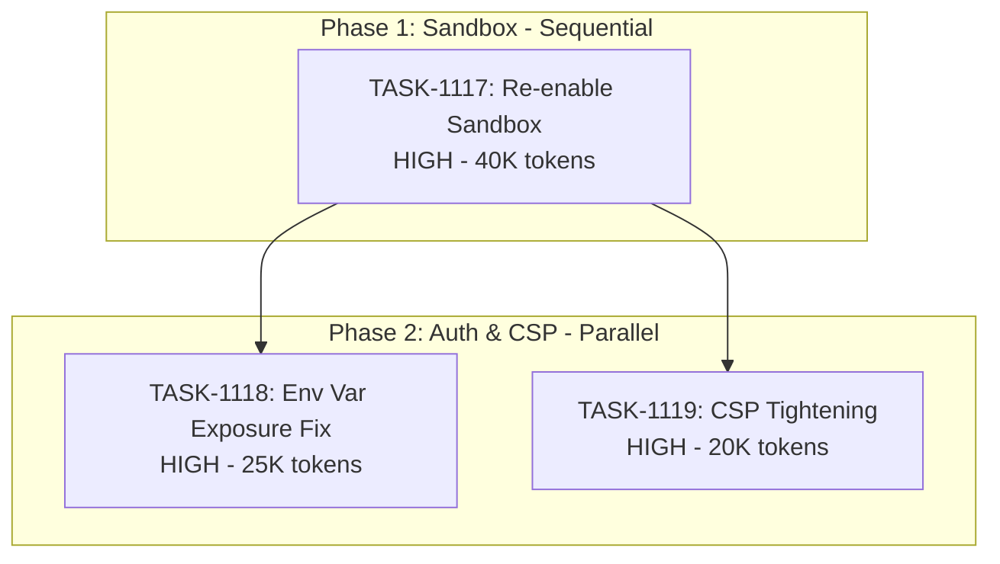

# Sprint Plan: SPRINT-043 - Security Hardening

## Sprint Goal

Address high-priority security vulnerabilities in Electron security configuration:
1. Re-enable sandbox for preload script (currently disabled)
2. Fix environment variable exposure in googleAuthService
3. Tighten Content Security Policy in development mode

## Sprint Status: COMPLETE

**Created:** 2026-01-18
**Completed:** 2026-01-18
**Target Branch:** develop
**Estimated Duration:** 2-3 days
**Total Estimated Tokens:** ~105K (with SR review overhead + buffer)

---

## Context

### Source

This sprint addresses security vulnerabilities identified during security audit. These are the remaining HIGH priority security items from the backlog (BACKLOG-247, 248, 249).

### Priority Rationale

| Priority | Items Selected | Reason |
|----------|----------------|--------|
| HIGH | BACKLOG-247 (sandbox disabled) | Process isolation security exposure |
| HIGH | BACKLOG-248 (env var exposure) | Credentials may leak to renderer process |
| HIGH | BACKLOG-249 (CSP permissive) | XSS attack surface in dev mode |

### Items NOT Included

| Backlog | Title | Reason |
|---------|-------|--------|
| BACKLOG-102 | Security Hardening Evaluation | Medium priority - future sprint |
| BACKLOG-277 | Secure CI Logs from Secret Exposure | Medium priority - future sprint |

---

## In Scope

| Task | Backlog | Title | Est. Tokens | Phase | Priority |
|------|---------|-------|-------------|-------|----------|
| TASK-1117 | BACKLOG-247 | Re-enable sandbox for preload script | ~40K | 1 | HIGH |
| TASK-1118 | BACKLOG-248 | Fix environment variable exposure in googleAuthService | ~25K | 2 | HIGH |
| TASK-1119 | BACKLOG-249 | Tighten CSP in development mode | ~20K | 2 | HIGH |

**Total Estimated (implementation):** ~85K tokens
**SR Review Overhead:** +15K (3 tasks)
**Buffer (10%):** ~10K
**Grand Total:** ~110K tokens

---

## Out of Scope / Deferred

| Backlog | Title | Reason |
|---------|-------|--------|
| BACKLOG-102 | Security Hardening Evaluation | Medium priority - future sprint |
| BACKLOG-277 | Secure CI Logs from Secret Exposure | Medium priority - future sprint |

---

## Phase Plan

### Phase 1: Sandbox Re-enablement (Sequential - Foundation)

```
Phase 1 (Sequential - Most Critical)
+-- TASK-1117: Re-enable sandbox for preload script (HIGH)
```

**Why Phase 1 is solo:**
- Sandbox affects how preload scripts interact with main process
- All preload bridges must be verified to work with sandbox enabled
- This is the foundation - if sandbox breaks anything, Phase 2 work would need adjustment
- Higher risk change requiring thorough validation

### Phase 2: Auth & CSP Hardening (Parallel Safe)

```
Phase 2 (Parallel)
+-- TASK-1118: Fix environment variable exposure in googleAuthService
+-- TASK-1119: Tighten CSP in development mode
```

**Why parallel is safe:**
- TASK-1118 modifies: `electron/services/googleAuthService.ts` (env var handling)
- TASK-1119 modifies: `electron/main.ts` (CSP directives only)
- Completely different files and concerns
- Both are hardening existing functionality, not changing architecture

---

## Dependency Graph



### YAML Edges

```yaml
dependency_graph:
  nodes:
    - id: TASK-1117
      type: task
      phase: 1
      title: "Re-enable sandbox for preload script"
      priority: high
    - id: TASK-1118
      type: task
      phase: 2
      title: "Fix environment variable exposure in googleAuthService"
      priority: high
    - id: TASK-1119
      type: task
      phase: 2
      title: "Tighten CSP in development mode"
      priority: high

  edges:
    - from: TASK-1117
      to: TASK-1118
      type: depends_on
      reason: "Phase 2 starts after sandbox work validated"
    - from: TASK-1117
      to: TASK-1119
      type: depends_on
      reason: "Phase 2 starts after sandbox work validated"
```

---

## SR Engineer Technical Review

**Status:** PENDING
**Review Date:** -
**Reviewer:** -

### Review Summary

*(To be completed by SR Engineer)*

### File Matrix Analysis

| File | Tasks | Risk | Notes |
|------|-------|------|-------|
| `electron/main.ts` | 1114, 1116 | Low | Different sections - webPreferences vs CSP setup |
| `electron/preload.ts` | 1114 | Low | May need verification, unlikely changes |
| `electron/preload/*.ts` | 1114 | Medium | All bridge modules need sandbox compatibility check |
| `electron/services/googleAuthService.ts` | 1115 | Low | Env var handling refactor |

### Parallel/Sequential Verification

*(To be completed by SR Engineer)*

### Technical Observations

*(To be completed by SR Engineer)*

---

## Prerequisites / Environment Setup

Before starting sprint work, engineers must:
- [ ] `git checkout develop && git pull origin develop`
- [ ] `npm install`
- [ ] `npm rebuild better-sqlite3-multiple-ciphers`
- [ ] `npx electron-rebuild`
- [ ] Verify app starts: `npm run dev`
- [ ] Have Google OAuth credentials for testing TASK-1118
- [ ] Review Electron sandbox documentation

---

## Testing & Quality Plan

### TASK-1117 (Sandbox Re-enablement)
- **Goal:** App works with sandbox: true (or removed, since true is default in Electron 20+)
- **Unit Tests:** Preload bridge function tests
- **Integration Tests:** Full IPC round-trip tests for all bridges
- **Manual Testing:**
  - App startup and login
  - OAuth flows (Google, Microsoft)
  - All major features (transactions, contacts, messages, sync)
- **Regression:** All existing functionality must work

### TASK-1118 (Env Var Exposure Fix)
- **Goal:** Environment variables not accessible from renderer process
- **Unit Tests:** Test that credentials are only used in main process
- **Integration Tests:** OAuth flow works without renderer access to env vars
- **Manual Testing:** Google login flow, verify no env vars in window context
- **Regression:** Google OAuth still works correctly

### TASK-1119 (CSP Tightening)
- **Goal:** Development CSP closer to production without breaking HMR
- **Unit Tests:** CSP directive validation tests
- **Integration Tests:** Dev mode app startup with tighter CSP
- **Manual Testing:**
  - `npm run dev` works with tighter CSP
  - HMR still functions
  - No console CSP violations during normal operation
- **Regression:** Development workflow not impacted

### CI Requirements
- All PRs must pass: `npm test`, `npm run type-check`, `npm run lint`
- No regressions in existing test coverage

---

## Progress Tracking

| Task | Phase | Status | Agent ID | Billable Tokens | Duration | PR |
|------|-------|--------|----------|-----------------|----------|-----|
| TASK-1117 | 1 | PENDING | - | - (est 40K) | - | - |
| TASK-1118 | 2 | PENDING | - | - (est 25K) | - | - |
| TASK-1119 | 2 | PENDING | - | - (est 20K) | - | - |

---

## Risk Register

| Risk | Impact | Likelihood | Mitigation |
|------|--------|------------|------------|
| Sandbox breaks preload functionality | High | Medium | Extensive testing of all IPC bridges before merge |
| Some bridge uses Node.js API incompatible with sandbox | High | Low | Current analysis shows all bridges only use ipcRenderer |
| CSP tightening breaks HMR | Medium | Medium | Test dev workflow thoroughly, keep escape hatch |
| Env var refactor breaks Google OAuth | High | Low | Test OAuth flow end-to-end |

---

## Blocking Issues

| Issue | Affected Tasks | Resolution |
|-------|----------------|------------|
| None currently | - | - |

---

## Success Criteria

1. **HIGH:** Preload script runs with sandbox enabled (default Electron 20+ behavior)
2. **HIGH:** Google OAuth credentials not accessible from renderer process
3. **HIGH:** Development CSP tightened (no unsafe-eval minimum)
4. **Quality:** All tests passing, no new flakiness
5. **Workflow:** Development experience unchanged (HMR works)

---

## End-of-Sprint Validation Checklist

- [ ] All tasks merged to develop
- [ ] All CI checks passing
- [ ] All acceptance criteria verified
- [ ] Testing requirements met
- [ ] No unresolved conflicts
- [ ] Documentation updated (sprint plan, backlog INDEX)
- [ ] Manual testing of app with sandbox enabled
- [ ] Manual testing of Google OAuth flow
- [ ] Manual testing of Microsoft OAuth flow
- [ ] Development workflow verified (npm run dev + HMR)
- [ ] No CSP violations in console during normal operation

---

## Unplanned Work Log

| Task | Source | Root Cause | Added Date | Est. Tokens | Actual Tokens |
|------|--------|------------|------------|-------------|---------------|
| - | - | - | - | - | - |

---

## Related Backlog Items

| ID | Title | Priority | Status | Sprint |
|----|-------|----------|--------|--------|
| BACKLOG-247 | Re-enable Sandbox for Preload Script | High | In Sprint | SPRINT-043 |
| BACKLOG-248 | Fix Environment Variable Exposure in googleAuthService | High | In Sprint | SPRINT-043 |
| BACKLOG-249 | Tighten CSP in Development Mode | High | In Sprint | SPRINT-043 |

---

## Notes

- This sprint focuses on Electron security hardening
- Sandbox re-enablement (TASK-1117) is the foundation - must complete first
- Current preload scripts only use `contextBridge` and `ipcRenderer` - should be sandbox-compatible
- Development CSP should be tightened but keep HMR working (may need targeted exceptions)
- This is the second security hardening sprint (first was SPRINT-039)
