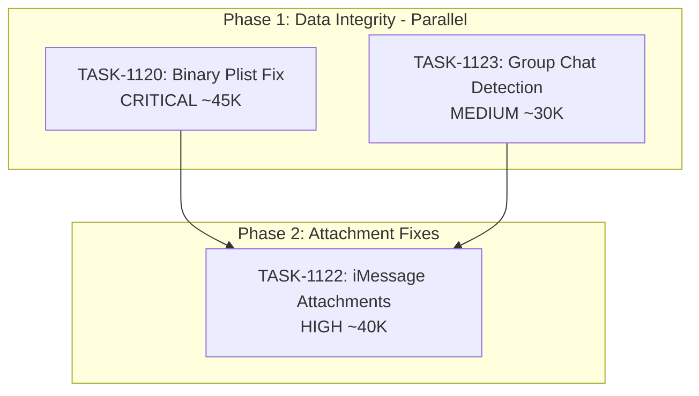

# Sprint Plan: SPRINT-044 - Reliability & Data Integrity

## Sprint Goal

Fix critical data integrity issues and improve application reliability. This sprint addresses the most impactful bugs affecting user experience: binary plist parsing failures, duplicate sync triggers, and iMessage attachment display issues.

## Sprint Status: PLANNING

**Created:** 2026-01-18
**Target Branch:** develop
**Estimated Duration:** 3-4 days
**Total Estimated Tokens:** ~145K (with SR review overhead + buffer)

---

## Context

### Why This Sprint?

Following SPRINT-043 (Security Hardening), the focus shifts to reliability and data integrity. User testing has revealed several critical issues:

1. **Binary plist text showing as garbage** (BACKLOG-229) - CRITICAL data integrity issue
2. ~~**Duplicate macOS messages sync** (BACKLOG-293)~~ - **ALREADY FIXED in TASK-1113 (SPRINT-041)**
3. **iMessage attachments not displaying** (BACKLOG-221) - Stale message_id after re-sync
4. **1:1 chats incorrectly shown as group chats** (BACKLOG-299) - Data quality issue

### Priority Rationale

| Priority | Items Selected | Reason |
|----------|----------------|--------|
| CRITICAL | BACKLOG-229 (binary plist) | Data shows as garbage - unusable messages |
| HIGH | BACKLOG-221 (iMessage attachments) | Attachments broken after re-sync |
| ~~MEDIUM~~ | ~~BACKLOG-293 (duplicate sync)~~ | **Already fixed - TASK-1113** |
| MEDIUM | BACKLOG-299 (group chat detection) | UX confusion on chat display |

### Items Deferred

| Backlog | Title | Reason |
|---------|-------|--------|
| BACKLOG-234 | Fix Race Condition in Sync Orchestrator | ~50K, complex - needs dedicated sprint |
| BACKLOG-237 | Reduce Transactions.tsx State Complexity | ~80K, large refactor - separate sprint |
| BACKLOG-228 | UI Freeze When Viewing Messages | Medium priority, can wait |
| BACKLOG-241 | Add Startup Health Checks | Operations focus - separate sprint |

---

## In Scope

| Task | Backlog | Title | Est. Tokens | Phase | Priority |
|------|---------|-------|-------------|-------|----------|
| TASK-1120 | BACKLOG-229 | Fix Binary Plist Text Garbage | ~45K | 1 | CRITICAL |
| ~~TASK-1121~~ | ~~BACKLOG-293~~ | ~~Fix Duplicate macOS Messages Sync~~ | ~~20K~~ | ~~1~~ | **REMOVED - Already done as TASK-1113** |
| TASK-1122 | BACKLOG-221 | Fix iMessage Attachments Not Displaying | ~40K | 2 | HIGH |
| TASK-1123 | BACKLOG-299 | Fix 1:1 Chat Group Detection | ~30K | 1 | MEDIUM |

**Total Estimated (implementation):** ~115K tokens (3 tasks)
**SR Review Overhead:** +12K (3 tasks @ ~4K each)
**Buffer (10%):** ~13K
**Grand Total:** ~140K tokens

**Note:** TASK-1123 moved to Phase 1 - it doesn't share files with TASK-1120 and can run in parallel.

---

## Out of Scope / Deferred

| Item | Reason |
|------|--------|
| BACKLOG-293 (Duplicate sync) | **Already fixed** as TASK-1113 in SPRINT-041 |
| BACKLOG-234 (Sync race condition) | Complex ~50K, needs architectural analysis |
| BACKLOG-237 (State complexity refactor) | Large ~80K refactor, separate sprint |
| BACKLOG-228 (UI freeze) | Lower priority than data integrity |
| BACKLOG-297 (Startup error handling) | UX improvement, not critical |

---

## Phase Plan

### Phase 1: Data Integrity & Display Fixes (Parallel Safe)

```
Phase 1 (Parallel - 2 tasks)
+-- TASK-1120: Fix Binary Plist Text Garbage (BACKLOG-229)
    - Fix messageParser.ts to handle remaining plist edge cases
    - Review prior work (TASK-1035, TASK-1046-1049) for gaps

+-- TASK-1123: Fix 1:1 Chat Group Detection (BACKLOG-299)
    - Add "unknown" filter to getThreadParticipants()
    - Investigate root cause in message import
```

**Why parallel is safe:**
- TASK-1120 modifies: `electron/utils/messageParser.ts` (parser internals)
- TASK-1123 modifies: `src/components/transactionDetailsModule/components/MessageThreadCard.tsx` (display logic)
- Completely different subsystems - no shared files

**TASK-1121 REMOVED:** Already implemented as TASK-1113 in SPRINT-041.

### Phase 2: Attachment Fixes (Sequential after Phase 1)

```
Phase 2 (After Phase 1 complete)
+-- TASK-1122: Fix iMessage Attachments Not Displaying (BACKLOG-221)
    - Fix stale message_id reference after re-sync
    - Update attachment linking to use stable identifiers
```

**Why Phase 2 after Phase 1:**
- TASK-1122 depends on parser working correctly (from TASK-1120)
- Attachment linking may surface issues if plist parsing is still broken

---

## Dependency Graph



**Note:** TASK-1121 removed - already completed as TASK-1113 in SPRINT-041.

### YAML Edges

```yaml
dependency_graph:
  nodes:
    - id: TASK-1120
      type: task
      phase: 1
      title: "Fix Binary Plist Text Garbage"
      priority: critical
      est_tokens: 45K
    - id: TASK-1123
      type: task
      phase: 1
      title: "Fix 1:1 Chat Group Detection"
      priority: medium
      est_tokens: 30K
    - id: TASK-1122
      type: task
      phase: 2
      title: "Fix iMessage Attachments Not Displaying"
      priority: high
      est_tokens: 40K

  edges:
    - from: TASK-1120
      to: TASK-1122
      type: depends_on
      reason: "Parser fixes should complete before attachment fixes"
    - from: TASK-1123
      to: TASK-1122
      type: soft_depends_on
      reason: "Phase gate - validate Phase 1 before Phase 2"
```

---

## SR Engineer Technical Review

**Status:** APPROVED WITH CHANGES
**Review Date:** 2026-01-18
**Reviewer:** Senior Engineer (PR Lead)

### Review Summary

Sprint proposal reviewed and approved with the following changes made:

1. **TASK-1121 REMOVED:** Duplicate of TASK-1113 (already completed in SPRINT-041)
   - `useMacOSMessagesImport.ts` and `useAutoRefresh.ts` already have module-level guards
   - No duplicate sync issue should remain; if it does, need new investigation

2. **TASK-1120 File Corrections:**
   - Primary file is `electron/utils/messageParser.ts` (contains plist parsing)
   - NOT `electron/services/iosMessagesParser.ts` (only reads raw data)
   - Extensive prior work exists (TASK-1035, TASK-1046-1049) - must review first

3. **TASK-1123 Enhanced Analysis:**
   - Root cause is in `getThreadParticipants()` not filtering "unknown"
   - Added two-pronged approach: display fix + data source investigation
   - Moved to Phase 1 (parallel safe with TASK-1120)

4. **Phase Reorganization:**
   - Phase 1: TASK-1120 + TASK-1123 (parallel, no shared files)
   - Phase 2: TASK-1122 only (depends on Phase 1)

5. **Token Estimates Adjusted:**
   - TASK-1120: 40K -> 45K (investigation of prior work)
   - TASK-1123: 25K -> 30K (may need root cause fix)
   - Total: ~140K (down from ~155K due to TASK-1121 removal)

### File Matrix Analysis

| File | Tasks | Risk | Notes |
|------|-------|------|-------|
| `electron/utils/messageParser.ts` | 1120 | Medium | Binary plist decoding (CORRECT file) |
| `electron/services/iosMessagesParser.ts` | 1120 | Low | May need minor text field handling |
| `src/components/.../MessageThreadCard.tsx` | 1123 | Low | getThreadParticipants() filter |
| `electron/services/db/communicationDbService.ts` | 1122 | Medium | Attachment queries |

**Note:** TASK-1121 removed - sync logic already fixed in TASK-1113.

### Parallel/Sequential Verification

**VERIFIED - Phase 1 is parallel safe:**

| Task | Primary Files | Conflicts With |
|------|--------------|----------------|
| TASK-1120 | `electron/utils/messageParser.ts` | None |
| TASK-1123 | `src/components/.../MessageThreadCard.tsx` | None |

These files are in completely different subsystems. Safe for parallel execution with isolated worktrees.

**Phase 2 must wait for Phase 1:**
- TASK-1122 depends on parser being fixed (TASK-1120)

### Technical Observations

1. **TASK-1120 has significant prior work:** Engineers MUST review TASK-1035, TASK-1046-1049 before starting. The issue may be in a specific edge case not covered by existing logic.

2. **TASK-1123 has two layers:** The immediate fix (filter "unknown" in display) is simple. The root cause (where "unknown" comes from in data) may require additional investigation.

3. **TASK-1122 schema risk:** The attachment linking approach may need review of the messages/attachments schema to understand how message_id stability works.

4. **Testing recommendation:** All tasks should include manual testing with real iMessage data, not just unit tests with mocked data.

---

## Prerequisites / Environment Setup

Before starting sprint work, engineers must:
- [ ] `git checkout develop && git pull origin develop`
- [ ] `npm install`
- [ ] `npm rebuild better-sqlite3-multiple-ciphers`
- [ ] `npx electron-rebuild`
- [ ] Verify app starts: `npm run dev`
- [ ] Have test iMessage backup with binary plist content (for TASK-1120)
- [ ] Have macOS with Messages access configured (for TASK-1121)

---

## Testing & Quality Plan

### TASK-1120 (Binary Plist Text Fix)
- **Goal:** Binary plist content renders as readable text
- **Unit Tests:** Test plist decoding functions with binary samples
- **Integration Tests:** Full parse cycle with binary plist messages
- **Manual Testing:**
  - Import iPhone backup with binary plist messages
  - Verify messages display correctly (not garbled)
  - Check existing messages after migration
- **Regression:** All existing message parsing tests pass

### TASK-1121 (Duplicate Sync Fix)
- **Goal:** macOS Messages sync triggers exactly once on dashboard load
- **Unit Tests:** Test sync guard/debounce logic
- **Integration Tests:** Dashboard load cycle test
- **Manual Testing:**
  - Login as returning user
  - Watch console/network for duplicate sync calls
  - Verify sync completes once
- **Regression:** Sync still works for first-time users

### TASK-1122 (iMessage Attachments Fix)
- **Goal:** Attachments display after re-sync
- **Unit Tests:** Test attachment linking with updated message_ids
- **Integration Tests:** Re-sync cycle with attachments
- **Manual Testing:**
  - Sync messages with attachments
  - Re-sync (simulate backup update)
  - Verify attachments still display
- **Regression:** Initial sync attachments work

### TASK-1123 (Group Chat Detection Fix)
- **Goal:** 1:1 chats display correctly, not as group chats
- **Unit Tests:** Test isGroupChat() logic with "unknown" participants
- **Integration Tests:** Chat display component tests
- **Manual Testing:**
  - View 1:1 conversation with one "unknown" contact
  - Verify displays as 1:1, not group
  - Verify actual group chats still show correctly
- **Regression:** Multi-party group chats still detected

### CI Requirements
- All PRs must pass: `npm test`, `npm run type-check`, `npm run lint`
- No regressions in existing test coverage

---

## Progress Tracking

| Task | Phase | Status | Agent ID | Billable Tokens | Duration | PR |
|------|-------|--------|----------|-----------------|----------|-----|
| TASK-1120 | 1 | TODO | - | - (est 45K) | - | - |
| ~~TASK-1121~~ | ~~1~~ | **REMOVED** | TASK-1113 | - | - | **Already done** |
| TASK-1122 | 2 | TODO | - | - (est 40K) | - | - |
| TASK-1123 | 1 | TODO | - | - (est 30K) | - | - |

---

## Risk Register

| Risk | Impact | Likelihood | Mitigation |
|------|--------|------------|------------|
| Binary plist has multiple encoding variants | High | Medium | Test with diverse real-world samples |
| Prior work (TASK-1035) may have covered issue | Medium | Medium | Review prior implementation first |
| Attachment fix may need schema changes | High | Low | Review schema before starting |
| Parser changes affect other message types | High | Medium | Comprehensive regression testing |
| "unknown" participant has semantic meaning | Medium | Low | Investigate source before filtering |

---

## Blocking Issues

| Issue | Affected Tasks | Resolution |
|-------|----------------|------------|
| BACKLOG-231 (20 failing iosMessagesParser tests) | TASK-1120 | May need to fix these first or as part of task |

---

## Success Criteria

1. **Binary Plist:** Messages with binary plist content display readable text
2. **Duplicate Sync:** Dashboard load triggers macOS sync exactly once
3. **Attachments:** iMessage attachments display correctly after re-sync
4. **Group Detection:** 1:1 conversations show as 1:1 (not group)
5. **Quality:** All tests passing, no new regressions

---

## End-of-Sprint Validation Checklist

- [ ] All tasks merged to develop
- [ ] All CI checks passing
- [ ] All acceptance criteria verified
- [ ] Testing requirements met
- [ ] No unresolved conflicts
- [ ] Documentation updated (sprint plan, backlog)
- [ ] Manual testing of all fixed scenarios
- [ ] Binary plist messages render correctly
- [ ] macOS sync triggers only once
- [ ] Attachments persist through re-sync
- [ ] 1:1 chats display correctly

---

## Unplanned Work Log

| Task | Source | Root Cause | Added Date | Est. Tokens | Actual Tokens |
|------|--------|------------|------------|-------------|---------------|
| - | - | - | - | - | - |

---

## Related Backlog Items

| ID | Title | Priority | Status | Sprint |
|----|-------|----------|--------|--------|
| BACKLOG-229 | Binary Plist Text Still Showing as Garbage | Critical | In Sprint | SPRINT-044 |
| BACKLOG-293 | Duplicate macOS Messages Sync | Medium | **CLOSED** | SPRINT-041 (TASK-1113) |
| BACKLOG-221 | iMessage Attachments Not Displaying | High | In Sprint | SPRINT-044 |
| BACKLOG-299 | 1:1 Chat Incorrectly Shown as Group Chat | Medium | In Sprint | SPRINT-044 |

---

## Notes

- BACKLOG-229 was marked incomplete from SPRINT-036 (TASK-1035) - review prior work before starting
- TASK-1121 removed during SR Engineer review - already implemented as TASK-1113
- Phase 1 has 2 parallel tasks (TASK-1120 and TASK-1123) - safe with isolated worktrees
- Phase 2 has 1 task (TASK-1122) - depends on Phase 1 parser fixes
- TASK-1120: Primary file is `messageParser.ts` NOT `iosMessagesParser.ts`

---

## References

- **BACKLOG-229:** Previous attempt in SPRINT-036, TASK-1035
- **BACKLOG-231:** Related test failures (may need addressing)
- **SPRINT-033:** Previous iMessage stability work
- **SPRINT-036:** Deterministic message parsing work
