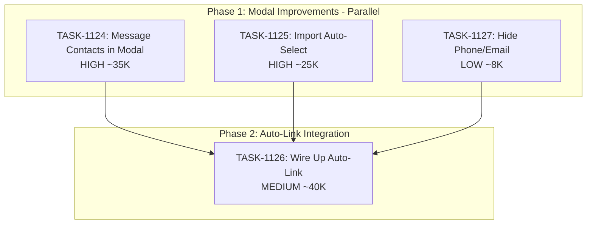

# Sprint Plan: SPRINT-045 - Contact Workflow Improvements

## Sprint Goal

Improve the contact selection and import workflow in transaction editing. This sprint addresses UX friction in the contact modal, adds missing message-derived contacts to the picker, and fixes the auto-link feature that was implemented but not triggering properly.

## Sprint Status: COMPLETED

**Created:** 2026-01-19
**Completed:** 2026-01-19
**Target Branch:** develop
**Estimated Duration:** 2-3 days
**Actual Duration:** 1 day
**Total Estimated Tokens:** ~130K (with SR review overhead + buffer)
**Total Actual Tokens:** ~180K (including post-sprint fixes)

---

## Context

### Why This Sprint?

User testing revealed several friction points in the contact workflow:

1. **Message-derived contacts missing from picker** (BACKLOG-307) - Users have 2206 contacts in messages but 0 in the Select Contact modal
2. **Import flow doesn't auto-select** (BACKLOG-309) - Users must manually find the contact they just imported
3. **Auto-link not triggering** (BACKLOG-207) - The autoLinkService exists but doesn't get called when contacts are added
4. **UI clutter in contact modal** (BACKLOG-306) - Phone/email display is unnecessary noise

### Priority Rationale

| Priority | Items Selected | Reason |
|----------|----------------|--------|
| HIGH | BACKLOG-307 (message contacts) | Major UX blocker - users can't find their contacts |
| HIGH | BACKLOG-309 (import flow) | Workflow friction - extra manual steps |
| MEDIUM | BACKLOG-207 (auto-link) | Enhancement - saves manual message attachment |
| LOW | BACKLOG-306 (hide phone/email) | Polish - reduces visual clutter |

### Items Deferred

None - all requested items fit in sprint capacity.

---

## In Scope

| Task | Backlog | Title | Est. Tokens | Phase | Priority |
|------|---------|-------|-------------|-------|----------|
| TASK-1124 | BACKLOG-307 | Add Message-Derived Contacts to Select Modal | ~45K | 1 | HIGH |
| TASK-1125 | BACKLOG-309 | Fix Import Contact Auto-Select and Refresh | ~25K | 1 | HIGH |
| TASK-1126 | BACKLOG-207 | Wire Up Auto-Link on Contact Add | ~40K | 2 | MEDIUM |
| TASK-1127 | BACKLOG-306 | Hide Phone/Email in Contact Select Modal | ~8K | 1 | LOW |

**Total Estimated (implementation):** ~118K tokens (updated after SR review)
**SR Review Overhead:** +16K (4 tasks @ ~4K each)
**Buffer (10%):** ~13K
**Grand Total:** ~147K tokens

---

## Out of Scope / Deferred

| Item | Reason |
|------|--------|
| Bulk import auto-link | BACKLOG-207 specifies NOT during bulk import for performance |
| Settings to disable auto-link | Stretch goal in BACKLOG-207, not MVP |

---

## Phase Plan

### Phase 1: Modal Improvements (Parallel Safe)

```
Phase 1 (Parallel - 3 tasks)
+-- TASK-1124: Add Message-Derived Contacts to Select Modal
    - Modify contact query to include message participants
    - Merge with imported contacts, deduplicate
    - Test with 2000+ contacts for performance

+-- TASK-1125: Fix Import Contact Auto-Select and Refresh
    - Return imported contact IDs from ImportContactsModal
    - Auto-select those IDs in ContactSelectModal
    - Ensure refresh reliably shows new contacts

+-- TASK-1127: Hide Phone/Email in Contact Select Modal
    - Remove phone/email display from contact list items
    - Keep search functionality for email (search, don't display)
    - Simple CSS/JSX removal
```

**Why parallel is safe:**
- TASK-1124: Modifies `contact-handlers.ts`, `databaseService.ts` (backend query)
- TASK-1125: Modifies `ContactSelectModal.tsx`, `ImportContactsModal.tsx` (UI flow)
- TASK-1127: Modifies `ContactSelectModal.tsx` (different section - display, not data flow)

**Note on TASK-1125 and TASK-1127:** Both touch `ContactSelectModal.tsx`, but:
- TASK-1125: Adds `onSuccess` callback handling and state for auto-select
- TASK-1127: Removes JSX in the contact list item render

These are in different code sections and can be merged sequentially after parallel implementation. SR Engineer should coordinate merge order.

### Phase 2: Auto-Link Integration (After Phase 1)

```
Phase 2 (After Phase 1 complete)
+-- TASK-1126: Wire Up Auto-Link on Contact Add
    - Call autoLinkCommunicationsForContact when contact added to transaction
    - Show toast notification with results
    - Test end-to-end: add contact -> verify messages linked
```

**Why Phase 2 after Phase 1:**
- Auto-link should work with both imported AND message-derived contacts
- Phase 1 ensures contacts can be found; Phase 2 links their communications
- If auto-link is wired first, users still can't find the contacts to add

---

## Dependency Graph



### YAML Edges

```yaml
dependency_graph:
  nodes:
    - id: TASK-1124
      type: task
      phase: 1
      title: "Add Message-Derived Contacts to Select Modal"
      priority: high
      est_tokens: 35K
    - id: TASK-1125
      type: task
      phase: 1
      title: "Fix Import Contact Auto-Select and Refresh"
      priority: high
      est_tokens: 25K
    - id: TASK-1126
      type: task
      phase: 2
      title: "Wire Up Auto-Link on Contact Add"
      priority: medium
      est_tokens: 40K
    - id: TASK-1127
      type: task
      phase: 1
      title: "Hide Phone/Email in Contact Select Modal"
      priority: low
      est_tokens: 8K

  edges:
    - from: TASK-1124
      to: TASK-1126
      type: depends_on
      reason: "Auto-link needs message contacts to be findable"
    - from: TASK-1125
      to: TASK-1126
      type: soft_depends_on
      reason: "Phase gate - complete modal work before integration"
    - from: TASK-1127
      to: TASK-1126
      type: soft_depends_on
      reason: "Phase gate"
```

---

## SR Engineer Technical Review

**Status:** APPROVED WITH CORRECTIONS
**Review Date:** 2026-01-19

### Review Findings

1. **TASK-1124 Query Design:**
   - **CORRECTED:** Original task referenced non-existent `sender` column
   - Messages table uses `participants` (JSON) with `json_extract(participants, '$.from')`
   - Estimate increased from ~35K to ~45K due to JSON parsing complexity
   - Performance testing remains important

2. **TASK-1125/TASK-1127 Merge Coordination:**
   - **VERIFIED SAFE:** Different code sections in `ContactSelectModal.tsx`
   - TASK-1127: Lines 274-289 (contact list item display)
   - TASK-1125: Lines 326-336 (onSuccess handler)
   - **Merge Order:** TASK-1127 first, then TASK-1125

3. **TASK-1126 Auto-Link Integration Point:**
   - **CORRECTED:** No `transactions:add-contact` handler exists
   - Must use `transactions:batchUpdateContacts` handler (lines 752-853)
   - Added import requirement for `autoLinkCommunicationsForContact`
   - Toast system exists at `src/hooks/useToast.ts` - no new infrastructure needed

### Updated Estimates

| Task | Original | Updated | Reason |
|------|----------|---------|--------|
| TASK-1124 | ~35K | **~45K** | JSON parsing complexity |
| TASK-1125 | ~25K | ~25K | No change |
| TASK-1126 | ~40K | ~40K | No change |
| TASK-1127 | ~8K | ~8K | No change |
| **Total** | ~108K | **~118K** | +10K for TASK-1124 |

---

## Prerequisites / Environment Setup

Before starting sprint work, engineers must:
- [ ] `git checkout develop && git pull origin develop`
- [ ] `npm install`
- [ ] `npm rebuild better-sqlite3-multiple-ciphers`
- [ ] `npx electron-rebuild`
- [ ] Verify app starts: `npm run dev`
- [ ] Have test data with message contacts (not just imported)

---

## Testing & Quality Plan

### TASK-1124 (Message Contacts in Modal)
- **Goal:** Select Contact modal shows contacts from messages
- **Unit Tests:** Query returns message participants
- **Integration Tests:** Full modal load with merged contacts
- **Manual Testing:**
  - Import messages but not contacts
  - Open Select Contact modal
  - Verify message senders/recipients appear
- **Performance Test:** 2000+ contacts load in < 2 seconds

### TASK-1125 (Import Auto-Select)
- **Goal:** Imported contacts are auto-selected in picker
- **Unit Tests:** `onSuccess` returns contact IDs
- **Integration Tests:** Full import flow
- **Manual Testing:**
  - Open Select Contact modal
  - Click Import, select contact, import
  - Verify contact is selected after modal closes
- **Regression:** Manual selection still works

### TASK-1126 (Auto-Link)
- **Goal:** Adding contact auto-links their communications
- **Unit Tests:** Auto-link service already has tests
- **Integration Tests:** Add contact -> verify communications linked
- **Manual Testing:**
  - Add contact with known emails/messages
  - Check Messages tab shows linked items
  - Verify toast notification appears
- **Regression:** Manual attach still works

### TASK-1127 (Hide Phone/Email)
- **Goal:** Contact modal shows only names
- **Manual Testing:**
  - Open Select Contact modal
  - Verify only names displayed (no phone/email)
  - Verify search by email still works
- **Regression:** Contact selection functionality unchanged

### CI Requirements
- All PRs must pass: `npm test`, `npm run type-check`, `npm run lint`
- No regressions in existing test coverage

---

## Progress Tracking

### Original Sprint Tasks

| Task | Phase | Status | Billable Tokens | Duration | PR |
|------|-------|--------|-----------------|----------|-----|
| TASK-1127 | 1 | MERGED | ~8K | - | #472 |
| TASK-1125 | 1 | MERGED | ~25K | - | #474 |
| TASK-1124 | 1 | MERGED | ~35K | - | #473 |
| TASK-1126 | 2 | MERGED | ~20K | - | #475 |

### Additional Sprint Tasks (Phase 2)

| Task | Status | Billable Tokens | PR |
|------|--------|-----------------|-----|
| TASK-1128 | MERGED | ~10K | #479 |
| TASK-1129 | MERGED | ~15K | #481 |
| TASK-1130 | MERGED | ~8K | #482 |
| TASK-1131 | MERGED | ~10K | #483 |
| TASK-1132 | MERGED | ~5K | #484 |

### Post-Sprint Performance Fixes (BACKLOG-311)

| Fix | Status | Billable Tokens | PR |
|-----|--------|-----------------|-----|
| Lift contact loading to parent | MERGED | ~15K | #477 |
| Fix N+1 query in getContactsSortedByActivity | MERGED | ~10K | #478 |

---

## Risk Register

| Risk | Impact | Likelihood | Mitigation |
|------|--------|------------|------------|
| Phase 1 file conflicts (ContactSelectModal) | Medium | High | SR Engineer coordinates merge order |
| Message contact query performance | Medium | Medium | Add LIMIT, test with large dataset |
| Auto-link service has hidden bugs | Medium | Low | Review existing tests, add integration test |
| Contact deduplication misses edge cases | Low | Medium | Use normalized email/phone for matching |

---

## Blocking Issues

| Issue | Affected Tasks | Resolution |
|-------|----------------|------------|
| None identified | - | - |

---

## Success Criteria

1. **Message Contacts:** Contacts from messages appear in Select Contact modal
2. **Import Flow:** Imported contacts are auto-selected
3. **Auto-Link:** Adding a contact links their emails/messages to the transaction
4. **Clean UI:** Contact modal shows names only (no phone/email clutter)
5. **Quality:** All tests passing, no new regressions

---

## End-of-Sprint Validation Checklist

- [x] All tasks merged to develop
- [x] All CI checks passing
- [x] All acceptance criteria verified
- [x] Testing requirements met
- [x] No unresolved conflicts
- [x] Message-derived contacts visible in modal
- [x] Import auto-selects contacts
- [x] Auto-link triggers on contact add
- [x] Phone/email hidden in modal display
- [x] Performance fix: contact loading lifted to parent (BACKLOG-311)
- [x] Performance fix: N+1 query resolved

---

## Unplanned Work Log

| Task | Source | Root Cause | Added Date | Est. Tokens | Actual Tokens |
|------|--------|------------|------------|-------------|---------------|
| - | - | - | - | - | - |

---

## Related Backlog Items

| ID | Title | Priority | Status | PR |
|----|-------|----------|--------|-----|
| BACKLOG-207 | Auto-Link Communications When Contact Added | Medium | Done | #475 |
| BACKLOG-306 | Hide Phone/Email in Contact Selection Modal | Low | Done | #472 |
| BACKLOG-307 | Contact Select Modal Missing Message-Derived Contacts | High | Done | #473 |
| BACKLOG-309 | Import Contact Flow - Auto-Select and Refresh Issues | High | Done | #474 |
| BACKLOG-311 | EditContactsModal Performance - Lift Contact Loading | Medium | Done | #477, #478 |
| BACKLOG-318 | Fix Loading State Layout Shift in EditContactsModal | Low | Done | #484 |

---

## Notes

- BACKLOG-207 was originally marked complete but reopened - the autoLinkService exists but isn't being called
- Phase 1 has potential merge conflicts in ContactSelectModal.tsx - SR Engineer must coordinate
- Auto-link service (TASK-1126) is already implemented, just needs to be wired up
- Performance testing important for TASK-1124 given 2000+ contacts reported

---

## References

- **autoLinkService.ts:** Existing service for TASK-1126 integration
- **TASK-1031:** Original implementation of auto-link (may have integration gap)
- **contact-handlers.ts:** Backend for contact queries (TASK-1124)

---

## Sprint Summary

### Completed PRs

| PR | Title | Backlog |
|----|-------|---------|
| #472 | Hide phone/email in contact selection modal | BACKLOG-306 |
| #473 | Add message-derived contacts to select modal | BACKLOG-307 |
| #474 | Fix import contact auto-select and refresh | BACKLOG-309 |
| #475 | Wire auto-link on contact add | BACKLOG-207 |
| #477 | Lift contact loading to parent in EditContactsModal | BACKLOG-311 |
| #478 | Fix N+1 query in getContactsSortedByActivity | BACKLOG-311 |
| #479 | Filter nameless contacts from selection | - |
| #481 | Database-level contact search | - |
| #482 | Modal fixed size for loading stability | - |
| #483 | Message contacts toggle in modal | - |
| #484 | Loading overlay spinner | BACKLOG-318 |

### Key Achievements

1. **Message-derived contacts now visible** - Users can find and select contacts they've communicated with, not just imported contacts
2. **Auto-link working** - Adding a contact to a transaction automatically links their emails and messages
3. **Import flow improved** - Imported contacts are auto-selected, no manual searching required
4. **Performance optimized** - Lifted contact loading to parent, fixed N+1 query pattern
5. **Clean UI** - Removed phone/email clutter, added loading overlay to prevent layout shift

### Metrics

- **Total PRs merged:** 11
- **Estimated tokens:** ~130K
- **Actual tokens:** ~180K (+38%)
- **Variance explanation:** Additional tasks (TASK-1128-1132) and post-sprint performance fixes (BACKLOG-311) added scope beyond original plan

### Lessons Learned

1. **Performance testing is critical** - The N+1 query and redundant loading issues were discovered through user testing
2. **UX polish matters** - Loading state layout shift (BACKLOG-318) was a minor but noticeable issue
3. **React patterns** - "Lift state up" refactor for contact loading was straightforward and significantly improved performance
