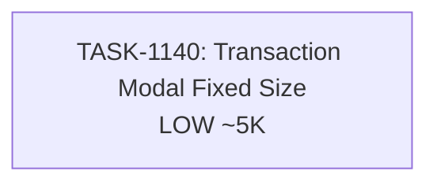

# Sprint Plan: SPRINT-046 - UI Polish: Transaction Details Modal

## Sprint Goal

Fix layout consistency issues in the Transaction Details modal to eliminate jarring size changes when switching between tabs.

## Sprint Status: PLANNING

**Created:** 2026-01-19
**Target Branch:** develop
**Estimated Duration:** 1 day
**Total Estimated Tokens:** ~8K (including SR review overhead)

---

## Context

### Why This Sprint?

User testing revealed the Transaction Details modal exhibits size jumping when switching between tabs (Details, Contacts, Messages, Emails, etc.). This causes a poor user experience with layout shifts during navigation.

### Similar Work

This sprint follows the same pattern established in SPRINT-045 with TASK-1130 (Contact modal fixed size). That implementation used a fixed height container with scrollable content, which provides the template for this fix.

### Priority Rationale

| Priority | Items Selected | Reason |
|----------|----------------|--------|
| LOW | BACKLOG-331 (Transaction modal size) | Polish - eliminates visual jitter |

---

## In Scope

| Task | Backlog | Title | Est. Tokens | Priority |
|------|---------|-------|-------------|----------|
| TASK-1140 | BACKLOG-331 | Transaction Details Modal Responsive Size | ~5K | LOW |

**Total Estimated (implementation):** ~5K tokens
**SR Review Overhead:** +3K (1 task @ ~3K)
**Grand Total:** ~8K tokens

---

## Out of Scope / Deferred

| Item | Reason |
|------|--------|
| Responsive breakpoints | Future enhancement if needed |
| Animation on tab changes | Outside current scope |

---

## Dependency Graph



### YAML Edges

```yaml
dependency_graph:
  nodes:
    - id: TASK-1140
      type: task
      phase: 1
      title: "Transaction Details Modal Responsive Size"
      priority: low
      est_tokens: 5K

  edges: []  # No dependencies - single task sprint
```

---

## SR Engineer Technical Review

**Status:** PENDING
**Review Date:** TBD

---

## Prerequisites / Environment Setup

Before starting sprint work, engineers must:
- [ ] `git checkout develop && git pull origin develop`
- [ ] `npm install`
- [ ] `npm rebuild better-sqlite3-multiple-ciphers`
- [ ] `npx electron-rebuild`
- [ ] Verify app starts: `npm run dev`

---

## Testing & Quality Plan

### TASK-1140 (Transaction Modal Fixed Size)
- **Goal:** Modal maintains consistent size when switching tabs
- **Unit Tests:** None needed (CSS-only change)
- **Manual Testing:**
  - Open Transaction Details modal
  - Switch between all tabs
  - Verify no size jumping
  - Test on different viewport sizes

### CI Requirements
- All PRs must pass: `npm test`, `npm run type-check`, `npm run lint`
- No regressions in existing test coverage

---

## Progress Tracking

| Task | Status | Billable Tokens | Duration | PR |
|------|--------|-----------------|----------|-----|
| TASK-1140 | TODO | - | - | - |

---

## Risk Register

| Risk | Impact | Likelihood | Mitigation |
|------|--------|------------|------------|
| Modal too tall on small screens | Low | Low | Use max-h constraint like ContactSelectModal |
| Content overflow handling differs by tab | Low | Medium | Test all tabs thoroughly |

---

## Blocking Issues

| Issue | Affected Tasks | Resolution |
|-------|----------------|------------|
| None identified | - | - |

---

## Success Criteria

1. **Fixed Size:** Transaction Details modal maintains consistent dimensions
2. **Scrollable Content:** Tab content scrolls within fixed container
3. **No Layout Shift:** Switching tabs causes no visual jumping
4. **Quality:** All tests passing, no new regressions

---

## Related Backlog Items

| ID | Title | Priority | Status |
|----|-------|----------|--------|
| BACKLOG-331 | Transaction Details Modal Responsive Size | Low | Pending |

---

## Notes

- Reference TASK-1130 (ContactSelectModal) for implementation pattern
- Pattern: Fixed outer container height, scrollable inner content area
- Should be a CSS-focused change similar to TASK-1130

---

## References

- **TASK-1130:** Contact modal fixed size implementation (archived)
- **ContactSelectModal.tsx:** Reference for fixed height pattern
