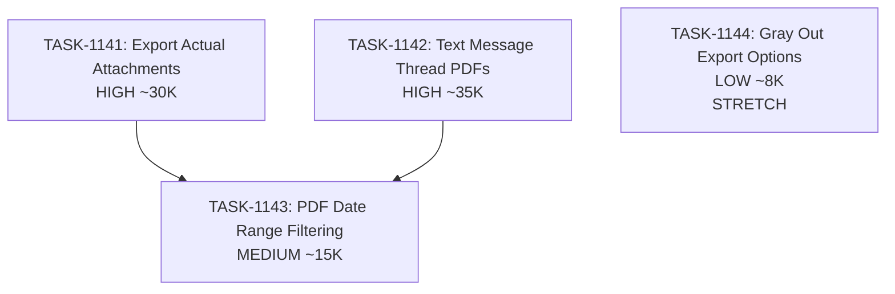

# Sprint Plan: SPRINT-047 - Audit Package Completion

## Sprint Goal

Complete the Audit Package export functionality by adding actual attachment file export and properly formatted text message threads, making the audit package fully functional for compliance needs.

## Sprint Status: IN PROGRESS

**Created:** 2026-01-19
**Target Branch:** develop
**Estimated Duration:** 2-3 days
**Total Estimated Tokens:** ~85K-115K (including SR review overhead)

---

## Context

### Why This Sprint?

User testing revealed the Audit Package export (folder export format) is incomplete:
1. **Attachments folder** only contains a manifest.json placeholder - no actual attachment files are copied
2. **Text messages** are not included (the folder is created but empty or poorly formatted)

The code explicitly notes this limitation:
```typescript
// Note: In a full implementation, we would:
// 1. Query attachments table for each email
// 2. Copy attachment files to the output folder
// 3. Build the manifest
//
// For now, we create an empty manifest indicating where attachments would go
```

### Current State Analysis

**folderExportService.ts:**
- `exportAttachments()` only creates a manifest from metadata - doesn't copy actual files
- `exportTextConversations()` groups by contact but doesn't use thread_id for proper conversation grouping
- Missing: Text messages as PDFs matching the PDF export styling

**Required Changes:**
1. Query and copy actual attachment files from storage location
2. Export text message threads as individual PDF files (one per thread, like emails)
3. Use thread_id for proper conversation grouping

### Priority Rationale

| Priority | Items Selected | Reason |
|----------|----------------|--------|
| HIGH | BACKLOG-332 (Audit Package) | Core functionality gap - audit package incomplete |
| MEDIUM | BACKLOG-331 (PDF Date Filtering) | UX improvement - related to export flow |
| LOW | BACKLOG-333 (Gray Out Options) | UI polish - can be done quickly alongside |

---

## In Scope

| Task | Backlog | Title | Est. Tokens | Priority |
|------|---------|-------|-------------|----------|
| TASK-1141 | BACKLOG-332 | Audit Package - Export Actual Attachments | ~30K | HIGH |
| TASK-1142 | BACKLOG-332 | Audit Package - Text Message Thread PDFs | ~35K | HIGH |
| TASK-1145 | BACKLOG-336 | Export Text Message Attachments | ~45K | HIGH |
| TASK-1143 | BACKLOG-331 | PDF Export Date Range Filtering | ~15K | MEDIUM |
| TASK-1144 | BACKLOG-333 | Gray Out Unimplemented Export Options | ~8K | LOW (stretch) |

**Total Estimated (implementation):** ~73K-88K tokens
**SR Review Overhead:** +12K (4 tasks @ ~3K each)
**Grand Total:** ~85K-100K tokens

---

## Out of Scope / Deferred

| Item | Reason |
|------|--------|
| BACKLOG-334 (Export Settings Defaults) | Nice-to-have, not critical for audit package |
| Rich HTML email rendering in PDF | Already exists in pdfExportService |
| Video attachment support | Future enhancement |
| Real-time attachment download from email provider | Files should already be in local storage |

---

## Dependency Graph



### Execution Order

**SR Engineer Correction:** TASK-1141 and TASK-1142 must be SEQUENTIAL (not parallel) because both modify `folderExportService.ts`. Running them in parallel would cause merge conflicts and race conditions.

**Phase 1A (First):**
- TASK-1141: Export Actual Attachments

**Phase 1B (After TASK-1141 merges):**
- TASK-1142: Text Message Thread PDFs

**Phase 2 (Sequential after Phase 1B):**
- TASK-1143: PDF Date Range Filtering (touches enhancedExportService which is shared)

**Phase 3 (Stretch - if time permits):**
- TASK-1144: Gray Out Unimplemented Export Options

### YAML Edges

```yaml
dependency_graph:
  nodes:
    - id: TASK-1141
      type: task
      phase: 1
      title: "Export Actual Attachments"
      priority: high
      est_tokens: 30K

    - id: TASK-1142
      type: task
      phase: 1
      title: "Text Message Thread PDFs"
      priority: high
      est_tokens: 35K

    - id: TASK-1143
      type: task
      phase: 2
      title: "PDF Date Range Filtering"
      priority: medium
      est_tokens: 15K

    - id: TASK-1144
      type: task
      phase: 3
      title: "Gray Out Export Options"
      priority: low
      est_tokens: 8K
      stretch: true

  edges:
    - from: TASK-1141
      to: TASK-1143
      type: must_complete_before
    - from: TASK-1142
      to: TASK-1143
      type: must_complete_before
```

---

## SR Engineer Technical Review

**Status:** PENDING
**Review Date:** TBD

### Review Checklist
- [ ] Identify shared file dependencies across tasks
- [ ] Recommend parallel vs sequential execution
- [ ] Add technical considerations to each task file
- [ ] Flag any architectural concerns

### Files Likely Modified

| Task | Files |
|------|-------|
| TASK-1141 | `electron/services/folderExportService.ts`, possibly attachment queries |
| TASK-1142 | `electron/services/folderExportService.ts` |
| TASK-1143 | `electron/services/enhancedExportService.ts`, `electron/services/pdfExportService.ts` |
| TASK-1144 | `src/components/ExportModal.tsx` |

---

## Prerequisites / Environment Setup

Before starting sprint work, engineers must:
- [ ] `git checkout develop && git pull origin develop`
- [ ] `npm install`
- [ ] `npm rebuild better-sqlite3-multiple-ciphers`
- [ ] `npx electron-rebuild`
- [ ] Verify app starts: `npm run dev`

---

## Testing & Quality Plan

### TASK-1141 (Export Attachments)
- **Goal:** Actual attachment files appear in attachments/ folder
- **Unit Tests:** Test attachment query and file copy logic
- **Manual Testing:**
  - Export audit package for transaction with attachments
  - Verify files exist in attachments/ folder
  - Verify manifest.json lists all attachments correctly

### TASK-1142 (Text Message PDFs)
- **Goal:** Each text thread becomes a styled PDF file
- **Unit Tests:** Test thread grouping logic
- **Manual Testing:**
  - Export audit package for transaction with texts
  - Verify texts/ folder contains PDF files (not just .txt)
  - Verify conversation styling matches PDF export

### TASK-1143 (Date Range Filtering)
- **Goal:** PDF export respects transaction date range
- **Unit Tests:** Test date filtering logic
- **Manual Testing:**
  - Set transaction dates
  - Export and verify only messages within date range are included
  - Test edge cases (no start date, no end date, neither)

### TASK-1144 (Gray Out Options)
- **Goal:** Unimplemented formats show "Coming Soon"
- **Unit Tests:** None needed (UI-only)
- **Manual Testing:**
  - Open export modal
  - Verify CSV, TXT+EML, JSON, Excel are grayed out
  - Verify they cannot be selected

### CI Requirements
- All PRs must pass: `npm test`, `npm run type-check`, `npm run lint`
- No regressions in existing test coverage

---

## Progress Tracking

| Task | Status | Billable Tokens | Duration | PR |
|------|--------|-----------------|----------|-----|
| TASK-1141 | MERGED | ~15K | ~5 min | #496 |
| TASK-1142 | MERGED | ~25K | ~15 min | #497 |
| TASK-1145 | IN PROGRESS | - | - | - |
| TASK-1143 | TODO | - | - | - |
| TASK-1144 | TODO (stretch) | - | - | - |

---

## Risk Register

| Risk | Impact | Likelihood | Mitigation |
|------|--------|------------|------------|
| Attachment storage location unknown | High | Medium | Investigate attachment_metadata field first |
| Text thread grouping complex | Medium | Low | Reuse logic from pdfExportService |
| Date filtering affects multiple export formats | Medium | Low | Test all formats after change |

---

## Blocking Issues

| Issue | Affected Tasks | Resolution |
|-------|----------------|------------|
| None identified | - | - |

---

## Success Criteria

1. **Attachments Export:** Actual attachment files are copied to attachments/ folder
2. **Text Messages:** Text threads exported as formatted PDF files in texts/ folder
3. **Date Filtering:** PDF exports respect transaction date range
4. **UI Polish:** Unimplemented export options visually disabled with "Coming Soon"
5. **Quality:** All tests passing, no new regressions

---

## Related Backlog Items

| ID | Title | Priority | Status |
|----|-------|----------|--------|
| BACKLOG-332 | Audit Package Missing Attachments and Text Messages | HIGH | In Progress |
| BACKLOG-331 | PDF Export Date Range Filtering | MEDIUM | In Progress |
| BACKLOG-333 | Gray Out Unimplemented Export Options | LOW | In Progress |
| BACKLOG-334 | Export Settings Defaults | MEDIUM | Deferred |

---

## Notes

- Text message PDF export should reuse the conversation styling from `pdfExportService._generateCommunicationsHTML()` for consistency
- Attachment files may be stored with paths in `attachment_metadata` JSON - need to investigate actual storage location
- TASK-1143 and TASK-1144 can potentially be combined if they're simple enough

---

## References

- **folderExportService.ts:** Current audit package implementation with placeholders
- **pdfExportService.ts:** Reference for text message styling (lines 553-953)
- **enhancedExportService.ts:** Date filtering implementation
- **ExportModal.tsx:** UI for export format selection
