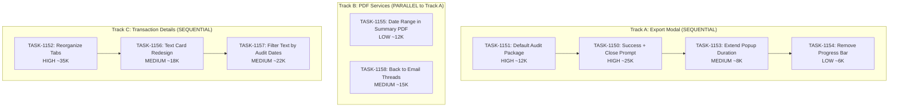

# Sprint Plan: SPRINT-048 - UI Export and Transaction Details

## Sprint Goal

Improve the export UX workflow and reorganize the Transaction Details page to provide cleaner separation between emails, texts, and transaction overview information.

## Sprint Status: PLANNING

**Created:** 2026-01-21
**Integration Branch:** int/sprint-ui-export-and-details
**Target Branch:** develop
**Estimated Duration:** 3-4 days
**Total Estimated Tokens:** ~150K-200K (including SR review overhead)

---

## Context

### Why This Sprint?

User feedback has identified two main areas needing improvement:

1. **Export UX Issues:**
   - Export success message with Finder link auto-dismisses too quickly
   - Users miss the opportunity to click "Open in Finder"
   - No prompt to close transaction after export
   - Export defaults should favor Audit Package, with "One PDF" marked coming soon
   - Progress bar during export creates anxiety

2. **Transaction Details Organization:**
   - Related Emails buried in the Details tab - needs its own tab
   - Text conversation cards show unnecessary preview text
   - Text preview modal shows all messages, not just audit period
   - PDF exports lack "Back to Email Threads" navigation link

### Priority Rationale

| Priority | Items Selected | Reason |
|----------|----------------|--------|
| HIGH | BACKLOG-352, 360, 363 | Core UX improvements affecting daily workflow |
| MEDIUM | BACKLOG-355, 356, 357, 362 | Important polish items |
| LOW | BACKLOG-359, 361 | Nice-to-have improvements |

---

## In Scope

| Task | Backlog | Title | Est. Tokens | Priority |
|------|---------|-------|-------------|----------|
| TASK-1150 | BACKLOG-352 | Export Success with Finder Link + Close Prompt | ~25K | HIGH |
| TASK-1151 | BACKLOG-360 | Default to Audit Package, One PDF Coming Soon | ~12K | HIGH |
| TASK-1152 | BACKLOG-363 | Reorganize Transaction Details Tabs | ~35K | HIGH |
| TASK-1153 | BACKLOG-362 | Increase Export Success Popup Duration | ~8K | MEDIUM |
| TASK-1154 | BACKLOG-361 | Remove Progress Bar from Audit Package Export | ~6K | LOW |
| TASK-1155 | BACKLOG-359 | Add Audit Date Range to Summary PDF Title | ~12K | LOW |
| TASK-1156 | BACKLOG-356 | Redesign Text Conversation Cards | ~18K | MEDIUM |
| TASK-1157 | BACKLOG-357 | Filter Text Preview by Audit Dates | ~22K | MEDIUM |
| TASK-1158 | BACKLOG-355 | Back to Email Threads Link in PDF | ~15K | MEDIUM |

**Total Estimated (implementation):** ~153K tokens
**SR Review Overhead:** +18K (9 tasks @ ~2K each)
**Grand Total:** ~171K tokens

---

## Out of Scope / Deferred

| Item | Reason |
|------|--------|
| BACKLOG-353 | Debug/investigation item - not implementation |
| BACKLOG-354 | Debug/investigation item - not implementation |
| BACKLOG-358 | Not in user's scope definition |

---

## Dependency Graph



### Execution Order

**Track A: Export Modal Tasks (SEQUENTIAL - all modify ExportModal.tsx)**
1. TASK-1151: Default to Audit Package (sets up export format defaults)
2. TASK-1150: Export Success with Finder Link + Close Transaction Prompt
3. TASK-1153: Increase Export Success Popup Duration
4. TASK-1154: Remove Progress Bar from Audit Package Export

**Track B: PDF Services (CAN RUN PARALLEL to Track A)**
- TASK-1155: Add Audit Date Range to Summary PDF (modifies folderExportService.ts)
- TASK-1158: Add Back to Email Threads Link (modifies pdfExportService.ts)

**Track C: Transaction Details (SEQUENTIAL - shared component files)**
1. TASK-1152: Reorganize Transaction Details Tabs (creates new Emails tab, restructures)
2. TASK-1156: Redesign Text Conversation Cards (modifies MessageThreadCard.tsx)
3. TASK-1157: Filter Text Preview by Audit Dates (modifies ConversationViewModal.tsx)

### Parallel Tracks Summary

| Track | Tasks | Can Run With |
|-------|-------|--------------|
| A (Export Modal) | 1151 -> 1150 -> 1153 -> 1154 | Track B, Track C |
| B (PDF Services) | 1155, 1158 (parallel to each other) | Track A, Track C |
| C (Transaction Details) | 1152 -> 1156 -> 1157 | Track A, Track B |

---

## Shared File Analysis

| File | Tasks That Modify | Conflict Risk |
|------|-------------------|---------------|
| `src/components/ExportModal.tsx` | 1150, 1151, 1153, 1154 | HIGH - must be sequential |
| `electron/services/folderExportService.ts` | 1155 | LOW - isolated change |
| `electron/services/pdfExportService.ts` | 1158 | LOW - isolated change |
| `src/components/transactionDetailsModule/components/TransactionTabs.tsx` | 1152 | MEDIUM |
| `src/components/transactionDetailsModule/components/TransactionDetailsTab.tsx` | 1152 | MEDIUM |
| `src/components/transactionDetailsModule/components/MessageThreadCard.tsx` | 1156 | MEDIUM |
| `src/components/transactionDetailsModule/components/modals/ConversationViewModal.tsx` | 1157 | MEDIUM |

---

## YAML Dependency Graph

```yaml
dependency_graph:
  nodes:
    - id: TASK-1151
      type: task
      phase: 1
      track: A
      title: "Default to Audit Package, One PDF Coming Soon"
      priority: high
      est_tokens: 12K
      files: [ExportModal.tsx]

    - id: TASK-1150
      type: task
      phase: 1
      track: A
      title: "Export Success with Finder Link + Close Prompt"
      priority: high
      est_tokens: 25K
      files: [ExportModal.tsx]

    - id: TASK-1153
      type: task
      phase: 1
      track: A
      title: "Increase Export Success Popup Duration"
      priority: medium
      est_tokens: 8K
      files: [ExportModal.tsx]

    - id: TASK-1154
      type: task
      phase: 1
      track: A
      title: "Remove Progress Bar from Audit Package"
      priority: low
      est_tokens: 6K
      files: [ExportModal.tsx]

    - id: TASK-1155
      type: task
      phase: 1
      track: B
      title: "Date Range in Summary PDF Title"
      priority: low
      est_tokens: 12K
      files: [folderExportService.ts]

    - id: TASK-1158
      type: task
      phase: 1
      track: B
      title: "Back to Email Threads Link"
      priority: medium
      est_tokens: 15K
      files: [pdfExportService.ts]

    - id: TASK-1152
      type: task
      phase: 1
      track: C
      title: "Reorganize Transaction Details Tabs"
      priority: high
      est_tokens: 35K
      files: [TransactionTabs.tsx, TransactionDetailsTab.tsx, new TransactionEmailsTab.tsx]

    - id: TASK-1156
      type: task
      phase: 2
      track: C
      title: "Redesign Text Conversation Cards"
      priority: medium
      est_tokens: 18K
      files: [MessageThreadCard.tsx]

    - id: TASK-1157
      type: task
      phase: 3
      track: C
      title: "Filter Text Preview by Audit Dates"
      priority: medium
      est_tokens: 22K
      files: [ConversationViewModal.tsx]

  edges:
    # Track A (Export Modal) - sequential
    - from: TASK-1151
      to: TASK-1150
      type: must_complete_before
    - from: TASK-1150
      to: TASK-1153
      type: must_complete_before
    - from: TASK-1153
      to: TASK-1154
      type: must_complete_before

    # Track C (Transaction Details) - sequential
    - from: TASK-1152
      to: TASK-1156
      type: must_complete_before
    - from: TASK-1156
      to: TASK-1157
      type: must_complete_before
```

---

## SR Engineer Technical Review

**Status:** PENDING
**Review Date:** TBD

### Review Checklist
- [ ] Verify shared file dependencies across tasks
- [ ] Confirm parallel vs sequential execution recommendations
- [ ] Add technical considerations to each task file
- [ ] Flag any architectural concerns
- [ ] Recommend branch strategy (worktrees for parallel tracks)

---

## Prerequisites / Environment Setup

Before starting sprint work, engineers must:
- [ ] `git checkout int/sprint-ui-export-and-details && git pull`
- [ ] `npm install`
- [ ] `npm rebuild better-sqlite3-multiple-ciphers`
- [ ] `npx electron-rebuild`
- [ ] Verify app starts: `npm run dev`

---

## Testing & Quality Plan

### Export Modal Tasks (Track A)
- **TASK-1151:** Verify Audit Package is default, One PDF shows "Coming Soon" and is disabled
- **TASK-1150:** Verify close transaction prompt appears, Finder link works
- **TASK-1153:** Verify popup stays visible until dismissed (or 30+ seconds)
- **TASK-1154:** Verify only spinner shows during Audit Package export (no progress bar)

### PDF Service Tasks (Track B)
- **TASK-1155:** Verify "Audit Period: X - Y" appears in Summary PDF header
- **TASK-1158:** Verify email threads have "Back to Email Threads" link in full PDF

### Transaction Details Tasks (Track C)
- **TASK-1152:** Verify new Emails tab, emails moved from Details, audit dates in Overview
- **TASK-1156:** Verify text cards show date range, no preview, "View Full" button
- **TASK-1157:** Verify toggle filters messages, shows count, persists state

### CI Requirements
- All PRs must pass: `npm test`, `npm run type-check`, `npm run lint`
- No regressions in existing test coverage

---

## Progress Tracking

| Task | Status | Billable Tokens | Duration | PR |
|------|--------|-----------------|----------|-----|
| TASK-1151 | TODO | - | - | - |
| TASK-1150 | TODO | - | - | - |
| TASK-1153 | TODO | - | - | - |
| TASK-1154 | TODO | - | - | - |
| TASK-1155 | TODO | - | - | - |
| TASK-1158 | TODO | - | - | - |
| TASK-1152 | TODO | - | - | - |
| TASK-1156 | TODO | - | - | - |
| TASK-1157 | TODO | - | - | - |

---

## Risk Register

| Risk | Impact | Likelihood | Mitigation |
|------|--------|------------|------------|
| ExportModal.tsx complex state | Medium | Medium | Sequential execution, thorough testing |
| Tab reorganization breaks existing flows | High | Low | Keep existing data flows, just move components |
| Transaction dates undefined | Medium | Medium | Graceful fallback when dates not set |

---

## Success Criteria

1. **Export UX:** Audit Package is default, close prompt appears, Finder link visible longer
2. **Export Visual:** Progress bar removed, success popup persists
3. **PDF Improvements:** Date range in header, back links for email threads
4. **Transaction Details:** Emails in own tab, text cards simplified
5. **Text Preview:** Filterable by audit period with toggle
6. **Quality:** All tests passing, no new regressions

---

## Related Backlog Items

| ID | Title | Priority | Status |
|----|-------|----------|--------|
| BACKLOG-352 | Export Success with Finder Link + Close Prompt | HIGH | In Progress |
| BACKLOG-360 | Default Export to Audit Package | HIGH | In Progress |
| BACKLOG-363 | Reorganize Transaction Details Tabs | HIGH | In Progress |
| BACKLOG-362 | Increase Export Success Popup Duration | MEDIUM | In Progress |
| BACKLOG-356 | Redesign Text Conversation Cards | MEDIUM | In Progress |
| BACKLOG-357 | Filter Text Preview by Audit Dates | MEDIUM | In Progress |
| BACKLOG-355 | Back to Email Threads Link | MEDIUM | In Progress |
| BACKLOG-359 | Audit Date Range in Summary PDF | LOW | In Progress |
| BACKLOG-361 | Remove Progress Bar | LOW | In Progress |

---

## Notes

- Track A tasks MUST be sequential due to shared ExportModal.tsx
- Track B tasks can run fully in parallel with each other and with other tracks
- Track C tasks must be sequential within the track but parallel to A and B
- Consider using git worktrees for parallel track execution

---

## References

- **ExportModal.tsx:** Current export modal implementation (560 lines)
- **folderExportService.ts:** Audit package export (2060 lines)
- **pdfExportService.ts:** PDF generation (1007 lines)
- **TransactionDetailsTab.tsx:** Current details tab (161 lines)
- **TransactionTabs.tsx:** Tab navigation (72 lines)
- **MessageThreadCard.tsx:** Text conversation cards (523 lines)
- **ConversationViewModal.tsx:** Text message popup modal (509 lines)
