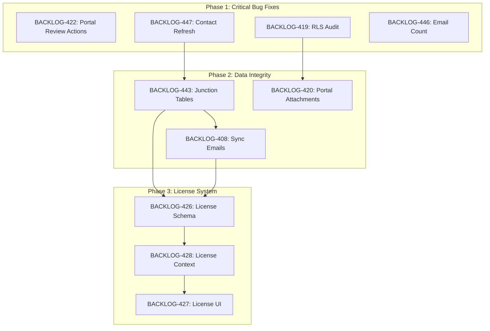

# Sprint Plan: SPRINT-051 - Bug Fixes, Data Foundation, License System

**Created**: 2026-01-23
**Updated**: 2026-01-23
**Status**: Ready for Execution (SR Engineer Approved)
**Goal**: Fix critical bugs affecting users, establish data integrity foundation, then implement license system

---

## Sprint Goal

This sprint prioritizes user-facing bugs first, then addresses data integrity issues that affect sync and communication linking, and finally implements the license system for feature gating. The priority order reflects user pain points:

1. **Critical Bug Fixes**: Portal review actions broken, contacts not showing, email counts wrong
2. **Data Integrity**: Fix email/phone storage in junction tables, fix sync finding emails
3. **License System**: Implement feature gating for Individual vs Team users

---

## Prerequisites / Environment Setup

Before starting sprint work, engineers must:
- [ ] `git checkout develop && git pull origin develop`
- [ ] `npm install`
- [ ] `npm rebuild better-sqlite3-multiple-ciphers`
- [ ] `npx electron-rebuild`
- [ ] Verify app starts: `npm run dev`
- [ ] Verify tests pass: `npm test`

**Note**: Native module rebuilds are required after `npm install` or Node.js updates.

---

## In Scope (10 Items)

### Phase 1: Critical Bug Fixes (~48K tokens)
| ID | Title | Priority | Est. Tokens |
|----|-------|----------|-------------|
| BACKLOG-422 | Portal review actions not working | P0 | ~20K |
| BACKLOG-419 | Audit and restore RLS policies | P1 | ~10K |
| BACKLOG-447 | Manually added contact not showing in list | P1 | ~8K |
| BACKLOG-446 | Email count shows 0 despite emails attached | P1 | ~10K |

### Phase 2: Data Integrity Foundation (~55K tokens)
| ID | Title | Priority | Est. Tokens |
|----|-------|----------|-------------|
| BACKLOG-443 | Store all emails/phones in junction table | P1 | ~25K |
| BACKLOG-408 | Sync not finding emails for contacts | P0 | ~15K |
| BACKLOG-420 | Portal attachments not displaying | P1 | ~15K |

### Phase 3: License System (~80K tokens)
| ID | Title | Priority | Est. Tokens |
|----|-------|----------|-------------|
| BACKLOG-426 | License type database schema support | P0 | ~20K |
| BACKLOG-428 | License context provider | P0 | ~25K |
| BACKLOG-427 | License-aware UI components | P0 | ~35K |

---

## Out of Scope / Deferred

| ID | Title | Reason |
|----|-------|--------|
| BACKLOG-418 | Contact selection UX redesign | Needs design planning first - complex UX change (~40K) |
| BACKLOG-406 | Apple signing certificate | Infrastructure task, not blocking current development |
| BACKLOG-409 | Align TypeScript types with SQLite schema | Moved to future sprint, not critical path |
| BACKLOG-411 | Update base schema.sql | Depends on 409, deferred together |
| BACKLOG-423 | Fix Transactions.test.tsx missing mock | Low priority test fix |
| BACKLOG-412 | Restore closed filter tab | UI polish, not blocking |
| BACKLOG-425 | Test desktop status sync | Testing task for after license system |
| BACKLOG-429 | Team workflow E2E testing | Testing task for after license system |

**Note on BACKLOG-406 (Apple Signing)**: This is an infrastructure task requiring manual intervention (certificate export, GitHub secrets update). It does not block development work and can be addressed independently when the user has time to perform the Apple Developer portal steps.

---

## Reprioritized Backlog

| Priority | ID | Title | Est. Tokens | Phase | Dependencies |
|----------|-----|-------|-------------|-------|--------------|
| 1 | BACKLOG-422 | Portal review actions not working | ~20K | 1 | None |
| 2 | BACKLOG-419 | Audit and restore RLS policies | ~10K | 1 | None |
| 3 | BACKLOG-447 | Contact not showing in list | ~8K | 1 | None |
| 4 | BACKLOG-446 | Email count shows 0 | ~10K | 1 | None |
| 5 | BACKLOG-443 | Store all emails/phones in junction table | ~25K | 2 | 447 (contact fix) |
| 6 | BACKLOG-408 | Sync not finding emails | ~15K | 2 | 443 (junction tables) |
| 7 | BACKLOG-420 | Portal attachments not displaying | ~15K | 2 | 419 (RLS audit) |
| 8 | BACKLOG-426 | License schema | ~20K | 3 | None |
| 9 | BACKLOG-428 | License context provider | ~25K | 3 | 426 |
| 10 | BACKLOG-427 | License-aware UI | ~35K | 3 | 428 |

**Total Estimated Tokens**: ~183K

---

## Phase Plan

### Phase 1: Critical Bug Fixes (Parallel-Safe)

**Goal**: Fix user-blocking bugs in portal and desktop app

| Task | Title | Est. | Execution |
|------|-------|------|-----------|
| TASK-TBD | Portal review actions fix | ~20K | Parallel |
| TASK-TBD | RLS policy audit | ~10K | Parallel |
| TASK-TBD | Contact not showing fix | ~8K | Parallel |
| TASK-TBD | Email count fix | ~10K | Parallel |

**File Conflict Analysis (SR Engineer to validate)**:

| File/Area | BACKLOG-422 | BACKLOG-419 | BACKLOG-447 | BACKLOG-446 |
|-----------|-------------|-------------|-------------|-------------|
| Portal ReviewActions.tsx | X | - | - | - |
| Supabase RLS policies | - | X | - | - |
| Portal supabase.ts | X | X | - | - |
| ContactSelectModal.tsx | - | - | X | - |
| ContactFormModal.tsx | - | - | X | - |
| contact-handlers.ts | - | - | X | - |
| transactionDbService.ts | - | - | - | X |
| TransactionTabs.tsx | - | - | - | X |

**Parallel Safety Assessment**:
- BACKLOG-422 and BACKLOG-419 both touch Supabase but different aspects (portal client vs RLS policies)
- BACKLOG-447 touches contact components only
- BACKLOG-446 touches transaction email count only
- **Recommendation**: Parallel execution is SAFE with separate worktrees

**Why Parallel**: These bugs are independent:
- 422: Portal Next.js app, Supabase client
- 419: Supabase dashboard RLS policies
- 447: Desktop contact modal/handler
- 446: Desktop transaction email count query

**Worktree Setup**:
```bash
git worktree add ../Mad-BACKLOG-422 -b fix/backlog-422-portal-actions develop
git worktree add ../Mad-BACKLOG-419 -b fix/backlog-419-rls-audit develop
git worktree add ../Mad-BACKLOG-447 -b fix/backlog-447-contact-refresh develop
git worktree add ../Mad-BACKLOG-446 -b fix/backlog-446-email-count develop
```

**Integration checkpoint**: All fixes merged, portal actions working, RLS documented.

---

### Phase 2: Data Integrity (Sequential)

**Goal**: Fix data storage and sync issues

| Task | Title | Est. | Execution |
|------|-------|------|-----------|
| TASK-TBD | Junction table email/phone storage | ~25K | First |
| TASK-TBD | Sync finding emails fix | ~15K | After junction fix |
| TASK-TBD | Portal attachments display | ~15K | After RLS audit |

**Dependency Analysis**:
- BACKLOG-443 (junction tables) must be FIRST - it fixes the data storage
- BACKLOG-408 (sync) depends on 443 - sync queries the junction tables
- BACKLOG-420 (portal attachments) depends on 419 (RLS) being correct

**Why Sequential**:
- 443 creates the foundation for 408
- 408 uses the data from 443
- 420 needs RLS from Phase 1 to be fixed first

**Execution Order**:
1. BACKLOG-443: Store emails/phones in junction tables
2. BACKLOG-408: Fix sync to query junction tables
3. BACKLOG-420: Fix portal attachments (can run parallel with 408 if RLS is fixed)

**Integration checkpoint**: Contacts have all emails stored, sync finds communications, portal shows attachments.

---

### Phase 3: License System (Sequential)

**Goal**: Implement license-based feature gating

| Task | Title | Est. | Execution |
|------|-------|------|-----------|
| TASK-TBD | License schema | ~20K | First |
| TASK-TBD | License context provider | ~25K | After schema |
| TASK-TBD | License-aware UI | ~35K | After context |

**Dependency Chain**:
```
BACKLOG-426 (Schema) → BACKLOG-428 (Context) → BACKLOG-427 (UI)
```

**Why Sequential**: Each layer depends on the previous:
- Context needs schema columns to exist
- UI needs context to read license state

**Integration checkpoint**: License schema deployed, context provides state, UI gates features correctly.

---

## Merge Plan

- **Main branch**: `develop`
- **Feature branch format**: `fix/backlog-XXX-description` or `feature/backlog-XXX-description`
- **No integration branches needed**: Tasks are well-isolated or sequential

### Merge Order (Explicit)

```
Phase 1 (Parallel):
1. fix/backlog-422-portal-actions → develop (PR)
2. fix/backlog-419-rls-audit → develop (PR)
3. fix/backlog-447-contact-refresh → develop (PR)
4. fix/backlog-446-email-count → develop (PR)

Phase 2 (Sequential):
5. fix/backlog-443-junction-tables → develop (PR, after Phase 1)
6. fix/backlog-408-sync-emails → develop (PR, after 443)
7. fix/backlog-420-portal-attachments → develop (PR, after 419)

Phase 3 (Sequential):
8. feature/backlog-426-license-schema → develop (PR, after Phase 2)
9. feature/backlog-428-license-context → develop (PR, after 426)
10. feature/backlog-427-license-ui → develop (PR, after 428)
```

---

## Dependency Graph (Mermaid)



---

## Dependency Graph (YAML)

```yaml
dependency_graph:
  nodes:
    # Phase 1
    - id: BACKLOG-422
      type: task
      phase: 1
      title: "Portal Review Actions Not Working"
      priority: P0
    - id: BACKLOG-419
      type: task
      phase: 1
      title: "Audit and Restore RLS Policies"
      priority: P1
    - id: BACKLOG-447
      type: task
      phase: 1
      title: "Contact Not Showing in List"
      priority: P1
    - id: BACKLOG-446
      type: task
      phase: 1
      title: "Email Count Shows 0"
      priority: P1
    # Phase 2
    - id: BACKLOG-443
      type: task
      phase: 2
      title: "Store Emails/Phones in Junction Tables"
      priority: P1
    - id: BACKLOG-408
      type: task
      phase: 2
      title: "Sync Not Finding Emails"
      priority: P0
    - id: BACKLOG-420
      type: task
      phase: 2
      title: "Portal Attachments Not Displaying"
      priority: P1
    # Phase 3
    - id: BACKLOG-426
      type: task
      phase: 3
      title: "License Schema"
      priority: P0
    - id: BACKLOG-428
      type: task
      phase: 3
      title: "License Context Provider"
      priority: P0
    - id: BACKLOG-427
      type: task
      phase: 3
      title: "License-Aware UI"
      priority: P0

  edges:
    # Phase 1 to Phase 2
    - from: BACKLOG-447
      to: BACKLOG-443
      type: depends_on
      reason: "Contact fix should be in place before junction table migration"
    - from: BACKLOG-419
      to: BACKLOG-420
      type: depends_on
      reason: "RLS must be correct for attachments to display"
    # Phase 2 internal
    - from: BACKLOG-443
      to: BACKLOG-408
      type: depends_on
      reason: "Sync queries junction tables, which must be populated first"
    # Phase 2 to Phase 3
    - from: BACKLOG-443
      to: BACKLOG-426
      type: can_start_after
      reason: "License schema can start after data integrity foundation"
    - from: BACKLOG-408
      to: BACKLOG-426
      type: can_start_after
      reason: "License schema can start after sync is fixed"
    # Phase 3 internal
    - from: BACKLOG-426
      to: BACKLOG-428
      type: depends_on
      reason: "Context needs schema columns to exist"
    - from: BACKLOG-428
      to: BACKLOG-427
      type: depends_on
      reason: "UI needs context to access license state"
```

---

## File Conflict Matrix

| File/Area | Tasks | Conflict Risk | Resolution |
|-----------|-------|---------------|------------|
| `broker-portal/` | 422, 420 | Low | Different features: ReviewActions vs AttachmentViewer |
| Supabase RLS | 419, 420, 422 | Medium | 419 audits RLS first, 420/422 depend on it |
| `electron/contact-handlers.ts` | 447, 443 | Medium | 447 first (refresh), then 443 (junction table writes) |
| `electron/services/db/contactDbService.ts` | 447, 443, 408 | Medium | Sequential: 447 → 443 → 408 |
| `electron/services/databaseService.ts` | 447, 443, 408 | Low | Delegate calls only - low risk |
| `electron/services/db/transactionDbService.ts` | 446 | None | Isolated change |
| `electron/services/autoLinkService.ts` | 408 | None | Isolated change |
| `src/contexts/LicenseContext.tsx` | 428 | None | New file |
| `src/components/common/LicenseGate.tsx` | 427 | None | New file |
| Supabase schema | 426 | None | Migration file |
| Local SQLite schema | 426 | None | Migration |

---

## Testing & Quality Plan

### Unit Testing

- New tests required for:
  - LicenseContext (BACKLOG-428)
  - useLicense hook (BACKLOG-428)
  - LicenseGate component (BACKLOG-427)
  - Junction table contact queries (BACKLOG-443)

- Existing tests to update:
  - Contact creation tests (BACKLOG-447)
  - Transaction email count tests (BACKLOG-446)

### Coverage Expectations

- Coverage rules: No regression from current baseline
- New license components: Target 60% coverage
- Bug fixes: Add regression tests

### Integration / Feature Testing

Required scenarios:

| Phase | Scenario | Owner |
|-------|----------|-------|
| 1 | Portal: Reject submission works | BACKLOG-422 |
| 1 | Portal: Request Changes works | BACKLOG-422 |
| 1 | Portal: Approve submission works | BACKLOG-422 |
| 1 | RLS audit documented, policies restored | BACKLOG-419 |
| 1 | New contact appears in modal after creation | BACKLOG-447 |
| 1 | Email tab count matches visible emails | BACKLOG-446 |
| 2 | Contact import stores all emails in junction table | BACKLOG-443 |
| 2 | Sync finds emails for all contact email addresses | BACKLOG-408 |
| 2 | Portal shows attachments for submissions | BACKLOG-420 |
| 3 | License schema migration runs without errors | BACKLOG-426 |
| 3 | License context loads on app start | BACKLOG-428 |
| 3 | Export button shows for Individual license | BACKLOG-427 |
| 3 | Submit button shows for Team license | BACKLOG-427 |
| 3 | AI features hidden without AI add-on | BACKLOG-427 |

### CI / CD Quality Gates

The following MUST pass before merge:
- [ ] Unit tests
- [ ] Type checking (`npm run type-check`)
- [ ] Linting (`npm run lint`)
- [ ] Build step (`npm run build`)

---

## Risk Register

| Risk | Likelihood | Impact | Mitigation |
|------|------------|--------|------------|
| RLS changes break auth | Medium | High | Test login flow after each RLS change |
| Junction table migration breaks existing contacts | Medium | High | Migration preserves existing data, adds to junction tables |
| Portal attachments still fail after RLS fix | Medium | Medium | Check Storage bucket policies separately |
| License schema migration fails | Low | High | Test on backup database first |
| Email count query has edge cases | Medium | Medium | Test with various email linking patterns |
| Contact refresh timing race condition | Low | Medium | Add small delay after create, then refresh |

---

## Decision Log

### Decision: Prioritize Bug Fixes Before License System

- **Date**: 2026-01-23
- **Context**: Existing SPRINT-051 prioritized license system, but users are experiencing blocking bugs
- **Decision**: Reorder to fix bugs first (Phase 1), then data integrity (Phase 2), then license (Phase 3)
- **Rationale**: User experience improvements should not be blocked by new feature development
- **Impact**: License system moves to Phase 3, estimated delivery delayed but users unblocked sooner

### Decision: Defer BACKLOG-418 (Contact UX Redesign)

- **Date**: 2026-01-23
- **Context**: BACKLOG-418 is a complex UX redesign requiring design planning
- **Decision**: Defer to future sprint, not include in SPRINT-051
- **Rationale**: ~40K token task that needs design validation before implementation
- **Impact**: Current contact workflow unchanged, simpler bug fixes (447) address immediate pain

### Decision: BACKLOG-406 (Apple Signing) Out of Scope

- **Date**: 2026-01-23
- **Context**: Apple signing is infrastructure requiring manual portal access
- **Decision**: Keep out of sprint scope, address separately
- **Rationale**: Not blocking development, requires human interaction with Apple Developer portal
- **Impact**: macOS release builds deferred until certificate is manually fixed

---

## Unplanned Work Log

| Task | Source | Root Cause | Added Date | Est. Tokens | Actual Tokens |
|------|--------|------------|------------|-------------|---------------|
| - | - | - | - | - | - |

---

## Parallel Execution Strategy

### Phase 1: Parallel (4 Engineers)

```
TIME -->
Track A: [BACKLOG-422 Portal Actions]     ~20K
Track B: [BACKLOG-419 RLS Audit]         ~10K
Track C: [BACKLOG-447 Contact Refresh]    ~8K
Track D: [BACKLOG-446 Email Count]       ~10K
```

**Worktree commands:**
```bash
git worktree add ../Mad-BACKLOG-422 -b fix/backlog-422-portal-actions develop
git worktree add ../Mad-BACKLOG-419 -b fix/backlog-419-rls-audit develop
git worktree add ../Mad-BACKLOG-447 -b fix/backlog-447-contact-refresh develop
git worktree add ../Mad-BACKLOG-446 -b fix/backlog-446-email-count develop
```

### Phase 2: Sequential

```
TIME -->
[BACKLOG-443 Junction Tables] --> [BACKLOG-408 Sync Emails]
         ~25K                            ~15K

                                  [BACKLOG-420 Portal Attachments]
                                          ~15K (after RLS)
```

### Phase 3: Sequential

```
TIME -->
[BACKLOG-426 Schema] --> [BACKLOG-428 Context] --> [BACKLOG-427 UI]
       ~20K                    ~25K                    ~35K
```

---

## Estimated Effort Summary

| Phase | Tasks | Est. Tokens | Execution |
|-------|-------|-------------|-----------|
| Phase 1: Bug Fixes | 422, 419, 447, 446 | ~48K | Parallel |
| Phase 2: Data Integrity | 443, 408, 420 | ~55K | Sequential |
| Phase 3: License System | 426, 428, 427 | ~80K | Sequential |
| **Total** | **10 tasks** | **~183K** | - |

**SR Review Overhead**: Add ~25K for reviews across 10 PRs
**Contingency**: ~20K (10%)

**Sprint Total**: ~228K tokens

---

## SR Engineer Review Checklist

Before execution, SR Engineer must validate:

- [x] Phase 1 parallel execution is safe (file conflict matrix reviewed)
- [x] Phase 2 sequential dependencies are correct
- [x] Phase 3 sequential dependencies are correct
- [x] Dependency graph is accurate
- [x] Token estimates are reasonable (+10-15% buffer for Phase 3 recommended)
- [x] RLS audit approach is sound
- [x] Junction table migration strategy is safe (additive, no data deletion)
- [x] License schema design reviewed
- [x] No hidden dependencies missed

**SR Engineer Review Date**: 2026-01-23
**Status**: APPROVED WITH NOTES

---

## SR Engineer Recommendations (MUST FOLLOW)

### 1. Soft Dependency: BACKLOG-422 ↔ BACKLOG-419

**IMPORTANT**: Both 422 (portal review actions) and 419 (RLS audit) can START in parallel, but:
- If 422 investigation reveals RLS is the root cause, **PAUSE 422**
- Wait for 419 to complete and fix RLS policies
- Then resume 422

This is a soft dependency - start both, but 422 may block on 419.

### 2. Junction Table Migration Script (BACKLOG-443)

Include this backfill SQL in the 443 implementation to migrate existing contacts:

```sql
-- Backfill existing contact emails from contacts.email (legacy field)
INSERT OR IGNORE INTO contact_emails (id, contact_id, email, is_primary, source, created_at)
SELECT
  lower(hex(randomblob(16))),
  c.id,
  LOWER(c.email),
  1,
  'backfill',
  CURRENT_TIMESTAMP
FROM contacts c
WHERE c.email IS NOT NULL
  AND NOT EXISTS (
    SELECT 1 FROM contact_emails ce WHERE ce.contact_id = c.id
  );
```

**Risk Level**: LOW - Migration is additive (INSERT OR IGNORE), no data deletion.

### 3. Phase 3 Buffer

The ~35K estimate for BACKLOG-427 (License-Aware UI) may expand due to:
- Multiple component modifications (TransactionDetailsHeader, Dashboard, TransactionFilters, AuditTransactionModal)
- Testing across all license combinations
- Edge cases in feature gating

**Recommendation**: The sprint's ~20K contingency should cover this, but monitor closely.

### 4. BACKLOG-446 May Surface Data Issues

If the email count fix (446) reveals data integrity issues (emails not properly linked), those will be addressed by BACKLOG-443 in Phase 2. This is expected and not a blocker.

---

## Task Execution Status

| Phase | Backlog | Title | Status | Engineer | PR | Actual Tokens |
|-------|---------|-------|--------|----------|-----|---------------|
| 1 | BACKLOG-422 | Portal Review Actions | Pending | - | - | - |
| 1 | BACKLOG-419 | RLS Audit | Pending | - | - | - |
| 1 | BACKLOG-447 | Contact Refresh | Pending | - | - | - |
| 1 | BACKLOG-446 | Email Count | Pending | - | - | - |
| 2 | BACKLOG-443 | Junction Tables | Pending | - | - | - |
| 2 | BACKLOG-408 | Sync Emails | Pending | - | - | - |
| 2 | BACKLOG-420 | Portal Attachments | Pending | - | - | - |
| 3 | BACKLOG-426 | License Schema | Pending | - | - | - |
| 3 | BACKLOG-428 | License Context | Pending | - | - | - |
| 3 | BACKLOG-427 | License UI | Pending | - | - | - |

---

## End-of-Sprint Validation Checklist

### Phase 1 Validation
- [ ] Portal Reject action works
- [ ] Portal Request Changes action works
- [ ] Portal Approve action works
- [ ] RLS policies documented and restored
- [ ] Login still works after RLS changes
- [ ] New contacts appear in select modal
- [ ] Email count matches visible emails

### Phase 2 Validation
- [ ] Contact import stores all emails in junction table
- [ ] Contact import stores all phones in junction table
- [ ] Sync Communications finds emails for contacts
- [ ] Portal shows attachments for submissions

### Phase 3 Validation
- [ ] License schema migration successful
- [ ] LicenseContext loads on app start
- [ ] useLicense hook works
- [ ] Export button visible for Individual license
- [ ] Submit button visible for Team license
- [ ] AI features hidden without AI add-on

### Final Validation
- [ ] All tasks merged to develop
- [ ] All CI checks passing
- [ ] No unresolved conflicts
- [ ] Worktree cleanup complete

---

## Related Documentation

- **Existing SPRINT-051**: `.claude/plans/sprints/SPRINT-051.md` (original, superseded)
- **Engineer Workflow**: `.claude/docs/ENGINEER-WORKFLOW.md`
- **PR-SOP**: `.claude/docs/PR-SOP.md`
- **SPRINT-050**: `.claude/plans/sprints/SPRINT-050-b2b-broker-portal.md` (predecessor)
