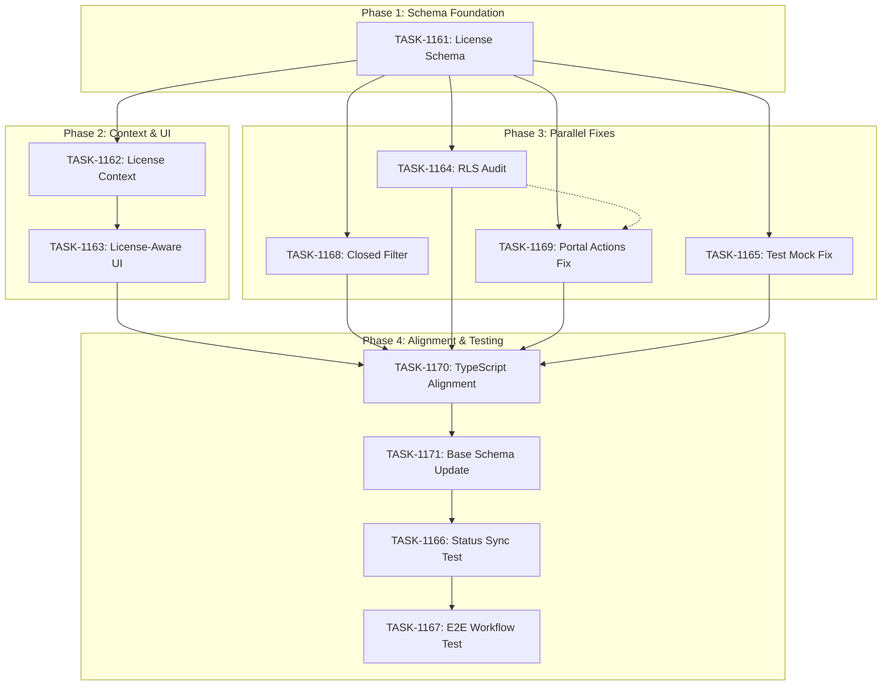

# Sprint Plan: SPRINT-051 - License System & Team Workflow

**Created**: 2026-01-22
**Updated**: 2026-01-23
**Status**: Completed
**Goal**: Implement license-based feature gating, fix critical bugs, and verify complete team workflow

---

## Sprint Goal

This sprint implements the license system that differentiates Individual vs Team users and gates features accordingly. The primary objectives are:

1. **License Schema**: Add database support for license types (Individual, Team) and AI Detection add-on
2. **License-Aware UI**: Show/hide features based on license type
3. **Critical Fixes**: Fix broker portal review actions, restore closed filter, align schemas
4. **Team Workflow Testing**: Verify the complete broker review workflow works flawlessly
5. **Security**: Ensure RLS policies are properly configured

---

## Prerequisites / Environment Setup

Before starting sprint work, engineers must:
- [ ] `git checkout develop && git pull origin develop`
- [ ] `npm install`
- [ ] `npm rebuild better-sqlite3-multiple-ciphers`
- [ ] `npx electron-rebuild`
- [ ] Verify app starts: `npm run dev`
- [ ] Verify tests pass: `npm test`

**Note**: Native module rebuilds are required after `npm install` or Node.js updates.

---

## In Scope (11 Items)

### Phase 1: License Schema Foundation (Sequential - MUST be first)
| ID | Title | Est. Tokens | Task File |
|----|-------|-------------|-----------|
| BACKLOG-426 | License Type Database Schema Support | ~20K | TASK-1161 |

### Phase 2: License Context & UI (Sequential - Requires Phase 1)
| ID | Title | Est. Tokens | Task File |
|----|-------|-------------|-----------|
| BACKLOG-428 | License Context Provider | ~25K | TASK-1162 |
| BACKLOG-427 | License-Aware UI Components | ~35K | TASK-1163 |

### Phase 3: Parallel Fixes (Can run after Phase 1)
| ID | Title | Est. Tokens | Task File |
|----|-------|-------------|-----------|
| BACKLOG-412 | Restore "Closed" Filter Tab | ~8K | TASK-1168 |
| BACKLOG-419 | Audit and Restore RLS Policies | ~10K | TASK-1164 |
| BACKLOG-422 | Fix Broker Portal Review Actions | ~20K | TASK-1169 |
| BACKLOG-423 | Fix Transactions.test.tsx Missing Mock | ~5K | TASK-1165 |

### Phase 4: Schema Alignment & Testing (Sequential - After Phase 2 & 3)
| ID | Title | Est. Tokens | Task File |
|----|-------|-------------|-----------|
| BACKLOG-409 | Align TypeScript Types with SQLite Schema | ~15K | TASK-1170 |
| BACKLOG-411 | Update Base schema.sql | ~10K | TASK-1171 |
| BACKLOG-425 | Test Desktop Status Sync and Broker Portal Actions | ~10K | TASK-1166 |
| BACKLOG-429 | Team Workflow E2E Testing | ~25K | TASK-1167 |

---

## Feature Gating Matrix

| Feature | Individual | Team | AI Add-on |
|---------|------------|------|-----------|
| Export button | Show | Hide | - |
| Submit button | Hide | Show | - |
| Auto-detection button | Hide | Hide | Show |
| AI transaction filters | Hide | Hide | Show |
| AI section in New Audit | Hide | Hide | Show |
| Manual transaction screen | Show | Show | Show |

---

## Reprioritized Backlog

| Priority | ID | Title | Est. Tokens | Phase | Dependencies |
|----------|-----|-------|-------------|-------|--------------|
| 1 | BACKLOG-426 | License Type Database Schema Support | ~20K | 1 | None |
| 2 | BACKLOG-428 | License Context Provider | ~25K | 2 | 426 |
| 3 | BACKLOG-427 | License-Aware UI Components | ~35K | 2 | 428 |
| 4 | BACKLOG-412 | Restore "Closed" Filter Tab | ~8K | 3 | None |
| 5 | BACKLOG-419 | Audit and Restore RLS Policies | ~10K | 3 | None |
| 6 | BACKLOG-422 | Fix Broker Portal Review Actions | ~20K | 3 | 419 (RLS must be correct) |
| 7 | BACKLOG-423 | Fix Transactions.test.tsx Missing Mock | ~5K | 3 | None |
| 8 | BACKLOG-409 | Align TypeScript Types with SQLite Schema | ~15K | 4 | 426 |
| 9 | BACKLOG-411 | Update Base schema.sql | ~10K | 4 | 409 |
| 10 | BACKLOG-425 | Test Desktop Status Sync | ~10K | 4 | 422, 427, 428 |
| 11 | BACKLOG-429 | Team Workflow E2E Testing | ~25K | 4 | 425 |

**Total Estimated Tokens**: ~183K

---

## Phase Plan

### Phase 1: License Schema Foundation (Sequential - MUST be first)

**Goal**: Add database support for license types

| Task | Title | Est. | Execution |
|------|-------|------|-----------|
| TASK-1161 | License Type Database Schema Support | ~20K | Sequential |

**Deliverables**:
- Supabase migration adds license_type, ai_detection_enabled columns
- Local SQLite schema includes license columns
- TypeScript types updated for new columns
- Migration preserves existing data

**Integration checkpoint**: Schema changes deployed, types compile, existing data preserved.

---

### Phase 2: License Context & UI (Sequential - Depends on Phase 1)

**Goal**: Implement license state management and UI gating

| Task | Title | Est. | Execution |
|------|-------|------|-----------|
| TASK-1162 | License Context Provider | ~25K | Sequential |
| TASK-1163 | License-Aware UI Components | ~35K | After TASK-1162 |

**Deliverables**:
- LicenseContext provides license state throughout app
- useLicense hook available in all components
- LicenseGate component for conditional rendering
- Export button shows only for Individual
- Submit button shows only for Team
- AI features gated by ai_detection_enabled

**Why Sequential**: Context must exist before UI can consume it.

**Integration checkpoint**: UI correctly shows/hides features based on license.

---

### Phase 3: Parallel Fixes (Can start after Phase 1)

**Goal**: Fix critical bugs and security issues in parallel

| Task | Title | Est. | Execution |
|------|-------|------|-----------|
| TASK-1168 | Restore "Closed" Filter Tab | ~8K | Parallel |
| TASK-1164 | Audit and Restore RLS Policies | ~10K | Parallel |
| TASK-1169 | Fix Broker Portal Review Actions | ~20K | Parallel (after 1164 if RLS-related) |
| TASK-1165 | Fix Transactions.test.tsx Missing Mock | ~5K | Parallel |

**Why Parallel**: These tasks touch completely different codebases:
- TASK-1168: UI filter component
- TASK-1164: Supabase RLS policies (dashboard only)
- TASK-1169: Broker portal Next.js app (separate codebase)
- TASK-1165: Jest test file mock

**Worktree Setup for Parallel Execution**:
```bash
# Create worktrees for parallel tasks
git worktree add ../Mad-TASK-1168 -b fix/task-1168-closed-filter develop
git worktree add ../Mad-TASK-1164 -b fix/task-1164-rls-audit develop
git worktree add ../Mad-TASK-1169 -b fix/task-1169-portal-actions develop
git worktree add ../Mad-TASK-1165 -b fix/task-1165-test-mock develop
```

**Integration checkpoint**: All fixes merged, RLS audit documented, tests passing.

---

### Phase 4: Schema Alignment & Testing (Sequential - After Phase 2 & 3)

**Goal**: Align schemas and verify complete workflow

| Task | Title | Est. | Execution |
|------|-------|------|-----------|
| TASK-1170 | Align TypeScript Types with SQLite Schema | ~15K | First |
| TASK-1171 | Update Base schema.sql | ~10K | After TASK-1170 |
| TASK-1166 | Test Desktop Status Sync | ~10K | After TASK-1171 |
| TASK-1167 | Team Workflow E2E Testing | ~25K | After TASK-1166 |

**Test Scenarios for TASK-1167**:
1. **Happy Path**: Agent submits -> Broker approves -> Desktop shows Approved
2. **Request Changes**: Submit -> Request Changes -> Resubmit -> Approve
3. **Rejection**: Submit -> Reject with notes -> Desktop shows Rejected
4. **Multiple Rounds**: Multiple request/resubmit cycles

**Integration checkpoint**: All test scenarios pass, workflow is flawless.

---

## Merge Plan

- **Main branch**: `develop`
- **Feature branch format**: `feature/TASK-XXXX-description` or `fix/TASK-XXXX-description`
- **No integration branches needed**: All tasks are sequential or touch isolated files

### Merge Order (Explicit)

```
Phase 1:
1. TASK-1161 -> develop (PR)

Phase 2:
2. TASK-1162 -> develop (PR, after 1161 merged)
3. TASK-1163 -> develop (PR, after 1162 merged)

Phase 3 (Parallel - can run after Phase 1):
4. TASK-1168 -> develop (PR)
5. TASK-1164 -> develop (PR)
6. TASK-1169 -> develop (PR)
7. TASK-1165 -> develop (PR)

Phase 4:
8.  TASK-1170 -> develop (PR, after Phase 2 and 3)
9.  TASK-1171 -> develop (PR, after 1170 merged)
10. TASK-1166 -> develop (PR, after 1171 merged)
11. TASK-1167 -> develop (PR, after 1166 merged)
```

---

## Dependency Graph (Mermaid)



---

## Dependency Graph (YAML)

```yaml
dependency_graph:
  nodes:
    - id: TASK-1161
      type: task
      phase: 1
      title: "License Type Database Schema Support"
      backlog: BACKLOG-426
    - id: TASK-1162
      type: task
      phase: 2
      title: "License Context Provider"
      backlog: BACKLOG-428
    - id: TASK-1163
      type: task
      phase: 2
      title: "License-Aware UI Components"
      backlog: BACKLOG-427
    - id: TASK-1168
      type: task
      phase: 3
      title: "Restore Closed Filter Tab"
      backlog: BACKLOG-412
    - id: TASK-1164
      type: task
      phase: 3
      title: "Audit and Restore RLS Policies"
      backlog: BACKLOG-419
    - id: TASK-1169
      type: task
      phase: 3
      title: "Fix Broker Portal Review Actions"
      backlog: BACKLOG-422
    - id: TASK-1165
      type: task
      phase: 3
      title: "Fix Transactions.test.tsx Missing Mock"
      backlog: BACKLOG-423
    - id: TASK-1170
      type: task
      phase: 4
      title: "Align TypeScript Types with SQLite Schema"
      backlog: BACKLOG-409
    - id: TASK-1171
      type: task
      phase: 4
      title: "Update Base schema.sql"
      backlog: BACKLOG-411
    - id: TASK-1166
      type: task
      phase: 4
      title: "Test Desktop Status Sync"
      backlog: BACKLOG-425
    - id: TASK-1167
      type: task
      phase: 4
      title: "Team Workflow E2E Testing"
      backlog: BACKLOG-429

  edges:
    - from: TASK-1161
      to: TASK-1162
      type: depends_on
      reason: "Context needs schema with license columns"
    - from: TASK-1162
      to: TASK-1163
      type: depends_on
      reason: "UI needs context to access license state"
    - from: TASK-1161
      to: TASK-1168
      type: can_start_after
      reason: "Filter fix can start after schema foundation"
    - from: TASK-1161
      to: TASK-1164
      type: can_start_after
      reason: "RLS audit can start after schema foundation"
    - from: TASK-1161
      to: TASK-1169
      type: can_start_after
      reason: "Portal fix can start after schema foundation"
    - from: TASK-1161
      to: TASK-1165
      type: can_start_after
      reason: "Test mock fix can start after schema foundation"
    - from: TASK-1164
      to: TASK-1169
      type: soft_dependency
      reason: "Portal actions may depend on RLS being correct"
    - from: TASK-1163
      to: TASK-1170
      type: depends_on
      reason: "TypeScript alignment needs license UI complete"
    - from: TASK-1170
      to: TASK-1171
      type: depends_on
      reason: "Base schema update needs types aligned first"
    - from: TASK-1171
      to: TASK-1166
      type: depends_on
      reason: "Testing needs schema alignment complete"
    - from: TASK-1166
      to: TASK-1167
      type: depends_on
      reason: "E2E testing needs basic sync verified first"
```

---

## File Conflict Matrix

| File/Area | Tasks | Conflict Risk | Resolution |
|-----------|-------|---------------|------------|
| Supabase schema | 1161, 1164, 1169 | Medium | 1161 first, 1164 audits, 1169 may update |
| `electron/database/schema.sql` | 1161, 1171 | Medium | 1161 adds license, 1171 adds AI columns |
| `src/types/*.ts` | 1161, 1170 | Medium | 1161 adds license types, 1170 aligns all |
| `src/contexts/LicenseContext.tsx` | 1162 | None | New file |
| `src/hooks/useLicense.ts` | 1162 | None | New file |
| `src/components/common/LicenseGate.tsx` | 1163 | None | New file |
| Transaction components | 1163, 1168 | Low | Different aspects |
| Supabase RLS | 1164 | None | Isolated Supabase work |
| Broker portal | 1169 | None | Separate codebase |
| Jest test files | 1165 | None | Isolated test work |

---

## Testing & Quality Plan

### Unit Testing

- New tests required for:
  - LicenseContext (TASK-1162)
  - useLicense hook (TASK-1162)
  - LicenseGate component (TASK-1163)
- Existing tests to update:
  - `Transactions.test.tsx` mock (TASK-1165)

### Coverage Expectations

- Coverage rules: No regression from current baseline
- New license components: Target 60% coverage

### Integration / Feature Testing

Required scenarios:
1. License schema: Migration runs without errors (TASK-1161)
2. License context: State loads correctly on app start (TASK-1162)
3. License UI: Export/Submit buttons show correctly (TASK-1163)
4. Closed filter: Tab visible and filters correctly (TASK-1168)
5. RLS: Policies work for both agent and broker users (TASK-1164)
6. Portal actions: Approve/Reject/Request Changes work (TASK-1169)
7. Workflow: Full team workflow round-trip (TASK-1167)

### CI / CD Quality Gates

The following MUST pass before merge:
- [ ] Unit tests
- [ ] Type checking (`npm run type-check`)
- [ ] Linting (`npm run lint`)
- [ ] Build step (`npm run build`)

---

## Risk Register

| Risk | Likelihood | Impact | Mitigation |
|------|------------|--------|------------|
| License schema migration breaks data | Low | High | Test migration on backup first |
| License context performance impact | Low | Medium | Use memoization, lazy loading |
| UI gating misses edge cases | Medium | Medium | Comprehensive test scenarios |
| Portal review actions RLS-related | High | High | Fix RLS (1164) before portal (1169) |
| Team workflow has unknown bugs | Medium | High | Systematic E2E testing |
| RLS changes break auth | Medium | High | Test with both user types |
| Schema alignment causes regressions | Medium | Medium | Careful type checking |

---

## Decision Log

### Decision: Add Phase 3 Parallel Fixes

- **Date**: 2026-01-22
- **Context**: User specified BACKLOG-412, 419, 422, 423 should be in sprint
- **Decision**: Add these as Phase 3 parallel fixes
- **Rationale**: These are independent bug fixes that can run in parallel
- **Impact**: Sprint scope increased from 7 to 11 items, ~183K total tokens

### Decision: Add Phase 4 Schema Alignment

- **Date**: 2026-01-22
- **Context**: User specified BACKLOG-409, 411 should be in sprint
- **Decision**: Add schema alignment to Phase 4 before testing
- **Rationale**: TypeScript alignment ensures clean testing phase
- **Impact**: Testing tasks depend on schema alignment

### Decision: BACKLOG-422 Priority

- **Date**: 2026-01-22
- **Context**: BACKLOG-422 (Portal review actions) is P0 Critical
- **Decision**: Include in Phase 3 with soft dependency on RLS audit
- **Rationale**: If review actions fail due to RLS, 1164 must complete first
- **Impact**: Phase 4 testing depends on portal actions working

---

## Unplanned Work Log

| Task | Source | Root Cause | Added Date | Est. Tokens | Actual Tokens |
|------|--------|------------|------------|-------------|---------------|
| - | - | - | - | - | - |

---

## Parallel Execution Strategy

### Phase 1: Sequential (Required)

```
TIME -->
[TASK-1161 License Schema]
         ~20K
```

### Phase 2: Sequential (Context before UI)

```
TIME -->
[TASK-1162 License Context] --> [TASK-1163 License-Aware UI]
         ~25K                          ~35K
```

### Phase 3: Parallel (After Phase 1)

```
TIME -->
Track A: [TASK-1168 Closed Filter]     ~8K
Track B: [TASK-1164 RLS Audit]        ~10K
Track C: [TASK-1169 Portal Actions]   ~20K
Track D: [TASK-1165 Test Mock]         ~5K
```

**Use separate worktrees:**
```bash
git worktree add ../Mad-TASK-1168 -b fix/task-1168-closed-filter develop
git worktree add ../Mad-TASK-1164 -b fix/task-1164-rls-audit develop
git worktree add ../Mad-TASK-1169 -b fix/task-1169-portal-actions develop
git worktree add ../Mad-TASK-1165 -b fix/task-1165-test-mock develop
```

### Phase 4: Sequential (Testing)

```
TIME -->
[TASK-1170 Types] --> [TASK-1171 Schema] --> [TASK-1166 Sync Test] --> [TASK-1167 E2E Test]
      ~15K                 ~10K                    ~10K                      ~25K
```

---

## Estimated Effort Summary

| Phase | Tasks | Est. Tokens | Execution |
|-------|-------|-------------|-----------|
| Phase 1: Schema | 1161 | ~20K | Sequential |
| Phase 2: Context/UI | 1162, 1163 | ~60K | Sequential |
| Phase 3: Fixes | 1168, 1164, 1169, 1165 | ~43K | Parallel |
| Phase 4: Alignment/Testing | 1170, 1171, 1166, 1167 | ~60K | Sequential |
| **Total** | **11 tasks** | **~183K** | - |

**SR Review Overhead**: Add ~25K for reviews across 11 PRs
**Contingency**: ~20K (10%)

**Sprint Total**: ~228K tokens

---

## SR Engineer Review Checklist

Before execution, SR Engineer must validate:

- [ ] Dependency graph is accurate
- [ ] File conflict matrix is complete
- [ ] Phase 1 and 2 sequential execution required
- [ ] Phase 3 parallel execution is safe
- [ ] Phase 4 sequential execution required
- [ ] Token estimates are reasonable
- [ ] License schema design is sound
- [ ] No hidden dependencies missed

---

## Task Execution Status

| Phase | Task | Backlog | Status | Engineer | PR | Actual Tokens |
|-------|------|---------|--------|----------|-----|---------------|
| 1 | TASK-1161 | BACKLOG-426 | Pending | - | - | - |
| 2 | TASK-1162 | BACKLOG-428 | Pending | - | - | - |
| 2 | TASK-1163 | BACKLOG-427 | Pending | - | - | - |
| 3 | TASK-1168 | BACKLOG-412 | Pending | - | - | - |
| 3 | TASK-1164 | BACKLOG-419 | Pending | - | - | - |
| 3 | TASK-1169 | BACKLOG-422 | Pending | - | - | - |
| 3 | TASK-1165 | BACKLOG-423 | Pending | - | - | - |
| 4 | TASK-1170 | BACKLOG-409 | Pending | - | - | - |
| 4 | TASK-1171 | BACKLOG-411 | Pending | - | - | - |
| 4 | TASK-1166 | BACKLOG-425 | Pending | - | - | - |
| 4 | TASK-1167 | BACKLOG-429 | Pending | - | - | - |

---

## End-of-Sprint Validation Checklist

- [ ] All tasks merged to develop
- [ ] All CI checks passing
- [ ] All acceptance criteria verified
- [ ] Testing requirements met
- [ ] No unresolved conflicts
- [ ] License schema deployed
- [ ] License context working
- [ ] UI correctly shows/hides features by license
- [ ] Closed filter tab restored
- [ ] RLS policies verified
- [ ] Portal review actions working
- [ ] Test mock fixed
- [ ] TypeScript types aligned
- [ ] Base schema updated
- [ ] Team workflow tested end-to-end
- [ ] Happy path (submit -> approve) verified
- [ ] Request changes flow verified
- [ ] Rejection flow verified

---

## Related Documentation

- **SPRINT-050**: `.claude/plans/sprints/SPRINT-050-b2b-broker-portal.md` (predecessor with B2B schema)
- **Engineer Workflow**: `.claude/docs/ENGINEER-WORKFLOW.md`
- **PR-SOP**: `.claude/docs/PR-SOP.md`
