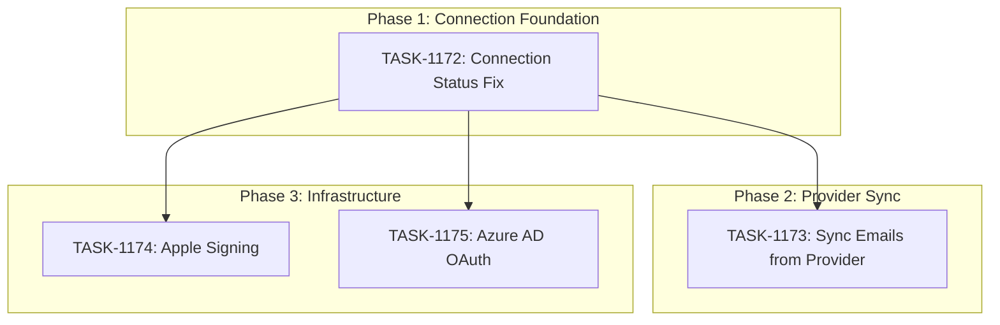

# Sprint Plan: SPRINT-052 - Email Sync Production Ready

**Created**: 2026-01-23
**Updated**: 2026-01-24
**Status**: In Progress - Bug Fixes
**Goal**: Fix email sync to actually fetch emails from providers and display accurate connection status

---

## Sprint Goal

This sprint focuses on making email sync production-ready by addressing two critical issues:

1. **BACKLOG-457 (P0)**: The "Sync Emails" button only links existing emails from the local database - it MUST fetch new emails from Gmail/Outlook for transaction contacts. Users expect "Sync" to actually sync.

2. **BACKLOG-458 (P1)**: Settings UI shows email accounts as "connected" even when OAuth sessions are expired, causing confusion when sync operations fail.

Secondary items address build/release infrastructure and OAuth configuration for enterprise customers.

---

## Prerequisites / Environment Setup

Before starting sprint work, engineers must:
- [ ] `git checkout develop && git pull origin develop`
- [ ] `npm install`
- [ ] `npm rebuild better-sqlite3-multiple-ciphers`
- [ ] `npx electron-rebuild`
- [ ] Verify app starts: `npm run dev`
- [ ] Verify tests pass: `npm test`

**Note**: Native module rebuilds are required after `npm install` or Node.js updates.

---

## In Scope (4 Items)

### Phase 1: Email Connection Foundation (Sequential)
| ID | Title | Est. Tokens | Priority | Task File |
|----|-------|-------------|----------|-----------|
| BACKLOG-458 | Email Connection Status Shows Connected When Session Expired | ~30K | P1 | TASK-1172 |

### Phase 2: Core Email Sync (Sequential - Depends on Phase 1)
| ID | Title | Est. Tokens | Priority | Task File |
|----|-------|-------------|----------|-----------|
| BACKLOG-457 | Sync Emails Must Fetch from Provider | ~50K | P0 | TASK-1173 |

### Phase 3: Infrastructure & OAuth (Parallel - Independent)
| ID | Title | Est. Tokens | Priority | Task File |
|----|-------|-------------|----------|-----------|
| BACKLOG-406 | Fix Apple Signing Certificate for macOS Release | ~5K | P1 | TASK-1174 |
| BACKLOG-454 | Azure AD OAuth Email Config | ~20K | P0 | TASK-1175 |

---

## Out of Scope / Deferred

| ID | Title | Reason |
|----|-------|--------|
| BACKLOG-456 | Unify Loading Animation UI | Nice-to-have, not critical for email sync |
| BACKLOG-452 | Admin User Management UI | Separate feature track |

---

## Reprioritized Backlog

| Priority | ID | Title | Est. Tokens | Phase | Dependencies |
|----------|-----|-------|-------------|-------|--------------|
| 1 | BACKLOG-458 | Email Connection Status Fix | ~30K | 1 | None |
| 2 | BACKLOG-457 | Sync Emails Must Fetch from Provider | ~50K | 2 | 458 (accurate status needed first) |
| 3 | BACKLOG-406 | Fix Apple Signing Certificate | ~5K | 3 | None |
| 4 | BACKLOG-454 | Azure AD OAuth Email Config | ~20K | 3 | None |

**Total Estimated Tokens**: ~105K

---

## Phase Plan

### Phase 1: Email Connection Foundation (Sequential - MUST be first)

**Goal**: Fix connection status to accurately reflect OAuth state before implementing provider fetch

| Task | Title | Est. | Execution |
|------|-------|------|-----------|
| TASK-1172 | Fix Email Connection Status Mismatch | ~30K | Sequential |

**Why First**: The sync feature in Phase 2 needs accurate connection status to:
1. Know when to attempt provider fetch vs prompt re-auth
2. Display correct error messages when OAuth is expired
3. Trigger token refresh proactively

**Deliverables**:
- Connection status validates OAuth token before displaying "connected"
- Expired/invalid tokens show "re-authenticate" prompt
- Token refresh logic implemented (refresh before expiry)
- Session idle state properly clears cached status

**Files Likely Modified**:
- `src/components/Settings.tsx` (connection status display)
- `src/appCore/state/flows/useEmailHandlers.ts` (OAuth state management)
- `electron/services/googleAuthService.ts` (token validation/refresh)
- `electron/services/microsoftAuthService.ts` (token validation/refresh)

**Integration checkpoint**: Connection status accurately reflects OAuth state, tests pass.

---

### Phase 2: Core Email Sync (Sequential - Depends on Phase 1)

**Goal**: Implement provider fetch when user clicks "Sync Emails"

| Task | Title | Est. | Execution |
|------|-------|------|-----------|
| TASK-1173 | Sync Emails Must Fetch from Provider | ~50K | After TASK-1172 |

**Why Sequential**: Requires accurate connection status from Phase 1 to:
1. Check if OAuth is valid before attempting fetch
2. Handle re-auth flow gracefully
3. Use token refresh from Phase 1

**Deliverables**:
- "Sync Emails" button fetches new emails from Gmail/Outlook
- Uses efficient provider search (filter by contact emails, date range)
- Deduplicates against existing communications
- Shows progress indicator during fetch
- Graceful fallback when provider unavailable
- Extends existing auto-link service

**Technical Approach** (from BACKLOG-457):
```
1. Get contact emails from transaction_contacts + contact_emails
2. Build provider-specific search query:
   - Gmail: `from:(email1 OR email2) OR to:(email1 OR email2) after:YYYY/MM/DD`
   - Outlook: Similar OData filter
3. Fetch matching emails (paginated, limited)
4. Dedup against existing communications.external_id
5. Store new emails
6. Run existing auto-link logic
```

**Files Likely Modified**:
- `electron/services/autoLinkService.ts` (extend to fetch from provider)
- `electron/transaction-handlers.ts` (add sync-from-provider IPC)
- `electron/services/googleAuthService.ts` or Gmail handlers (search API)
- `electron/services/outlookHandlers.ts` (search API)
- `src/components/TransactionDetail.tsx` (UI trigger + progress)

**Integration checkpoint**: Sync Emails fetches and links provider emails, tests pass.

---

### Phase 3: Infrastructure & OAuth (Parallel - After Phase 1)

**Goal**: Address release infrastructure and enterprise OAuth needs

| Task | Title | Est. | Execution |
|------|-------|------|-----------|
| TASK-1174 | Fix Apple Signing Certificate | ~5K | Parallel |
| TASK-1175 | Azure AD OAuth Email Config | ~20K | Parallel |

**Why Parallel**: These tasks are independent:
- TASK-1174: CI/CD and GitHub Secrets work (no code changes)
- TASK-1175: Azure AD OAuth config (separate from Gmail/Outlook consumer OAuth)

**Note on Parallel Execution**:
- These are infrastructure/config tasks with no shared files
- Can use separate git worktrees if needed
- Both can start after Phase 1 completes

**Worktree Setup** (if parallel execution):
```bash
git worktree add ../Mad-TASK-1174 -b fix/task-1174-apple-signing develop
git worktree add ../Mad-TASK-1175 -b feature/task-1175-azure-ad develop
```

**Integration checkpoint**: macOS release builds succeed, Azure AD OAuth functional.

---

## Merge Plan

- **Main branch**: `develop`
- **Feature branch format**: `fix/TASK-XXXX-description` or `feature/TASK-XXXX-description`
- **No integration branches needed**: Tasks are sequential or touch isolated systems

### Merge Order (Explicit)

```
Phase 1:
1. TASK-1172 -> develop (PR)

Phase 2:
2. TASK-1173 -> develop (PR, after 1172 merged)

Phase 3 (Parallel - can run after Phase 1):
3. TASK-1174 -> develop (PR)
4. TASK-1175 -> develop (PR)
```

---

## Dependency Graph (Mermaid)



---

## Dependency Graph (YAML)

```yaml
dependency_graph:
  nodes:
    - id: TASK-1172
      type: task
      phase: 1
      title: "Fix Email Connection Status Mismatch"
      backlog: BACKLOG-458
    - id: TASK-1173
      type: task
      phase: 2
      title: "Sync Emails Must Fetch from Provider"
      backlog: BACKLOG-457
    - id: TASK-1174
      type: task
      phase: 3
      title: "Fix Apple Signing Certificate"
      backlog: BACKLOG-406
    - id: TASK-1175
      type: task
      phase: 3
      title: "Azure AD OAuth Email Config"
      backlog: BACKLOG-454

  edges:
    - from: TASK-1172
      to: TASK-1173
      type: depends_on
      reason: "Provider sync needs accurate OAuth status to function correctly"
    - from: TASK-1172
      to: TASK-1174
      type: can_start_after
      reason: "Infrastructure work is independent but follows foundation"
    - from: TASK-1172
      to: TASK-1175
      type: can_start_after
      reason: "Azure AD OAuth is independent but follows foundation"
```

---

## File Conflict Matrix

| File/Area | Tasks | Conflict Risk | Resolution |
|-----------|-------|---------------|------------|
| `electron/services/googleAuthService.ts` | 1172, 1173 | Medium | 1172 first adds validation, 1173 uses it |
| `electron/services/microsoftAuthService.ts` | 1172, 1173 | Medium | 1172 first adds validation, 1173 uses it |
| `electron/services/autoLinkService.ts` | 1173 | None | Single task modifies |
| `src/components/Settings.tsx` | 1172 | None | Single task modifies |
| `.github/workflows/release.yml` | 1174 | None | Isolated CI work |
| `electron/services/azureAuthService.ts` | 1175 | None | New or isolated file |

---

## Testing & Quality Plan

### Unit Testing

**New tests required for:**
- TASK-1172: OAuth token validation functions, connection status logic
- TASK-1173: Provider search query building, deduplication logic, auto-link extension
- TASK-1175: Azure AD OAuth flow (if code changes)

**Existing tests to update:**
- `electron/services/__tests__/autoLinkService.test.ts` (extend for provider fetch)
- Auth service tests for token validation

### Coverage Expectations

- Coverage rules: No regression from current baseline
- New OAuth validation: Target 60% coverage
- New provider fetch: Target 60% coverage

### Integration / Feature Testing

Required manual test scenarios:

**TASK-1172 - Connection Status:**
1. Connect Gmail -> show connected
2. Wait for token expiry / manually revoke -> show disconnected/re-auth
3. Reconnect -> show connected
4. Same flows for Outlook

**TASK-1173 - Provider Sync:**
1. Add contact to transaction
2. Click "Sync Emails" -> fetches new emails from provider
3. Verify emails appear in transaction communications
4. Verify deduplication (re-sync doesn't duplicate)
5. Test with expired OAuth -> graceful re-auth prompt
6. Test with both Gmail and Outlook

**TASK-1174 - Apple Signing:**
1. Re-run release workflow
2. Verify macOS .dmg and .zip artifacts uploaded
3. Verify code signing and notarization

**TASK-1175 - Azure AD:**
1. Configure Azure AD OAuth
2. Connect enterprise email account
3. Verify email sync works

### CI / CD Quality Gates

The following MUST pass before merge:
- [ ] Unit tests
- [ ] Type checking (`npm run type-check`)
- [ ] Linting (`npm run lint`)
- [ ] Build step (`npm run build`)
- [ ] Security audit

---

## Risk Register

| Risk | Likelihood | Impact | Mitigation |
|------|------------|--------|------------|
| OAuth token refresh breaks existing flows | Medium | High | Comprehensive testing of connect/disconnect cycles |
| Provider API rate limits during bulk sync | Medium | Medium | Implement pagination, respect rate limits |
| Gmail/Outlook search API differences | Medium | Medium | Abstract provider-specific logic, test both |
| Azure AD OAuth complexity | Medium | Medium | Follow Microsoft docs, test with enterprise account |
| Apple certificate issues persist | Low | Medium | Document troubleshooting steps, test locally first |
| Connection status cache invalidation | Medium | Medium | Use event-based updates, avoid polling |

---

## Decision Log

### Decision: Phase 1 Before Phase 2

- **Date**: 2026-01-23
- **Context**: BACKLOG-457 (provider sync) and BACKLOG-458 (connection status) are related
- **Decision**: Fix connection status first, then implement provider sync
- **Rationale**: Provider sync needs to know if OAuth is valid before attempting fetch. Inaccurate status leads to confusing error handling.
- **Impact**: Sequential dependency adds time but reduces integration issues

### Decision: Include Infrastructure Items

- **Date**: 2026-01-23
- **Context**: BACKLOG-406 (Apple signing) and BACKLOG-454 (Azure AD) were mentioned
- **Decision**: Include as Phase 3 parallel work
- **Rationale**: These are relatively low-effort and address release/enterprise needs
- **Impact**: Sprint scope ~105K tokens, manageable

### Decision: Exclude UI Polish Items

- **Date**: 2026-01-23
- **Context**: BACKLOG-456 (loading animation) could be included
- **Decision**: Defer to future sprint
- **Rationale**: Not critical for email sync functionality
- **Impact**: Sprint remains focused on core email sync

---

## Unplanned Work Log

| Task | Source | Root Cause | Added Date | Est. Tokens | Actual Tokens |
|------|--------|------------|------------|-------------|---------------|
| BACKLOG-490 | QA Testing | EMAIL_CONNECTED not updating userData.hasEmailConnected in ready state | 2026-01-24 | ~15K | - |
| BACKLOG-491 | QA Testing | Excessive NavigationButtons console logging (22+ entries) | 2026-01-24 | ~5K | - |
| BACKLOG-492 | QA Testing | Outlook/Microsoft email sync not tested (only Gmail tested) | 2026-01-24 | ~5K | - |
| BACKLOG-493 | QA Testing | Cannot unlink emails - "Communication not found" error | 2026-01-24 | ~10K | - |
| BACKLOG-494 | User Request | Emails not displayed in natural thread format like messages | 2026-01-24 | ~25K | - |

---

## Parallel Execution Strategy

### Phase 1: Sequential (Required)

```
TIME -->
[TASK-1172 Connection Status Fix]
         ~30K
```

### Phase 2: Sequential (Depends on Phase 1)

```
TIME -->
[TASK-1173 Sync Emails from Provider]
         ~50K
```

### Phase 3: Parallel (After Phase 1)

```
TIME -->
Track A: [TASK-1174 Apple Signing]      ~5K
Track B: [TASK-1175 Azure AD OAuth]    ~20K
```

---

## Estimated Effort Summary

| Phase | Tasks | Est. Tokens | Execution |
|-------|-------|-------------|-----------|
| Phase 1: Connection Foundation | 1172 | ~30K | Sequential |
| Phase 2: Provider Sync | 1173 | ~50K | Sequential |
| Phase 3: Infrastructure | 1174, 1175 | ~25K | Parallel |
| **Total** | **4 tasks** | **~105K** | - |

**SR Review Overhead**: Add ~15K for reviews across 4 PRs
**Contingency**: ~10K (10%)

**Sprint Total**: ~130K tokens

---

## SR Engineer Review Checklist

Before execution, SR Engineer must validate:

- [ ] Dependency graph is accurate
- [ ] File conflict matrix is complete
- [ ] Phase 1 -> Phase 2 sequential execution required
- [ ] Phase 3 parallel execution is safe
- [ ] Token estimates are reasonable
- [ ] OAuth token validation approach is sound
- [ ] Provider search API approach is efficient
- [ ] No hidden dependencies missed

---

## Task Execution Status

| Phase | Task | Backlog | Status | Engineer | PR | Actual Tokens |
|-------|------|---------|--------|----------|-----|---------------|
| 1 | TASK-1172 | BACKLOG-458 | **MERGED** | Claude | #568 | - |
| 2 | TASK-1173 | BACKLOG-457 | **MERGED** | Claude | #571 | - |
| 3 | TASK-1174 | BACKLOG-406 | Deferred to SPRINT-056 | - | - | - |
| 3 | TASK-1175 | BACKLOG-454 | Deferred (no sprint) | - | - | - |

### Additional PRs from QA
| PR | Description | Status |
|----|-------------|--------|
| #572 | Dashboard reconnect button (BACKLOG-464) | **MERGED** |
| #573 | Email connection UI fixes | **FAIL** - onboarding loop bug |

### Follow-up Items Created
- BACKLOG-466: Email sync optimization
- BACKLOG-467: Sync AI add-on from Supabase

### Sprint Reopened for Bug Fixes (2026-01-24)
- Core items complete: Email connection status (458), Email sync from provider (457)
- BACKLOG-406 (Apple signing): Deferred to SPRINT-056 (Consumer Launch Track)
- BACKLOG-454 (Azure AD): Deferred, no sprint assignment (enterprise feature)
- **Bugs discovered during QA testing - must fix before sprint closure:**
  - BACKLOG-490: EMAIL_CONNECTED not updating state in ready mode
  - BACKLOG-491: Excessive NavigationButtons console logging
  - BACKLOG-492: Outlook/Microsoft email sync not tested

### Phase 4: Bug Fixes (Unplanned - Added 2026-01-24)

| Task | Backlog | Status | Engineer | PR | Actual Tokens |
|------|---------|--------|----------|-----|---------------|
| TASK-TBD | BACKLOG-490 | Pending | - | - | - |
| TASK-TBD | BACKLOG-491 | Pending | - | - | - |
| TASK-TBD | BACKLOG-492 | Pending | - | - | - |
| TASK-TBD | BACKLOG-493 | Pending | - | - | - |

### Phase 5: Email Thread Display (User Request - Added 2026-01-24)

| Task | Backlog | Status | Engineer | PR | Actual Tokens |
|------|---------|--------|----------|-----|---------------|
| TASK-1183 | BACKLOG-494 | Pending | - | - | - |

**Description**: Display emails in natural thread format, grouping conversations similar to how text messages are displayed. P0 priority - user specifically requested for SPRINT-052.

---

## End-of-Sprint Validation Checklist

- [x] Core tasks merged to develop (458, 457)
- [ ] All CI checks passing (App.test.tsx has pre-existing failures)
- [x] Core acceptance criteria verified via QA
- [ ] Manual testing completed (Outlook not tested)
- [x] No unresolved conflicts
- [ ] Bug fixes completed (BACKLOG-490, 491, 492)

**Email Connection Status (TASK-1172 / PR #568):** ✅ PASS
- [x] Connection status validates OAuth token
- [x] Expired tokens prompt re-auth (yellow "Connection Issue" state)
- [x] Token refresh before expiry works
- [x] Gmail tested (Outlook not tested this session)

**Sync Emails (TASK-1173 / PR #571):** ✅ PASS
- [x] Sync button fetches from provider
- [x] Efficient search (contacts + date range)
- [x] Deduplication works
- [x] Progress indicator shown
- [x] Graceful error handling
- [x] Gmail tested

**Apple Signing (TASK-1174):** ⏳ DEFERRED
- [ ] Certificate exported and encoded
- [ ] GitHub Secrets updated
- [ ] Release workflow succeeds for macOS
- [ ] .dmg and .zip artifacts uploaded

**Azure AD OAuth (TASK-1175):** ⏳ DEFERRED
- [ ] Azure AD OAuth configured
- [ ] Enterprise email connection works
- [ ] Email sync functional

**Dashboard Reconnect (PR #572):** ✅ PASS
- [x] Full-width banner style (matches OfflineBanner)
- [x] "Continue Setup" opens Settings with scroll/highlight
- [x] Yellow state shows for expired connections

---

## Related Documentation

- **SPRINT-051**: `.claude/plans/sprints/SPRINT-051.md` (predecessor with license system)
- **Auto-Link Service**: `electron/services/autoLinkService.ts`
- **Engineer Workflow**: `.claude/docs/ENGINEER-WORKFLOW.md`
- **PR-SOP**: `.claude/docs/PR-SOP.md`
