# Sprint Plan: SPRINT-053 - BACKLOG-506 Redo (Database Architecture Cleanup)

**Created**: 2026-01-25
**Updated**: 2026-01-25
**Status**: Planning
**Goal**: Redo BACKLOG-506 correctly with comprehensive audit, phased implementation, user testing gates, and proper SR review

---

## Incident Summary: Why This Sprint Exists

BACKLOG-506 was merged prematurely on 2026-01-25, causing multiple production failures:

### Symptoms
- Contact search broken ("no such column: comm.sent_at")
- Message lookup not finding all messages
- Export services broken (folderExportService, pdfExportService)
- Multiple queries still referencing removed columns

### Root Causes (Lessons Learned)

| Root Cause | What Happened | Prevention in This Sprint |
|------------|---------------|---------------------------|
| **Incomplete audit** | Engineer didn't find ALL queries referencing removed columns | TASK-1210: Comprehensive audit with explicit checklist |
| **Merged without user testing** | User said "test on branch first", we merged anyway | User approval gates after EACH phase |
| **Skipped SR review** | Used `--admin` to bypass CI gates | SR Engineer review is MANDATORY before any merge |
| **Reactive patching** | Each bug led to quick fix that introduced new bugs | No hotfixes - if something breaks, REVERT and fix properly |
| **Mixed concerns** | Combined BACKLOG-506 fixes with BACKLOG-508 refactoring | One concern per task, clean separation |

### Commits to Revert (in order)

```
94655d48 fix: create frontend-compatible utilities for browser use
484183c3 fix(db): update SQL queries for BACKLOG-506 column removal
25d1f131 docs: update task file with PR URL
cc6601ea refactor(utils): consolidate message/contact utilities into shared modules
6e6ae2f9 chore(pm): create TASK-1201 for BACKLOG-508 consolidate message utilities
6d615711 Merge pull request #606 (BACKLOG-506 merge commit)
```

### Last Known Good State

**Commit:** `59ca47a9` (Merge PR #590 from sprint-052-closure)

---

## Sprint Goal

Redo BACKLOG-506 Database Architecture Cleanup with:
1. **Comprehensive pre-implementation audit** - Find EVERY query referencing removed columns
2. **User-approved implementation plan** - User reviews and approves audit before any code
3. **Phased implementation** - One small change per phase, verified before proceeding
4. **User testing gates** - User tests after EACH phase (not "trust me it works")
5. **Proper SR review** - Full review before any merge to develop
6. **User-controlled merge** - Final merge only with explicit user action

---

## Phase Structure

This sprint has a strict sequential structure with user approval gates:

```
Phase 0: REVERT (get user back to working state)
    |
    v
Phase 1: AUDIT (engineer finds ALL references)
    |
    v
USER APPROVAL GATE: Review and approve audit checklist
    |
    v
Phase 2: UNIQUE CONSTRAINTS (add constraints only)
    |
    v
USER TESTING GATE: Verify app still works
    |
    v
Phase 3: DROP UNUSED TABLE (transaction_participants)
    |
    v
USER TESTING GATE: Verify app still works
    |
    v
Phase 4: ACID WRAPPERS (transaction wrapping)
    |
    v
USER TESTING GATE: Verify app still works
    |
    v
Phase 5: EMAIL LINKING (fix code path, create messageDbService)
    |
    v
USER TESTING GATE: Verify email linking works
    |
    v
Phase 6: UPDATE QUERIES (the big one - update ALL queries)
    |
    v
USER TESTING GATE: Verify all features work (most critical gate)
    |
    v
Phase 7: REMOVE COLUMNS (the destructive migration)
    |
    v
USER TESTING GATE: Final verification
    |
    v
Phase 8: CLEANUP (remove COALESCE patterns)
    |
    v
SR ENGINEER REVIEW: Full architecture review
    |
    v
USER-CONTROLLED MERGE: User explicitly requests merge
```

---

## Tasks

### Phase 0: Revert to Working State

| ID | Title | Est. Tokens | Type |
|----|-------|-------------|------|
| TASK-1210 | Revert BACKLOG-506 and BACKLOG-508 changes | ~15K | revert |

**Gate:** User confirms app is working before proceeding

---

### Phase 1: Comprehensive Audit

| ID | Title | Est. Tokens | Type |
|----|-------|-------------|------|
| TASK-1211 | Comprehensive query audit for column removal | ~25K | audit |

**Deliverable:** Explicit checklist of:
- Every SQL query referencing to-be-removed columns
- Every TypeScript type using removed column names
- Every export service using legacy patterns
- Every test that needs updating

**Gate:** User reviews and approves checklist before implementation begins

---

### Phase 2: Add Unique Constraints

| ID | Title | Est. Tokens | Type |
|----|-------|-------------|------|
| TASK-1212 | Add unique constraints to communications table | ~10K | schema |

**Gate:** User tests - app should work exactly as before

---

### Phase 3: Drop Unused Table

| ID | Title | Est. Tokens | Type |
|----|-------|-------------|------|
| TASK-1213 | Drop transaction_participants table | ~8K | schema |

**Gate:** User tests - app should work exactly as before

---

### Phase 4: ACID Compliance Wrappers

| ID | Title | Est. Tokens | Type |
|----|-------|-------------|------|
| TASK-1214 | Add transaction wrappers for data integrity | ~12K | refactor |

**Gate:** User tests - app should work exactly as before

---

### Phase 5: Fix Email Linking Code Path

| ID | Title | Est. Tokens | Type |
|----|-------|-------------|------|
| TASK-1215 | Create messageDbService and update email linking | ~30K | feature |

**Gate:** User tests email linking specifically

---

### Phase 6: Update ALL Queries (The Big One)

| ID | Title | Est. Tokens | Type |
|----|-------|-------------|------|
| TASK-1216 | Update all queries from audit checklist | ~50K | refactor |

**Sub-tasks (from audit):**
- 6a: Update contactDbService queries
- 6b: Update communicationDbService queries
- 6c: Update folderExportService queries
- 6d: Update pdfExportService queries
- 6e: Update enhancedExportService queries
- 6f: Update any other queries from audit

**Gate:** MOST CRITICAL - User tests ALL features:
- Contact search
- Message display
- Export (folder and PDF)
- Email linking
- Text message display

---

### Phase 7: Remove Legacy Columns

| ID | Title | Est. Tokens | Type |
|----|-------|-------------|------|
| TASK-1217 | Migration to drop legacy columns from communications | ~15K | schema |

**This is the destructive migration.** Only run after Phase 6 is fully verified.

**Gate:** User tests - everything should still work

---

### Phase 8: Clean Up COALESCE Patterns

| ID | Title | Est. Tokens | Type |
|----|-------|-------------|------|
| TASK-1218 | Remove COALESCE fallback patterns | ~10K | cleanup |

**Gate:** User tests - no behavioral changes expected

---

### Final Review and Merge

| ID | Title | Est. Tokens | Type |
|----|-------|-------------|------|
| TASK-1219 | SR Engineer full architecture review | ~20K | review |
| TASK-1220 | User-controlled merge to develop | ~5K | merge |

---

## Dependency Graph

```mermaid
graph TD
    subgraph Phase0[Phase 0: Revert]
        TASK1210[TASK-1210: Revert changes]
    end

    subgraph UserGate0[User Gate 0]
        UG0{User confirms working}
    end

    subgraph Phase1[Phase 1: Audit]
        TASK1211[TASK-1211: Query audit]
    end

    subgraph UserGate1[User Gate 1]
        UG1{User approves checklist}
    end

    subgraph Phase2[Phase 2: Constraints]
        TASK1212[TASK-1212: Unique constraints]
    end

    subgraph UserGate2[User Gate 2]
        UG2{User tests app}
    end

    subgraph Phase3[Phase 3: Drop Table]
        TASK1213[TASK-1213: Drop participants]
    end

    subgraph UserGate3[User Gate 3]
        UG3{User tests app}
    end

    subgraph Phase4[Phase 4: ACID]
        TASK1214[TASK-1214: Transaction wrappers]
    end

    subgraph UserGate4[User Gate 4]
        UG4{User tests app}
    end

    subgraph Phase5[Phase 5: Email]
        TASK1215[TASK-1215: messageDbService]
    end

    subgraph UserGate5[User Gate 5]
        UG5{User tests email linking}
    end

    subgraph Phase6[Phase 6: Queries]
        TASK1216[TASK-1216: Update all queries]
    end

    subgraph UserGate6[User Gate 6: CRITICAL]
        UG6{User tests ALL features}
    end

    subgraph Phase7[Phase 7: Remove]
        TASK1217[TASK-1217: Drop columns]
    end

    subgraph UserGate7[User Gate 7]
        UG7{User tests app}
    end

    subgraph Phase8[Phase 8: Cleanup]
        TASK1218[TASK-1218: Remove COALESCE]
    end

    subgraph Review[Final Review]
        TASK1219[TASK-1219: SR Review]
        TASK1220[TASK-1220: User merge]
    end

    TASK1210 --> UG0 --> TASK1211
    TASK1211 --> UG1 --> TASK1212
    TASK1212 --> UG2 --> TASK1213
    TASK1213 --> UG3 --> TASK1214
    TASK1214 --> UG4 --> TASK1215
    TASK1215 --> UG5 --> TASK1216
    TASK1216 --> UG6 --> TASK1217
    TASK1217 --> UG7 --> TASK1218
    TASK1218 --> TASK1219
    TASK1219 --> TASK1220
```



---

## YAML Dependency Graph

```yaml
dependency_graph:
  nodes:
    - id: TASK-1210
      type: task
      phase: 0
      title: "Revert BACKLOG-506 and BACKLOG-508 changes"
      gate_after: "User confirms app working"
    - id: TASK-1211
      type: task
      phase: 1
      title: "Comprehensive query audit"
      gate_after: "User approves audit checklist"
    - id: TASK-1212
      type: task
      phase: 2
      title: "Add unique constraints"
      gate_after: "User tests app"
    - id: TASK-1213
      type: task
      phase: 3
      title: "Drop transaction_participants"
      gate_after: "User tests app"
    - id: TASK-1214
      type: task
      phase: 4
      title: "ACID transaction wrappers"
      gate_after: "User tests app"
    - id: TASK-1215
      type: task
      phase: 5
      title: "Create messageDbService, update email linking"
      gate_after: "User tests email linking"
    - id: TASK-1216
      type: task
      phase: 6
      title: "Update ALL queries from audit"
      gate_after: "User tests ALL features (CRITICAL)"
    - id: TASK-1217
      type: task
      phase: 7
      title: "Drop legacy columns migration"
      gate_after: "User tests app"
    - id: TASK-1218
      type: task
      phase: 8
      title: "Remove COALESCE patterns"
    - id: TASK-1219
      type: task
      phase: 9
      title: "SR Engineer architecture review"
    - id: TASK-1220
      type: task
      phase: 10
      title: "User-controlled merge"

  edges:
    - from: TASK-1210
      to: TASK-1211
      type: depends_on
      gate: "user_approval"
    - from: TASK-1211
      to: TASK-1212
      type: depends_on
      gate: "user_approval"
    - from: TASK-1212
      to: TASK-1213
      type: depends_on
      gate: "user_testing"
    - from: TASK-1213
      to: TASK-1214
      type: depends_on
      gate: "user_testing"
    - from: TASK-1214
      to: TASK-1215
      type: depends_on
      gate: "user_testing"
    - from: TASK-1215
      to: TASK-1216
      type: depends_on
      gate: "user_testing"
    - from: TASK-1216
      to: TASK-1217
      type: depends_on
      gate: "user_testing_critical"
    - from: TASK-1217
      to: TASK-1218
      type: depends_on
      gate: "user_testing"
    - from: TASK-1218
      to: TASK-1219
      type: depends_on
    - from: TASK-1219
      to: TASK-1220
      type: depends_on
      gate: "sr_approval"
```

---

## Estimated Effort Summary

| Phase | Task | Est. Tokens | Gate Type |
|-------|------|-------------|-----------|
| 0 | TASK-1210 Revert | ~15K | User confirms working |
| 1 | TASK-1211 Audit | ~25K | User approves checklist |
| 2 | TASK-1212 Constraints | ~10K | User testing |
| 3 | TASK-1213 Drop table | ~8K | User testing |
| 4 | TASK-1214 ACID | ~12K | User testing |
| 5 | TASK-1215 Email | ~30K | User testing (email) |
| 6 | TASK-1216 Queries | ~50K | User testing (CRITICAL) + midpoint checkpoint |
| 7 | TASK-1217 Columns | ~15K | Backup verification + User testing |
| 8 | TASK-1218 Cleanup | ~10K | - |
| 9 | TASK-1219 SR Review | ~20K | SR approval |
| 10 | TASK-1220 Merge | ~5K | User action |
| **Total** | **11 tasks** | **~200K** | - |

**SR Review Overhead**: Included in TASK-1219
**Contingency**: ~40K (20% - higher due to complexity)

**Sprint Total**: ~240K tokens

### Calendar Time Tracking (SR Engineer Recommendation)

**Track wall-clock time from TASK-1210 start to TASK-1220 merge for future sprint planning.**

| Metric | Value |
|--------|-------|
| Sprint Start (TASK-1210 begins) | _[Record timestamp]_ |
| Sprint End (TASK-1220 merged) | _[Record timestamp]_ |
| Total Calendar Days | _[Calculate]_ |
| Working Days (excluding user wait time) | _[Calculate]_ |

This data will help estimate similar phased sprints with user testing gates.

---

## Guardrails (ENFORCED)

### No Shortcuts

| Shortcut | Why It's Blocked |
|----------|------------------|
| Bypass user testing | This is exactly what caused the incident |
| Combine phases | Each phase needs isolated verification |
| Skip SR review | We used `--admin` bypass last time - NEVER AGAIN |
| Hotfix on develop | If something breaks, REVERT and fix in the phase branch |
| Merge before CI passes | CI is the first quality gate |

### Stop-and-Ask Triggers

Engineers MUST stop and ask if:
- Audit finds more than 20 files needing changes (scope expansion)
- Any user test fails (do not proceed)
- Any CI check fails (do not bypass)
- Any query pattern is unclear (ask for clarification)
- Migration seems risky (get explicit approval)

### Rollback Plan

If any phase causes issues after user testing:
1. **Immediate:** Close PR without merging
2. **If merged:** Revert the specific phase commit
3. **Document:** Add to incident notes
4. **Fix:** Create new task to address the issue
5. **Re-test:** Full user testing before proceeding

---

## Branch Strategy

### Project Branch

All work happens on a single project branch:
```bash
git checkout develop  # After TASK-1210 revert
git checkout -b project/backlog-506-redo
```

### Phase Branches

Each phase creates a branch FROM the project branch:
```bash
git checkout project/backlog-506-redo
git checkout -b fix/task-1212-unique-constraints
# ... do work ...
# PR targets project/backlog-506-redo, NOT develop
```

### Final Merge

Only TASK-1220 merges `project/backlog-506-redo` to `develop`.

---

## Risk Register

| Risk | Likelihood | Impact | Mitigation |
|------|------------|--------|------------|
| Audit misses queries | Medium | High | Multiple passes, grep patterns, user review |
| Phase 6 too large | High | Medium | Sub-tasks, explicit checklist from audit |
| User unavailable for testing | Medium | High | Schedule testing windows in advance |
| Migration corrupts data | Low | Critical | Phase 7 is last, all verifications first |
| SR Engineer finds issues | Medium | Medium | Early informal review between phases |
| Timeline pressure leads to shortcuts | High | High | PM enforces gates, no exceptions |

---

## Decision Log

### Decision: Strict User Testing Gates

- **Date**: 2026-01-25
- **Context**: BACKLOG-506 failed because we merged without user testing
- **Decision**: User must explicitly approve after each phase
- **Rationale**: The user is the ultimate quality gate for this type of change
- **Impact**: Longer timeline but significantly reduced failure risk

### Decision: Project Branch Strategy

- **Date**: 2026-01-25
- **Context**: Need to isolate all phases from develop until fully verified
- **Decision**: Use `project/backlog-506-redo` branch
- **Rationale**: Each phase merges to project branch, final merge to develop only after all phases complete
- **Impact**: Clean develop history, easy rollback if needed

### Decision: No Parallel Execution

- **Date**: 2026-01-25
- **Context**: Could potentially parallelize some phases
- **Decision**: All phases strictly sequential
- **Rationale**: This task failed once due to complexity - simpler is better
- **Impact**: Slower but safer

---

## Task Execution Status

| Phase | Task | Status | Engineer | PR | Actual Tokens | User Gate |
|-------|------|--------|----------|-----|---------------|-----------|
| 0 | TASK-1210 | Pending | - | - | - | - |
| 1 | TASK-1211 | Pending | - | - | - | - |
| 2 | TASK-1212 | Pending | - | - | - | - |
| 3 | TASK-1213 | Pending | - | - | - | - |
| 4 | TASK-1214 | Pending | - | - | - | - |
| 5 | TASK-1215 | Pending | - | - | - | - |
| 6 | TASK-1216 | Pending | - | - | - | - |
| 7 | TASK-1217 | Pending | - | - | - | - |
| 8 | TASK-1218 | Pending | - | - | - | - |
| 9 | TASK-1219 | Pending | - | - | - | - |
| 10 | TASK-1220 | Pending | - | - | - | - |

---

## End-of-Sprint Validation Checklist

- [ ] TASK-1210: Develop is back to working state
- [ ] TASK-1211: Comprehensive audit completed and approved
- [ ] TASK-1212: Unique constraints added, user tested
- [ ] TASK-1213: transaction_participants dropped, user tested
- [ ] TASK-1214: ACID wrappers added, user tested
- [ ] TASK-1215: messageDbService created, email linking works
- [ ] TASK-1216: All queries updated, ALL features tested
- [ ] TASK-1217: Legacy columns dropped, user tested
- [ ] TASK-1218: COALESCE patterns removed
- [ ] TASK-1219: SR Engineer approved
- [ ] TASK-1220: Merged to develop with user action
- [ ] No regressions from original functionality
- [ ] Contact search works
- [ ] Message display works
- [ ] Export (folder and PDF) works
- [ ] Email linking works
- [ ] Text message display works

---

## Related Documentation

- **Original Backlog Item**: `.claude/plans/backlog/items/BACKLOG-506.md`
- **Engineer Workflow**: `.claude/docs/ENGINEER-WORKFLOW.md`
- **PR-SOP**: `.claude/docs/PR-SOP.md`
- **Git Branching**: `.claude/docs/shared/git-branching.md`
