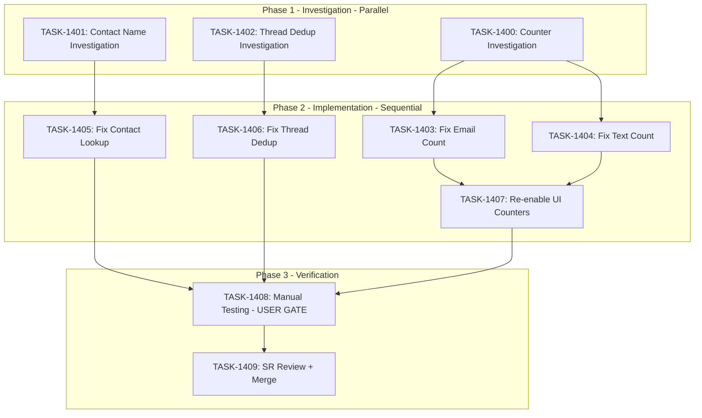

# Sprint Plan: SPRINT-061 - Communication Display Fixes

**Created**: 2026-01-26
**Updated**: 2026-01-26
**Status**: Ready for Planning
**Project Branch**: `project/sprint-061-communication-display-fixes`
**Base**: `develop`

---

## Sprint Goal

Fix communication display issues discovered during BACKLOG-506 (database architecture cleanup) testing. This sprint addresses three related bugs affecting text and email thread counters, contact name resolution, and thread deduplication in the UI.

---

## Prerequisites / Environment Setup

Before starting sprint work, engineers must:
- [ ] `git checkout develop && git pull origin develop`
- [ ] `npm install`
- [ ] `npm rebuild better-sqlite3-multiple-ciphers`
- [ ] `npx electron-rebuild`
- [ ] Verify app starts: `npm run dev`
- [ ] Verify tests pass: `npm test`

**Note**: Native module rebuilds are required after `npm install` or Node.js updates.

---

## Context: New Architecture (BACKLOG-506)

The app now has a three-table architecture:

```
emails table (NEW)
  |-- all email content (subject, body_plain, sender, etc.)

messages table (EXISTS)
  |-- all text content (body_text, participants, etc.)

communications table (JUNCTION ONLY)
  |-- email_id FK -> emails
  |-- message_id FK -> messages
  |-- transaction_id FK -> transactions
  |-- link metadata (link_source, link_confidence, linked_at)
```

**Schema Version**: 23

---

## In Scope

| ID | Title | Priority | Type |
|----|-------|----------|------|
| BACKLOG-510 | Fix transaction card communication counters | Medium | UI Bug |
| BACKLOG-513 | Fix unknown contact name display in text threads | Medium | UI Bug |
| BACKLOG-514 | Fix thread deduplication during message import | Medium | Backend Bug |

---

## Out of Scope / Deferred

- Performance optimizations for large message lists
- New communication features
- Changes to the emails table structure (BACKLOG-506 complete)
- Broker portal communication display (separate codebase)

---

## Issue Analysis

### BACKLOG-510: Communication Counter Issues

**Symptoms:**
- Text and email thread counters on TransactionCard show wrong counts
- Counters currently hidden (lines 208-225 in TransactionCard.tsx)

**Root Cause Investigation Needed:**

1. **Email count query issue**: The current SQL uses COALESCE with deprecated `c.communication_type`:
```sql
-- transactionDbService.ts lines 119-125
COALESCE(m.channel, c.communication_type) = 'email'
```
Since BACKLOG-506, `communications` is a pure junction table - `communication_type` column no longer exists!

2. **Text thread count may be correct**: Uses stored `text_thread_count` which is updated via `updateTransactionThreadCount()`. However, need to verify the counting logic accounts for the new architecture properly.

**Likely Files:**
- `electron/services/db/transactionDbService.ts` - Email count query needs fixing
- `electron/services/db/communicationDbService.ts` - Thread counting logic verification
- `src/components/transaction/components/TransactionCard.tsx` - Re-enable counters after fix

---

### BACKLOG-513: Unknown Contact Name Display

**Symptoms:**
- When linking text threads to transactions, some 1:1 conversations display "unknown" as contact name
- Contact lookup not finding phone number match

**Root Cause Investigation Needed:**

1. **Phone normalization mismatch**: The lookup may use different normalization than what's stored
2. **Contact phone table join issue**: The query joining contacts may have a bug
3. **Fallback handling**: The "unknown" default may be returned prematurely

**Likely Files:**
- `src/components/transactionDetailsModule/components/MessageThreadCard.tsx` - Contains `normalizePhoneForLookup()`
- `electron/services/db/contactDbService.ts` - Contact phone lookup queries
- `electron/services/iosContactsParser.ts` - `lookupByPhone()` method

---

### BACKLOG-514: Thread Deduplication Issues

**Symptoms:**
- Same conversation appears as multiple separate threads in UI
- Messages from same thread imported with different thread_ids

**Root Cause Investigation Needed:**

1. **Import thread assignment**: Check if macOS import assigns consistent thread_ids
2. **Grouping logic**: Check if frontend grouping handles edge cases
3. **Re-import handling**: Check if re-syncing creates duplicate threads

**Likely Files:**
- `electron/services/macOSMessagesImportService.ts` - Import logic, thread_id assignment
- `electron/services/db/communicationDbService.ts` - `countTextThreadsForTransaction()` grouping logic
- `src/components/transactionDetailsModule/components/TransactionMessagesTab.tsx` - Frontend thread grouping

---

## Phase Plan

### Phase 1: Investigation (Parallel - 3 tasks)

**Goal**: Understand root causes before implementing fixes

| Task | Title | Focus Area | Est. Tokens |
|------|-------|------------|-------------|
| TASK-1400 | Investigate email/text counter accuracy | BACKLOG-510 | ~15K |
| TASK-1401 | Investigate unknown contact name display | BACKLOG-513 | ~12K |
| TASK-1402 | Investigate thread deduplication issue | BACKLOG-514 | ~15K |

**Note**: Investigation tasks are parallelizable - no shared file modifications.

**Integration checkpoint**: All investigations complete, root causes documented.

---

### Phase 2: Implementation (Sequential - Based on Investigation)

Tasks will be defined after Phase 1 investigation completes. Expected tasks:

| Task | Title | Dependencies | Est. Tokens |
|------|-------|--------------|-------------|
| TASK-1403 | Fix email count query for new architecture | TASK-1400 | ~20K |
| TASK-1404 | Fix text thread count calculation | TASK-1400 | ~15K |
| TASK-1405 | Fix contact phone lookup normalization | TASK-1401 | ~15K |
| TASK-1406 | Fix thread deduplication on import | TASK-1402 | ~20K |
| TASK-1407 | Re-enable communication counters in UI | TASK-1403, TASK-1404 | ~8K |

**Note**: Actual tasks and estimates will be refined after Phase 1.

**Integration checkpoint**: All CI checks passing, manual testing complete.

---

### Phase 3: Verification (USER GATE + SR Review)

| Task | Title | Dependencies | Est. Tokens |
|------|-------|--------------|-------------|
| TASK-1408 | Manual testing checklist (USER GATE) | All Phase 2 tasks | ~5K |
| TASK-1409 | SR Engineer final review | TASK-1408 (approved) | ~12K |

**USER GATE**: TASK-1408 requires manual user verification before proceeding.

**Integration checkpoint**: Project branch merged to develop.

---

## Dependency Graph (Mermaid)



---

## Dependency Graph (YAML)

```yaml
dependency_graph:
  nodes:
    - id: TASK-1400
      type: investigation
      phase: 1
      title: Investigate counter accuracy
      backlog: BACKLOG-510
    - id: TASK-1401
      type: investigation
      phase: 1
      title: Investigate unknown contact name
      backlog: BACKLOG-513
    - id: TASK-1402
      type: investigation
      phase: 1
      title: Investigate thread deduplication
      backlog: BACKLOG-514
    - id: TASK-1403
      type: fix
      phase: 2
      title: Fix email count query
    - id: TASK-1404
      type: fix
      phase: 2
      title: Fix text thread count
    - id: TASK-1405
      type: fix
      phase: 2
      title: Fix contact phone lookup
    - id: TASK-1406
      type: fix
      phase: 2
      title: Fix thread deduplication
    - id: TASK-1407
      type: ui
      phase: 2
      title: Re-enable UI counters
    - id: TASK-1408
      type: testing
      phase: 3
      title: Manual testing checklist (USER GATE)
    - id: TASK-1409
      type: review
      phase: 3
      title: SR Engineer final review
  edges:
    - from: TASK-1400
      to: TASK-1403
      type: informs
    - from: TASK-1400
      to: TASK-1404
      type: informs
    - from: TASK-1401
      to: TASK-1405
      type: informs
    - from: TASK-1402
      to: TASK-1406
      type: informs
    - from: TASK-1403
      to: TASK-1407
      type: depends_on
    - from: TASK-1404
      to: TASK-1407
      type: depends_on
    - from: TASK-1405
      to: TASK-1408
      type: depends_on
    - from: TASK-1406
      to: TASK-1408
      type: depends_on
    - from: TASK-1407
      to: TASK-1408
      type: depends_on
    - from: TASK-1408
      to: TASK-1409
      type: depends_on
```

---

## Merge Plan

- **Main branch**: `develop`
- **Project branch**: `project/sprint-061-communication-display-fixes`
- **Feature branch format**: `fix/task-XXXX-<slug>`
- **Merge order**:
  1. Phase 1 investigation tasks -> project branch (parallel PRs)
  2. Phase 2 implementation tasks -> project branch (sequential, based on findings)
  3. Phase 3 review -> project branch
  4. project branch -> develop (after final review)

---

## Testing & Quality Plan (REQUIRED)

### Unit Testing

- New tests required for:
  - Email count calculation with new architecture (no communication_type column)
  - Text thread count calculation edge cases
  - Phone normalization edge cases
  - Thread deduplication scenarios

- Existing tests to update:
  - `transactionDbService` tests if email count query changes
  - `communicationDbService` tests for thread counting
  - `MessageThreadCard` tests for contact name display

### Coverage Expectations

- Coverage rules: No regression from current coverage
- Focus areas:
  - DB service functions: Target 80%+
  - UI components with display logic: Target 70%+

### Integration / Feature Testing

Required scenarios (manual testing):
- [ ] Create transaction, link text threads, verify text_thread_count is correct
- [ ] Create transaction, link emails, verify email_count is correct
- [ ] Counters display correctly on TransactionCard (after TASK-1407)
- [ ] Contact names resolve correctly for 1:1 text threads
- [ ] Re-import messages does not create duplicate threads

### CI / CD Quality Gates

The following MUST pass before merge:
- [ ] Unit tests
- [ ] Integration tests (if applicable)
- [ ] Coverage checks
- [ ] Type checking
- [ ] Linting / formatting
- [ ] Build step

---

## Risk Register

| Risk | Likelihood | Impact | Mitigation |
|------|------------|--------|------------|
| Investigation finds multiple root causes | Medium | Medium | Scope Phase 2 tasks based on findings |
| Email count fix requires schema change | Low | High | Avoid schema changes - query-only fix preferred |
| Phone normalization fix affects existing data | Medium | Medium | Test with real user data before merge |
| Thread dedup fix requires re-import | Low | High | Document workaround for existing users |

---

## Decision Log

### Decision: Investigation-First Approach

- **Date**: 2026-01-26
- **Context**: Issues are symptomatic - root causes unclear
- **Decision**: Start with investigation tasks before defining implementation
- **Rationale**: Prevents wasted effort on wrong fixes, ensures comprehensive solution
- **Impact**: Phase 2 tasks defined after Phase 1 complete

### Decision: Project Branch Strategy

- **Date**: 2026-01-26
- **Context**: Multiple related bug fixes need coordinated testing
- **Decision**: Use project branch, merge all fixes together
- **Rationale**: Allows holistic testing of all communication display fixes
- **Impact**: Single merge to develop after all fixes verified

---

## Unplanned Work Log

**Instructions:** Update this section AS unplanned work is discovered during the sprint.

| Task | Source | Root Cause | Added Date | Est. Tokens | Actual Tokens |
|------|--------|------------|------------|-------------|---------------|
| - | - | - | - | - | - |

---

## Estimated Effort Summary

| Phase | Tasks | Est. Tokens | Cumulative |
|-------|-------|-------------|------------|
| 1 | 3 | ~42K | ~42K |
| 2 | 5 | ~73K | ~115K |
| 3 | 2 | ~17K | ~132K |
| **Total** | **10 tasks** | **~132K** | - |

**Phase 2 Breakdown:**
- TASK-1403: ~17.5K (email count fix)
- TASK-1404: ~13.5K (text thread count)
- TASK-1405: ~13.5K (contact lookup)
- TASK-1406: ~17.5K (thread dedup)
- TASK-1407: ~7K (UI counters)

**Phase 3 Breakdown:**
- TASK-1408: ~5K (manual testing prep)
- TASK-1409: ~12K (SR review + merge)

**Contingency**: ~26K (20%)
**Sprint Total**: ~158K tokens

**Note**: Phase 2 estimates will be refined after Phase 1 investigation reveals exact scope.

---

## Task Execution Status

| Phase | Task | Status | Engineer | PR | Tokens | Notes |
|-------|------|--------|----------|-----|--------|-------|
| 1 | TASK-1400 | Ready | - | - | - | Counter investigation |
| 1 | TASK-1401 | Ready | - | - | - | Contact name investigation |
| 1 | TASK-1402 | Ready | - | - | - | Thread dedup investigation |
| 2 | TASK-1403 | Blocked | - | - | - | Awaiting TASK-1400 |
| 2 | TASK-1404 | Blocked | - | - | - | Awaiting TASK-1400 |
| 2 | TASK-1405 | Blocked | - | - | - | Awaiting TASK-1401 |
| 2 | TASK-1406 | Blocked | - | - | - | Awaiting TASK-1402 |
| 2 | TASK-1407 | Blocked | - | - | - | Awaiting TASK-1403, TASK-1404 |
| 3 | TASK-1408 | Blocked | USER | - | - | Manual testing (USER GATE) |
| 3 | TASK-1409 | Blocked | - | - | - | SR Review + Merge to develop |

---

## Files Likely Affected

### Investigation Phase (Read-Only)

| File | Investigation Task |
|------|-------------------|
| `electron/services/db/transactionDbService.ts` | TASK-1400 |
| `electron/services/db/communicationDbService.ts` | TASK-1400, TASK-1402 |
| `electron/database/schema.sql` | TASK-1400, TASK-1402 |
| `src/components/transaction/components/TransactionCard.tsx` | TASK-1400 |
| `src/components/transactionDetailsModule/components/MessageThreadCard.tsx` | TASK-1401 |
| `electron/services/db/contactDbService.ts` | TASK-1401 |
| `electron/services/iosContactsParser.ts` | TASK-1401 |
| `electron/services/macOSMessagesImportService.ts` | TASK-1402 |
| `src/components/transactionDetailsModule/components/TransactionMessagesTab.tsx` | TASK-1402 |

### Implementation Phase (Modify - TBD after investigation)

Files will be identified during Phase 1 investigation.

---

## Related Documentation

- **BACKLOG-506 Audit**: `.claude/plans/BACKLOG-506-audit.md`
- **BACKLOG-506 Design**: `.claude/plans/BACKLOG-506-design.md`
- **SPRINT-060 (Database Cleanup)**: `.claude/plans/sprints/SPRINT-060-database-architecture-cleanup.md`
- **Engineer Workflow**: `.claude/docs/ENGINEER-WORKFLOW.md`
- **PR-SOP**: `.claude/docs/PR-SOP.md`

---

## End-of-Sprint Validation Checklist

- [ ] All tasks merged to project branch
- [ ] All CI checks passing
- [ ] All acceptance criteria verified
- [ ] Testing requirements met (unit + manual)
- [ ] No unresolved conflicts
- [ ] Communication counters display correctly
- [ ] Contact names resolve correctly
- [ ] No duplicate threads appear
- [ ] Project branch merged to develop
- [ ] **Worktree cleanup complete** (if parallel execution used)
