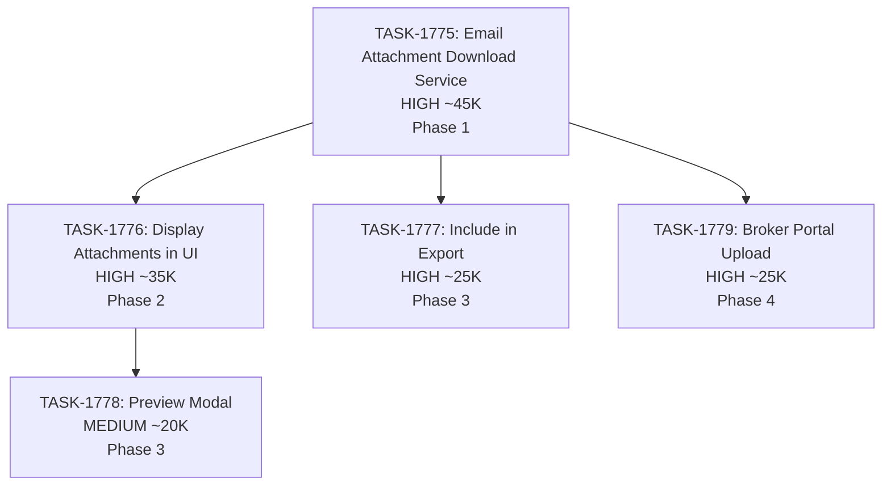

# Sprint Plan: SPRINT-067 - Email Attachments for Audits

**Created**: 2026-01-31
**Status**: PLANNING
**Goal**: Enable users to see email attachments in audit interface and include them in exports
**Target Branch**: develop
**Estimated Duration**: 3-4 days
**Total Estimated Tokens**: ~170K (including SR review overhead)

---

## Sprint Goal

Implement email attachment visibility and export functionality for audits. Currently, email attachments are only tracked as metadata (count, filename) but never downloaded or displayed. This sprint will:

1. Download and store email attachments from Gmail/Outlook
2. Display email attachments in the audit interface (EmailViewModal)
3. Include email attachments in audit package exports
4. Upload email attachments to broker portal (parity with text messages)

---

## Context

### Why This Sprint?

User requirements:
1. **Users can see email attachments** - Attachments should be visible within the audit interface
2. **Attachments included in export** - When exporting an audit, email attachments must be included

### Current State Analysis

**What Exists:**
- `gmailFetchService.ts` has `getAttachment()` method to download from Gmail API
- `outlookFetchService.ts` can fetch attachments via Graph API
- `attachments` table exists with `storage_path` column for local files
- Text message attachments ARE downloaded, stored, displayed, and exported
- Email attachment metadata is stored in `attachment_metadata` JSON but files are NOT downloaded

**Gap:**
| Feature | Text Messages | Emails |
|---------|---------------|--------|
| File storage | Yes (`attachments.storage_path`) | No (metadata only) |
| UI display | Yes (inline images) | No |
| Export | Yes (TASK-1141, 1145) | No (no files) |

**Root Cause:** Email attachments were never implemented beyond metadata capture. The `getAttachment()` API method exists but is never called.

### Architecture Considerations

**Attachment Storage Pattern (from text messages):**
- Store files in `~/Library/Application Support/Magic Audit/attachments/`
- Use content hash for filename to deduplicate
- Record in `attachments` table with `storage_path`

**Download Strategy Options:**
1. **On-Demand** - Download when user clicks attachment (requires API access)
2. **During Sync** - Download during email fetch (increases sync time, but offline access)
3. **Hybrid** - Download metadata during sync, fetch content on first view

**Recommendation:** Hybrid approach - download during initial sync for linked emails, on-demand for browse. This mirrors how text attachments work.

---

## In Scope

| Task | Title | Est. Tokens | Priority | Phase |
|------|-------|-------------|----------|-------|
| TASK-1775 | Email Attachment Download Service | ~45K | HIGH | 1 |
| TASK-1776 | Display Email Attachments in UI | ~35K | HIGH | 2 |
| TASK-1777 | Include Email Attachments in Export | ~25K | HIGH | 3 |
| TASK-1778 | Email Attachment Preview Modal | ~20K | MEDIUM | 3 |
| TASK-1779 | Upload Email Attachments to Broker Portal | ~25K | HIGH | 4 |

**Total Estimated (implementation):** ~150K tokens
**SR Review Overhead:** +20K (5 tasks @ ~4K each)
**Grand Total:** ~170K tokens

---

## Out of Scope / Deferred

| Item | Reason |
|------|--------|
| Video attachment preview | Complex, future enhancement |
| Attachment search/filtering | Future enhancement |
| Cloud storage integration | Files stored locally |
| Batch download UI | On-demand sufficient for MVP |
| Attachment thumbnails for PDFs | Future enhancement |

---

## Dependency Graph



### Execution Order

**Phase 1 (Foundation):**
- TASK-1775: Email Attachment Download Service
  - Creates the infrastructure to download and store email attachments
  - Must complete before any UI or export work

**Phase 2 (UI Display):**
- TASK-1776: Display Email Attachments in UI
  - Depends on TASK-1775 (needs files to display)
  - Shows attachment list in EmailViewModal

**Phase 3 (Export + Enhancements) - Parallel:**
- TASK-1777: Include Email Attachments in Export
  - Depends on TASK-1775 (needs files to export)
  - Can run parallel with TASK-1778

- TASK-1778: Email Attachment Preview Modal
  - Depends on TASK-1776 (needs attachment list to click)
  - Can run parallel with TASK-1777

**Phase 4 (Broker Portal):**
- TASK-1779: Upload Email Attachments to Broker Portal
  - Depends on TASK-1775 (needs files to upload)
  - Runs after Phase 3 (sequential, modifies submission service)

### YAML Edges

```yaml
dependency_graph:
  nodes:
    - id: TASK-1775
      type: task
      phase: 1
      title: "Email Attachment Download Service"
      priority: high
      est_tokens: 45K

    - id: TASK-1776
      type: task
      phase: 2
      title: "Display Email Attachments in UI"
      priority: high
      est_tokens: 35K

    - id: TASK-1777
      type: task
      phase: 3
      title: "Include Email Attachments in Export"
      priority: high
      est_tokens: 25K

    - id: TASK-1778
      type: task
      phase: 3
      title: "Email Attachment Preview Modal"
      priority: medium
      est_tokens: 20K

    - id: TASK-1779
      type: task
      phase: 4
      title: "Upload Email Attachments to Broker Portal"
      priority: high
      est_tokens: 25K

  edges:
    - from: TASK-1775
      to: TASK-1776
      type: must_complete_before
    - from: TASK-1775
      to: TASK-1777
      type: must_complete_before
    - from: TASK-1775
      to: TASK-1779
      type: must_complete_before
    - from: TASK-1776
      to: TASK-1778
      type: must_complete_before
```

---

## SR Engineer Technical Review

**Status:** PENDING
**Review Date:** TBD

### Review Checklist
- [ ] Identify shared file dependencies across tasks
- [ ] Recommend parallel vs sequential execution
- [ ] Add technical considerations to each task file
- [ ] Flag any architectural concerns
- [ ] Confirm branch info for each task

### Files Likely Modified

| Task | Files |
|------|-------|
| TASK-1775 | `electron/services/emailAttachmentService.ts` (NEW), `electron/services/gmailFetchService.ts`, `electron/services/outlookFetchService.ts`, `electron/services/db/emailDbService.ts` |
| TASK-1776 | `src/components/transactionDetailsModule/components/modals/EmailViewModal.tsx`, `src/components/transactionDetailsModule/hooks/useEmailAttachments.ts` (NEW) |
| TASK-1777 | `electron/services/folderExportService.ts` |
| TASK-1778 | `src/components/transactionDetailsModule/components/modals/AttachmentPreviewModal.tsx` (NEW) |
| TASK-1779 | `electron/services/submissionService.ts` |

### Shared File Analysis

| File | Modified By | Risk |
|------|-------------|------|
| `electron/services/folderExportService.ts` | TASK-1777 only | Low |
| `electron/services/gmailFetchService.ts` | TASK-1775 only | Low |
| `EmailViewModal.tsx` | TASK-1776 only | Low |

**Parallel Safety:** Phase 3 tasks (TASK-1777, TASK-1778) modify different files and can run in parallel.

---

## Prerequisites / Environment Setup

Before starting sprint work, engineers must:
- [ ] `git checkout develop && git pull origin develop`
- [ ] `npm install`
- [ ] `npm rebuild better-sqlite3-multiple-ciphers`
- [ ] `npx electron-rebuild`
- [ ] Verify app starts: `npm run dev`
- [ ] Have Gmail/Outlook connected with test emails containing attachments

---

## Testing & Quality Plan

### TASK-1775 (Email Attachment Download)
- **Goal:** Email attachments are downloaded and stored locally
- **Unit Tests:**
  - Download service functions
  - Storage path generation
  - Deduplication by content hash
- **Integration Tests:**
  - Mock Gmail API response with attachment
  - Verify file appears in attachments table with storage_path
- **Manual Testing:**
  - Connect email, sync messages with attachments
  - Verify files appear in app data directory

### TASK-1776 (Display in UI)
- **Goal:** Attachments visible in EmailViewModal
- **Unit Tests:**
  - useEmailAttachments hook
  - AttachmentList component
- **Manual Testing:**
  - Open email with attachments
  - See attachment list with names, sizes, icons
  - Click to download works

### TASK-1777 (Export)
- **Goal:** Email attachments included in audit package
- **Unit Tests:**
  - Email attachment query logic
  - Manifest generation for email attachments
- **Manual Testing:**
  - Export audit package
  - Verify email attachment files in attachments/ folder
  - Verify manifest.json includes email attachments

### TASK-1778 (Preview Modal)
- **Goal:** Click attachment to preview inline
- **Unit Tests:**
  - Preview modal component
  - File type detection
- **Manual Testing:**
  - Click image attachment, see preview
  - Click PDF attachment, see preview/download
  - Click other types, offer download

### TASK-1779 (Broker Portal)
- **Goal:** Email attachments upload to broker portal with submissions
- **Unit Tests:**
  - Email attachment inclusion in submission query
  - Mixed email + text attachment submission
- **Manual Testing:**
  - Submit transaction with email attachments
  - Verify attachments visible in broker portal

### CI Requirements
- All PRs must pass: `npm test`, `npm run type-check`, `npm run lint`
- No regressions in existing test coverage

---

## Progress Tracking

| Task | Status | Billable Tokens | Duration | PR |
|------|--------|-----------------|----------|-----|
| TASK-1775 | MERGED | ~45K (est) | - | #697 |
| TASK-1776 | TODO | - | - | - |
| TASK-1777 | TODO | - | - | - |
| TASK-1778 | TODO | - | - | - |
| TASK-1779 | TODO | - | - | - |
| **User Testing** | PENDING | - | - | - |

---

## User Testing Gate

**Status:** PENDING
**Required Before:** Sprint close

After all 5 PRs are merged to develop:

### Manual Test Checklist

- [ ] **Attachment Download:** Link an email with attachments, verify files appear in app data
- [ ] **UI Display:** Open email in EmailViewModal, see attachment list with names/sizes/icons
- [ ] **Open Attachment:** Click an attachment, verify it opens with system viewer
- [ ] **Preview Modal:** Click image attachment, verify inline preview displays
- [ ] **Export:** Export audit package, verify email attachments in attachments/ folder
- [ ] **Manifest:** Check manifest.json includes email attachment entries with `messageType: "email"`
- [ ] **Broker Portal:** Submit transaction, verify email attachments appear in broker portal

### How to Test

1. Run `npm run dev`
2. Open a transaction with linked emails that have attachments
3. Click an email to open EmailViewModal
4. Verify attachments section appears
5. Test open/preview functionality
6. Export the audit package and inspect the output folder
7. Submit the transaction to broker portal
8. Log into broker portal and verify email attachments are visible

### Pass/Fail

- **Pass:** Mark sprint as COMPLETED
- **Fail:** Create fix tasks, return to implementation

---

## Risk Register

| Risk | Impact | Likelihood | Mitigation |
|------|--------|------------|------------|
| OAuth token expired during attachment download | Medium | Medium | Refresh token before download, retry on 401 |
| Large attachments slow down sync | High | Medium | Set max attachment size (50MB), async download |
| Gmail rate limits | Medium | Low | Use existing throttling in gmailFetchService |
| Outlook Graph API pagination for attachments | Medium | Low | Handle @odata.nextLink |
| Storage space concerns | Low | Low | Content hash dedup, respect existing 50MB limit |

---

## Blocking Issues

| Issue | Affected Tasks | Resolution |
|-------|----------------|------------|
| None identified | - | - |

---

## Success Criteria

1. **Attachment Download:** Email attachments are downloaded during sync and stored locally
2. **UI Visibility:** Users can see list of attachments in email view with names, sizes, icons
3. **Download/Open:** Users can click to download or open attachments
4. **Preview:** Image attachments show inline preview
5. **Export:** Audit package export includes email attachment files
6. **Manifest:** Export manifest.json includes email attachment metadata
7. **Quality:** All tests passing, no new regressions
8. **Broker Portal:** Email attachments upload and visible in broker portal
9. **User Verification:** Manual testing checkpoint passed before sprint close

---

## Related Backlog Items

| ID | Title | Priority | Status |
|----|-------|----------|--------|
| NEW | Email Attachment Visibility | HIGH | This Sprint |
| NEW | Email Attachments in Export | HIGH | This Sprint |
| NEW | Email Attachments in Broker Portal | HIGH | This Sprint |
| BACKLOG-332 | Audit Package Completion | HIGH | Partially Complete (text done, email pending) |

---

## Notes

- Reuse existing attachment storage patterns from macOSMessagesImportService
- Follow same storage structure: `~/Library/Application Support/Magic Audit/attachments/`
- Use content hash for filename deduplication (same as text attachments)
- Consider batch download vs on-demand tradeoffs
- Gmail attachmentId is required for download (stored in attachment_metadata already)

---

## References

- **gmailFetchService.ts:** Existing `getAttachment()` method (line 454-476)
- **outlookFetchService.ts:** Graph API attachment pattern
- **macOSMessagesImportService.ts:** Attachment storage pattern (line 1100-1280)
- **folderExportService.ts:** Export attachment pattern (line 1427-1698)
- **attachments table:** Schema in `electron/database/schema.sql` (line 270-296)
