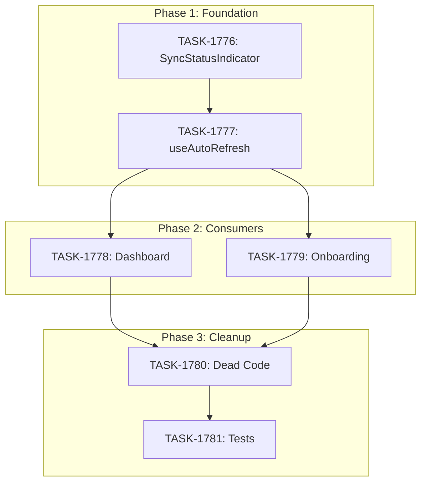

# Sprint Plan: SPRINT-068 - Unified Sync State Architecture

## Sprint Goal

Implement a single source of truth for sync state using SyncQueueService, fixing race conditions with IPC progress events, unreliable pill colors in SyncStatusIndicator, and simplifying coordination between onboarding and dashboard. Expected to remove ~600 lines of dead/duplicate code.

## Prerequisites / Environment Setup

Before starting sprint work, engineers must:
- [x] Current branch: `feature/dynamic-import-batch-size`
- [ ] `npm install`
- [ ] `npm run type-check` passes
- [ ] `npm test` passes
- [ ] Verify app starts: `npm run dev`

**Note**: This sprint repurposes the existing `feature/dynamic-import-batch-size` branch.

## In Scope

| ID | Title | Rationale |
|----|-------|-----------|
| TASK-1776 | Update SyncStatusIndicator to use useSyncQueue | Foundation - enables reliable pill states |
| TASK-1777 | Simplify useAutoRefresh | Removes duplicate state management |
| TASK-1778 | Update Dashboard component | Removes prop drilling |
| TASK-1779 | Update Onboarding PermissionsStep | Uses syncQueue for import tracking |
| TASK-1780 | Remove dead code | Cleanup of obsolete flags and functions |
| TASK-1781 | Update tests | Maintains test coverage |

## Out of Scope / Deferred

- Refactoring OS notification logic (already uses SyncQueue)
- Adding new sync types (iPhone backup, etc.)
- Performance optimizations beyond state management

## Reprioritized Backlog (Sprint Scope)

| ID | Title | Priority | Rationale | Dependencies | Conflicts |
|----|-------|----------|-----------|--------------|-----------|
| TASK-1776 | SyncStatusIndicator uses useSyncQueue | 1 | Foundation for all other changes | None | None |
| TASK-1777 | Simplify useAutoRefresh | 2 | Removes duplicate state | TASK-1776 | None |
| TASK-1778 | Update Dashboard | 3 | Removes prop drilling | TASK-1777 | None |
| TASK-1779 | Update Onboarding | 3 | Can parallel with TASK-1778 | TASK-1777 | None |
| TASK-1780 | Remove dead code | 4 | Cleanup after refactors | TASK-1778, TASK-1779 | None |
| TASK-1781 | Update tests | 5 | Final validation | TASK-1780 | None |

## Phase Plan

### Phase 1: Foundation (Sequential)

- TASK-1776: Update SyncStatusIndicator to use useSyncQueue
- TASK-1777: Simplify useAutoRefresh (depends on TASK-1776)

**Integration checkpoint**: Both tasks merged, `npm run type-check` and `npm test` pass.

### Phase 2: Consumer Updates (Parallelizable)

- TASK-1778: Update Dashboard component
- TASK-1779: Update Onboarding PermissionsStep

**Integration checkpoint**: All tasks merged, manual testing of sync flow.

### Phase 3: Cleanup (Sequential)

- TASK-1780: Remove dead code
- TASK-1781: Update tests (depends on TASK-1780)

**Integration checkpoint**: Full CI passes, no regressions.

## Merge Plan

- **Main branch**: `feature/dynamic-import-batch-size` (existing)
- **Feature branch format**: `fix/task-XXXX-description` or direct to main branch
- **Merge order** (explicit):
  1. TASK-1776 - SyncStatusIndicator
  2. TASK-1777 - useAutoRefresh
  3. TASK-1778 + TASK-1779 (parallel)
  4. TASK-1780 - Dead code removal
  5. TASK-1781 - Test updates

**Note**: Since tasks are small and sequential, we can work directly on the branch.

## Dependency Graph (Mermaid)



## Dependency Graph (YAML)

```yaml
dependency_graph:
  nodes:
    - id: TASK-1776
      type: task
      phase: 1
      title: SyncStatusIndicator uses useSyncQueue
    - id: TASK-1777
      type: task
      phase: 1
      title: Simplify useAutoRefresh
    - id: TASK-1778
      type: task
      phase: 2
      title: Update Dashboard
    - id: TASK-1779
      type: task
      phase: 2
      title: Update Onboarding
    - id: TASK-1780
      type: task
      phase: 3
      title: Remove dead code
    - id: TASK-1781
      type: task
      phase: 3
      title: Update tests
  edges:
    - from: TASK-1776
      to: TASK-1777
      type: depends_on
    - from: TASK-1777
      to: TASK-1778
      type: depends_on
    - from: TASK-1777
      to: TASK-1779
      type: depends_on
    - from: TASK-1778
      to: TASK-1780
      type: depends_on
    - from: TASK-1779
      to: TASK-1780
      type: depends_on
    - from: TASK-1780
      to: TASK-1781
      type: depends_on
```

## Testing & Quality Plan (REQUIRED)

### Unit Testing

- New tests required for:
  - None (existing test coverage is being updated)
- Existing tests to update:
  - `SyncStatusIndicator.test.tsx` - mock useSyncQueue instead of status prop
  - `useAutoRefresh.test.ts` - remove tests for deleted functionality

### Coverage Expectations

- Coverage must not decrease
- New code should be covered by existing test updates

### Integration / Feature Testing

- Required scenarios:
  - Fresh onboarding: Contacts + Messages pills go gray -> blue -> green
  - Dashboard auto-refresh: Same pill behavior
  - Returning user (skip onboarding): Pills behave correctly
  - OS notification fires exactly once when all syncs complete
  - Error handling: Pills show correct state on sync failure

### CI / CD Quality Gates

The following MUST pass before merge:
- [x] Unit tests
- [x] Integration tests (if applicable)
- [x] Coverage checks
- [x] Type checking
- [x] Lint / format checks
- [x] Build step

## Risk Register

| Risk | Likelihood | Impact | Mitigation |
|------|------------|--------|------------|
| State sync issues between components | Medium | High | Thorough manual testing after each phase |
| Breaking onboarding flow | Low | High | Test onboarding end-to-end after TASK-1779 |
| Missing edge cases in pill state derivation | Medium | Medium | Review SyncQueueService state machine |
| Test failures from removed code | Low | Low | Update tests in dedicated task |

## Decision Log

### Decision: Work directly on branch instead of separate PRs

- **Date**: 2026-02-01
- **Context**: Sprint has 6 sequential/dependent tasks
- **Decision**: Work directly on `feature/dynamic-import-batch-size` branch, committing after each task
- **Rationale**: Faster iteration, avoids PR overhead for tightly coupled changes
- **Impact**: Single PR at end for full review

### Decision: Keep progress percentage display from IPC events

- **Date**: 2026-02-01
- **Context**: SyncQueueService tracks state, but not detailed progress
- **Decision**: Keep IPC listeners for progress %, but derive pill state from SyncQueue
- **Rationale**: Best of both worlds - reliable state + detailed progress
- **Impact**: TASK-1777 keeps IPC listeners for progress only

## Unplanned Work Log

**Instructions:** Update this section AS unplanned work is discovered during the sprint. Do NOT wait until sprint review.

| Task | Source | Root Cause | Added Date | Est. Tokens | Actual Tokens |
|------|--------|------------|------------|-------------|---------------|
| - | - | - | - | - | - |

### Unplanned Work Summary (Updated at Sprint Close)

| Metric | Value |
|--------|-------|
| Unplanned tasks | 0 |
| Unplanned PRs | 0 |
| Unplanned lines changed | +0/-0 |
| Unplanned tokens (est) | 0 |
| Unplanned tokens (actual) | 0 |
| Discovery buffer | 0% |

### Root Cause Categories

| Category | Count | Examples |
|----------|-------|----------|
| Integration gaps | 0 | - |
| Validation discoveries | 0 | - |
| Review findings | 0 | - |
| Dependency discoveries | 0 | - |
| Scope expansion | 0 | - |

## End-of-Sprint Validation Checklist

- [ ] All tasks complete
- [ ] All CI checks passing
- [ ] All acceptance criteria verified
- [ ] Testing requirements met (manual sync flow testing)
- [ ] No unresolved conflicts
- [ ] Pills show reliable states: gray (queued) -> blue (running) -> green (complete)
- [ ] OS notification fires exactly once when all syncs complete
- [ ] ~600 lines of dead code removed (verified with diff)

## Effort Estimates

| Task | Category | Est. Tokens | Token Cap |
|------|----------|-------------|-----------|
| TASK-1776 | refactor | ~15K | 60K |
| TASK-1777 | refactor | ~20K | 80K |
| TASK-1778 | refactor | ~8K | 32K |
| TASK-1779 | refactor | ~12K | 48K |
| TASK-1780 | cleanup | ~10K | 40K |
| TASK-1781 | test | ~15K | 60K |
| **Total** | - | **~80K** | **320K** |

*Estimates apply 0.5x refactor/cleanup multiplier per historical data.*
