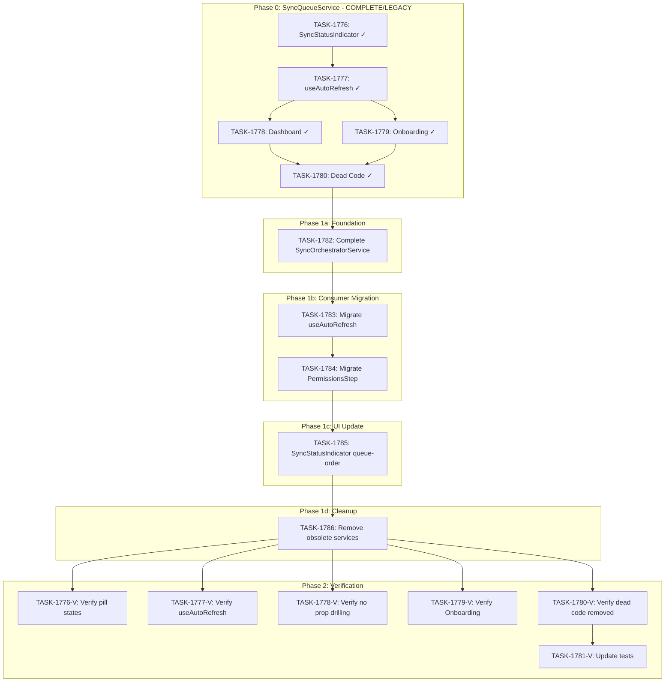

# Sprint Plan: SPRINT-068 - Unified Sync State Architecture

**Status:** IN_PROGRESS
**Started:** 2026-02-01
**Branch:** `feature/dynamic-import-batch-size`

## Progress Tracking

### Phase 0: SyncQueueService Integration (COMPLETE - Legacy)

| Task | Status | Assigned | Est Tokens | Actual Tokens |
|------|--------|----------|------------|---------------|
| TASK-1776 | complete | - | ~15K | - |
| TASK-1777 | complete | - | ~20K | - |
| TASK-1778 | complete | - | ~8K | - |
| TASK-1779 | complete | - | ~12K | - |
| TASK-1780 | complete | - | ~10K | - |
| TASK-1781 | obsolete | - | ~15K | - |

### Phase 1: Infrastructure (SyncOrchestrator) - COMPLETE

| Task | Status | Assigned | Est Tokens | Actual Tokens |
|------|--------|----------|------------|---------------|
| TASK-1782 | complete | - | ~20K | TBD |
| TASK-1783 | complete | - | ~15K | TBD |
| TASK-1784 | complete | - | ~12K | TBD |
| TASK-1785 | complete | - | ~10K | TBD |
| TASK-1786 | complete | - | ~8K | - |

### Phase 2: Verification (Original Goals)

| Task | Type | Status | Assigned | Est Tokens | Actual Tokens |
|------|------|--------|----------|------------|---------------|
| TASK-1776-V | verification | complete | - | ~5K | - |
| TASK-1777-V | verification | pending | - | ~5K | - |
| TASK-1778-V | verification | pending | - | ~3K | - |
| TASK-1779-V | verification | pending | - | ~3K | - |
| TASK-1780-V | verification | pending | - | ~3K | - |
| TASK-1781-V | verification | pending | - | ~8K | - |

## Sprint Goal

**Phase 0 (COMPLETE):** Implemented SyncQueueService as initial single source of truth for sync state.

**Phase 1 (CURRENT):** Build the new centralized SyncOrchestratorService architecture:
- Register canonical sync functions (one per type)
- Handle conflicts (sync in progress -> queue or force)
- Sequential sync execution with proper state tracking
- Migrate all consumers to use the orchestrator
- Deprecate SyncQueueService and useMacOSMessagesImport

**Phase 2 (PENDING):** Verify the infrastructure solves all original problems:
- Pill states are correct (gray -> blue -> green)
- useAutoRefresh is simplified
- Dashboard doesn't need prop drilling
- Onboarding works correctly
- Dead code is removed
- Tests cover new architecture

## Prerequisites / Environment Setup

Before starting sprint work, engineers must:
- [x] Current branch: `feature/dynamic-import-batch-size`
- [ ] `npm install`
- [ ] `npm run type-check` passes
- [ ] `npm test` passes
- [ ] Verify app starts: `npm run dev`

**Note**: This sprint repurposes the existing `feature/dynamic-import-batch-size` branch.

## In Scope

### Phase 1: Infrastructure (SyncOrchestrator)

| ID | Title | Type | Rationale |
|----|-------|------|-----------|
| TASK-1782 | Complete SyncOrchestratorService | refactor | Foundation - register canonical sync functions, handle conflicts |
| TASK-1783 | Migrate useAutoRefresh to SyncOrchestrator | refactor | Use orchestrator instead of SyncQueueService |
| TASK-1784 | Migrate PermissionsStep to SyncOrchestrator | refactor | Use orchestrator for onboarding sync |
| TASK-1785 | Update SyncStatusIndicator for queue-order pills | refactor | Only show queued syncs, in queue order |
| TASK-1786 | Deprecate/remove obsolete services | cleanup | Remove useMacOSMessagesImport + SyncQueueService |

### Phase 2: Verification (Acceptance Criteria)

| ID | Title | Type | Verifies |
|----|-------|------|----------|
| TASK-1776-V | Verify pill states are correct | verification | Gray -> blue -> green transitions work |
| TASK-1777-V | Verify useAutoRefresh is simplified | verification | Hook just calls orchestrator, no duplicate logic |
| TASK-1778-V | Verify Dashboard doesn't need prop drilling | verification | No sync-related props passed through Dashboard |
| TASK-1779-V | Verify Onboarding works correctly | verification | Onboarding flow uses orchestrator seamlessly |
| TASK-1780-V | Verify dead code is removed | verification | No orphaned SyncQueueService or useMacOSMessagesImport references |
| TASK-1781-V | Update tests for new architecture | verification | Tests cover SyncOrchestratorService patterns |

## Out of Scope / Deferred

- Refactoring OS notification logic (already uses SyncQueue)
- Adding new sync types (iPhone backup, etc.)
- Performance optimizations beyond state management

## Reprioritized Backlog (Sprint Scope)

### Phase 1: Infrastructure (Implementation)

| ID | Title | Priority | Rationale | Dependencies | Conflicts |
|----|-------|----------|-----------|--------------|-----------|
| TASK-1782 | Complete SyncOrchestratorService | 1 | Foundation - register canonical sync functions | None | None |
| TASK-1783 | Migrate useAutoRefresh to SyncOrchestrator | 2 | Use orchestrator for dashboard syncs | TASK-1782 | None |
| TASK-1784 | Migrate PermissionsStep to SyncOrchestrator | 3 | Use orchestrator for onboarding | TASK-1783 | Shared sync patterns |
| TASK-1785 | Update SyncStatusIndicator for queue-order pills | 4 | Show queued syncs in queue order + error UX | TASK-1784 | None |
| TASK-1786 | Deprecate/remove obsolete services | 5 | Final cleanup | TASK-1785 | None |

**Execution Order (SR Recommendation):** 1782 -> 1783 -> 1784 -> 1785 -> 1786 (all sequential)

### Phase 2: Verification (Blocked by Phase 1)

| ID | Title | Priority | Verifies | Dependencies |
|----|-------|----------|----------|--------------|
| TASK-1776-V | Verify pill states | 1 | Pill state machine | Phase 1 complete |
| TASK-1777-V | Verify useAutoRefresh simplified | 2 | Hook simplification | Phase 1 complete |
| TASK-1778-V | Verify no prop drilling | 3 | Dashboard architecture | Phase 1 complete |
| TASK-1779-V | Verify Onboarding + Conflict Handling | 3 | Onboarding flow + conflict UX | Phase 1 complete |
| TASK-1780-V | Verify dead code removed | 4 | Code cleanup | Phase 1 complete |
| TASK-1781-V | Update tests | 5 | Test coverage | TASK-1780-V |

## Phase Plan

### Phase 0: SyncQueueService Integration (COMPLETE - Legacy)

- [x] TASK-1776: Update SyncStatusIndicator to use useSyncQueue (`d47c0102`)
- [x] TASK-1777: Simplify useAutoRefresh (`c5c81ae4`)
- [x] TASK-1778: Update Dashboard component (`abb2ffa3`)
- [x] TASK-1779: Update Onboarding PermissionsStep (`7f418d36`)
- [x] TASK-1780: Remove dead code (`818ec841`)
- [x] TASK-1781: OBSOLETE - tests updated as part of above tasks

**Phase 0 Status**: COMPLETE - All SyncQueueService integration done. Phase 1 supersedes this work.

---

### Phase 1: Infrastructure (SyncOrchestrator) - COMPLETE

Build the centralized sync architecture that replaces SyncQueueService.

#### Phase 1a: Foundation (Sequential)

- TASK-1782: Complete SyncOrchestratorService
  - Register canonical sync functions for contacts, emails, messages
  - Handle conflict resolution (queue vs force)
  - Expose queue state for UI consumption

**Integration checkpoint**: SyncOrchestratorService can register and execute sync functions with proper state tracking.

#### Phase 1b: Consumer Migration (SEQUENTIAL - SR Recommendation)

- TASK-1783: Migrate useAutoRefresh to SyncOrchestrator
- TASK-1784: Migrate PermissionsStep to SyncOrchestrator (AFTER TASK-1783)

**SR Engineer Note:** These tasks must be sequential, not parallel. TASK-1784 depends on patterns established in TASK-1783. Both modify sync coordination logic that could conflict if done in parallel.

**Integration checkpoint**: Both consumers use SyncOrchestrator. Manual testing of sync flows.

#### Phase 1c: UI Update (Sequential)

- TASK-1785: Update SyncStatusIndicator for queue-order pills
  - Only show pills for syncs in queue
  - Display pills in queue order (not static order)

**Integration checkpoint**: Pills show only queued syncs in queue order.

#### Phase 1d: Cleanup (Sequential)

- TASK-1786: Deprecate/remove useMacOSMessagesImport and SyncQueueService

**Integration checkpoint**: No references to SyncQueueService or useMacOSMessagesImport remain.

**Phase 1 Gate**: All infrastructure tasks complete. CI passing. Ready for verification.

---

### Phase 2: Verification (Original Goals)

Verify the infrastructure solves all original problems. Phase 2 is blocked until Phase 1 is complete.

#### Verification Tasks (Sequential)

- TASK-1776-V: Verify pill states are correct (gray -> blue -> green)
- TASK-1777-V: Verify useAutoRefresh is simplified (just calls orchestrator)
- TASK-1778-V: Verify Dashboard doesn't need prop drilling
- TASK-1779-V: Verify Onboarding works correctly + conflict handling tests
- TASK-1780-V: Verify dead code is removed (no orphan references)
- TASK-1781-V: Update tests for new architecture

**Phase 2 Gate**: All verification tasks pass. Sprint complete.

## Merge Plan

- **Main branch**: `feature/dynamic-import-batch-size` (existing)
- **Feature branch format**: `fix/task-XXXX-description` or direct to main branch

### Phase 1 Merge Order (Infrastructure) - SEQUENTIAL

1. TASK-1782 - Complete SyncOrchestratorService
2. TASK-1783 - Migrate useAutoRefresh to SyncOrchestrator
3. TASK-1784 - Migrate PermissionsStep to SyncOrchestrator
4. TASK-1785 - Update SyncStatusIndicator (error UX)
5. TASK-1786 - Cleanup obsolete services

**SR Recommendation:** All tasks are sequential. TASK-1783/1784 were originally marked parallelizable but share sync coordination patterns that risk race conditions and merge conflicts if done in parallel.

### Phase 2 (Verification)

No merges required - verification tasks validate existing code and may produce minor fixes committed directly.

**Note**: Since tasks are small and sequential, we can work directly on the branch.

## Dependency Graph (Mermaid)



## Dependency Graph (YAML)

```yaml
dependency_graph:
  nodes:
    # Phase 0 - COMPLETE (Legacy)
    - id: TASK-1776
      type: task
      phase: 0
      status: complete
      title: SyncStatusIndicator uses useSyncQueue
    - id: TASK-1777
      type: task
      phase: 0
      status: complete
      title: Simplify useAutoRefresh
    - id: TASK-1778
      type: task
      phase: 0
      status: complete
      title: Update Dashboard
    - id: TASK-1779
      type: task
      phase: 0
      status: complete
      title: Update Onboarding
    - id: TASK-1780
      type: task
      phase: 0
      status: complete
      title: Remove dead code
    - id: TASK-1781
      type: task
      phase: 0
      status: obsolete
      title: Update tests (obsolete - done inline)

    # Phase 1 - Infrastructure
    - id: TASK-1782
      type: task
      phase: 1a
      status: complete
      title: Complete SyncOrchestratorService
    - id: TASK-1783
      type: task
      phase: 1b
      status: complete
      title: Migrate useAutoRefresh to SyncOrchestrator
    - id: TASK-1784
      type: task
      phase: 1b
      status: complete
      title: Migrate PermissionsStep to SyncOrchestrator
    - id: TASK-1785
      type: task
      phase: 1c
      status: complete
      title: Update SyncStatusIndicator for queue-order pills
    - id: TASK-1786
      type: task
      phase: 1d
      status: pending
      title: Deprecate/remove obsolete services

    # Phase 2 - Verification
    - id: TASK-1776-V
      type: verification
      phase: 2
      status: pending
      title: Verify pill states are correct
      verifies: Pill state machine (gray -> blue -> green)
    - id: TASK-1777-V
      type: verification
      phase: 2
      status: pending
      title: Verify useAutoRefresh is simplified
      verifies: Hook just calls orchestrator
    - id: TASK-1778-V
      type: verification
      phase: 2
      status: pending
      title: Verify Dashboard doesn't need prop drilling
      verifies: No sync props passed through Dashboard
    - id: TASK-1779-V
      type: verification
      phase: 2
      status: pending
      title: Verify Onboarding + Conflict Handling
      verifies: Onboarding flow uses orchestrator, conflict dialog works
    - id: TASK-1780-V
      type: verification
      phase: 2
      status: pending
      title: Verify dead code is removed
      verifies: No orphaned SyncQueueService references
    - id: TASK-1781-V
      type: verification
      phase: 2
      status: pending
      title: Update tests for new architecture
      verifies: Test coverage for SyncOrchestratorService

  edges:
    # Phase 0 (complete)
    - from: TASK-1776
      to: TASK-1777
      type: depends_on
    - from: TASK-1777
      to: TASK-1778
      type: depends_on
    - from: TASK-1777
      to: TASK-1779
      type: depends_on
    - from: TASK-1778
      to: TASK-1780
      type: depends_on
    - from: TASK-1779
      to: TASK-1780
      type: depends_on

    # Phase 0 -> Phase 1 bridge
    - from: TASK-1780
      to: TASK-1782
      type: depends_on

    # Phase 1 internal (SEQUENTIAL per SR recommendation)
    - from: TASK-1782
      to: TASK-1783
      type: depends_on
    - from: TASK-1783
      to: TASK-1784
      type: depends_on
      note: "SR: Sequential - shared sync patterns, risk of race conditions"
    - from: TASK-1784
      to: TASK-1785
      type: depends_on
    - from: TASK-1785
      to: TASK-1786
      type: depends_on

    # Phase 1 -> Phase 2 bridge (all verification blocked by Phase 1)
    - from: TASK-1786
      to: TASK-1776-V
      type: depends_on
    - from: TASK-1786
      to: TASK-1777-V
      type: depends_on
    - from: TASK-1786
      to: TASK-1778-V
      type: depends_on
    - from: TASK-1786
      to: TASK-1779-V
      type: depends_on
    - from: TASK-1786
      to: TASK-1780-V
      type: depends_on

    # Phase 2 internal
    - from: TASK-1780-V
      to: TASK-1781-V
      type: depends_on
```

## Testing & Quality Plan (REQUIRED)

### Unit Testing

- New tests required for:
  - SyncOrchestratorService (canonical function registration, conflict handling)
  - Queue order state exposure for UI
- Existing tests to update:
  - `SyncStatusIndicator.test.tsx` - mock orchestrator instead of useSyncQueue
  - `useAutoRefresh.test.ts` - verify calls to orchestrator

### Coverage Expectations

- Coverage must not decrease
- SyncOrchestratorService should have >80% coverage

### Integration / Feature Testing

- Required scenarios:
  - Fresh onboarding: Contacts + Messages pills go gray -> blue -> green
  - Dashboard auto-refresh: Same pill behavior
  - Returning user (skip onboarding): Pills behave correctly
  - OS notification fires exactly once when all syncs complete
  - Error handling: Pills show correct state on sync failure
  - Conflict handling: Triggering sync while another is running

### CI / CD Quality Gates

The following MUST pass before merge:
- [x] Unit tests
- [x] Integration tests (if applicable)
- [x] Coverage checks
- [x] Type checking
- [x] Lint / format checks
- [x] Build step

## Risk Register

| Risk | Likelihood | Impact | Mitigation |
|------|------------|--------|------------|
| State sync issues between components | Medium | High | Thorough manual testing after Phase 1 |
| Breaking onboarding flow | Low | High | Test onboarding end-to-end after TASK-1784 |
| Missing edge cases in orchestrator | Medium | Medium | Review SyncOrchestrator state machine |
| Incomplete cleanup of old services | Low | Low | Grep for all references before TASK-1786 |
| Verification finds issues requiring Phase 1 rework | Medium | Medium | Phase 2 exists to catch this before merge |
| **Race condition during migration** | Medium | High | **Sequential execution of 1783/1784 (SR recommendation)** |
| **Notification duplication** | Medium | Medium | **Derive notifications from orchestrator state only** |
| **Progress event wiring issues** | Medium | Medium | **Sync functions own their IPC listeners (not consumers)** |
| **Module-level flags stale state** | Medium | Medium | **Orchestrator's isRunning replaces module-level flags** |

## Decision Log

### Decision: Work directly on branch instead of separate PRs

- **Date**: 2026-02-01
- **Context**: Sprint has sequential/dependent tasks
- **Decision**: Work directly on `feature/dynamic-import-batch-size` branch, committing after each task
- **Rationale**: Faster iteration, avoids PR overhead for tightly coupled changes
- **Impact**: Single PR at end for full review

### Decision: Keep progress percentage display from IPC events

- **Date**: 2026-02-01
- **Context**: SyncQueueService tracks state, but not detailed progress
- **Decision**: Keep IPC listeners for progress %, but derive pill state from SyncQueue
- **Rationale**: Best of both worlds - reliable state + detailed progress
- **Impact**: TASK-1777 keeps IPC listeners for progress only

### Decision: Migrate from SyncQueueService to SyncOrchestratorService

- **Date**: 2026-02-02
- **Context**: SyncQueueService works but has limitations:
  - Callers must manually coordinate sync order
  - No conflict handling (what if user triggers sync while one is running?)
  - Multiple entry points for sync logic (useAutoRefresh, PermissionsStep, useMacOSMessagesImport)
- **Decision**: Complete SyncOrchestratorService and migrate all consumers
- **Options Considered**:
  - Option A (CHOSEN): Complete SyncOrchestrator, migrate consumers, deprecate SyncQueue
  - Option B: Keep SyncQueue, add conflict handling separately
- **Rationale**:
  - SyncOrchestrator already exists with basic structure
  - Centralizes sync logic with canonical functions
  - Handles conflicts natively
  - Removes need for useMacOSMessagesImport entirely
- **Impact**: 5 implementation tasks (TASK-1782 through TASK-1786)

### Decision: Restructure sprint with Infrastructure and Verification phases

- **Date**: 2026-02-02
- **Context**: Original tasks (1776-1781) implemented SyncQueueService. SyncOrchestrator supersedes this.
- **Decision**:
  - Phase 1 = Infrastructure (TASK-1782-1786): Build the new architecture
  - Phase 2 = Verification (TASK-1776-V through TASK-1781-V): Verify original goals are met
- **Rationale**:
  - Clear separation of implementation vs acceptance
  - Verification blocked until infrastructure complete
  - Original goals still tracked and verified
- **Impact**: Original task IDs repurposed as verification tasks with -V suffix

## Unplanned Work Log

**Instructions:** Update this section AS unplanned work is discovered during the sprint. Do NOT wait until sprint review.

| Task | Source | Root Cause | Added Date | Est. Tokens | Actual Tokens |
|------|--------|------------|------------|-------------|---------------|
| Fix progress bar during message import | Testing | IPC progress events not reaching UI | 2026-02-02 | ~5K | - |
| Remove subscription-based useSyncQueue from useAutoRefresh | Perf | Re-renders during onboarding | 2026-02-02 | ~3K | - |
| Add state comparison to avoid re-renders | Perf | Unnecessary re-renders | 2026-02-02 | ~2K | - |
| Fix `this` binding in useSyncQueue | Bug | useState initializer lost context | 2026-02-02 | ~2K | - |

### Ad-Hoc Commits (Phase 0)

| Commit | Description |
|--------|-------------|
| `407b5b30` | fix(sync): show progress bar during message import |
| `b71faa4c` | perf(sync): remove subscription-based useSyncQueue from useAutoRefresh |
| `c7d404ef` | perf(sync): add state comparison to avoid unnecessary re-renders |
| `8935496d` | fix(sync): preserve this binding in useSyncQueue useState initializer |

### Unplanned Work Summary (Updated at Sprint Close)

| Metric | Value |
|--------|-------|
| Unplanned tasks | 4 |
| Unplanned PRs | 0 |
| Unplanned lines changed | ~+50/-30 |
| Unplanned tokens (est) | ~12K |
| Unplanned tokens (actual) | - |
| Discovery buffer | ~15% |

### Root Cause Categories

| Category | Count | Examples |
|----------|-------|----------|
| Integration gaps | 1 | Progress bar not showing |
| Validation discoveries | 2 | Re-render issues found during testing |
| Review findings | 0 | - |
| Dependency discoveries | 1 | `this` binding issue in SyncQueueService |
| Scope expansion | 0 | - |

## End-of-Sprint Validation Checklist

### Phase 1 Gate (Infrastructure)

- [x] TASK-1782 complete - SyncOrchestratorService functional
- [x] TASK-1783 complete - useAutoRefresh migrated (469 -> 304 lines, 35% reduction)
- [x] TASK-1784 complete - PermissionsStep migrated (commit: `4b383a50`, ~106 lines reduced, 72/72 tests pass)
- [x] TASK-1785 complete - SyncStatusIndicator shows queue-order pills (commit: `377fbc39`, 20/20 tests pass)
- [x] TASK-1786 complete - Obsolete services removed (commit: `4f7be075`)
- [x] All CI checks passing
- [x] No TypeScript errors
- [x] No lint errors

### Phase 2 Gate (Verification)

- [x] TASK-1776-V: Pills show reliable states: gray (queued) -> blue (running) -> green (complete)
- [ ] TASK-1777-V: useAutoRefresh is simplified (single orchestrator call)
- [ ] TASK-1778-V: Dashboard has no sync-related prop drilling
- [ ] TASK-1779-V: Onboarding flow works correctly with orchestrator
- [ ] TASK-1780-V: No orphaned SyncQueueService or useMacOSMessagesImport references
- [ ] TASK-1781-V: Tests cover SyncOrchestratorService patterns
- [ ] OS notification fires exactly once when all syncs complete

## Effort Estimates

### Phase 0 (COMPLETE - Legacy)

| Task | Category | Est. Tokens | Token Cap | Actual |
|------|----------|-------------|-----------|--------|
| TASK-1776 | refactor | ~15K | 60K | - |
| TASK-1777 | refactor | ~20K | 80K | - |
| TASK-1778 | refactor | ~8K | 32K | - |
| TASK-1779 | refactor | ~12K | 48K | - |
| TASK-1780 | cleanup | ~10K | 40K | - |
| TASK-1781 | test | ~15K | 60K | OBSOLETE |
| Ad-hoc fixes | fix | ~12K | - | - |
| **Phase 0 Total** | - | **~92K** | - | - |

### Phase 1 (Infrastructure)

| Task | Category | Est. Tokens | Token Cap |
|------|----------|-------------|-----------|
| TASK-1782 | refactor | ~20K | 80K |
| TASK-1783 | refactor | ~15K | 60K |
| TASK-1784 | refactor | ~12K | 48K |
| TASK-1785 | refactor | ~10K | 40K |
| TASK-1786 | cleanup | ~8K | 32K |
| **Phase 1 Total** | - | **~65K** | **260K** |

### Phase 2 (Verification)

| Task | Category | Est. Tokens | Token Cap |
|------|----------|-------------|-----------|
| TASK-1776-V | verification | ~5K | 20K |
| TASK-1777-V | verification | ~5K | 20K |
| TASK-1778-V | verification | ~3K | 12K |
| TASK-1779-V | verification | ~3K | 12K |
| TASK-1780-V | verification | ~3K | 12K |
| TASK-1781-V | verification | ~8K | 32K |
| **Phase 2 Total** | - | **~27K** | **108K** |

### Sprint Total

| Phase | Est. Tokens |
|-------|-------------|
| Phase 0 (Legacy) | ~92K |
| Phase 1 (Infrastructure) | ~65K |
| Phase 2 (Verification) | ~27K |
| **Total** | **~184K** |

*Estimates apply 0.5x refactor/cleanup multiplier per historical data.*
*Verification tasks are lower effort (0.25x) as they validate rather than implement.*
