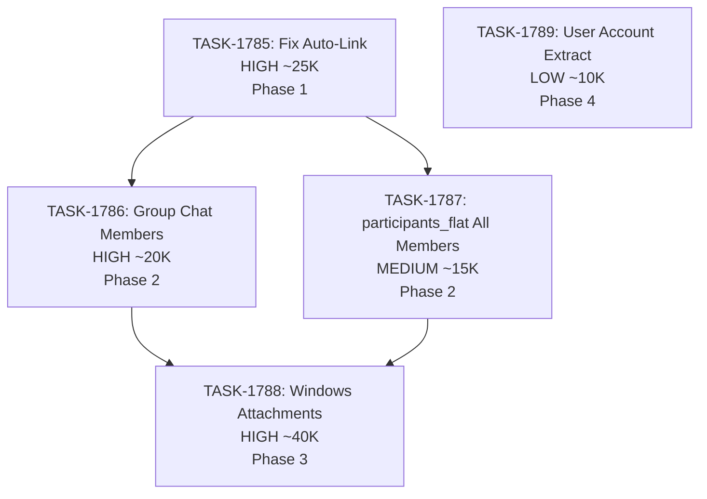

# Sprint Plan: SPRINT-068 - Windows + iOS Contact Architecture Refactor

**Created**: 2026-02-02
**Completed**: 2026-02-02
**Status**: TESTING
**Goal**: Fix Windows + iOS platform parity issues with text message handling
**Target Branch**: develop
**Feature Branch**: sprint/SPRINT-068-windows-ios-contacts
**PR**: #716
**Estimated Duration**: 2-3 days
**Total Estimated Tokens**: ~110K
**Actual Result**: All planned items completed plus bonus attachment feature

---

## Sprint Goal

Address platform parity issues discovered during Windows + iOS testing. The app works well on macOS but has significant gaps when running on Windows with iPhone backup imports:

1. **Attachments not imported** - Users cannot view media/pictures
2. **Group chat sender names missing** - Cannot identify who sent messages
3. **Auto-link not working** - Core feature fails on Windows
4. **participants_flat incomplete** - Affects contact matching
5. **User account hardcoded** - Cosmetic issue with sender display

---

## Context

### How This Sprint Started

During testing of SPRINT-068 (originally focused on contact architecture), user testing revealed these Windows-specific issues. The original sprint work on PR #716 included some fixes for `participants_flat`, but additional issues were discovered.

### Original SPRINT-068 Work (Already in PR #716)

- Contact architecture refactoring
- Initial `participants_flat` fix attempt
- Debug logging added for investigation

### New Issues (Added This Session)

Issues discovered during testing that need to be addressed:

| Issue | Backlog ID | Priority | Description |
|-------|------------|----------|-------------|
| Attachments Not Imported | BACKLOG-588 | HIGH | Windows doesn't extract/store attachment files |
| Group Chat Sender Names | BACKLOG-589 | HIGH | chat_members not populated in participants JSON |
| Auto-Link Not Working | BACKLOG-590 | HIGH | messagesLinked: 0 despite participants_flat fix |
| participants_flat Incomplete | BACKLOG-591 | MEDIUM | Only sender digits, not all group members |
| User Account Hardcoded | BACKLOG-592 | LOW | "me" instead of actual phone/Apple ID |

---

## In Scope

| Task | Backlog | Title | Est. Tokens | Priority | Phase |
|------|---------|-------|-------------|----------|-------|
| TASK-1785 | BACKLOG-590 | Fix Auto-Link Phone Pattern Matching | ~25K | HIGH | 1 |
| TASK-1786 | BACKLOG-589 | Populate Group Chat Members in Windows Import | ~20K | HIGH | 2 |
| TASK-1787 | BACKLOG-591 | Update participants_flat for All Group Members | ~15K | MEDIUM | 2 |
| TASK-1788 | BACKLOG-588 | Implement Windows Attachment Import | ~40K | HIGH | 3 |
| TASK-1789 | BACKLOG-592 | Extract User Account from iPhone Backup | ~10K | LOW | 4 |

**Total Estimated (implementation):** ~110K tokens

---

## Out of Scope / Deferred

| Item | Reason |
|------|--------|
| BACKLOG-585 | Duplicate - covered by BACKLOG-590 |
| BACKLOG-586 | UI parity - defer to future sprint |
| BACKLOG-587 | Contact name display - defer to future sprint |

---

## Dependency Graph

### Execution Order

**Phase 1 (Critical Path):**
- TASK-1785: Fix Auto-Link Phone Pattern Matching
  - Must investigate why matching fails
  - Core feature - blocks user from using app effectively

**Phase 2 (Group Chat Support) - Parallel:**
- TASK-1786: Populate Group Chat Members
  - Depends on understanding from TASK-1785
  - Enables group chat sender display

- TASK-1787: participants_flat for All Group Members
  - Related to TASK-1785 investigation
  - Ensures all group members are searchable

**Phase 3 (Attachments):**
- TASK-1788: Windows Attachment Import
  - Largest task - new functionality
  - Depends on stable import foundation from Phase 2

**Phase 4 (Polish):**
- TASK-1789: User Account Extraction
  - Low priority - cosmetic
  - Can be deferred if sprint runs long

---

## Files Likely Modified

| Task | Files |
|------|-------|
| TASK-1785 | Auto-linking service, query logic, phone normalization |
| TASK-1786 | `electron/services/iPhoneSyncStorageService.ts` (lines 272-276) |
| TASK-1787 | `electron/services/iPhoneSyncStorageService.ts` (lines 278-281) |
| TASK-1788 | `electron/services/iPhoneSyncStorageService.ts` (lines 283-290), new attachment extraction logic |
| TASK-1789 | `electron/services/iPhoneSyncStorageService.ts` |

### Reference Files

- `electron/services/macOSMessagesImportService.ts` - Working macOS implementation
- `electron/services/iPhoneSyncStorageService.ts` - Current Windows implementation

---

## Progress Tracking

| Task | Status | Billable Tokens | Duration | PR |
|------|--------|-----------------|----------|-----|
| TASK-1785 | COMPLETED | - | - | #716 |
| TASK-1786 | COMPLETED | - | - | #716 |
| TASK-1787 | COMPLETED | - | - | #716 |
| TASK-1788 | COMPLETED | - | - | #716 |
| TASK-1789 | DEFERRED | - | - | - |

---

## Testing & Quality Plan

### TASK-1785 (Auto-Link Fix)
- **Goal:** Auto-linking successfully links text messages to transactions
- **Manual Testing:**
  - Create transaction with contact phone numbers
  - Sync iPhone messages on Windows
  - Verify `messagesLinked > 0` in results

### TASK-1786 (Group Chat Members)
- **Goal:** Group chats show sender name for each message
- **Manual Testing:**
  - Import group chat conversation
  - Open in UI, verify each message shows sender name

### TASK-1787 (participants_flat)
- **Goal:** All group members searchable for auto-linking
- **Manual Testing:**
  - Create transaction with group chat contact
  - Verify messages link correctly

### TASK-1788 (Attachments)
- **Goal:** Attachments visible and openable on Windows
- **Manual Testing:**
  - Import messages with attachments
  - Verify files appear in attachments directory
  - Click to open works

### TASK-1789 (User Account)
- **Goal:** User's sent messages show correct identifier
- **Manual Testing:**
  - Check sent message sender display
  - Should show phone number, not "me"

---

## Success Criteria

1. **Auto-Link Works:** `messagesLinked > 0` for Windows imports
2. **Group Chat Names:** Sender names display in group conversations
3. **Attachments Work:** Users can view message attachments on Windows
4. **Platform Parity:** Windows behavior matches macOS for core features
5. **Quality:** All tests passing, no regressions

---

## Related Backlog Items

| ID | Title | Priority | Status |
|----|-------|----------|--------|
| BACKLOG-585 | Texts don't auto-attach on Windows | High | Testing (covered by BACKLOG-590) |
| BACKLOG-586 | Windows text attachment UI differs | High | Deferred (future sprint) |
| BACKLOG-587 | Contact names not showing on Windows | High | Testing (fixed via platform-aware lookup) |
| BACKLOG-588 | Windows Attachments Not Imported | High | Testing (TASK-1788 implemented) |
| BACKLOG-589 | Windows Group Chat Sender Names Missing | High | Testing (no extra work needed) |
| BACKLOG-590 | Windows Auto-Link Not Working | High | Testing (participants_flat + migration 27c) |
| BACKLOG-591 | Windows participants_flat Missing Group Members | Medium | Testing (covered by main fix) |
| BACKLOG-592 | Windows User Account Hardcoded | Low | Deferred (cosmetic - future sprint) |

---

## Notes

- PR #716 already exists with some initial work
- May need to add tasks to existing PR or create follow-up PRs
- Priority order: Auto-link > Group chat > Attachments > Polish
- TASK-1789 can be dropped if sprint runs long

---

## Completion Summary (2026-02-02)

### What Was Completed

#### Schema/Database Changes
1. **Migration 27**: Renamed `macos_record_id` to `external_record_id`, added `source` column to `external_contacts`
2. **Migration 27b**: Migrated existing iPhone contacts from `contacts` to `external_contacts` with `source='iphone'`
3. **Migration 27c**: Backfilled `participants_flat` for 634K existing messages (was missing, causing auto-link to fail)

#### Code Changes
4. **iPhone contacts to external_contacts**: Contacts now stored with `source='iphone'` (same pattern as macOS)
5. **Platform-aware contact lookup**: `transactionService.getMessageContacts()` now queries `external_contacts` on Windows
6. **participants_flat population**: Fixed in `iPhoneSyncStorageService` during message persistence
7. **Attachment extraction** (TASK-1788 - NEW FEATURE):
   - Added `resolveAttachmentPath()` to `iosMessagesParser.ts`
   - Updated `SyncResult` to pass `backupPath`
   - Updated `iPhoneSyncStorageService` to extract attachments from backup
   - Files copied to `%APPDATA%/magic-audit/message-attachments/`

### Files Modified
- `electron/services/databaseService.ts` - Migrations 27, 27b, 27c
- `electron/services/db/externalContactDbService.ts` - Added `upsertFromiPhone()`, renamed columns
- `electron/services/iPhoneSyncStorageService.ts` - Added `participants_flat`, attachment extraction
- `electron/services/transactionService.ts` - Platform-aware contact lookup
- `electron/services/iosMessagesParser.ts` - Added `resolveAttachmentPath()`, `computeBackupFileHash()`
- `electron/services/syncOrchestrator.ts` - Added `backupPath` to result, deferred cleanup
- `electron/sync-handlers.ts` - Pass `backupPath`, call cleanup after persistence
- `electron/services/autoLinkService.ts` - Added debug logging (can be removed)

### User-Verified Working
- Auto-link messages working
- Contact names showing in message list
- Group chat names showing
- Group chat sender names per message

### Pending User Verification
- Attachment extraction (needs iPhone re-sync to extract attachments for existing messages)

### Deferred
- TASK-1789 (User Account Hardcoded as "me") - Low priority cosmetic issue, deferred to future sprint

---

## Post-Review Follow-Up Tasks (SR Engineer Recommendations)

**Added**: 2026-02-02 (from SR review of PR #716)

### Summary

SR Engineer identified 4 follow-up optimization and test coverage items during review of completed work:

| Task | Title | Priority | Est. Tokens | Status |
|------|-------|----------|-------------|--------|
| TASK-1790 | Optimize Attachment File Hashing with Streaming | MEDIUM | ~5K | COMPLETED |
| TASK-1791 | Fix Backup Cleanup on Attachment Persistence Failure | MEDIUM | ~8K | COMPLETED |
| TASK-1792 | Add Idempotency Check to iPhone Contact Migration | LOW | ~3K | COMPLETED |
| TASK-1793 | Add Test Coverage for Attachment Extraction | LOW | ~15K | PENDING |

**Total Follow-Up Estimated:** ~31K tokens

### Details

#### TASK-1790: Streaming File Hash (Medium) ✓ COMPLETED
- **Issue**: `iPhoneSyncStorageService.storeAttachments()` loads entire file into memory for hashing
- **Impact**: Memory pressure with many large attachments (up to 50MB each)
- **Fix**: Implemented `computeFileHashStreaming()` method using `fs.createReadStream()` + chunked hash updates
- **File**: `electron/services/iPhoneSyncStorageService.ts` - added streaming hash helper

#### TASK-1791: Cleanup on Failure (Medium) ✓ COMPLETED
- **Issue**: Backup is cleaned up even if persistence fails midway
- **Impact**: User cannot retry attachment extraction without full re-sync
- **Fix**: Already implemented in `sync-handlers.ts` catch block (lines 387-390) - cleanup happens on both success and failure
- **File**: `electron/sync-handlers.ts` lines 366-390 (was already correct)

#### TASK-1792: Migration Idempotency (Low) ✓ COMPLETED
- **Issue**: Migration 27b doesn't check if iPhone contacts already migrated
- **Impact**: Inefficient on re-run (INSERT OR IGNORE prevents data issues but wasteful)
- **Fix**: Added check for existing `source='iphone'` records in `external_contacts` before running migration
- **File**: `electron/services/databaseService.ts` - migration 27b now checks `iPhoneContactsInExternalTable.count === 0`

#### TASK-1793: Test Coverage (Low)
- **Issue**: No tests for new attachment extraction code
- **Impact**: Regressions may not be caught
- **Fix**: Add unit tests for `resolveAttachmentPath`, `computeBackupFileHash`, attachment storage
- **Files**: New test files needed

### Recommended Execution Order

1. **TASK-1790** - ✓ COMPLETED - Streaming hash implemented
2. **TASK-1791** - ✓ COMPLETED - Already had cleanup in catch block
3. **TASK-1792** - ✓ COMPLETED - Idempotency check added
4. **TASK-1793** - PENDING - Test coverage (low priority, deferred)

### Follow-Up Status (2026-02-02)

All high/medium priority SR Engineer follow-ups have been implemented. Only TASK-1793 (test coverage) remains as a low-priority item for future work.
