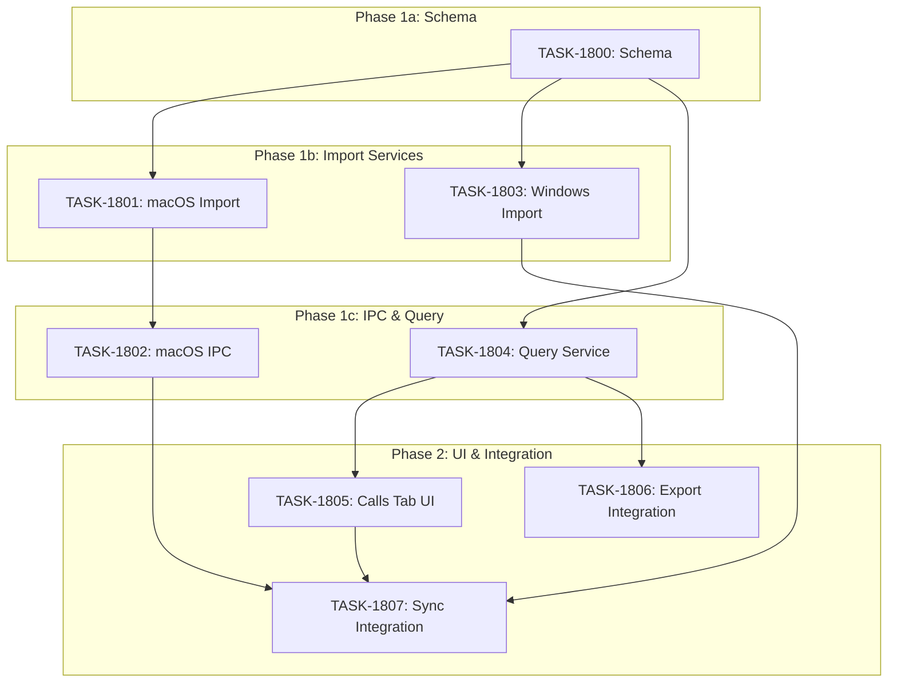

# Sprint Plan: SPRINT-069 - Call Logs Tracking

**Status:** PLANNING
**Created:** 2026-02-02
**Backlog Item:** BACKLOG-378

## Sprint Goal

Add phone call history tracking to transaction audits, enabling real estate compliance auditors to see a complete communication picture including phone calls alongside emails and text messages.

This sprint implements:
1. Database schema for call logs storage
2. macOS call history import from CallHistoryDB (requires Full Disk Access)
3. Windows call history import from iPhone backup
4. New "Calls" tab in transaction details UI
5. Call log export integration

## Prerequisites / Environment Setup

Before starting sprint work, engineers must:
- [ ] `git checkout develop && git pull origin develop`
- [ ] `npm install`
- [ ] `npm rebuild better-sqlite3-multiple-ciphers`
- [ ] `npx electron-rebuild`
- [ ] Verify app starts: `npm run dev`
- [ ] Verify tests pass: `npm test`

**Note**: Native module rebuilds are required after `npm install` or Node.js updates.

## In Scope

| ID | Title | Type | Rationale |
|----|-------|------|-----------|
| TASK-1800 | Call logs database schema | schema | Foundation - storage for imported call data |
| TASK-1801 | macOS call history import service | service | Read from ~/Library/Application Support/CallHistoryDB/CallHistory.storedata |
| TASK-1802 | macOS call history IPC handlers | ipc | Expose import service to renderer |
| TASK-1803 | Windows iPhone backup call log parser | service | Extract call_history.db from iPhone backup |
| TASK-1804 | Call log service (CRUD operations) | service | Query/filter call logs for transaction display |
| TASK-1805 | Calls tab UI component | ui | Display call logs in transaction details |
| TASK-1806 | Call log export integration | service | Include calls in PDF/audit package exports |
| TASK-1807 | Call sync integration | refactor | Add calls to SyncOrchestrator |

## Out of Scope / Deferred

- VoIP calls (FaceTime Audio, WhatsApp calls, etc.) - not accessible
- Call recordings - not accessible
- Real-time call monitoring - out of scope
- Android call logs - deferred to BACKLOG-373
- Call transcription - future feature
- Timeline integration - can be added in future sprint

## Reprioritized Backlog (Sprint Scope)

### Phase 1: Schema & Infrastructure (Sequential)

| ID | Title | Priority | Rationale | Dependencies | Conflicts |
|----|-------|----------|-----------|--------------|-----------|
| TASK-1800 | Call logs database schema | 1 | Foundation - must exist before import | None | None |
| TASK-1801 | macOS call history import service | 2 | Core import logic for macOS | TASK-1800 | None |
| TASK-1802 | macOS call history IPC handlers | 3 | Expose service to renderer | TASK-1801 | None |
| TASK-1803 | Windows iPhone backup call log parser | 4 | Core import logic for Windows | TASK-1800 | None |
| TASK-1804 | Call log service (CRUD operations) | 5 | Query layer for UI | TASK-1800 | None |

### Phase 2: UI & Integration (After Phase 1)

| ID | Title | Priority | Rationale | Dependencies | Conflicts |
|----|-------|----------|-----------|--------------|-----------|
| TASK-1805 | Calls tab UI component | 6 | User-facing display | TASK-1804 | None |
| TASK-1806 | Call log export integration | 7 | Include in audit packages | TASK-1804 | None |
| TASK-1807 | Call sync integration | 8 | Automatic sync on dashboard | TASK-1802, TASK-1803 | None |

## Phase Plan

### Phase 1: Schema & Import Infrastructure (Parallelizable after schema)

**Phase 1a: Schema (Sequential - Foundation)**

- TASK-1800: Call logs database schema

**Integration checkpoint**: Schema migration applied, tables created.

**Phase 1b: Platform Import Services (Parallelizable)**

- TASK-1801: macOS call history import service (can run parallel)
- TASK-1803: Windows iPhone backup call log parser (can run parallel)

**Phase 1c: IPC & Query Layer (Sequential)**

- TASK-1802: macOS call history IPC handlers (depends on TASK-1801)
- TASK-1804: Call log service (depends on schema only)

**Integration checkpoint**: Import works on both platforms, call logs queryable.

### Phase 2: UI & Integration (Sequential)

- TASK-1805: Calls tab UI component
- TASK-1806: Call log export integration
- TASK-1807: Call sync integration

**Integration checkpoint**: Full feature complete, calls visible and exportable.

## Merge Plan

- **Main branch**: `develop`
- **Feature branch format**: `feature/TASK-XXXX-description`
- **Sprint branch**: `sprint/069-call-logs-tracking`
- **Merge order** (explicit):
  1. TASK-1800 -> develop (schema first)
  2. TASK-1801 -> develop (macOS import)
  3. TASK-1803 -> develop (Windows import, can be parallel with 1801)
  4. TASK-1802 -> develop (macOS IPC)
  5. TASK-1804 -> develop (query service)
  6. TASK-1805 -> develop (UI)
  7. TASK-1806 -> develop (export)
  8. TASK-1807 -> develop (sync integration)

## Dependency Graph (Mermaid)



## Dependency Graph (YAML)

```yaml
dependency_graph:
  nodes:
    # Phase 1a: Schema
    - id: TASK-1800
      type: task
      phase: 1a
      status: pending
      title: Call logs database schema

    # Phase 1b: Import Services
    - id: TASK-1801
      type: task
      phase: 1b
      status: pending
      title: macOS call history import service
    - id: TASK-1803
      type: task
      phase: 1b
      status: pending
      title: Windows iPhone backup call log parser

    # Phase 1c: IPC & Query
    - id: TASK-1802
      type: task
      phase: 1c
      status: pending
      title: macOS call history IPC handlers
    - id: TASK-1804
      type: task
      phase: 1c
      status: pending
      title: Call log service (CRUD operations)

    # Phase 2: UI & Integration
    - id: TASK-1805
      type: task
      phase: 2
      status: pending
      title: Calls tab UI component
    - id: TASK-1806
      type: task
      phase: 2
      status: pending
      title: Call log export integration
    - id: TASK-1807
      type: task
      phase: 2
      status: pending
      title: Call sync integration

  edges:
    # Schema dependencies
    - from: TASK-1800
      to: TASK-1801
      type: depends_on
    - from: TASK-1800
      to: TASK-1803
      type: depends_on
    - from: TASK-1800
      to: TASK-1804
      type: depends_on

    # macOS IPC depends on service
    - from: TASK-1801
      to: TASK-1802
      type: depends_on

    # Phase 2 dependencies
    - from: TASK-1804
      to: TASK-1805
      type: depends_on
    - from: TASK-1804
      to: TASK-1806
      type: depends_on
    - from: TASK-1802
      to: TASK-1807
      type: depends_on
    - from: TASK-1803
      to: TASK-1807
      type: depends_on
    - from: TASK-1805
      to: TASK-1807
      type: depends_on
```

## Testing & Quality Plan (REQUIRED)

### Unit Testing

- New tests required for:
  - `callLogDbService.ts` - CRUD operations
  - `macOSCallHistoryImportService.ts` - Import logic with mocked SQLite
  - `callLogParser.ts` - Windows backup parsing
  - `TransactionCallsTab.tsx` - UI component
- Existing tests to update:
  - Export service tests - add call log section
  - SyncOrchestrator tests - add call sync type

### Coverage Expectations

- Coverage must not decrease
- New call log services should have >80% coverage
- UI components should have >60% coverage

### Integration / Feature Testing

- Required scenarios:
  - macOS: Import call history with Full Disk Access granted
  - macOS: Graceful handling when Full Disk Access denied
  - Windows: Import call history from encrypted iPhone backup
  - Windows: Import call history from unencrypted backup
  - UI: Calls tab shows calls filtered by transaction contacts
  - UI: Incoming/outgoing/missed filter works
  - UI: Sort by date works
  - Export: PDF includes call log summary
  - Export: Audit package includes call log CSV

### CI / CD Quality Gates

The following MUST pass before merge:
- [ ] Unit tests
- [ ] Integration tests (if applicable)
- [ ] Coverage checks
- [ ] Type checking
- [ ] Lint / format checks
- [ ] Build step

## Risk Register

| Risk | Likelihood | Impact | Mitigation |
|------|------------|--------|------------|
| iOS version call log format changes | Low | Medium | Test across iOS versions 14-17 |
| CallHistoryDB access denied | Medium | Medium | Clear permission instructions in UI |
| Phone number matching accuracy | Medium | Medium | Implement robust normalization (strip formatting) |
| Large call logs affecting performance | Low | Low | Pagination and virtualization |
| Encrypted backup call logs | Medium | High | Ensure backup decryption covers CallHistory.storedata |
| Core Data format complexity | Medium | Medium | Research Z_PRIMARYKEY and Z_METADATA table handling |

## Decision Log

### Decision: Use existing message import patterns

- **Date**: 2026-02-02
- **Context**: Need to import call history similar to messages
- **Decision**: Follow the macOSMessagesImportService pattern for consistency
- **Rationale**: Proven patterns, familiar to codebase, consistent error handling
- **Impact**: TASK-1801 and TASK-1803 will mirror message import services

### Decision: Separate import services for macOS and Windows

- **Date**: 2026-02-02
- **Context**: macOS reads from system CallHistoryDB, Windows reads from iPhone backup
- **Decision**: Create platform-specific import services, shared database schema
- **Rationale**: Different data sources require different parsing logic
- **Impact**: Two import services (TASK-1801, TASK-1803) sharing schema (TASK-1800)

### Decision: Calls tab follows Messages tab pattern

- **Date**: 2026-02-02
- **Context**: Need UI for displaying call logs in transaction details
- **Decision**: Follow TransactionMessagesTab.tsx patterns and styling
- **Rationale**: Consistent UX, familiar codebase patterns
- **Impact**: TASK-1805 uses similar component structure to messages tab

## Unplanned Work Log

**Instructions:** Update this section AS unplanned work is discovered during the sprint. Do NOT wait until sprint review.

| Task | Source | Root Cause | Added Date | Est. Tokens | Actual Tokens |
|------|--------|------------|------------|-------------|---------------|
| - | - | - | - | - | - |

### Unplanned Work Summary (Updated at Sprint Close)

| Metric | Value |
|--------|-------|
| Unplanned tasks | 0 |
| Unplanned PRs | 0 |
| Unplanned lines changed | +0/-0 |
| Unplanned tokens (est) | 0 |
| Unplanned tokens (actual) | 0 |
| Discovery buffer | 0% |

### Root Cause Categories

| Category | Count | Examples |
|----------|-------|----------|
| Integration gaps | 0 | - |
| Validation discoveries | 0 | - |
| Review findings | 0 | - |
| Dependency discoveries | 0 | - |
| Scope expansion | 0 | - |

## End-of-Sprint Validation Checklist

### Phase 1 Gate (Infrastructure)

- [ ] TASK-1800 complete - Schema migration applied
- [ ] TASK-1801 complete - macOS import works
- [ ] TASK-1802 complete - macOS IPC handlers registered
- [ ] TASK-1803 complete - Windows backup parsing works
- [ ] TASK-1804 complete - Query service functional
- [ ] All CI checks passing
- [ ] No TypeScript errors
- [ ] No lint errors

### Phase 2 Gate (UI & Integration)

- [ ] TASK-1805 complete - Calls tab visible and functional
- [ ] TASK-1806 complete - Export includes call logs
- [ ] TASK-1807 complete - Sync orchestrator includes calls
- [ ] Manual testing: macOS call import end-to-end
- [ ] Manual testing: Windows call import end-to-end
- [ ] Manual testing: Calls display correctly in transaction
- [ ] Manual testing: Calls included in export

## Effort Estimates

### Phase 1 (Infrastructure)

| Task | Category | Est. Tokens | Token Cap | Notes |
|------|----------|-------------|-----------|-------|
| TASK-1800 | schema | ~15K | 60K | Schema + 1.3x multiplier = ~20K |
| TASK-1801 | service | ~30K | 120K | Complex parsing, service x0.5 = ~15K |
| TASK-1802 | ipc | ~12K | 48K | IPC x1.5 multiplier = ~18K |
| TASK-1803 | service | ~25K | 100K | Backup parsing, similar to messages |
| TASK-1804 | service | ~15K | 60K | CRUD operations |
| **Phase 1 Total** | - | **~97K** | **388K** | - |

### Phase 2 (UI & Integration)

| Task | Category | Est. Tokens | Token Cap | Notes |
|------|----------|-------------|-----------|-------|
| TASK-1805 | ui | ~25K | 100K | New tab component + tests |
| TASK-1806 | service | ~15K | 60K | Export integration |
| TASK-1807 | refactor | ~10K | 40K | Sync integration, refactor x0.5 |
| **Phase 2 Total** | - | **~50K** | **200K** | - |

### Sprint Total

| Phase | Est. Tokens |
|-------|-------------|
| Phase 1 (Infrastructure) | ~97K |
| Phase 2 (UI & Integration) | ~50K |
| **Total** | **~147K** |

*Estimates apply category multipliers per historical data in `.claude/skills/agentic-pm/modules/task-file-authoring.md`.*

## Technical Reference

### macOS CallHistory.storedata Structure

Location: `~/Library/Application Support/CallHistoryDB/CallHistory.storedata`

This is a Core Data SQLite database with:
- `Z_PRIMARYKEY` - Core Data metadata
- `Z_METADATA` - Core Data schema info
- `ZCALLRECORD` - Main call records table

Key ZCALLRECORD fields:
| Field | Type | Description |
|-------|------|-------------|
| Z_PK | INTEGER | Primary key |
| ZADDRESS | TEXT | Phone number/identifier |
| ZCALLTYPE | INTEGER | 1=outgoing, 4=incoming, 16=missed |
| ZDURATION | REAL | Call duration in seconds |
| ZDATE | REAL | Core Data timestamp (seconds since 2001-01-01) |
| ZORIGINATED | INTEGER | 1=outgoing, 0=incoming |
| ZANSWERED | INTEGER | 1=answered, 0=not answered |

### iPhone Backup call_history.db Location

Within iPhone backup (Windows):
- Domain: `HomeDomain`
- Path: `Library/CallHistoryDB/CallHistory.storedata`
- File hash: SHA-1 of domain-path for manifest lookup

### Phone Number Normalization

Normalize before matching to contacts:
```typescript
function normalizePhoneNumber(phone: string): string {
  // Remove all non-digit characters except leading +
  const cleaned = phone.replace(/[^\d+]/g, '');
  // Keep last 10 digits for US numbers
  if (cleaned.length > 10 && !cleaned.startsWith('+')) {
    return cleaned.slice(-10);
  }
  return cleaned;
}
```

## Worktree Cleanup (Post-Sprint)

If parallel execution used git worktrees, clean them up after all PRs merge:

```bash
# List current worktrees
git worktree list

# Remove sprint worktrees (adjust names as needed)
git worktree remove Mad-task-1800 --force
git worktree remove Mad-task-1801 --force

# Verify cleanup
git worktree list
```

**Note:** Orphaned worktrees consume disk space and clutter IDE file browsers.
