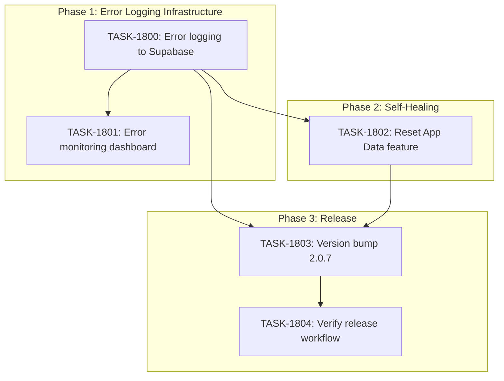

# Sprint Plan: SPRINT-069 - Critical Onboarding Fixes

**Status:** PLANNING
**Created:** 2026-02-03
**Target Branch:** `main` (critical fixes)
**Release Version:** 2.0.7

## Sprint Goal

Complete the critical onboarding fix suite to enable production monitoring and self-healing capabilities for users encountering installation issues.

## Context

A test user (Paul Dorian) encountered issues completing installation. Several fixes have been merged:
- BACKLOG-615: Handler graceful degradation (PR #737 - MERGED)
- BACKLOG-614: Fixed needsTermsAcceptance default
- Release workflow YAML fix (pushed to main)

This sprint completes the remaining critical items to:
1. Enable production error monitoring via Supabase
2. Provide users self-healing capability to recover from corrupted state
3. Release version 2.0.7 with all fixes

## Prerequisites

- [x] PR #737 merged (BACKLOG-615)
- [x] BACKLOG-614 fix merged
- [x] Release workflow YAML fix pushed to main
- [x] `error_logs` table exists in Supabase (verified)

## In Scope

| ID | Backlog | Title | Type | Priority |
|----|---------|-------|------|----------|
| TASK-1800 | BACKLOG-613 | Production error logging to Supabase | feature | Critical |
| TASK-1801 | BACKLOG-613 | Internal error monitoring dashboard | feature | Critical |
| TASK-1802 | BACKLOG-616/617 | Reset App Data self-healing feature | feature | Critical |
| TASK-1803 | - | Version bump to 2.0.7 | chore | Critical |
| TASK-1804 | - | Verify release workflow triggers | verification | Critical |

## Out of Scope / Deferred

- Full error analytics dashboard (future sprint)
- Error aggregation/deduplication logic
- Automated alerting for error spikes
- Error resolution tracking workflow

## Phase Plan

### Phase 1: Error Logging Infrastructure (Sequential)

**Tasks:** TASK-1800, TASK-1801
**Rationale:** Error logging must exist before the ErrorScreen can submit logs.

| Task | Dependencies | Est. Tokens |
|------|--------------|-------------|
| TASK-1800: Production error logging to Supabase | None | ~25K |
| TASK-1801: Internal error monitoring dashboard | TASK-1800 | ~15K |

**Phase 1 Gate:** Error logs can be submitted from app and viewed in dashboard.

### Phase 2: Self-Healing Feature (Sequential)

**Task:** TASK-1802
**Rationale:** Depends on error logging being available to log reset events.

| Task | Dependencies | Est. Tokens |
|------|--------------|-------------|
| TASK-1802: Reset App Data self-healing | TASK-1800 | ~20K |

**Phase 2 Gate:** Users can reset corrupted app state from ErrorScreen.

### Phase 3: Release (Sequential)

**Tasks:** TASK-1803, TASK-1804
**Rationale:** Version bump and release verification after all features merged.

| Task | Dependencies | Est. Tokens |
|------|--------------|-------------|
| TASK-1803: Version bump to 2.0.7 | TASK-1800, TASK-1802 | ~3K |
| TASK-1804: Verify release workflow | TASK-1803 | ~5K |

**Phase 3 Gate:** Release 2.0.7 successfully built and artifacts available.

## Dependency Graph (Mermaid)



## Dependency Graph (YAML)

```yaml
dependency_graph:
  nodes:
    - id: TASK-1800
      type: task
      phase: 1
      status: pending
      title: Production error logging to Supabase
    - id: TASK-1801
      type: task
      phase: 1
      status: pending
      title: Internal error monitoring dashboard
    - id: TASK-1802
      type: task
      phase: 2
      status: pending
      title: Reset App Data self-healing feature
    - id: TASK-1803
      type: task
      phase: 3
      status: pending
      title: Version bump to 2.0.7
    - id: TASK-1804
      type: verification
      phase: 3
      status: pending
      title: Verify release workflow triggers

  edges:
    - from: TASK-1800
      to: TASK-1801
      type: depends_on
    - from: TASK-1800
      to: TASK-1802
      type: depends_on
    - from: TASK-1800
      to: TASK-1803
      type: depends_on
    - from: TASK-1802
      to: TASK-1803
      type: depends_on
    - from: TASK-1803
      to: TASK-1804
      type: depends_on
```

## Merge Plan

All work targets `main` branch directly (critical fixes).

**Branch naming:**
- `fix/TASK-1800-error-logging`
- `fix/TASK-1801-error-dashboard`
- `fix/TASK-1802-reset-app-data`
- `chore/TASK-1803-version-bump`

**Merge order:**
1. TASK-1800 (error logging foundation)
2. TASK-1801 (dashboard - can merge after 1800)
3. TASK-1802 (reset feature - can merge after 1800)
4. TASK-1803 (version bump - after 1800, 1802)
5. TASK-1804 (verification only, no merge needed)

**Note:** TASK-1801 and TASK-1802 can be parallelized after TASK-1800 merges.

## Testing & Quality Plan

### Unit Testing

**TASK-1800:**
- Test error logging service creation
- Test error payload construction
- Test offline queueing behavior
- Test Supabase submission

**TASK-1802:**
- Test reset confirmation dialog
- Test local storage clearing
- Test keychain clearing (mocked)
- Test app restart trigger

### Integration Testing

- Submit error from ErrorScreen, verify appears in Supabase
- Trigger reset, verify app restarts in clean state
- Test error logging when offline (queue behavior)

### CI Requirements

All PRs must pass:
- [x] Unit tests
- [x] Type checking
- [x] Lint checks
- [x] Build step

## Risk Register

| Risk | Likelihood | Impact | Mitigation |
|------|------------|--------|------------|
| Reset clears too much data | Low | High | Explicit confirmation dialog with consequences listed |
| Error logs contain PII | Medium | High | Sanitize user data, don't log message content |
| Supabase error_logs RLS blocks inserts | Low | Medium | Test RLS policy allows authenticated user inserts |
| Release workflow still broken | Low | High | Manual verification task included |

## Decision Log

### Decision: Target main branch directly

- **Date:** 2026-02-03
- **Context:** These are critical fixes for production users
- **Decision:** Branch from and merge to `main` directly
- **Rationale:** Faster path to release, develop can merge from main later
- **Impact:** Skips develop integration, acceptable for hotfixes

### Decision: Error logs table already exists

- **Date:** 2026-02-03
- **Context:** Checked Supabase schema, `error_logs` table exists with comprehensive columns
- **Decision:** No migration needed, use existing table
- **Rationale:** Table has all required fields: user_id, device_id, app_version, error_type, error_message, stack_trace, breadcrumbs, app_state, user_feedback
- **Impact:** TASK-1800 only needs client-side implementation

### Decision: Dashboard as separate task

- **Date:** 2026-02-03
- **Context:** Error logging and dashboard are distinct features
- **Decision:** Split into TASK-1800 (logging) and TASK-1801 (dashboard)
- **Rationale:** Allows parallel work after foundation, cleaner PRs
- **Impact:** TASK-1801 blocked by TASK-1800

## Effort Estimates

| Task | Category | Est. Tokens | Token Cap | Notes |
|------|----------|-------------|-----------|-------|
| TASK-1800 | service | ~25K | 100K | Error service + ErrorScreen integration |
| TASK-1801 | ui | ~15K | 60K | Simple dashboard page |
| TASK-1802 | ui | ~20K | 80K | Reset dialog + IPC handlers |
| TASK-1803 | config | ~3K | 12K | package.json update |
| TASK-1804 | verification | ~5K | 20K | Manual verification |
| **Total** | - | **~68K** | **272K** | |

*Estimates apply 0.5x service multiplier per historical data.*

## Progress Tracking

| Task | Status | Assigned | Branch | PR | Actual Tokens |
|------|--------|----------|--------|-----|---------------|
| TASK-1800 | pending | - | - | - | - |
| TASK-1801 | pending | - | - | - | - |
| TASK-1802 | pending | - | - | - | - |
| TASK-1803 | pending | - | - | - | - |
| TASK-1804 | pending | - | - | - | - |

## End-of-Sprint Validation Checklist

### Phase 1 Gate
- [ ] TASK-1800 complete - Error logging service functional
- [ ] TASK-1801 complete - Dashboard shows error logs
- [ ] CI passing on both PRs

### Phase 2 Gate
- [ ] TASK-1802 complete - Reset App Data working
- [ ] Confirmation dialog shows consequences
- [ ] App restarts in clean state after reset

### Phase 3 Gate
- [ ] TASK-1803 complete - Version is 2.0.7
- [ ] TASK-1804 complete - Release workflow triggered successfully
- [ ] Release artifacts available for download
