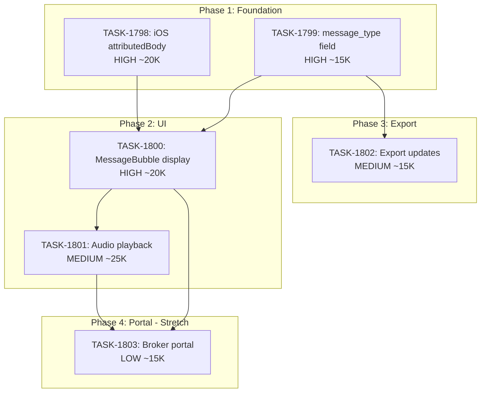

# Sprint Plan: SPRINT-069 - Special Message Type Support

**Created**: 2026-02-02
**Status**: PLANNING
**Goal**: Enable proper display and export of special message types (audio/voice messages, location sharing)
**Target Branch**: develop
**Feature Branch**: sprint/SPRINT-069-special-message-types
**Estimated Duration**: 3-4 days
**Total Estimated Tokens**: ~105K-140K (excluding TASK-1803 stretch goal)

---

## SR Engineer Review Notes (2026-02-02)

**Status**: APPROVED with conditions

**Key Changes Applied:**
1. Phase 1: TASK-1798 and TASK-1799 can run **in parallel** (different files)
2. Phase 2: TASK-1800 and TASK-1801 must be **sequential** (shared file risk)
3. TASK-1798 absorbs TASK-1797 (iOS attributedBody - was never implemented)
4. TASK-1801: AudioPlayer extraction is **mandatory** (not optional)
5. Use **lucide-react** (already installed) instead of heroicons
6. Migration 28 available for TASK-1799 if needed
7. Token estimates adjusted upward based on historical data

---

## Sprint Goal

Implement support for displaying and exporting "non-normal" message types that currently show as "[Media not available]" or "[Attachment]". This sprint focuses on:

1. **Audio/Voice Messages** - Display "[Voice Message]" indicator with transcript, audio playback capability
2. **Location Sharing Messages** - Display location info properly (parsed from attributedBody)

This builds on the existing `attributedBody` parsing infrastructure (BACKLOG-604) and attachment handling system (SPRINT-068).

---

## Prerequisites / Environment Setup

Before starting sprint work, engineers must:
- [ ] `git checkout develop && git pull origin develop`
- [ ] `npm install`
- [ ] `npm rebuild better-sqlite3-multiple-ciphers`
- [ ] `npx electron-rebuild`
- [ ] Verify app starts: `npm run dev`
- [ ] Verify tests pass: `npm test`

**Note**: Native module rebuilds are required after `npm install` or Node.js updates.

---

## Context

### Technical Background

**What We Have:**
- `attributedBody` parsing exists in `electron/utils/messageParser.ts` for macOS
- Attachments store `mime_type` field in database (can identify audio via `audio/*`)
- Export service has `getAttachmentTypeLabel()` for type detection
- BACKLOG-604 identified (iOS `attributedBody` parsing needed)
- iOS backup attachment extraction implemented in SPRINT-068

**What's Missing:**
1. iOS parser doesn't query `attributedBody` column from sms.db
2. iOS parser doesn't query `audio_transcript` column (if available in iOS DB)
3. No `message_type` indicator passed to frontend beyond `has_attachments: boolean`
4. MessageBubble only sees `has_attachments`, not attachment types or message types
5. No audio playback capability in UI
6. No special handling for location messages in display or export

### Key Files Reference

| Purpose | File |
|---------|------|
| iOS Message Parsing | `electron/services/iosMessagesParser.ts` |
| iOS Storage Service | `electron/services/iPhoneSyncStorageService.ts` |
| macOS Message Import | `electron/services/macOSMessagesImportService.ts` |
| AttributedBody Parser | `electron/utils/messageParser.ts` |
| Message Display | `src/components/transactionDetailsModule/components/MessageBubble.tsx` |
| PDF/Folder Export | `electron/services/folderExportService.ts` |
| iOS Message Types | `electron/types/iosMessages.ts` |
| Communication Type | `electron/types/models.ts` |

### Related Backlog Items

| ID | Title | Status | Relation |
|----|-------|--------|----------|
| BACKLOG-604 | iOS attributedBody parsing | Created | Foundation - parse location/special messages |
| BACKLOG-588 | Windows attachments | Testing | Prerequisite - attachments must work |

---

## In Scope

| Task | Backlog | Title | Est. Tokens | Priority | Phase |
|------|---------|-------|-------------|----------|-------|
| TASK-1798 | BACKLOG-605 | Parse iOS attributedBody and audio_transcript | ~20K | HIGH | 1 |
| TASK-1799 | BACKLOG-606 | Add message_type field to Communication model | ~15K | HIGH | 1 |
| TASK-1800 | BACKLOG-607 | Update MessageBubble for special message types | ~20K | HIGH | 2 |
| TASK-1801 | BACKLOG-608 | Implement audio playback in MessageBubble | ~25K | MEDIUM | 2 |
| TASK-1802 | BACKLOG-609 | Update PDF/folder export for special messages | ~15K | MEDIUM | 3 |
| TASK-1803 | BACKLOG-610 | Broker portal special message support | ~15K | LOW | 4 |

**Total Estimated (implementation):** ~85K-110K tokens

---

## Out of Scope / Deferred

| Item | Reason |
|------|--------|
| Video message playback | Requires additional video player infrastructure |
| Map rendering for locations | Would need map API integration |
| macOS audio transcription | macOS handles this differently, separate task |
| Rich link previews | Future enhancement |

---

## Reprioritized Backlog (Sprint Scope)

| ID | Title | Priority | Rationale | Dependencies | Conflicts |
|----|-------|----------|-----------|--------------|-----------|
| BACKLOG-605 | iOS attributedBody + transcript parsing | HIGH | Enables all other features | BACKLOG-604 | None |
| BACKLOG-606 | message_type field in Communication | HIGH | Required for UI differentiation | None | None |
| BACKLOG-607 | MessageBubble special type display | HIGH | User-visible improvement | BACKLOG-605, 606 | None |
| BACKLOG-608 | Audio playback capability | MEDIUM | Enhances voice message UX | BACKLOG-607, attachment system | None |
| BACKLOG-609 | Export service updates | MEDIUM | Audit package completeness | BACKLOG-606 | None |
| BACKLOG-610 | Broker portal support | LOW | B2B parity | BACKLOG-607 | None |

---

## Phase Plan

### Phase 1: Foundation (PARALLEL - coordinated merge)

**TASK-1798: iOS attributedBody + audio_transcript parsing (~20-25K)**
- **NOTE: Absorbs TASK-1797 scope** (iOS attributedBody was never implemented)
- Extend `iosMessagesParser.ts` to query `attributedBody`, `associated_message_type`, `audio_transcript` columns
- Use existing `messageParser.ts` functions to parse binary plist format
- Extend `RawMessageRow` interface with new fields
- Return parsed text in `iOSMessage.text` when `text` is null

**TASK-1799: message_type field in Communication (~15-20K)**
- Add `message_type?: MessageType` to `Communication` interface
- Define `MessageType = 'text' | 'voice_message' | 'location' | 'attachment' | 'system' | 'unknown'`
- Update database schema (Migration 28 available)
- Update `iPhoneSyncStorageService` to set `message_type` based on mime_type/attributedBody

**Can run in parallel**: Different files, coordinate merge order (1798 before 1799).
**Integration checkpoint**: Both tasks merge to develop, CI must pass.

### Phase 2: UI Implementation (SEQUENTIAL - shared file risk)

**TASK-1800: MessageBubble special type display (~20-25K)** - FIRST
- Read `message_type` from Communication
- Display appropriate indicator: "[Voice Message]", "[Location Shared]", etc.
- Show transcript text if available
- Style differently (italic, icon prefix using **lucide-react**)

**TASK-1801: Audio playback in MessageBubble (~25-35K)** - SECOND (after TASK-1800)
- **MANDATORY**: Extract `AudioPlayer` to `src/components/common/AudioPlayer.tsx`
- Add HTML5 audio player for voice messages
- Locate audio file from attachment storage
- Handle file-not-found gracefully

**Must be sequential**: Both modify MessageBubble.tsx - high merge conflict risk.

**Integration checkpoint**: UI changes visible, manual testing required.

### Phase 3: Export Updates (Sequential after Phase 2)

**TASK-1802: PDF/folder export updates (~15K)**
- Update `folderExportService.ts` to handle special message types
- Show transcript in PDF for voice messages
- Show "[Voice Message - transcript below]" or similar
- Include location text for location messages

**Integration checkpoint**: Export produces correct output.

### Phase 4: Broker Portal (Stretch Goal)

**TASK-1803: Broker portal special message support (~15K)**
- Ensure message_type flows through Supabase sync
- Update broker portal UI components (if any client-side work needed)
- Audio playback in web context

**Note**: This task may be deferred if sprint runs long.

---

## Merge Plan

- **Target branch**: `develop`
- **Feature branch format**: `fix/TASK-XXXX-description` or `feature/TASK-XXXX-description`
- **Sprint branch**: `sprint/SPRINT-069-special-message-types` (optional, for grouping)

**Merge order**:
1. TASK-1798 (iOS parsing) -> develop
2. TASK-1799 (message_type field) -> develop
3. TASK-1800 (MessageBubble) -> develop (after 1798, 1799)
4. TASK-1801 (audio playback) -> develop (after 1800)
5. TASK-1802 (export) -> develop (after 1799)
6. TASK-1803 (broker portal) -> develop (stretch)

---

## Dependency Graph (Mermaid)



## Dependency Graph (YAML)

```yaml
dependency_graph:
  nodes:
    - id: TASK-1798
      type: task
      phase: 1
      title: iOS attributedBody parsing
      priority: HIGH
      est_tokens: 20000
    - id: TASK-1799
      type: task
      phase: 1
      title: message_type field
      priority: HIGH
      est_tokens: 15000
    - id: TASK-1800
      type: task
      phase: 2
      title: MessageBubble display
      priority: HIGH
      est_tokens: 20000
    - id: TASK-1801
      type: task
      phase: 2
      title: Audio playback
      priority: MEDIUM
      est_tokens: 25000
    - id: TASK-1802
      type: task
      phase: 3
      title: Export updates
      priority: MEDIUM
      est_tokens: 15000
    - id: TASK-1803
      type: task
      phase: 4
      title: Broker portal
      priority: LOW
      est_tokens: 15000
  edges:
    - from: TASK-1798
      to: TASK-1800
      type: depends_on
    - from: TASK-1799
      to: TASK-1800
      type: depends_on
    - from: TASK-1799
      to: TASK-1802
      type: depends_on
    - from: TASK-1800
      to: TASK-1801
      type: depends_on
    - from: TASK-1800
      to: TASK-1803
      type: depends_on
    - from: TASK-1801
      to: TASK-1803
      type: depends_on
```

---

## Testing & Quality Plan

### Unit Testing

**New tests required for:**
- `iosMessagesParser.ts` - Test `attributedBody`, `audio_transcript` column handling
- `messageParser.ts` - Ensure existing tests still pass with iOS usage
- `iPhoneSyncStorageService.ts` - Test `message_type` derivation logic
- `MessageBubble.tsx` - Test rendering for each message type

**Existing tests to update:**
- Any tests mocking Communication objects need `message_type` field

### Coverage Expectations

- Coverage should not decrease
- New parsing logic should have >80% coverage
- UI component tests should cover all message type branches

### Integration / Feature Testing

**Required scenarios:**
1. Import iPhone backup with voice message -> displays "[Voice Message]" + transcript
2. Import iPhone backup with location share -> displays location text
3. Click play on voice message -> audio plays
4. Export transaction with voice messages -> PDF shows transcript
5. View voice message in broker portal -> playback works

### CI / CD Quality Gates

The following MUST pass before merge:
- [ ] Unit tests
- [ ] Integration tests
- [ ] Coverage checks
- [ ] Type checking
- [ ] Linting / formatting
- [ ] Build step

---

## Risk Register

| Risk | Likelihood | Impact | Mitigation |
|------|------------|--------|------------|
| iOS sms.db schema varies by iOS version | Medium | Medium | Test with multiple iOS backup versions |
| audio_transcript column may not exist | Medium | Low | Graceful fallback - show "[Voice Message]" only |
| Audio file format compatibility | Low | Medium | Use HTML5 audio with common formats (m4a, mp3, wav) |
| Broker portal audio playback browser issues | Medium | Low | Progressive enhancement - text fallback |
| attributedBody binary format variations | Medium | Medium | Leverage existing robust parser |

---

## Decision Log

### Decision: Use message_type enum vs derive from attachments

- **Date**: 2026-02-02
- **Context**: Could derive message type from mime_type at render time vs store explicit type
- **Decision**: Store explicit `message_type` field in database
- **Rationale**: Faster queries, clearer data model, enables filtering by type
- **Impact**: Schema change required, migration needed

### Decision: Audio playback approach

- **Date**: 2026-02-02
- **Context**: Could use third-party audio library vs native HTML5 audio
- **Decision**: Use native HTML5 `<audio>` element
- **Rationale**: Simpler, no additional dependencies, sufficient for MVP
- **Impact**: May need enhancement later for waveform visualization

---

## Unplanned Work Log

**Instructions:** Update this section AS unplanned work is discovered during the sprint.

| Task | Source | Root Cause | Added Date | Est. Tokens | Actual Tokens |
|------|--------|------------|------------|-------------|---------------|
| - | - | - | - | - | - |

---

## End-of-Sprint Validation Checklist

- [ ] All tasks merged to develop
- [ ] All CI checks passing
- [ ] All acceptance criteria verified
- [ ] Testing requirements met
- [ ] No unresolved conflicts
- [ ] Documentation updated (if applicable)
- [ ] Manual testing on Windows with iPhone backup
- [ ] Manual testing on macOS (no regression)

---

## Progress Tracking

| Task | Status | Billable Tokens | Duration | PR |
|------|--------|-----------------|----------|-----|
| TASK-1798 | PENDING | - | - | - |
| TASK-1799 | PENDING | - | - | - |
| TASK-1800 | PENDING | - | - | - |
| TASK-1801 | PENDING | - | - | - |
| TASK-1802 | PENDING | - | - | - |
| TASK-1803 | PENDING | - | - | - |

---

## Notes

- **TASK-1797 absorbed into TASK-1798**: iOS attributedBody parsing was planned but never implemented; TASK-1798 now includes that scope
- **Icon library**: Use `lucide-react` (already installed) - NOT heroicons
- **Migration number**: Migration 28 is available for TASK-1799 schema changes
- **Phase 4 (Broker Portal)**: Stretch goal - explicit go/no-go decision after Phase 2
- **TASK-1803 cutoff**: If sprint runs over 140K tokens by end of Phase 3, defer TASK-1803

---
